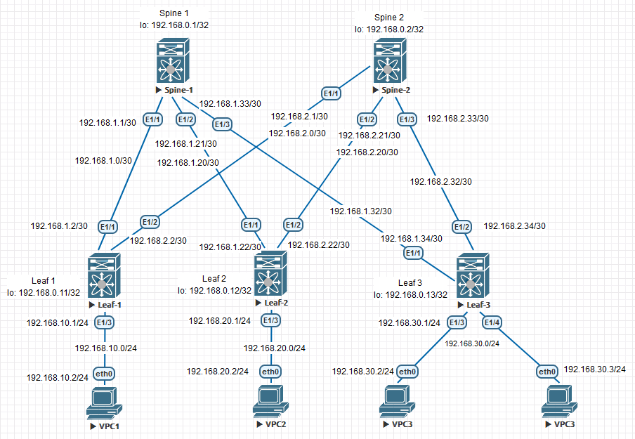

### Проектирование адресного пространства.

## Цель:

- Собрать схему CLOS;

- Распределить адресное пространство;

## В этой самостоятельной работе мы ожидаем, что вы самостоятельно:

1. Соберете топологию CLOS, как на схеме:
  
   
2. Распределите адресное пространство для Underlay сети

## Собираем указанную схему

## Распределяем адресное пространство и заносим в таблицу

## Таблица адресов
| Device  | Interface | IP Address   | Subnet Mask     | Default Gateway |
|---------|-----------|--------------|-----------------|-----------------|
| Spine 1 | lo        | 192.168.0.1  | 255.255.255.255 |                 |
|         | E1/1      | 192.168.1.1  | 255.255.255.252 |                 |
|         | E1/2      | 192.168.1.21 | 255.255.255.252 |                 |
|         | E1/3      | 192.168.1.33 | 255.255.255.252 |                 |
| Spine 1 | lo        | 192.168.0.2  | 255.255.255.255 |                 |
|         | E1/1      | 192.168.2.1  | 255.255.255.252 |                 |
|         | E1/2      | 192.168.2.21 | 255.255.255.252 |                 |
|         | E1/3      | 192.168.2.33 | 255.255.255.252 |                 |
| Leaf 1  | lo        | 192.168.0.11 | 255.255.255.255 |                 |
|         | E1/1      | 192.168.1.2  | 255.255.255.252 |                 |
|         | E1/2      | 192.168.2.2  | 255.255.255.252 |                 |
|         | E1/3      | 192.168.10.1 | 255.255.255.0   |                 |
| Leaf 2  | lo        | 192.168.0.12 | 255.255.255.255 |                 |
|         | E1/1      | 192.168.1.22 | 255.255.255.252 |                 |
|         | E1/2      | 192.168.2.22 | 255.255.255.252 |                 |
|         | E1/3      | 192.168.20.1 | 255.255.255.252 |                 |
| Leaf 3  | lo        | 192.168.0.13 | 255.255.255.255 |                 |
|         | E1/1      | 192.168.1.34 | 255.255.255.252 |                 |
|         | E1/2      | 192.168.2.34 | 255.255.255.252 |                 |
|         | E1/3      | 192.168.30.1 | 255.255.255.0   |                 |
|         | E1/3      | 192.168.30.1 | 255.255.255.0   |                 |
| VPC1    | eth0      | 192.168.10.2 | 255.255.255.0   |                 |
| VPC2    | eth0      | 192.168.20.2 | 255.255.255.0   |                 |
| VPC3    | eth0      | 192.168.30.2 | 255.255.255.0   |                 |
| VPC4    | eth0      | 192.168.30.3 | 255.255.255.0   |                 |

## Переносим адреса на собранную схему

