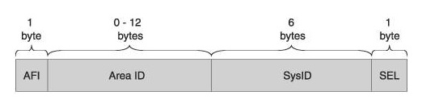

### Underlay IS-IS.

## Цель:

- Настроить IS-IS для Underlay сети


## В этой самостоятельной работе мы ожидаем, что вы самостоятельно:
  
1. настроить IS-IS в Underlay сети, для IP связанности между всеми устройствами NXOS


### Описание/Пошаговая инструкция выполнения домашнего задания:

1. Настроить IPv4 адресацию на всех устройствах.
2. Настроить IS-IS.
3. Проверить работу протокола IS-IS.  


### Общая информация

<summary> Описание протокола </summary>

### IS-IS (Intermediate System to Intermediate System)

IS-IS работает поверх канального уровня модели OSI, поэтому он не привязан к конкретному протоколу сетевого уровня. Также IS-IS не использует протокол IP для доставки сообщений, содержащих информацию о маршрутизации (LSA и прочее).

Протокол IS-IS разработан Digital Equipment Corporation как составляющая часть DECnet Phase V. Он был стандартизирован ISO в 1992 году как ISO 10589 для взаимодействия между сетевыми устройствами, которые обозначались как Промежуточные Системы (в противовес конечным устройствам). Основная цель разработки IS-IS - маршрутизация пакетов средствами, входящими в набор протоколов ISO OSI - CLNS.

## Терминология

СLNP (Connection Less Network Protocol) - бесконтактный сетевой протокол - это дейтаграммный протокол передачи данных, функционально очень похожий на протокол IP.

## Адресация в СLNP



NET идентификатор (идентификатор сети):

```
- "AFI" (Authority and Format Identifier) - является частью номера области, хотя постоянно изображается отдельно. 
  Подавляющее большинство реализаций IS-IS на маршрутизаторах имеют это поле, равным 49. 
  Адреса, у которых AFI был равен 49, относились к классу локальных.

- "Area ID", номер области, к которой принадлежит маршрутизатор. Это поле переменной длины.

- "System ID" - это идентификатор маршрутизатора. У каждого маршрутизатора в топологии он должен быть уникальным, 
  поскольку именно по System ID маршрутизаторы "узнают" друг друга при осознании топологии. 
  В OSPF аналогом System ID является Router ID (однако он имеет другой формат).

```

В идентификаторе сети удобно указывать например ip адрес loopback интерфейса и номер локации, для облегчения дебага/траблшутинга в виде:

```
Тогда как вариант идентификатор сети будет вида:
49.xxyy.zzzz.zzzz.zzzz.00

где
- "xx" - номер локации,
- "yy" - номер по порядку оборудования
- "zzzz.zzzz.zzzz" - ip адрес loopback интерфейса
      - если IP-адрес 192.168.0.1, то zzzz.zzzz.zzzz==1921.6800.0001  (недостающие разряды дополняются нулями)

```

## Пример

```
net 49.0001.1921.6800.0001.00

- "00" - локация 0
- "01" - номер по порядку оборудования
- "1921.6800.0001" - ip адрес лупбека 192.168.0.1

```

</details>


## Схема стенда 


## Таблица адресов

| Device  | Interface | IP Address   | Subnet Mask     | Default Gateway |
|---------|-----------|--------------|-----------------|-----------------|
| Spine 1 | lo        | 192.168.0.1  | 255.255.255.255 |                 |
|         | E1/1      | 192.168.1.0  | 255.255.255.254 |                 |
|         | E1/2      | 192.168.1.20 | 255.255.255.254 |                 |
|         | E1/3      | 192.168.1.30 | 255.255.255.254 |                 |
| Spine 1 | lo        | 192.168.0.2  | 255.255.255.255 |                 |
|         | E1/1      | 192.168.2.0  | 255.255.255.254 |                 |
|         | E1/2      | 192.168.2.20 | 255.255.255.254 |                 |
|         | E1/3      | 192.168.2.30 | 255.255.255.254 |                 |
| Leaf 1  | lo        | 192.168.0.11 | 255.255.255.255 |                 |
|         | E1/1      | 192.168.1.1  | 255.255.255.254 |                 |
|         | E1/2      | 192.168.2.1  | 255.255.255.254 |                 |
|         | E1/3      | 192.168.10.1 | 255.255.255.0   |                 |
| Leaf 2  | lo        | 192.168.0.12 | 255.255.255.255 |                 |
|         | E1/1      | 192.168.1.21 | 255.255.255.254 |                 |
|         | E1/2      | 192.168.2.21 | 255.255.255.254 |                 |
|         | E1/3      | 192.168.20.1 | 255.255.255.0   |                 |
| Leaf 3  | lo        | 192.168.0.13 | 255.255.255.255 |                 |
|         | E1/1      | 192.168.1.31 | 255.255.255.254 |                 |
|         | E1/2      | 192.168.2.31 | 255.255.255.254 |                 |
|         | E1/3      | 192.168.30.1 | 255.255.255.0   |                 |
|         | E1/4      | 192.168.40.1 | 255.255.255.0   |                 |
| VPC1    | eth0      | 192.168.10.2 | 255.255.255.0   | 192.168.10.1    |
| VPC2    | eth0      | 192.168.20.2 | 255.255.255.0   | 192.168.20.1    |
| VPC3    | eth0      | 192.168.30.2 | 255.255.255.0   | 192.168.30.1    |
| VPC4    | eth0      | 192.168.40.2 | 255.255.255.0   | 192.168.40.1    |


### [Файлы конфигураций устройст и сама работа выполненная в EVE-NG ](https://github.com/niknav83/Data_center_network_design/tree/main/labs/lab03/configs)

В данной работе применялса образ nxosv9k-9500-9.3.8

Логин и пароль: admin 

## Приступаем к настрйке сети:

### Настроим интерфейсы и IP адреса на всех устройствах Underlay-сети.


 Конфигурация интерфейсов для Spine-1:

```
interface Ethernet1/1
  medium p2p
  ip address 192.168.1.0/31
  no shutdown

interface Ethernet1/2
  medium p2p
  ip address 192.168.1.20/31
  no shutdown

interface Ethernet1/3
  medium p2p
  ip address 192.168.1.30/31
  no shutdown

interface loopback0
  ip address 192.168.0.1/32
!
```
 Конфигурация интерфейсов для Spine-2:

```
interface Ethernet1/1
  medium p2p
  ip address 192.168.2.0/31
  no shutdown

interface Ethernet1/2
  medium p2p
  ip address 192.168.2.20/31
  no shutdown

interface Ethernet1/3
  medium p2p
  ip address 192.168.2.30/31
  no shutdown

interface loopback0
  ip address 192.168.0.2/32
!
```

 Конфигурация интерфейсов для Leaf-1:

```
interface Ethernet1/1
  medium p2p
  ip address 192.168.1.1/31
  no shutdown

interface Ethernet1/2
  medium p2p
  ip address 192.168.2.1/31
  no shutdown

interface Ethernet1/3
  ip address 192.168.10.1/24
  no shutdown

interface loopback0
  ip address 192.168.0.11/32
!
```

 Конфигурация интерфейсов для Leaf-2:

```
interface Ethernet1/1
  medium p2p
  ip address 192.168.1.21/31
  no shutdown

interface Ethernet1/2
  medium p2p
  ip address 192.168.2.21/31
  no shutdown

interface Ethernet1/3
  ip address 192.168.20.1/24
  no shutdown

interface loopback0
  ip address 192.168.0.12/32
!
```

 Конфигурация интерфейсов для Leaf-3:

```
interface Ethernet1/1
  medium p2p
  ip address 192.168.1.31/31
  no shutdown

interface Ethernet1/2
  medium p2p
  ip address 192.168.2.31/31
  no shutdown

interface Ethernet1/3
  ip address 192.168.30.1/24
  no shutdown

interface Ethernet1/4
  ip address 192.168.40.1/24
  no shutdown

interface loopback0
  ip address 192.168.0.13/32
!
```

Конфигурация интерфейсов для VPC1:

```
ip 192.168.10.2 192.168.10.1 24
```

Конфигурация интерфейсов для VPC2:

```
ip 192.168.20.2 192.168.20.1 24
```

Конфигурация интерфейсов для VPC3:

```
ip 192.168.30.2 192.168.30.1 24
```

Конфигурация интерфейсов для VPC4:

```
ip 192.168.40.2 192.168.40.1 24
```


### Далее для общей связанности между всеми устройствами настроим протокол IS-IS.

На Nexus необходимо для начала включить функцию IS-IS

```
feature isis
```

 Конфигурация IS-IS для Spine-1:

```
feature isis

interface Ethernet1/1
  medium p2p
  ip address 192.168.1.0/31
  isis network point-to-point
  ip router isis Underlay
  no shutdown

interface Ethernet1/2
  medium p2p
  ip address 192.168.1.20/31
  isis network point-to-point
  ip router isis Underlay
  no shutdown

interface Ethernet1/3
  medium p2p
  ip address 192.168.1.30/31
  isis network point-to-point
  ip router isis Underlay
  no shutdown

interface loopback0
  ip address 192.168.0.1/32
  ip router isis Underlay
  isis passive-interface level-1-2

router isis Underlay
  net 49.0001.1921.6800.0001.00
  is-type level-1
!
```
 Конфигурация IS-IS для Spine-2:

```
feature isis

interface Ethernet1/1
  medium p2p
  ip address 192.168.2.0/31
  isis network point-to-point
  ip router isis Underlay
  no shutdown

interface Ethernet1/2
  medium p2p
  ip address 192.168.2.20/31
  isis network point-to-point
  ip router isis Underlay
  no shutdown

interface Ethernet1/3
  medium p2p
  ip address 192.168.2.30/31
  isis network point-to-point
  ip router isis Underlay
  no shutdown

interface loopback0
  ip address 192.168.0.2/32
  ip router isis Underlay
  isis passive-interface level-1-2

router isis Underlay
  net 49.0001.1921.6800.0002.00
  is-type level-1
!
```

 Конфигурация IS-IS для Leaf-1:

```
feature isis

interface Ethernet1/1
  medium p2p
  ip address 192.168.1.1/31
  isis network point-to-point
  ip router isis Underlay
  no shutdown

interface Ethernet1/2
  medium p2p
  ip address 192.168.2.1/31
  isis network point-to-point
  ip router isis Underlay
  no shutdown

interface Ethernet1/3
  ip address 192.168.10.1/24
  ip router isis Underlay
  isis passive-interface level-1-2
  no shutdown

interface loopback0
  ip address 192.168.0.11/32
  ip router isis Underlay
  isis passive-interface level-1-2

router isis Underlay
  net 49.0001.1921.6800.0011.00
  is-type level-1
!
```

 Конфигурация IS-IS для Leaf-2:

```
feature isis

interface Ethernet1/1
  medium p2p
  ip address 192.168.1.21/31
  isis network point-to-point
  ip router isis Underlay
  no shutdown

interface Ethernet1/2
  medium p2p
  ip address 192.168.2.21/31
  isis network point-to-point
  ip router isis Underlay
  no shutdown

interface Ethernet1/3
  ip address 192.168.20.1/24
  ip router isis Underlay
  isis passive-interface level-1-2
  no shutdown

interface loopback0
  ip address 192.168.0.12/32
  ip router isis Underlay
  isis passive-interface level-1-2

router isis Underlay
  net 49.0001.1921.6800.0012.00
  is-type level-1
!
```

 Конфигурация IS-IS для Leaf-3:

```
feature isis

interface Ethernet1/1
  medium p2p
  ip address 192.168.1.31/31
  isis network point-to-point
  ip router isis Underlay
  no shutdown

interface Ethernet1/2
  medium p2p
  ip address 192.168.2.31/31
  isis network point-to-point
  ip router isis Underlay
  no shutdown

interface Ethernet1/3
  ip address 192.168.30.1/24
  ip router isis Underlay
  isis passive-interface level-1-2
  no shutdown

interface Ethernet1/4
  ip address 192.168.40.1/24
  ip router isis Underlay
  isis passive-interface level-1-2
  no shutdown

interface loopback0
  ip address 192.168.0.13/32
  ip router isis Underlay
  isis passive-interface level-1-2

router isis Underlay
  net 49.0001.1921.6800.0013.00
  is-type level-1
!
```

## Проверяем работу протокола IS-IS:

 Вывод команды show isis hostname для Spine-1:

```
Spine-1# show isis hostname
IS-IS Process: Underlay dynamic hostname table VRF: default
  Level  System ID       Dynamic hostname
  1      1921.6800.0001* Spine-1
  1      1921.6800.0002  Spine-2
  1      1921.6800.0011  Liaf-1
  1      1921.6800.0012  Leaf-2
  1      1921.6800.0013  Leaf-3
```

 Вывод команды show isis hostname для Spine-2:

```
Spine-2# show isis hostname
IS-IS Process: Underlay dynamic hostname table VRF: default
  Level  System ID       Dynamic hostname
  1      1921.6800.0001  Spine-1
  1      1921.6800.0002* Spine-2
  1      1921.6800.0011  Liaf-1
  1      1921.6800.0012  Leaf-2
  1      1921.6800.0013  Leaf-3
```

 Вывод команды show isis hostname для Leaf-1:

```
Liaf-1# show isis hostname
IS-IS Process: Underlay dynamic hostname table VRF: default
  Level  System ID       Dynamic hostname
  1      1921.6800.0001  Spine-1
  1      1921.6800.0002  Spine-2
  1      1921.6800.0011* Liaf-1
  1      1921.6800.0012  Leaf-2
  1      1921.6800.0013  Leaf-3
```

 Вывод команды show isis hostname для Leaf-2:

```
Leaf-2# show isis hostname
IS-IS Process: Underlay dynamic hostname table VRF: default
  Level  System ID       Dynamic hostname
  1      1921.6800.0001  Spine-1
  1      1921.6800.0002  Spine-2
  1      1921.6800.0011  Liaf-1
  1      1921.6800.0012* Leaf-2
  1      1921.6800.0013  Leaf-3
```
 
 Вывод команды show isis hostname для Leaf-3:

```
Leaf-3# show isis hostname
IS-IS Process: Underlay dynamic hostname table VRF: default
  Level  System ID       Dynamic hostname
  1      1921.6800.0001  Spine-1
  1      1921.6800.0002  Spine-2
  1      1921.6800.0011  Liaf-1
  1      1921.6800.0012  Leaf-2
  1      1921.6800.0013* Leaf-3
```

 Вывод команды show isis database для Spine-1:

```
Spine-1# show isis database
IS-IS Process: Underlay LSP database VRF: default
IS-IS Level-1 Link State Database
  LSPID                 Seq Number   Checksum  Lifetime   A/P/O/T
  Spine-1.00-00       * 0x00000023   0x37CA    816        0/0/0/1
  Spine-2.00-00         0x00000023   0xD61D    823        0/0/0/1
  Liaf-1.00-00          0x0000000A   0xEB25    824        0/0/0/1
  Leaf-2.00-00          0x0000001B   0x1666    617        0/0/0/1
  Leaf-3.00-00          0x0000000E   0x75EE    703        0/0/0/1

IS-IS Level-2 Link State Database
  LSPID                 Seq Number   Checksum  Lifetime   A/P/O/T
```

 Вывод команды show isis database для Spine-2:

```
Spine-2# show isis database
IS-IS Process: Underlay LSP database VRF: default
IS-IS Level-1 Link State Database
  LSPID                 Seq Number   Checksum  Lifetime   A/P/O/T
  Spine-1.00-00         0x00000023   0x37CA    788        0/0/0/1
  Spine-2.00-00       * 0x00000023   0xD61D    798        0/0/0/1
  Liaf-1.00-00          0x0000000A   0xEB25    797        0/0/0/1
  Leaf-2.00-00          0x0000001C   0x1467    1189       0/0/0/1
  Leaf-3.00-00          0x0000000F   0x73EF    1187       0/0/0/1

IS-IS Level-2 Link State Database
  LSPID                 Seq Number   Checksum  Lifetime   A/P/O/T
```

 Вывод команды show isis database для Leaf-1:

```
Liaf-1# show isis database
IS-IS Process: Underlay LSP database VRF: default
IS-IS Level-1 Link State Database
  LSPID                 Seq Number   Checksum  Lifetime   A/P/O/T
  Spine-1.00-00         0x00000023   0x37CA    689        0/0/0/1
  Spine-2.00-00         0x00000023   0xD61D    697        0/0/0/1
  Liaf-1.00-00        * 0x0000000A   0xEB25    698        0/0/0/1
  Leaf-2.00-00          0x0000001C   0x1467    1088       0/0/0/1
  Leaf-3.00-00          0x0000000F   0x73EF    1086       0/0/0/1

IS-IS Level-2 Link State Database
  LSPID                 Seq Number   Checksum  Lifetime   A/P/O/T
```

 Вывод команды show isis database для Leaf-2:

```
Leaf-2# show  isis database
IS-IS Process: Underlay LSP database VRF: default
IS-IS Level-1 Link State Database
  LSPID                 Seq Number   Checksum  Lifetime   A/P/O/T
  Spine-1.00-00         0x00000024   0x35CB    1170       0/0/0/1
  Spine-2.00-00         0x00000023   0xD61D    654        0/0/0/1
  Liaf-1.00-00          0x0000000A   0xEB25    653        0/0/0/1
  Leaf-2.00-00        * 0x0000001C   0x1467    1046       0/0/0/1
  Leaf-3.00-00          0x0000000F   0x73EF    1042       0/0/0/1

IS-IS Level-2 Link State Database
  LSPID                 Seq Number   Checksum  Lifetime   A/P/O/T
```
 
 Вывод команды show isis database для Leaf-3:

```
Leaf-3# show isis database
IS-IS Process: Underlay LSP database VRF: default
IS-IS Level-1 Link State Database
  LSPID                 Seq Number   Checksum  Lifetime   A/P/O/T
  Spine-1.00-00         0x00000023   0x37CA    901        0/0/0/1
  Spine-2.00-00         0x00000023   0xD61D    910        0/0/0/1
  Liaf-1.00-00          0x0000000A   0xEB25    909        0/0/0/1
  Leaf-2.00-00          0x0000001B   0x1666    701        0/0/0/1
  Leaf-3.00-00        * 0x0000000E   0x75EE    790        0/0/0/1

IS-IS Level-2 Link State Database
  LSPID                 Seq Number   Checksum  Lifetime   A/P/O/T
```


 Вывод команды show isis topology для Spine-1:

```
Spine-1# show isis topology
IS-IS process: Underlay
VRF: default
Topology ID: 0

IS-IS Level-1 IS routing table
Spine-2.00, Instance 0x00000030
   *via Liaf-1, Ethernet1/1, metric 80
   *via Leaf-2, Ethernet1/2, metric 80
   *via Leaf-3, Ethernet1/3, metric 80
Liaf-1.00, Instance 0x00000030
   *via Liaf-1, Ethernet1/1, metric 40
Leaf-2.00, Instance 0x00000030
   *via Leaf-2, Ethernet1/2, metric 40
Leaf-3.00, Instance 0x00000030
   *via Leaf-3, Ethernet1/3, metric 40

IS-IS Level-2 IS routing table
```

 Вывод команды show isis topology для Spine-2:

```
Spine-2# show isis topology
IS-IS process: Underlay
VRF: default
Topology ID: 0

IS-IS Level-1 IS routing table
Spine-1.00, Instance 0x0000002F
   *via Liaf-1, Ethernet1/1, metric 80
   *via Leaf-2, Ethernet1/2, metric 80
   *via Leaf-3, Ethernet1/3, metric 80
Liaf-1.00, Instance 0x0000002F
   *via Liaf-1, Ethernet1/1, metric 40
Leaf-2.00, Instance 0x0000002F
   *via Leaf-2, Ethernet1/2, metric 40
Leaf-3.00, Instance 0x0000002F
   *via Leaf-3, Ethernet1/3, metric 40

IS-IS Level-2 IS routing table
```

 Вывод команды show isis topology для Leaf-1:

```
Liaf-1# show isis topology
IS-IS process: Underlay
VRF: default
Topology ID: 0

IS-IS Level-1 IS routing table
Spine-1.00, Instance 0x00000009
   *via Spine-1, Ethernet1/1, metric 40
Spine-2.00, Instance 0x00000009
   *via Spine-2, Ethernet1/2, metric 40
Leaf-2.00, Instance 0x00000009
   *via Spine-1, Ethernet1/1, metric 80
   *via Spine-2, Ethernet1/2, metric 80
Leaf-3.00, Instance 0x00000009
   *via Spine-1, Ethernet1/1, metric 80
   *via Spine-2, Ethernet1/2, metric 80

IS-IS Level-2 IS routing table
```

 Вывод команды show isis topology для Leaf-2:

```
Leaf-2# show isis topology
IS-IS process: Underlay
VRF: default
Topology ID: 0

IS-IS Level-1 IS routing table
Spine-1.00, Instance 0x00000026
   *via Spine-1, Ethernet1/1, metric 40
Spine-2.00, Instance 0x00000026
   *via Spine-2, Ethernet1/2, metric 40
Liaf-1.00, Instance 0x00000026
   *via Spine-1, Ethernet1/1, metric 80
   *via Spine-2, Ethernet1/2, metric 80
Leaf-3.00, Instance 0x00000026
   *via Spine-1, Ethernet1/1, metric 80
   *via Spine-2, Ethernet1/2, metric 80

IS-IS Level-2 IS routing table
```
 
 Вывод команды show isis topology для Leaf-3:

```
Leaf-3# show isis topology
IS-IS process: Underlay
VRF: default
Topology ID: 0

IS-IS Level-1 IS routing table
Spine-1.00, Instance 0x0000000D
   *via Spine-1, Ethernet1/1, metric 40
Spine-2.00, Instance 0x0000000D
   *via Spine-2, Ethernet1/2, metric 40
Liaf-1.00, Instance 0x0000000D
   *via Spine-1, Ethernet1/1, metric 80
   *via Spine-2, Ethernet1/2, metric 80
Leaf-2.00, Instance 0x0000000D
   *via Spine-1, Ethernet1/1, metric 80
   *via Spine-2, Ethernet1/2, metric 80

IS-IS Level-2 IS routing table
```


 Вывод команды show ip route isis-Underlay для Spine-1:

```
Spine-1# show ip route isis-Underlay
IP Route Table for VRF "default"
'*' denotes best ucast next-hop
'**' denotes best mcast next-hop
'[x/y]' denotes [preference/metric]
'%<string>' in via output denotes VRF <string>

192.168.0.2/32, ubest/mbest: 3/0
    *via 192.168.1.1, Eth1/1, [115/81], 00:14:54, isis-Underlay, L1
    *via 192.168.1.21, Eth1/2, [115/81], 01:53:11, isis-Underlay, L1
    *via 192.168.1.31, Eth1/3, [115/81], 01:03:29, isis-Underlay, L1
192.168.0.11/32, ubest/mbest: 1/0
    *via 192.168.1.1, Eth1/1, [115/41], 00:15:02, isis-Underlay, L1
192.168.0.12/32, ubest/mbest: 1/0
    *via 192.168.1.21, Eth1/2, [115/41], 01:53:11, isis-Underlay, L1
192.168.0.13/32, ubest/mbest: 1/0
    *via 192.168.1.31, Eth1/3, [115/41], 01:03:30, isis-Underlay, L1
192.168.2.0/31, ubest/mbest: 1/0
    *via 192.168.1.1, Eth1/1, [115/80], 00:15:02, isis-Underlay, L1
192.168.2.20/31, ubest/mbest: 1/0
    *via 192.168.1.21, Eth1/2, [115/80], 01:53:11, isis-Underlay, L1
192.168.2.30/31, ubest/mbest: 1/0
    *via 192.168.1.31, Eth1/3, [115/80], 01:03:30, isis-Underlay, L1
192.168.10.0/24, ubest/mbest: 1/0
    *via 192.168.1.1, Eth1/1, [115/80], 00:15:02, isis-Underlay, L1
192.168.20.0/24, ubest/mbest: 1/0
    *via 192.168.1.21, Eth1/2, [115/80], 01:53:11, isis-Underlay, L1
192.168.30.0/24, ubest/mbest: 1/0
    *via 192.168.1.31, Eth1/3, [115/80], 01:03:30, isis-Underlay, L1
192.168.40.0/24, ubest/mbest: 1/0
    *via 192.168.1.31, Eth1/3, [115/80], 01:03:30, isis-Underlay, L1
```

 Вывод команды show ip route isis-Underlay для Spine-2:

```
Spine-2# show ip route isis-Underlay
IP Route Table for VRF "default"
'*' denotes best ucast next-hop
'**' denotes best mcast next-hop
'[x/y]' denotes [preference/metric]
'%<string>' in via output denotes VRF <string>

192.168.0.1/32, ubest/mbest: 3/0
    *via 192.168.2.1, Eth1/1, [115/81], 00:16:07, isis-Underlay, L1
    *via 192.168.2.21, Eth1/2, [115/81], 01:54:23, isis-Underlay, L1
    *via 192.168.2.31, Eth1/3, [115/81], 01:04:41, isis-Underlay, L1
192.168.0.11/32, ubest/mbest: 1/0
    *via 192.168.2.1, Eth1/1, [115/41], 00:16:07, isis-Underlay, L1
192.168.0.12/32, ubest/mbest: 1/0
    *via 192.168.2.21, Eth1/2, [115/41], 01:54:23, isis-Underlay, L1
192.168.0.13/32, ubest/mbest: 1/0
    *via 192.168.2.31, Eth1/3, [115/41], 01:04:41, isis-Underlay, L1
192.168.1.0/31, ubest/mbest: 1/0
    *via 192.168.2.1, Eth1/1, [115/80], 00:16:07, isis-Underlay, L1
192.168.1.20/31, ubest/mbest: 1/0
    *via 192.168.2.21, Eth1/2, [115/80], 01:54:23, isis-Underlay, L1
192.168.1.30/31, ubest/mbest: 1/0
    *via 192.168.2.31, Eth1/3, [115/80], 01:04:41, isis-Underlay, L1
192.168.10.0/24, ubest/mbest: 1/0
    *via 192.168.2.1, Eth1/1, [115/80], 00:16:07, isis-Underlay, L1
192.168.20.0/24, ubest/mbest: 1/0
    *via 192.168.2.21, Eth1/2, [115/80], 01:54:23, isis-Underlay, L1
192.168.30.0/24, ubest/mbest: 1/0
    *via 192.168.2.31, Eth1/3, [115/80], 01:04:41, isis-Underlay, L1
192.168.40.0/24, ubest/mbest: 1/0
    *via 192.168.2.31, Eth1/3, [115/80], 01:04:41, isis-Underlay, L1
```

 Вывод команды show ip route isis-Underlay для Leaf-1:

```
Liaf-1# show ip route isis-Underlay
IP Route Table for VRF "default"
'*' denotes best ucast next-hop
'**' denotes best mcast next-hop
'[x/y]' denotes [preference/metric]
'%<string>' in via output denotes VRF <string>

192.168.0.1/32, ubest/mbest: 1/0
    *via 192.168.1.0, Eth1/1, [115/41], 00:16:46, isis-Underlay, L1
192.168.0.2/32, ubest/mbest: 1/0
    *via 192.168.2.0, Eth1/2, [115/41], 00:16:37, isis-Underlay, L1
192.168.0.12/32, ubest/mbest: 2/0
    *via 192.168.1.0, Eth1/1, [115/81], 00:16:45, isis-Underlay, L1
    *via 192.168.2.0, Eth1/2, [115/81], 00:16:37, isis-Underlay, L1
192.168.0.13/32, ubest/mbest: 2/0
    *via 192.168.1.0, Eth1/1, [115/81], 00:16:45, isis-Underlay, L1
    *via 192.168.2.0, Eth1/2, [115/81], 00:16:37, isis-Underlay, L1
192.168.1.20/31, ubest/mbest: 1/0
    *via 192.168.1.0, Eth1/1, [115/80], 00:16:46, isis-Underlay, L1
192.168.1.30/31, ubest/mbest: 1/0
    *via 192.168.1.0, Eth1/1, [115/80], 00:16:46, isis-Underlay, L1
192.168.2.20/31, ubest/mbest: 1/0
    *via 192.168.2.0, Eth1/2, [115/80], 00:16:37, isis-Underlay, L1
192.168.2.30/31, ubest/mbest: 1/0
    *via 192.168.2.0, Eth1/2, [115/80], 00:16:37, isis-Underlay, L1
192.168.20.0/24, ubest/mbest: 2/0
    *via 192.168.1.0, Eth1/1, [115/120], 00:16:45, isis-Underlay, L1
    *via 192.168.2.0, Eth1/2, [115/120], 00:16:37, isis-Underlay, L1
192.168.30.0/24, ubest/mbest: 2/0
    *via 192.168.1.0, Eth1/1, [115/120], 00:16:45, isis-Underlay, L1
    *via 192.168.2.0, Eth1/2, [115/120], 00:16:37, isis-Underlay, L1
192.168.40.0/24, ubest/mbest: 2/0
    *via 192.168.1.0, Eth1/1, [115/120], 00:16:45, isis-Underlay, L1
    *via 192.168.2.0, Eth1/2, [115/120], 00:16:37, isis-Underlay, L1
```

 Вывод команды show ip route isis-Underlay для Leaf-2:

```
Leaf-2# show ip route isis-Underlay
IP Route Table for VRF "default"
'*' denotes best ucast next-hop
'**' denotes best mcast next-hop
'[x/y]' denotes [preference/metric]
'%<string>' in via output denotes VRF <string>

192.168.0.1/32, ubest/mbest: 1/0
    *via 192.168.1.20, Eth1/1, [115/41], 01:55:23, isis-Underlay, L1
192.168.0.2/32, ubest/mbest: 1/0
    *via 192.168.2.20, Eth1/2, [115/41], 01:55:22, isis-Underlay, L1
192.168.0.11/32, ubest/mbest: 2/0
    *via 192.168.1.20, Eth1/1, [115/81], 00:17:13, isis-Underlay, L1
    *via 192.168.2.20, Eth1/2, [115/81], 00:17:05, isis-Underlay, L1
192.168.0.13/32, ubest/mbest: 2/0
    *via 192.168.1.20, Eth1/1, [115/81], 01:05:42, isis-Underlay, L1
    *via 192.168.2.20, Eth1/2, [115/81], 01:05:41, isis-Underlay, L1
192.168.1.0/31, ubest/mbest: 1/0
    *via 192.168.1.20, Eth1/1, [115/80], 01:55:23, isis-Underlay, L1
192.168.1.30/31, ubest/mbest: 1/0
    *via 192.168.1.20, Eth1/1, [115/80], 01:55:23, isis-Underlay, L1
192.168.2.0/31, ubest/mbest: 1/0
    *via 192.168.2.20, Eth1/2, [115/80], 01:55:22, isis-Underlay, L1
192.168.2.30/31, ubest/mbest: 1/0
    *via 192.168.2.20, Eth1/2, [115/80], 01:55:22, isis-Underlay, L1
192.168.10.0/24, ubest/mbest: 2/0
    *via 192.168.1.20, Eth1/1, [115/120], 00:17:13, isis-Underlay, L1
    *via 192.168.2.20, Eth1/2, [115/120], 00:17:05, isis-Underlay, L1
192.168.30.0/24, ubest/mbest: 2/0
    *via 192.168.1.20, Eth1/1, [115/120], 01:05:42, isis-Underlay, L1
    *via 192.168.2.20, Eth1/2, [115/120], 01:05:41, isis-Underlay, L1
192.168.40.0/24, ubest/mbest: 2/0
    *via 192.168.1.20, Eth1/1, [115/120], 01:05:42, isis-Underlay, L1
    *via 192.168.2.20, Eth1/2, [115/120], 01:05:41, isis-Underlay, L1
```
 
 Вывод команды show ip route isis-Underlay для Leaf-3:

```
Leaf-3# show ip route isis-Underlay
IP Route Table for VRF "default"
'*' denotes best ucast next-hop
'**' denotes best mcast next-hop
'[x/y]' denotes [preference/metric]
'%<string>' in via output denotes VRF <string>

192.168.0.1/32, ubest/mbest: 1/0
    *via 192.168.1.30, Eth1/1, [115/41], 01:06:35, isis-Underlay, L1
192.168.0.2/32, ubest/mbest: 1/0
    *via 192.168.2.30, Eth1/2, [115/41], 01:06:34, isis-Underlay, L1
192.168.0.11/32, ubest/mbest: 2/0
    *via 192.168.1.30, Eth1/1, [115/81], 00:18:07, isis-Underlay, L1
    *via 192.168.2.30, Eth1/2, [115/81], 00:17:59, isis-Underlay, L1
192.168.0.12/32, ubest/mbest: 2/0
    *via 192.168.1.30, Eth1/1, [115/81], 01:06:34, isis-Underlay, L1
    *via 192.168.2.30, Eth1/2, [115/81], 01:06:34, isis-Underlay, L1
192.168.1.0/31, ubest/mbest: 1/0
    *via 192.168.1.30, Eth1/1, [115/80], 01:06:35, isis-Underlay, L1
192.168.1.20/31, ubest/mbest: 1/0
    *via 192.168.1.30, Eth1/1, [115/80], 01:06:35, isis-Underlay, L1
192.168.2.0/31, ubest/mbest: 1/0
    *via 192.168.2.30, Eth1/2, [115/80], 01:06:34, isis-Underlay, L1
192.168.2.20/31, ubest/mbest: 1/0
    *via 192.168.2.30, Eth1/2, [115/80], 01:06:34, isis-Underlay, L1
192.168.10.0/24, ubest/mbest: 2/0
    *via 192.168.1.30, Eth1/1, [115/120], 00:18:07, isis-Underlay, L1
    *via 192.168.2.30, Eth1/2, [115/120], 00:17:59, isis-Underlay, L1
192.168.20.0/24, ubest/mbest: 2/0
    *via 192.168.1.30, Eth1/1, [115/120], 01:06:34, isis-Underlay, L1
    *via 192.168.2.30, Eth1/2, [115/120], 01:06:34, isis-Underlay, L1
```


Проверяем работу протокола IS-IS c VPC1

```
VPCS> tracer 192.168.20.2
trace to 192.168.20.2, 8 hops max, press Ctrl+C to stop
 1   192.168.10.1   19.443 ms  2.665 ms  2.272 ms
 2   192.168.1.0   13.417 ms  14.655 ms  9.027 ms
 3   192.168.1.21   28.974 ms  18.168 ms  17.394 ms
 4   *192.168.20.2   18.125 ms (ICMP type:3, code:3, Destination port unreachable)
```

```
VPCS> tracer 192.168.30.2
trace to 192.168.30.2, 8 hops max, press Ctrl+C to stop
 1   192.168.10.1   16.566 ms  3.467 ms  2.848 ms
 2   192.168.2.0   23.074 ms  8.463 ms  8.655 ms
 3   192.168.2.31   95.766 ms  20.504 ms  16.328 ms
 4   *192.168.30.2   46.202 ms (ICMP type:3, code:3, Destination port unreachable)
```

```
VPCS> tracer 192.168.40.2
trace to 192.168.40.2, 8 hops max, press Ctrl+C to stop
 1   192.168.10.1   9.821 ms  3.401 ms  2.598 ms
 2   192.168.2.0   25.905 ms  19.643 ms  8.425 ms
 3   192.168.2.31   18.033 ms  23.675 ms  15.004 ms
 4   *192.168.40.2   31.331 ms (ICMP type:3, code:3, Destination port unreachable)
```

Проверяем работу протокола IS-IS c VPC2

```
VPCS> tracer 192.168.10.2
trace to 192.168.10.2, 8 hops max, press Ctrl+C to stop
 1   192.168.20.1   5.767 ms  *  4.098 ms  2.706 ms
 2   192.168.2.20   9.758 ms  10.077 ms  8.613 ms
 3   192.168.2.1   22.361 ms  15.621 ms  15.758 ms
 4   *192.168.10.2   23.051 ms (ICMP type:3, code:3, Destination port unreachable)
```

```
VPCS> tracer 192.168.30.2
trace to 192.168.30.2, 8 hops max, press Ctrl+C to stop
 1   192.168.20.1   11.623 ms  2.839 ms  2.412 ms
 2   192.168.2.20   16.356 ms  7.406 ms  8.250 ms
 3   192.168.2.31   26.132 ms  15.309 ms  12.452 ms
 4   *192.168.30.2   17.135 ms (ICMP type:3, code:3, Destination port unreachable)
```

```
VPCS> tracer 192.168.40.2
trace to 192.168.40.2, 8 hops max, press Ctrl+C to stop
 1   192.168.20.1   21.144 ms  3.365 ms  4.844 ms
 2   192.168.2.20   19.954 ms  12.040 ms  8.486 ms
 3   192.168.2.31   79.552 ms  14.187 ms  15.466 ms
 4   *192.168.40.2   18.516 ms (ICMP type:3, code:3, Destination port unreachable)
```

Проверяем работу протокола IS-IS c VPC3

```
VPCS> tracer 192.168.10.2
trace to 192.168.10.2, 8 hops max, press Ctrl+C to stop
 1   192.168.30.1   8.488 ms  4.266 ms  3.448 ms
 2   192.168.1.30   10.639 ms  9.790 ms  9.785 ms
 3   192.168.1.1   20.380 ms  14.630 ms  14.098 ms
 4   *192.168.10.2   18.174 ms (ICMP type:3, code:3, Destination port unreachable)
```

```
VPCS> tracer 192.168.20.2
trace to 192.168.20.2, 8 hops max, press Ctrl+C to stop
 1   192.168.30.1   8.683 ms  2.336 ms  2.856 ms
 2   192.168.2.30   32.482 ms  9.613 ms  8.255 ms
 3   192.168.2.21   95.936 ms  18.571 ms  18.972 ms
 4   *192.168.20.2   19.665 ms (ICMP type:3, code:3, Destination port unreachable)
```

```
VPCS> tracer 192.168.40.2
trace to 192.168.40.2, 8 hops max, press Ctrl+C to stop
 1   192.168.30.1   9.654 ms  3.456 ms  3.178 ms
 2   *192.168.40.2   25.828 ms (ICMP type:3, code:3, Destination port unreachable)
```
Проверяем работу протокола IS-IS c VPC4

```
VPCS> tracer 192.168.10.2
trace to 192.168.10.2, 8 hops max, press Ctrl+C to stop
 1   192.168.40.1   16.380 ms  3.594 ms  2.942 ms
 2   192.168.1.30   19.995 ms  7.887 ms  19.660 ms
 3   192.168.1.1   70.015 ms  13.899 ms  13.536 ms
 4   *192.168.10.2   37.058 ms (ICMP type:3, code:3, Destination port unreachable)
```

```
VPCS> tracer 192.168.20.2
trace to 192.168.20.2, 8 hops max, press Ctrl+C to stop
 1   192.168.40.1   5.361 ms  4.179 ms  3.557 ms
 2   192.168.2.30   53.656 ms  9.142 ms  8.908 ms
 3   192.168.2.21   29.023 ms  15.581 ms  14.953 ms
 4   *192.168.20.2   32.921 ms (ICMP type:3, code:3, Destination port unreachable)
```

```
VPCS> tracer 192.168.30.2
trace to 192.168.30.2, 8 hops max, press Ctrl+C to stop
 1   192.168.40.1   11.393 ms  3.129 ms  2.498 ms
 2   *192.168.30.2   18.018 ms (ICMP type:3, code:3, Destination port unreachable)
```

