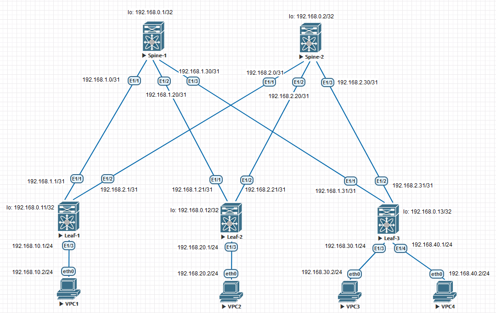

### Underlay IS-IS.

## Цель:

- Настроить IS-IS для Underlay сети


## В этой самостоятельной работе мы ожидаем, что вы самостоятельно:
  
1. настроить IS-IS в Underlay сети, для IP связанности между всеми устройствами NXOS


### Описание/Пошаговая инструкция выполнения домашнего задания:

1. Настроить IPv4 адресацию на всех устройствах.
2. Настроить IS-IS.
3. Проверить работу протокола IS-IS.  


## Схема стенда 


## Таблица адресов
| Device  | Interface | IP Address   | Subnet Mask     | Default Gateway |
|---------|-----------|--------------|-----------------|-----------------|
| Spine 1 | lo        | 192.168.0.1  | 255.255.255.255 |                 |
|         | E1/1      | 192.168.1.1  | 255.255.255.252 |                 |
|         | E1/2      | 192.168.1.21 | 255.255.255.252 |                 |
|         | E1/3      | 192.168.1.33 | 255.255.255.252 |                 |
| Spine 1 | lo        | 192.168.0.2  | 255.255.255.255 |                 |
|         | E1/1      | 192.168.2.1  | 255.255.255.252 |                 |
|         | E1/2      | 192.168.2.21 | 255.255.255.252 |                 |
|         | E1/3      | 192.168.2.33 | 255.255.255.252 |                 |
| Leaf 1  | lo        | 192.168.0.11 | 255.255.255.255 |                 |
|         | E1/1      | 192.168.1.2  | 255.255.255.252 |                 |
|         | E1/2      | 192.168.2.2  | 255.255.255.252 |                 |
|         | E1/3      | 192.168.10.1 | 255.255.255.0   |                 |
| Leaf 2  | lo        | 192.168.0.12 | 255.255.255.255 |                 |
|         | E1/1      | 192.168.1.22 | 255.255.255.252 |                 |
|         | E1/2      | 192.168.2.22 | 255.255.255.252 |                 |
|         | E1/3      | 192.168.20.1 | 255.255.255.252 |                 |
| Leaf 3  | lo        | 192.168.0.13 | 255.255.255.255 |                 |
|         | E1/1      | 192.168.1.34 | 255.255.255.252 |                 |
|         | E1/2      | 192.168.2.34 | 255.255.255.255 |                 |
|         | E1/3      | 192.168.30.1 | 255.255.255.0   |                 |
|         | E1/3      | 192.168.30.1 | 255.255.255.0   |                 |
| VPC1    | eth0      | 192.168.10.2 | 255.255.255.0   | 192.168.10.1    |
| VPC2    | eth0      | 192.168.20.2 | 255.255.255.0   | 192.168.20.1    |
| VPC3    | eth0      | 192.168.30.2 | 255.255.255.0   | 192.168.30.1    |
| VPC4    | eth0      | 192.168.30.3 | 255.255.255.0   | 192.168.30.1    |


### [Файлы конфигураций устройст и сама работа выполненная в EVE-NG ](https://github.com/niknav83/Data_center_network_design/tree/main/labs/lab03/configs)

В данной работе применялса образ nxosv9k-9500-9.3.7

Логин и пароль: admin 

## Приступаем к настрйке сети:

### Настроим интерфейсы и IP адреса на всех устройствах Underlay-сети.


 Конфигурация интерфейсов для Spine-1:

```
interface Ethernet1/1
  mtu 9216
  ip address 192.168.1.1/30
  no shutdown

interface Ethernet1/2
  mtu 9216
  ip address 192.168.1.21/30
  no shutdown

interface Ethernet1/3
  mtu 9216
  ip address 192.168.1.33/30
  no shutdown

interface loopback0
  ip address 192.168.0.1/32
!
```
 Конфигурация интерфейсов для Spine-2:

```
interface Ethernet1/1
  mtu 9216
  ip address 192.168.2.1/30
  no shutdown

interface Ethernet1/2
  mtu 9216
  ip address 192.168.2.21/30
  no shutdown

interface Ethernet1/3
  mtu 9216
  ip address 192.168.2.33/30
  no shutdown

interface loopback0
  ip address 192.168.0.2/32
!
```

 Конфигурация интерфейсов для Leaf-1:

```
interface Ethernet1/1
  mtu 9216
  ip address 192.168.1.2/30
  no shutdown

interface Ethernet1/2
  mtu 9216
  ip address 192.168.2.2/30
  no shutdown

interface Ethernet1/3
  mtu 9216
  ip address 192.168.10.1/24
  no shutdown

interface loopback0
  ip address 192.168.0.11/32
!
```

 Конфигурация интерфейсов для Leaf-2:

```
interface Ethernet1/1
  mtu 9216
  ip address 192.168.1.22/30
  no shutdown

interface Ethernet1/2
  mtu 9216
  ip address 192.168.2.22/30
  no shutdown

interface Ethernet1/3
  mtu 9216
  ip address 192.168.20.1/24
  no shutdown

interface loopback0
  ip address 192.168.0.12/32
!
```

 Конфигурация интерфейсов для Leaf-3:

```
interface Vlan130
  no shutdown
  ip address 192.168.30.1/24

interface Ethernet1/1
  mtu 9216
  ip address 192.168.1.34/30
  no shutdown

interface Ethernet1/2
  mtu 9216
  ip address 192.168.2.34/30
  no shutdown

interface Ethernet1/3
  switchport
  switchport access vlan 130
  mtu 9216
  no shutdown

interface Ethernet1/4
  switchport
  switchport access vlan 130
  mtu 9216
  no shutdown

interface loopback0
  ip address 192.168.0.13/32
!
```

### Далее для общей связанности между всеми устройствами настроим протокол IS-IS.

На Nexus необходимо для начала включить функцию IS-IS

```
feature ospf
```

 Конфигурация IS-IS для Spine-1:

```
feature ospf

interface Ethernet1/1
  mtu 9216
  ip address 192.168.1.1/30
  isis network point-to-point
  ip router isis Underlay
  no shutdown

interface Ethernet1/2
  mtu 9216
  ip address 192.168.1.21/30
  isis network point-to-point
  ip router isis Underlay
  no shutdown

interface Ethernet1/3
  mtu 9216
  ip address 192.168.1.33/30
  isis network point-to-point
  ip router isis Underlay
  no shutdown

interface loopback0
  ip address 192.168.0.1/32
  isis network point-to-point
  ip router isis Underlay

router isis Underlay
  net 49.0001.1921.6800.0001.00
  is-type level-1
!
```
 Конфигурация IS-IS для Spine-2:

```
feature ospf

interface Ethernet1/1
  mtu 9216
  ip address 192.168.2.1/30
  isis network point-to-point
  ip router isis Underlay
  no shutdown

interface Ethernet1/2
  mtu 9216
  ip address 192.168.2.21/30
  isis network point-to-point
  ip router isis Underlay
  no shutdown

interface Ethernet1/3
  mtu 9216
  ip address 192.168.2.33/30
  isis network point-to-point
  ip router isis Underlay
  no shutdown

interface loopback0
  ip address 192.168.0.2/32
  isis network point-to-point
  ip router isis Underlay

router isis Underlay
  net 49.0001.1921.6800.0002.00
  is-type level-1
!
```

 Конфигурация IS-IS для Leaf-1:

```
feature ospf

interface Ethernet1/1
  mtu 9216
  ip address 192.168.1.2/30
  isis network point-to-point
  ip router isis Underlay
  no shutdown

interface Ethernet1/2
  mtu 9216
  ip address 192.168.2.2/30
  isis network point-to-point
  ip router isis Underlay
  no shutdown

interface Ethernet1/3
  mtu 9216
  ip address 192.168.10.1/24
  ip router isis Underlay
  isis passive-interface level-1-2
  no shutdown

interface loopback0
  ip address 192.168.0.11/32
  ip router isis Underlay
  isis passive-interface level-1-2

router isis Underlay
  net 49.0001.1921.6800.0011.00
  is-type level-1
!
```

 Конфигурация IS-IS для Leaf-2:

```
feature ospf

interface Ethernet1/1
  mtu 9216
  ip address 192.168.1.22/30
  isis network point-to-point
  ip router isis Underlay
  no shutdown

interface Ethernet1/2
  mtu 9216
  ip address 192.168.2.22/30
  isis network point-to-point
  ip router isis Underlay
  no shutdown

interface Ethernet1/3
  mtu 9216
  ip address 192.168.20.1/24
  ip router isis Underlay
  isis passive-interface level-1-2
  no shutdown

interface loopback0
  ip address 192.168.0.12/32
  ip router isis Underlay
  isis passive-interface level-1-2

router isis Underlay
  net 49.0001.1921.6800.0012.00
  is-type level-1
!
```

 Конфигурация IS-IS для Leaf-3:

```
feature ospf

interface Vlan130
  no shutdown
  mtu 9216
  ip address 192.168.30.1/24
  ip router isis Underlay
  isis passive-interface level-1-2

interface Ethernet1/1
  mtu 9216
  ip address 192.168.1.34/30
  isis network point-to-point
  ip router isis Underlay
  no shutdown

interface Ethernet1/2
  mtu 9216
  ip address 192.168.2.34/30
  isis network point-to-point
  ip router isis Underlay
  no shutdown

interface Ethernet1/3
  switchport
  switchport access vlan 130
  mtu 9216
  no shutdown

interface Ethernet1/4
  switchport
  switchport access vlan 130
  mtu 9216
  no shutdown

interface loopback0
  ip address 192.168.0.13/32
  ip router isis Underlay
  isis passive-interface level-1-2

router isis Underlay
  net 49.0001.1921.6800.0013.00
  is-type level-1
!
```


