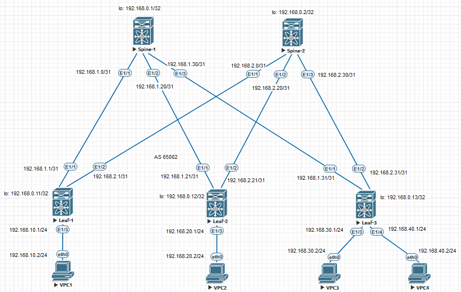

### Underlay iBGP.

## Цель:

- Настроить iBGP для Underlay сети


## В этой самостоятельной работе мы ожидаем, что вы самостоятельно:
  
1. Настроить iBGP в Underlay сети, для IP связанности между всеми устройствами NXOS


### Описание/Пошаговая инструкция выполнения домашнего задания:

1. Настроить IPv4 адресацию на всех устройствах.
2. Настроить iBGP.
3. Проверить работу протокола iBGP.  

## Схема стенда 



## Таблица адресов

| Device  | Interface | IP Address   | Subnet Mask     | Default Gateway |
|---------|-----------|--------------|-----------------|-----------------|
| Spine 1 | lo        | 192.168.0.1  | 255.255.255.255 |                 |
|         | E1/1      | 192.168.1.0  | 255.255.255.254 |                 |
|         | E1/2      | 192.168.1.20 | 255.255.255.254 |                 |
|         | E1/3      | 192.168.1.30 | 255.255.255.254 |                 |
| Spine 1 | lo        | 192.168.0.2  | 255.255.255.255 |                 |
|         | E1/1      | 192.168.2.0  | 255.255.255.254 |                 |
|         | E1/2      | 192.168.2.20 | 255.255.255.254 |                 |
|         | E1/3      | 192.168.2.30 | 255.255.255.254 |                 |
| Leaf 1  | lo        | 192.168.0.11 | 255.255.255.255 |                 |
|         | E1/1      | 192.168.1.1  | 255.255.255.254 |                 |
|         | E1/2      | 192.168.2.1  | 255.255.255.254 |                 |
|         | E1/3      | 192.168.10.1 | 255.255.255.0   |                 |
| Leaf 2  | lo        | 192.168.0.12 | 255.255.255.255 |                 |
|         | E1/1      | 192.168.1.21 | 255.255.255.254 |                 |
|         | E1/2      | 192.168.2.21 | 255.255.255.254 |                 |
|         | E1/3      | 192.168.20.1 | 255.255.255.0   |                 |
| Leaf 3  | lo        | 192.168.0.13 | 255.255.255.255 |                 |
|         | E1/1      | 192.168.1.31 | 255.255.255.254 |                 |
|         | E1/2      | 192.168.2.31 | 255.255.255.254 |                 |
|         | E1/3      | 192.168.30.1 | 255.255.255.0   |                 |
|         | E1/4      | 192.168.40.1 | 255.255.255.0   |                 |
| VPC1    | eth0      | 192.168.10.2 | 255.255.255.0   | 192.168.10.1    |
| VPC2    | eth0      | 192.168.20.2 | 255.255.255.0   | 192.168.20.1    |
| VPC3    | eth0      | 192.168.30.2 | 255.255.255.0   | 192.168.30.1    |
| VPC4    | eth0      | 192.168.40.2 | 255.255.255.0   | 192.168.40.1    |


### [Файлы конфигураций устройст и сама работа выполненная в EVE-NG ](https://github.com/niknav83/Data_center_network_design/tree/main/labs/lab04.2/configs)

В данной работе применялса образ nxosv9k-9500-9.3.8

Логин и пароль: admin 

## Приступаем к настрйке сети:

### Настроим интерфейсы и IP адреса на всех устройствах Underlay-сети.

<details>

<summary> Конфигурация интерфейсов для Spine-1: </summary>

```
interface Ethernet1/1
  mtu 9216
  medium p2p
  ip address 192.168.1.0/31
  no shutdown

interface Ethernet1/2
  mtu 9216
  medium p2p
  ip address 192.168.1.20/31
  no shutdown

interface Ethernet1/3
  mtu 9216
  medium p2p
  ip address 192.168.1.30/31
  no shutdown

interface loopback0
  ip address 192.168.0.1/32
```
</details>


<details>

<summary> Конфигурация интерфейсов для Spine-2: </summary>

```
interface Ethernet1/1
  mtu 9216
  medium p2p
  ip address 192.168.2.0/31
  no shutdown

interface Ethernet1/2
  mtu 9216
  medium p2p
  ip address 192.168.2.20/31
  no shutdown

interface Ethernet1/3
  mtu 9216
  medium p2p
  ip address 192.168.2.30/31
  no shutdown

interface loopback0
  ip address 192.168.0.2/32
```
</details>


<details>

<summary> Конфигурация интерфейсов для Leaf-1: </summary>

```
interface Ethernet1/1
  mtu 9216
  medium p2p
  ip address 192.168.1.1/31
  no shutdown

interface Ethernet1/2
  mtu 9216
  medium p2p
  ip address 192.168.2.1/31
  no shutdown

interface Ethernet1/3
  mtu 9216
  ip address 192.168.10.1/24
  no shutdown

interface loopback0
  ip address 192.168.0.11/32
```
</details>


<details>

<summary> Конфигурация интерфейсов для Leaf-2: </summary>

```
interface Ethernet1/1
  mtu 9216
  medium p2p
  ip address 192.168.1.21/31
  no shutdown

interface Ethernet1/2
  mtu 9216
  medium p2p
  ip address 192.168.2.21/31
  no shutdown

interface Ethernet1/3
  mtu 9216
  ip address 192.168.20.1/24
  no shutdown

interface loopback0
  ip address 192.168.0.12/32
```
</details>


<details>

<summary> Конфигурация интерфейсов для Leaf-3: </summary>

```
interface Ethernet1/1
  mtu 9216
  medium p2p
  ip address 192.168.1.31/31
  no shutdown

interface Ethernet1/2
  mtu 9216
  medium p2p
  ip address 192.168.2.31/31
  no shutdown

interface Ethernet1/3
  mtu 9216
  ip address 192.168.30.1/24
  no shutdown

interface Ethernet1/4
  mtu 9216
  ip address 192.168.40.1/24
  no shutdown

interface loopback0
  ip address 192.168.0.13/32
```
</details>


<details>
  
<summary> Конфигурация интерфейсов для VPC1: </summary>

```
ip 192.168.10.2 192.168.10.1 24
```
</details>

<details>
  
<summary> Конфигурация интерфейсов для VPC2: </summary>

```
ip 192.168.20.2 192.168.20.1 24
```
</details>
  
<details>
    
<summary> Конфигурация интерфейсов для VPC3: </summary>

```
ip 192.168.30.2 192.168.30.1 24
```
</details>

<details>
  
<summary> Конфигурация интерфейсов для VPC4: </summary>

```
ip 192.168.40.2 192.168.40.1 24
```
</details>


### Далее для общей связанности между всеми устройствами настроим протокол iBGP.

На Nexus необходимо для начала включить функцию BGP

```
feature bgp
```

Конфигурация BGP для Spine-1:

```
feature bgp
feature bfd

route-map RM_REDIS_CON permit 10
  match interface loopback0

router bgp 65000
  router-id 192.168.0.1
  reconnect-interval 12
  log-neighbor-changes
  address-family ipv4 unicast
    redistribute direct route-map RM_REDIS_CON
    maximum-paths ibgp 64
  neighbor 192.168.1.0/24
    remote-as 65000
    maximum-peers 10
    address-family ipv4 unicast
      route-reflector-client
      next-hop-self all
```

 Конфигурация BGP для Spine-2:

```
feature bgp
feature bfd

route-map RM_REDIS_CON permit 10
  match interface loopback0

router bgp 65000
  router-id 192.168.0.2
  reconnect-interval 12
  log-neighbor-changes
  address-family ipv4 unicast
    redistribute direct route-map RM_REDIS_CON
    maximum-paths ibgp 64
  neighbor 192.168.2.0/24
    remote-as 65000
    maximum-peers 10
    address-family ipv4 unicast
      route-reflector-client
      next-hop-self all
```

 Конфигурация BGP для Leaf-1:

```
feature bgp
feature bfd

route-map RM_REDIS_CON permit 10
  match interface loopback0 Ethernet1/3

router bgp 65000
  router-id 192.168.0.11
  reconnect-interval 12
  log-neighbor-changes
  address-family ipv4 unicast
    redistribute direct route-map RM_REDIS_CON
    maximum-paths ibgp 64
  template peer SPINES
    remote-as 65000
    timers 3 9
    address-family ipv4 unicast
  neighbor 192.168.1.0
    inherit peer SPINES
  neighbor 192.168.2.0
    inherit peer SPINES
```

 Конфигурация BGP для Leaf-2:

```
feature bgp
feature bfd

route-map RM_REDIS_CON permit 10
  match interface loopback0 Ethernet1/3

router bgp 65000
  router-id 192.168.0.12
  reconnect-interval 12
  log-neighbor-changes
  address-family ipv4 unicast
    redistribute direct route-map RM_REDIS_CON
    maximum-paths ibgp 64
  template peer SPINES
    remote-as 65000
    timers 3 9
    address-family ipv4 unicast
  neighbor 192.168.1.20
    inherit peer SPINES
  neighbor 192.168.2.20
    inherit peer SPINES
```

 Конфигурация BGP для Leaf-3:

```
feature bgp
feature bfd

route-map RM_REDIS_CON permit 10
  match interface loopback0 Ethernet1/3 Ethernet1/4 

router bgp 65000
  router-id 192.168.0.13
  reconnect-interval 12
  log-neighbor-changes
  address-family ipv4 unicast
    redistribute direct route-map RM_REDIS_CON
    maximum-paths ibgp 64
  template peer SPINES
    remote-as 65000
    timers 3 9
    address-family ipv4 unicast
  neighbor 192.168.1.30
    inherit peer SPINES
  neighbor 192.168.2.30
    inherit peer SPINES
```

## Проверяем работу протокола iBGP:


<details>
  
<summary>Вывод команды show ip bgp summary:</summary>

Spine-1

```
Spine-1# show ip bgp summary
BGP summary information for VRF default, address family IPv4 Unicast
BGP router identifier 192.168.0.1, local AS number 65000
BGP table version is 468, IPv4 Unicast config peers 4, capable peers 3
8 network entries and 8 paths using 1952 bytes of memory
BGP attribute entries [2/344], BGP AS path entries [0/0]
BGP community entries [0/0], BGP clusterlist entries [0/0]

Neighbor        V    AS MsgRcvd MsgSent   TblVer  InQ OutQ Up/Down  State/PfxRcd
192.168.1.1     4 65000    3088    3064      468    0    0 00:06:45 2
192.168.1.21    4 65000    3063    3066      468    0    0 00:06:44 2
192.168.1.31    4 65000    3105    3079      468    0    0 00:06:42 3
```

Spine-2

```
Spine-2# show ip bgp summary
BGP summary information for VRF default, address family IPv4 Unicast
BGP router identifier 192.168.0.2, local AS number 65000
BGP table version is 1427, IPv4 Unicast config peers 4, capable peers 3
8 network entries and 8 paths using 1952 bytes of memory
BGP attribute entries [2/344], BGP AS path entries [0/0]
BGP community entries [0/0], BGP clusterlist entries [0/0]

Neighbor        V    AS MsgRcvd MsgSent   TblVer  InQ OutQ Up/Down  State/PfxRcd
192.168.2.1     4 65000    3131    3111     1427    0    0 00:00:06 2
192.168.2.21    4 65000    3133    3114     1427    0    0 00:00:06 2
192.168.2.31    4 65000    3146    3115     1427    0    0 00:00:10 3
```

Leaf-1

```
Leaf-1# show ip bgp summary
BGP summary information for VRF default, address family IPv4 Unicast
BGP router identifier 192.168.0.11, local AS number 65000
BGP table version is 775, IPv4 Unicast config peers 2, capable peers 2
9 network entries and 14 paths using 2796 bytes of memory
BGP attribute entries [6/1032], BGP AS path entries [0/0]
BGP community entries [0/0], BGP clusterlist entries [4/16]

Neighbor        V    AS MsgRcvd MsgSent   TblVer  InQ OutQ Up/Down  State/PfxRcd
192.168.1.0     4 65000    3159    3113      775    0    0 00:00:42 6
192.168.2.0     4 65000    3177    3134      775    0    0 00:00:46 6
```

Leaf-2

```
Leaf-2# show ip bgp summary
BGP summary information for VRF default, address family IPv4 Unicast
BGP router identifier 192.168.0.12, local AS number 65000
BGP table version is 738, IPv4 Unicast config peers 2, capable peers 2
9 network entries and 14 paths using 2796 bytes of memory
BGP attribute entries [6/1032], BGP AS path entries [0/0]
BGP community entries [0/0], BGP clusterlist entries [4/16]

Neighbor        V    AS MsgRcvd MsgSent   TblVer  InQ OutQ Up/Down  State/PfxRcd
192.168.1.20    4 65000    3171    3118      738    0    0 00:01:21 6
192.168.2.20    4 65000    3194    3144      738    0    0 00:01:18 6
```

Leaf-3

```
Leaf-3# show ip bgp summary
BGP summary information for VRF default, address family IPv4 Unicast
BGP router identifier 192.168.0.13, local AS number 65000
BGP table version is 634, IPv4 Unicast config peers 2, capable peers 2
9 network entries and 13 paths using 2676 bytes of memory
BGP attribute entries [6/1032], BGP AS path entries [0/0]
BGP community entries [0/0], BGP clusterlist entries [4/16]

Neighbor        V    AS MsgRcvd MsgSent   TblVer  InQ OutQ Up/Down  State/PfxRcd
192.168.1.30    4 65000    3205    3161      634    0    0 00:00:04 3
192.168.2.30    4 65000    3217    3169      634    0    0 00:00:02 1
```
</details>

<details>
  
<summary>Вывод команды show ip bgp :</summary>

Spine-1

```
Spine-1# show ip bgp
BGP routing table information for VRF default, address family IPv4 Unicast
BGP table version is 501, Local Router ID is 192.168.0.1
Status: s-suppressed, x-deleted, S-stale, d-dampened, h-history, *-valid, >-best
Path type: i-internal, e-external, c-confed, l-local, a-aggregate, r-redist, I-i
njected
Origin codes: i - IGP, e - EGP, ? - incomplete, | - multipath, & - backup, 2 - b
est2

   Network            Next Hop            Metric     LocPrf     Weight Path
*>r192.168.0.1/32     0.0.0.0                  0        100      32768 ?
*>i192.168.0.11/32    192.168.1.1              0        100          0 ?
*>i192.168.0.12/32    192.168.1.21             0        100          0 ?
*>i192.168.0.13/32    192.168.1.31             0        100          0 ?
*>i192.168.10.0/24    192.168.1.1              0        100          0 ?
*>i192.168.20.0/24    192.168.1.21             0        100          0 ?
*>i192.168.30.0/24    192.168.1.31             0        100          0 ?
*>i192.168.40.0/24    192.168.1.31             0        100          0 ?
```

Spine-2

```
Spine-2# show ip bgp
BGP routing table information for VRF default, address family IPv4 Unicast
BGP table version is 1451, Local Router ID is 192.168.0.2
Status: s-suppressed, x-deleted, S-stale, d-dampened, h-history, *-valid, >-best
Path type: i-internal, e-external, c-confed, l-local, a-aggregate, r-redist, I-i
njected
Origin codes: i - IGP, e - EGP, ? - incomplete, | - multipath, & - backup, 2 - b
est2

   Network            Next Hop            Metric     LocPrf     Weight Path
*>r192.168.0.2/32     0.0.0.0                  0        100      32768 ?
*>i192.168.0.11/32    192.168.2.1              0        100          0 ?
*>i192.168.0.12/32    192.168.2.21             0        100          0 ?
*>i192.168.0.13/32    192.168.2.31             0        100          0 ?
*>i192.168.10.0/24    192.168.2.1              0        100          0 ?
*>i192.168.20.0/24    192.168.2.21             0        100          0 ?
*>i192.168.30.0/24    192.168.2.31             0        100          0 ?
*>i192.168.40.0/24    192.168.2.31             0        100          0 ?
```

Leaf-1

```
Leaf-1# show ip bgp
BGP routing table information for VRF default, address family IPv4 Unicast
BGP table version is 803, Local Router ID is 192.168.0.11
Status: s-suppressed, x-deleted, S-stale, d-dampened, h-history, *-valid, >-best
Path type: i-internal, e-external, c-confed, l-local, a-aggregate, r-redist, I-i
njected
Origin codes: i - IGP, e - EGP, ? - incomplete, | - multipath, & - backup, 2 - b
est2

   Network            Next Hop            Metric     LocPrf     Weight Path
x i192.168.0.1/32     192.168.1.0              0        100          0 ?
x i192.168.0.2/32     192.168.2.0              0        100          0 ?
*>r192.168.0.11/32    0.0.0.0                  0        100      32768 ?
x i192.168.0.12/32    192.168.2.0              0        100          0 ?
x i                   192.168.1.0              0        100          0 ?
x i192.168.0.13/32    192.168.2.0              0        100          0 ?
x i                   192.168.1.0              0        100          0 ?
*>r192.168.10.0/24    0.0.0.0                  0        100      32768 ?
x i192.168.20.0/24    192.168.2.0              0        100          0 ?
x i                   192.168.1.0              0        100          0 ?
x i192.168.30.0/24    192.168.2.0              0        100          0 ?
x i                   192.168.1.0              0        100          0 ?
x i192.168.40.0/24    192.168.2.0              0        100          0 ?
x i                   192.168.1.0              0        100          0 ?
```

Leaf-2

```
Leaf-2# show ip bgp
BGP routing table information for VRF default, address family IPv4 Unicast
BGP table version is 785, Local Router ID is 192.168.0.12
Status: s-suppressed, x-deleted, S-stale, d-dampened, h-history, *-valid, >-best
Path type: i-internal, e-external, c-confed, l-local, a-aggregate, r-redist, I-i
njected
Origin codes: i - IGP, e - EGP, ? - incomplete, | - multipath, & - backup, 2 - b
est2

   Network            Next Hop            Metric     LocPrf     Weight Path
*>i192.168.0.1/32     192.168.1.20             0        100          0 ?
*>i192.168.0.2/32     192.168.2.20             0        100          0 ?
*>i192.168.0.11/32    192.168.1.20             0        100          0 ?
*|i                   192.168.2.20             0        100          0 ?
*>r192.168.0.12/32    0.0.0.0                  0        100      32768 ?
*>i192.168.0.13/32    192.168.1.20             0        100          0 ?
*|i                   192.168.2.20             0        100          0 ?
*>i192.168.10.0/24    192.168.1.20             0        100          0 ?
*|i                   192.168.2.20             0        100          0 ?
*>r192.168.20.0/24    0.0.0.0                  0        100      32768 ?
*>i192.168.30.0/24    192.168.1.20             0        100          0 ?
*|i                   192.168.2.20             0        100          0 ?
*>i192.168.40.0/24    192.168.1.20             0        100          0 ?
*|i                   192.168.2.20             0        100          0 ?
```

Leaf-3

```
Leaf-3# show ip bgp
BGP routing table information for VRF default, address family IPv4 Unicast
BGP table version is 660, Local Router ID is 192.168.0.13
Status: s-suppressed, x-deleted, S-stale, d-dampened, h-history, *-valid, >-best
Path type: i-internal, e-external, c-confed, l-local, a-aggregate, r-redist, I-i
njected
Origin codes: i - IGP, e - EGP, ? - incomplete, | - multipath, & - backup, 2 - b
est2

   Network            Next Hop            Metric     LocPrf     Weight Path
*>i192.168.0.1/32     192.168.1.30             0        100          0 ?
*>i192.168.0.2/32     192.168.2.30             0        100          0 ?
*>i192.168.0.11/32    192.168.1.30             0        100          0 ?
*|i                   192.168.2.30             0        100          0 ?
*>i192.168.0.12/32    192.168.1.30             0        100          0 ?
*|i                   192.168.2.30             0        100          0 ?
*>r192.168.0.13/32    0.0.0.0                  0        100      32768 ?
*>i192.168.10.0/24    192.168.1.30             0        100          0 ?
*|i                   192.168.2.30             0        100          0 ?
*>i192.168.20.0/24    192.168.1.30             0        100          0 ?
*|i                   192.168.2.30             0        100          0 ?
*>r192.168.30.0/24    0.0.0.0                  0        100      32768 ?
*>r192.168.40.0/24    0.0.0.0                  0        100      32768 ?
```

</details>


<details>
  
<summary>Проверяем работу протокола BGP c VPC1</summary>

```
VPCS> trace 192.168.20.2
trace to 192.168.20.2, 8 hops max, press Ctrl+C to stop
 1   192.168.10.1   6.847 ms  3.016 ms  2.991 ms
 2   192.168.1.0   19.313 ms  9.375 ms  9.939 ms
 3   192.168.1.21   26.343 ms  19.935 ms  14.333 ms
 4   *192.168.20.2   18.399 ms (ICMP type:3, code:3, Destination port unreachable)
```
```
VPCS> trace 192.168.30.2
trace to 192.168.30.2, 8 hops max, press Ctrl+C to stop
 1   192.168.10.1   24.779 ms  5.964 ms  4.122 ms
 2   192.168.2.0   35.109 ms  14.011 ms  15.186 ms
 3   192.168.2.31   61.015 ms  95.396 ms  33.882 ms
 4   *192.168.30.2   60.811 ms (ICMP type:3, code:3, Destination port unreachable)
```
```
VPCS> trace 192.168.40.2
trace to 192.168.40.2, 8 hops max, press Ctrl+C to stop
 1   192.168.10.1   45.772 ms  5.845 ms  3.134 ms
 2   192.168.2.0   32.619 ms  10.190 ms  12.992 ms
 3   192.168.2.31   58.780 ms  16.655 ms  18.662 ms
 4   *192.168.40.2   35.878 ms (ICMP type:3, code:3, Destination port unreachable)
```
</details>


<details>
  
<summary>Проверяем работу протокола BGP c VPC2</summary>

```
VPCS> trace 192.168.10.2
trace to 192.168.10.2, 8 hops max, press Ctrl+C to stop
 1   192.168.20.1   29.233 ms  4.053 ms  5.824 ms
 2   192.168.2.20   37.352 ms  8.877 ms  10.137 ms
 3   192.168.2.1   38.286 ms  39.378 ms  21.041 ms
 4   *192.168.10.2   44.849 ms (ICMP type:3, code:3, Destination port unreachable)
```
```
VPCS> trace 192.168.30.2
trace to 192.168.30.2, 8 hops max, press Ctrl+C to stop
 1   192.168.20.1   12.579 ms  5.232 ms  4.286 ms
 2   192.168.2.20   18.425 ms  12.503 ms  23.717 ms
 3   192.168.2.31   104.218 ms  30.314 ms  25.285 ms
 4   *192.168.30.2   22.563 ms (ICMP type:3, code:3, Destination port unreachable)
```
```
VPCS> trace 192.168.40.2
trace to 192.168.40.2, 8 hops max, press Ctrl+C to stop
 1   192.168.20.1   200.521 ms  7.560 ms  11.123 ms
 2   192.168.2.20   470.225 ms  33.129 ms  45.041 ms
 3   192.168.2.31   193.687 ms  63.592 ms  49.119 ms
 4   *192.168.40.2   61.072 ms (ICMP type:3, code:3, Destination port unreachable)
```
</details>

<details>
  
<summary>Проверяем работу протокола BGP c VPC3</summary>

```
VPCS> trace 192.168.10.2
trace to 192.168.10.2, 8 hops max, press Ctrl+C to stop
 1   192.168.30.1   9.293 ms  2.476 ms  2.698 ms
 2   192.168.1.30   26.142 ms  11.908 ms  8.372 ms
 3   192.168.1.1   34.849 ms  13.283 ms  14.420 ms
 4   *192.168.10.2   42.758 ms (ICMP type:3, code:3, Destination port unreachable)
```
```
VPCS> trace 192.168.20.2
trace to 192.168.20.2, 8 hops max, press Ctrl+C to stop
 1   192.168.30.1   5.120 ms  3.330 ms  3.421 ms
 2   192.168.2.30   20.928 ms  12.635 ms  8.497 ms
 3   192.168.2.21   23.730 ms  53.840 ms  15.457 ms
 4   *192.168.20.2   22.942 ms (ICMP type:3, code:3, Destination port unreachable)
```
```
VPCS> trace 192.168.40.2
trace to 192.168.40.2, 8 hops max, press Ctrl+C to stop
 1   192.168.30.1   18.231 ms  5.328 ms  3.251 ms
 2   *192.168.40.2   20.121 ms (ICMP type:3, code:3, Destination port unreachable)
```
</details>

<details>
  
<summary>Проверяем работу протокола BGP c VPC4</summary>

```
VPCS> trace 192.168.10.2
trace to 192.168.10.2, 8 hops max, press Ctrl+C to stop
 1   192.168.40.1   10.169 ms  2.861 ms  2.782 ms
 2   192.168.1.30   43.956 ms  9.572 ms  14.005 ms
 3   192.168.1.1   30.674 ms  18.779 ms  21.134 ms
 4   *192.168.10.2   29.602 ms (ICMP type:3, code:3, Destination port unreachable)
```
```
VPCS> trace 192.168.20.2
trace to 192.168.20.2, 8 hops max, press Ctrl+C to stop
 1   192.168.40.1   4.141 ms  3.150 ms  2.545 ms
 2   192.168.2.30   8.352 ms  7.810 ms  7.670 ms
 3   192.168.2.21   19.103 ms  19.563 ms  20.093 ms
 4   192.168.20.2   24.067 ms (ICMP type:3, code:3, Destination port unreachable)
```
```
VPCS> trace 192.168.30.2
trace to 192.168.30.2, 8 hops max, press Ctrl+C to stop
 1   192.168.40.1   14.090 ms  12.444 ms  7.591 ms
 2   *192.168.30.2   27.088 ms (ICMP type:3, code:3, Destination port unreachable)
```
</details>


