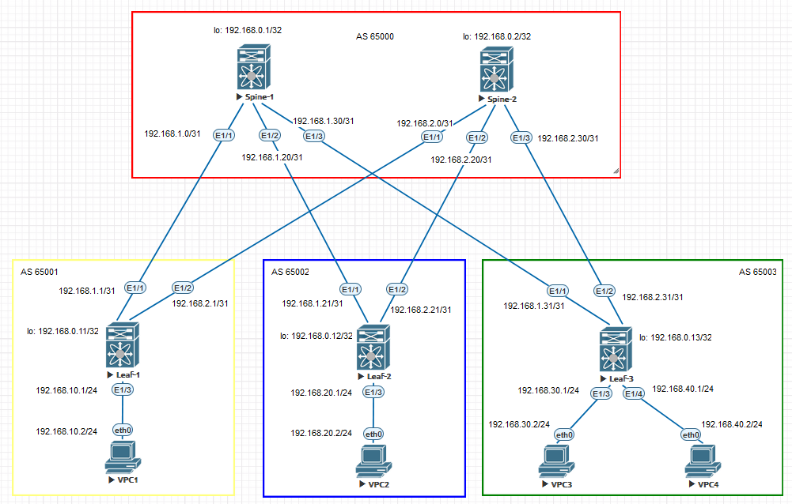

### Underlay BGP.

## Цель:

- Настроить BGP для Underlay сети


## В этой самостоятельной работе мы ожидаем, что вы самостоятельно:
  
1. Настроить BGP в Underlay сети, для IP связанности между всеми устройствами NXOS


### Описание/Пошаговая инструкция выполнения домашнего задания:

1. Настроить IPv4 адресацию на всех устройствах.
2. Настроить BGP.
3. Проверить работу протокола BGP.  

## Схема стенда 


## Таблица адресов

| Device  | Interface | IP Address   | Subnet Mask     | Default Gateway |
|---------|-----------|--------------|-----------------|-----------------|
| Spine 1 | lo        | 192.168.0.1  | 255.255.255.255 |                 |
|         | E1/1      | 192.168.1.0  | 255.255.255.254 |                 |
|         | E1/2      | 192.168.1.20 | 255.255.255.254 |                 |
|         | E1/3      | 192.168.1.30 | 255.255.255.254 |                 |
| Spine 1 | lo        | 192.168.0.2  | 255.255.255.255 |                 |
|         | E1/1      | 192.168.2.0  | 255.255.255.254 |                 |
|         | E1/2      | 192.168.2.20 | 255.255.255.254 |                 |
|         | E1/3      | 192.168.2.30 | 255.255.255.254 |                 |
| Leaf 1  | lo        | 192.168.0.11 | 255.255.255.255 |                 |
|         | E1/1      | 192.168.1.1  | 255.255.255.254 |                 |
|         | E1/2      | 192.168.2.1  | 255.255.255.254 |                 |
|         | E1/3      | 192.168.10.1 | 255.255.255.0   |                 |
| Leaf 2  | lo        | 192.168.0.12 | 255.255.255.255 |                 |
|         | E1/1      | 192.168.1.21 | 255.255.255.254 |                 |
|         | E1/2      | 192.168.2.21 | 255.255.255.254 |                 |
|         | E1/3      | 192.168.20.1 | 255.255.255.0   |                 |
| Leaf 3  | lo        | 192.168.0.13 | 255.255.255.255 |                 |
|         | E1/1      | 192.168.1.31 | 255.255.255.254 |                 |
|         | E1/2      | 192.168.2.31 | 255.255.255.254 |                 |
|         | E1/3      | 192.168.30.1 | 255.255.255.0   |                 |
|         | E1/4      | 192.168.40.1 | 255.255.255.0   |                 |
| VPC1    | eth0      | 192.168.10.2 | 255.255.255.0   | 192.168.10.1    |
| VPC2    | eth0      | 192.168.20.2 | 255.255.255.0   | 192.168.20.1    |
| VPC3    | eth0      | 192.168.30.2 | 255.255.255.0   | 192.168.30.1    |
| VPC4    | eth0      | 192.168.40.2 | 255.255.255.0   | 192.168.40.1    |


### [Файлы конфигураций устройст и сама работа выполненная в EVE-NG ](https://github.com/niknav83/Data_center_network_design/tree/main/labs/lab04/configs)

В данной работе применялса образ nxosv9k-9500-9.3.8

Логин и пароль: admin 

## Приступаем к настрйке сети:

### Настроим интерфейсы и IP адреса на всех устройствах Underlay-сети.

<details>

<summary> Конфигурация интерфейсов для Spine-1: </summary>

```
interface Ethernet1/1
  mtu 9216
  medium p2p
  ip address 192.168.1.0/31
  no shutdown

interface Ethernet1/2
  mtu 9216
  medium p2p
  ip address 192.168.1.20/31
  no shutdown

interface Ethernet1/3
  mtu 9216
  medium p2p
  ip address 192.168.1.30/31
  no shutdown

interface loopback0
  ip address 192.168.0.1/32
```
</details>


<details>

<summary> Конфигурация интерфейсов для Spine-2: </summary>

```
interface Ethernet1/1
  mtu 9216
  medium p2p
  ip address 192.168.2.0/31
  no shutdown

interface Ethernet1/2
  mtu 9216
  medium p2p
  ip address 192.168.2.20/31
  no shutdown

interface Ethernet1/3
  mtu 9216
  medium p2p
  ip address 192.168.2.30/31
  no shutdown

interface loopback0
  ip address 192.168.0.2/32
```
</details>


<details>

<summary> Конфигурация интерфейсов для Leaf-1: </summary>

```
interface Ethernet1/1
  mtu 9216
  medium p2p
  ip address 192.168.1.1/31
  no shutdown

interface Ethernet1/2
  mtu 9216
  medium p2p
  ip address 192.168.2.1/31
  no shutdown

interface Ethernet1/3
  mtu 9216
  ip address 192.168.10.1/24
  no shutdown

interface loopback0
  ip address 192.168.0.11/32
```
</details>


<details>

<summary> Конфигурация интерфейсов для Leaf-2: </summary>

```
interface Ethernet1/1
  mtu 9216
  medium p2p
  ip address 192.168.1.21/31
  no shutdown

interface Ethernet1/2
  mtu 9216
  medium p2p
  ip address 192.168.2.21/31
  no shutdown

interface Ethernet1/3
  mtu 9216
  ip address 192.168.20.1/24
  no shutdown

interface loopback0
  ip address 192.168.0.12/32
```
</details>


<details>

<summary> Конфигурация интерфейсов для Leaf-3: </summary>

```
interface Ethernet1/1
  mtu 9216
  medium p2p
  ip address 192.168.1.31/31
  no shutdown

interface Ethernet1/2
  mtu 9216
  medium p2p
  ip address 192.168.2.31/31
  no shutdown

interface Ethernet1/3
  mtu 9216
  ip address 192.168.30.1/24
  no shutdown

interface Ethernet1/4
  mtu 9216
  ip address 192.168.40.1/24
  no shutdown

interface loopback0
  ip address 192.168.0.13/32
```
</details>


<details>
  
<summary> Конфигурация интерфейсов для VPC1: </summary>

```
ip 192.168.10.2 192.168.10.1 24
```
</details>

<details>
  
<summary> Конфигурация интерфейсов для VPC2: </summary>

```
ip 192.168.20.2 192.168.20.1 24
```
</details>
  
<details>
    
<summary> Конфигурация интерфейсов для VPC3: </summary>

```
ip 192.168.30.2 192.168.30.1 24
```
</details>

<details>
  
<summary> Конфигурация интерфейсов для VPC4: </summary>

```
ip 192.168.40.2 192.168.40.1 24
```
</details>


### Далее для общей связанности между всеми устройствами настроим протокол BGP.

На Nexus необходимо для начала включить функцию BGP

```
feature bgp
```

Конфигурация BGP для Spine-1:

```
feature bgp
feature bfd

router bgp 65000
  router-id 192.168.0.1
  bestpath as-path multipath-relax
  reconnect-interval 10
  address-family ipv4 unicast
    network 192.168.0.1/32
    maximum-paths 10
  neighbor 192.168.1.1
    bfd
    remote-as 65001
    address-family ipv4 unicast
  neighbor 192.168.1.21
    bfd
    remote-as 65002
    address-family ipv4 unicast
  neighbor 192.168.1.31
    bfd
    remote-as 65003
    address-family ipv4 unicast
```

 Конфигурация BGP для Spine-2:

```
feature bgp
feature bfd

router bgp 65000
  router-id 192.168.0.2
  bestpath as-path multipath-relax
  reconnect-interval 10
  address-family ipv4 unicast
    network 192.168.0.2/32
    maximum-paths 10
  neighbor 192.168.2.1
    bfd
    remote-as 65001
    address-family ipv4 unicast
  neighbor 192.168.2.21
    bfd
    remote-as 65002
    address-family ipv4 unicast
  neighbor 192.168.2.31
    bfd
    remote-as 65003
    address-family ipv4 unicast
```

 Конфигурация BGP для Leaf-1:

```
feature bgp
feature bfd

route-map REDISTRIBUTE_CONNECTED permit 10
  match interface Ethernet1/3 

router bgp 65001
  router-id 192.168.0.11
  bestpath as-path multipath-relax
  reconnect-interval 10
  log-neighbor-changes
  address-family ipv4 unicast
    network 192.168.0.11/32
    redistribute direct route-map REDISTRIBUTE_CONNECTED
    maximum-paths 10
  template peer SPINES
    bfd
    remote-as 65000
    timers 3 9
    address-family ipv4 unicast
  neighbor 192.168.1.0
    inherit peer SPINES
  neighbor 192.168.2.0
    inherit peer SPINES
```

 Конфигурация BGP для Leaf-2:

```
feature bgp
feature bfd

route-map REDISTRIBUTE_CONNECTED permit 10
  match interface Ethernet1/3

router bgp 65002
  router-id 192.168.0.12
  bestpath as-path multipath-relax
  reconnect-interval 10
  log-neighbor-changes
  address-family ipv4 unicast
    network 192.168.0.12/32
    redistribute direct route-map REDISTRIBUTE_CONNECTED
    maximum-paths 10
  template peer SPINES
    bfd
    remote-as 65000
    timers 3 9
    address-family ipv4 unicast
  neighbor 192.168.1.20
    inherit peer SPINES
  neighbor 192.168.2.20
    inherit peer SPINES
```

 Конфигурация BGP для Leaf-3:

```
feature bgp
feature bfd

route-map REDISTRIBUTE_CONNECTED permit 10
  match interface Ethernet1/3 Ethernet1/4

router bgp 65003
  router-id 192.168.0.13
  bestpath as-path multipath-relax
  reconnect-interval 10
  log-neighbor-changes
  address-family ipv4 unicast
    network 192.168.0.13/32
    redistribute direct route-map REDISTRIBUTE_CONNECTED
    maximum-paths 10
  template peer SPINES
    bfd
    remote-as 65000
    timers 3 9
    address-family ipv4 unicast
  neighbor 192.168.1.30
    inherit peer SPINES
  neighbor 192.168.2.30
    inherit peer SPINES
```

## Проверяем работу протокола BGP:


