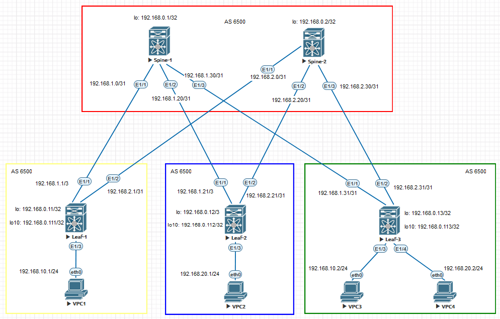

### VxLAN. EVPN L2.

## Цель:

- Настроить Overlay на основе VxLAN EVPN для L2 связанности между клиентами


## В этой самостоятельной работе мы ожидаем, что вы самостоятельно:
  
1. Настроить Overlay на основе VxLAN EVPN для L2 связанности между клиентами


### Описание/Пошаговая инструкция выполнения домашнего задания:

- В качестве Underlay-сети для IP-связанности будем использовать eBGP. Настройка eBGP проводилась в [предыдущей](https://github.com/niknav83/Data_center_network_design/tree/main/labs/lab04) лабораторной работе
- Настроить eBGP peering в Address Family L2VPN EVPN, указать BGP-соседство с IP-адресами Loopback 0 соседних устройств
- Выбрать VNI и VLAN ID. Создать VLAN и связать его с VNI на всех LEAF-коммутаторах
- Создать интерфейсы Loopback 10 на LEAF-коммутаторах и задать им IP-адреса
- Создать и настроить интерфейсы VxLAN на всех LEAF-коммутаторах - NVE
- Прописать VLAN на физических интерфейсах в Access Mode, к которым подключены клиентские устройства
- Выполнить проверку работы EVPN и VxLAN на всех устройствах

## Схема стенда 


## Таблица адресов

| Device  | Interface | IP Address   | Subnet Mask     | Default Gateway |
|---------|-----------|--------------|-----------------|-----------------|
| Spine 1 | lo 0      | 192.168.0.1  | 255.255.255.255 |                 |
|         | E1/1      | 192.168.1.0  | 255.255.255.254 |                 |
|         | E1/2      | 192.168.1.20 | 255.255.255.254 |                 |
|         | E1/3      | 192.168.1.30 | 255.255.255.254 |                 |
| Spine 1 | lo 0      | 192.168.0.2  | 255.255.255.255 |                 |
|         | E1/1      | 192.168.2.0  | 255.255.255.254 |                 |
|         | E1/2      | 192.168.2.20 | 255.255.255.254 |                 |
|         | E1/3      | 192.168.2.30 | 255.255.255.254 |                 |
| Leaf 1  | lo 0      | 192.168.0.11 | 255.255.255.255 |                 |
|         | lo 10     | 192.168.0.111| 255.255.255.255 |                 |
|         | E1/1      | 192.168.1.1  | 255.255.255.254 |                 |
|         | E1/2      | 192.168.2.1  | 255.255.255.254 |                 |
|         | E1/3      | 192.168.10.1 | 255.255.255.0   |                 |
| Leaf 2  | lo 0      | 192.168.0.12 | 255.255.255.255 |                 |
|         | lo 10     | 192.168.0.112| 255.255.255.255 |                 |
|         | E1/1      | 192.168.1.21 | 255.255.255.254 |                 |
|         | E1/2      | 192.168.2.21 | 255.255.255.254 |                 |
|         | E1/3      | 192.168.20.1 | 255.255.255.0   |                 |
| Leaf 3  | lo 0      | 192.168.0.13 | 255.255.255.255 |                 |
|         | lo 10     | 192.168.0.113| 255.255.255.255 |                 |
|         | E1/1      | 192.168.1.31 | 255.255.255.254 |                 |
|         | E1/2      | 192.168.2.31 | 255.255.255.254 |                 |
|         | E1/3      | 192.168.30.1 | 255.255.255.0   |                 |
|         | E1/4      | 192.168.40.1 | 255.255.255.0   |                 |
| VPC1    | eth0      | 192.168.10.1 | 255.255.255.0   |                 |
| VPC2    | eth0      | 192.168.20.1 | 255.255.255.0   |                 |
| VPC3    | eth0      | 192.168.10.2 | 255.255.255.0   |                 |
| VPC4    | eth0      | 192.168.20.2 | 255.255.255.0   |                 |


### [Файлы конфигураций устройст и сама работа выполненная в EVE-NG ](https://github.com/niknav83/Data_center_network_design/tree/main/labs/lab05/configs)

В данной работе применялса образ nxosv9k-9500-9.3.8

Логин и пароль: admin 

## Приступаем к настрйке сети:

### Настроим интерфейсы и IP адреса на всех устройствах Underlay-сети.

<details>

<summary> Конфигурация интерфейсов для Spine-1: </summary>

```
interface Ethernet1/1
  mtu 9216
  medium p2p
  ip address 192.168.1.0/31
  no shutdown

interface Ethernet1/2
  mtu 9216
  medium p2p
  ip address 192.168.1.20/31
  no shutdown

interface Ethernet1/3
  mtu 9216
  medium p2p
  ip address 192.168.1.30/31
  no shutdown

interface loopback0
  ip address 192.168.0.1/32
```
</details>


<details>

<summary> Конфигурация интерфейсов для Spine-2: </summary>

```
interface Ethernet1/1
  mtu 9216
  medium p2p
  ip address 192.168.2.0/31
  no shutdown

interface Ethernet1/2
  mtu 9216
  medium p2p
  ip address 192.168.2.20/31
  no shutdown

interface Ethernet1/3
  mtu 9216
  medium p2p
  ip address 192.168.2.30/31
  no shutdown

interface loopback0
  ip address 192.168.0.2/32
```
</details>


<details>

<summary> Конфигурация интерфейсов для Leaf-1: </summary>

```
interface Ethernet1/1
  mtu 9216
  medium p2p
  ip address 192.168.1.1/31
  no shutdown

interface Ethernet1/2
  mtu 9216
  medium p2p
  ip address 192.168.2.1/31
  no shutdown

interface Ethernet1/3
  description CLIENT-1
  switchport
  switchport access vlan 10
  no shutdown

interface loopback0
  ip address 192.168.0.11/32

interface loopback10
  ip address 192.168.0.111/32
```
</details>


<details>

<summary> Конфигурация интерфейсов для Leaf-2: </summary>

```
interface Ethernet1/1
  mtu 9216
  medium p2p
  ip address 192.168.1.21/31
  no shutdown

interface Ethernet1/2
  mtu 9216
  medium p2p
  ip address 192.168.2.21/31
  no shutdown

interface Ethernet1/3
  description CLIENT-2
  switchport
  switchport access vlan 20
  no shutdown

interface loopback0
  ip address 192.168.0.12/32

interface loopback10
  ip address 192.168.0.112/32
```
</details>


<details>

<summary> Конфигурация интерфейсов для Leaf-3: </summary>

```
interface Ethernet1/1
  mtu 9216
  medium p2p
  ip address 192.168.1.31/31
  no shutdown

interface Ethernet1/2
  mtu 9216
  medium p2p
  ip address 192.168.2.31/31
  no shutdown

interface Ethernet1/3
  description CLIENT-2
  switchport
  switchport access vlan 10
  no shutdown

interface Ethernet1/4
  description CLIENT-3
  switchport
  switchport access vlan 20
  no shutdown

interface loopback0
  ip address 192.168.0.13/32

interface loopback10
  ip address 192.168.0.113/32
```
</details>


### Далее на всех устройствах произведем необходимые настройки.

На Nexus необходимо для начала включить функции

```
nv overlay evpn
feature bgp
feature bfd
```

Конфигурация для Spine-1:

```
router bgp 65000
  router-id 192.168.0.1
  bestpath as-path multipath-relax
  address-family ipv4 unicast
    network 192.168.0.1/32
    maximum-paths 4
  address-family l2vpn evpn
    nexthop route-map NEXT-HOP-UNCH
    retain route-target all
  template peer LEAF-IPv4
    bfd
    address-family ipv4 unicast
  template peer LEAF-L2VPN
    update-source loopback0
    disable-connected-check
    ebgp-multihop 3
    address-family l2vpn evpn
      disable-peer-as-check
      send-community
      send-community extended
      route-map NEXT-HOP-UNCH out
      rewrite-evpn-rt-asn
  neighbor 192.168.0.11
    inherit peer LEAF-L2VPN
    remote-as 65001
  neighbor 192.168.0.12
    inherit peer LEAF-L2VPN
    remote-as 65002
  neighbor 192.168.0.13
    inherit peer LEAF-L2VPN
    remote-as 65003
  neighbor 192.168.1.1
    inherit peer LEAF-IPv4
    bfd
    remote-as 65001
    update-source Ethernet1/1
  neighbor 192.168.1.21
    inherit peer LEAF-IPv4
    bfd
    remote-as 65002
    update-source Ethernet1/2
  neighbor 192.168.1.31
    inherit peer LEAF-IPv4
    bfd
    remote-as 65003
    update-source Ethernet1/3
```

 Конфигурация для Spine-2:

```
router bgp 65000
  router-id 192.168.0.2
  bestpath as-path multipath-relax
  address-family ipv4 unicast
    network 192.168.0.2/32
    maximum-paths 4
  address-family l2vpn evpn
    nexthop route-map NEXT-HOP-UNCH
    retain route-target all
  template peer LEAF-IPv4
    bfd
    address-family ipv4 unicast
  template peer LEAF-L2VPN
    update-source loopback0
    disable-connected-check
    ebgp-multihop 3
    address-family l2vpn evpn
      disable-peer-as-check
      send-community
      send-community extended
      route-map NEXT-HOP-UNCH out
      rewrite-evpn-rt-asn
  neighbor 192.168.0.11
    inherit peer LEAF-L2VPN
    remote-as 65001
  neighbor 192.168.0.12
    inherit peer LEAF-L2VPN
    remote-as 65002
  neighbor 192.168.0.13
    inherit peer LEAF-L2VPN
    remote-as 65003
  neighbor 192.168.2.1
    inherit peer LEAF-IPv4
    bfd
    remote-as 65001
    update-source Ethernet1/1
  neighbor 192.168.2.21
    inherit peer LEAF-IPv4
    bfd
    remote-as 65002
    update-source Ethernet1/2
  neighbor 192.168.2.31
    inherit peer LEAF-IPv4
    bfd
    remote-as 65003
    update-source Ethernet1/3
```

 Конфигурация для Leaf-1:

```
router bgp 65001
  router-id 192.168.0.11
  bestpath as-path multipath-relax
  address-family ipv4 unicast
    network 192.168.0.11/32
    network 192.168.0.111/32
    maximum-paths 4
  address-family l2vpn evpn
    retain route-target all
  template peer SPINE-IPv4
    bfd
    remote-as 65000
    address-family ipv4 unicast
  template peer SPINE-L2VPN
    remote-as 65000
    update-source loopback0
    ebgp-multihop 3
    address-family l2vpn evpn
      send-community
      send-community extended
      rewrite-evpn-rt-asn
  neighbor 192.168.0.1
    inherit peer SPINE-L2VPN
  neighbor 192.168.0.2
    inherit peer SPINE-L2VPN
  neighbor 192.168.1.0
    inherit peer SPINE-IPv4
    update-source Ethernet1/1
  neighbor 192.168.2.0
    inherit peer SPINE-IPv4
    update-source Ethernet1/2
evpn
  vni 10010 l2
    rd auto
    route-target import auto
    route-target export auto
```

 Конфигурация для Leaf-2:

```
router bgp 65002
  router-id 192.168.0.12
  bestpath as-path multipath-relax
  address-family ipv4 unicast
    network 192.168.0.12/32
    network 192.168.0.112/32
    maximum-paths 4
  address-family l2vpn evpn
    retain route-target all
  template peer SPINE-IPv4
    bfd
    remote-as 65000
    address-family ipv4 unicast
  template peer SPINE-L2VPN
    remote-as 65000
    update-source loopback0
    ebgp-multihop 3
    address-family l2vpn evpn
      send-community
      send-community extended
  neighbor 192.168.0.1
    inherit peer SPINE-L2VPN
  neighbor 192.168.0.2
    inherit peer SPINE-L2VPN
  neighbor 192.168.1.20
    inherit peer SPINE-IPv4
    update-source Ethernet1/1
  neighbor 192.168.2.20
    inherit peer SPINE-IPv4
    update-source Ethernet1/2
evpn
  vni 10020 l2
    rd auto
    route-target import auto
    route-target export auto
```

 Конфигурация для Leaf-3:

```
router bgp 65003
  router-id 192.168.0.13
  bestpath as-path multipath-relax
  address-family ipv4 unicast
    network 192.168.0.13/32
    network 192.168.0.113/32
    maximum-paths 4
  address-family l2vpn evpn
    retain route-target all
  template peer SPINE-IPv4
    bfd
    remote-as 65000
    address-family ipv4 unicast
  template peer SPINE-L2VPN
    remote-as 65000
    update-source loopback0
    ebgp-multihop 3
    address-family l2vpn evpn
      send-community
      send-community extended
      rewrite-evpn-rt-asn
  neighbor 192.168.0.1
    inherit peer SPINE-L2VPN
  neighbor 192.168.0.2
    inherit peer SPINE-L2VPN
  neighbor 192.168.1.30
    inherit peer SPINE-IPv4
    update-source Ethernet1/1
  neighbor 192.168.2.30
    inherit peer SPINE-IPv4
    update-source Ethernet1/2
evpn
  vni 10010 l2
    rd auto
    route-target import auto
    route-target export auto
  vni 10020 l2
    rd auto
    route-target import auto
    route-target export auto
```

## Проверка работоспособности EVPN / VxLAN. Проверяем соседство по L2VPN между устройствами и таблицу маршрутизации Route Distinguisher. На LEAF-коммутаторах проверяем также NVE Peers:


<details>
  
<summary>Вывод команды show bgp l2vpn evpn summary и show bgp l2vpn evpn:</summary>

Spine-1

```
Spine-1# show bgp l2vpn evpn summary
BGP summary information for VRF default, address family L2VPN EVPN
BGP router identifier 192.168.0.1, local AS number 65000
BGP table version is 14, L2VPN EVPN config peers 3, capable peers 3
4 network entries and 4 paths using 976 bytes of memory
BGP attribute entries [4/688], BGP AS path entries [3/18]
BGP community entries [0/0], BGP clusterlist entries [0/0]

Neighbor        V    AS MsgRcvd MsgSent   TblVer  InQ OutQ Up/Down  State/PfxRcd
192.168.0.11    4 65001      61      59       14    0    0 00:54:09 1
192.168.0.12    4 65002      60      60       14    0    0 00:54:32 1
192.168.0.13    4 65003      62      58       14    0    0 00:53:33 2
```
```
Spine-1# show bgp l2vpn evpn
BGP routing table information for VRF default, address family L2VPN EVPN
BGP table version is 14, Local Router ID is 192.168.0.1
Status: s-suppressed, x-deleted, S-stale, d-dampened, h-history, *-valid, >-best
Path type: i-internal, e-external, c-confed, l-local, a-aggregate, r-redist, I-i
njected
Origin codes: i - IGP, e - EGP, ? - incomplete, | - multipath, & - backup, 2 - b
est2

   Network            Next Hop            Metric     LocPrf     Weight Path
Route Distinguisher: 192.168.0.11:32777
*>e[3]:[0]:[32]:[192.168.0.111]/88
                      192.168.0.111                                  0 65001 i

Route Distinguisher: 192.168.0.12:32787
*>e[3]:[0]:[32]:[192.168.0.112]/88
                      192.168.0.112                                  0 65002 i

Route Distinguisher: 192.168.0.13:32777
*>e[3]:[0]:[32]:[192.168.0.113]/88
                      192.168.0.113                                  0 65003 i

Route Distinguisher: 192.168.0.13:32787
*>e[3]:[0]:[32]:[192.168.0.113]/88
                      192.168.0.113                                  0 65003 i

```

Spine-2

```
Spine-2# show bgp l2vpn evpn summary
BGP summary information for VRF default, address family L2VPN EVPN
BGP router identifier 192.168.0.2, local AS number 65000
BGP table version is 34, L2VPN EVPN config peers 3, capable peers 3
4 network entries and 4 paths using 976 bytes of memory
BGP attribute entries [4/688], BGP AS path entries [3/18]
BGP community entries [0/0], BGP clusterlist entries [0/0]

Neighbor        V    AS MsgRcvd MsgSent   TblVer  InQ OutQ Up/Down  State/PfxRcd
192.168.0.11    4 65001     287     284       34    0    0 04:33:36 1
192.168.0.12    4 65002     262     264       34    0    0 03:51:31 1
192.168.0.13    4 65003     287     282       34    0    0 04:33:24 2

```
```
Spine-2# show bgp l2vpn evpn
BGP routing table information for VRF default, address family L2VPN EVPN
BGP table version is 34, Local Router ID is 192.168.0.2
Status: s-suppressed, x-deleted, S-stale, d-dampened, h-history, *-valid, >-best
Path type: i-internal, e-external, c-confed, l-local, a-aggregate, r-redist, I-injected
Origin codes: i - IGP, e - EGP, ? - incomplete, | - multipath, & - backup, 2 - best2

   Network            Next Hop            Metric     LocPrf     Weight Path
Route Distinguisher: 192.168.0.11:32777
*>e[3]:[0]:[32]:[192.168.0.111]/88
                      192.168.0.111                                  0 65001 i

Route Distinguisher: 192.168.0.12:32787
*>e[3]:[0]:[32]:[192.168.0.112]/88
                      192.168.0.112                                  0 65002 i

Route Distinguisher: 192.168.0.13:32777
*>e[3]:[0]:[32]:[192.168.0.113]/88
                      192.168.0.113                                  0 65003 i

Route Distinguisher: 192.168.0.13:32787
*>e[3]:[0]:[32]:[192.168.0.113]/88
                      192.168.0.113                                  0 65003 i

```

Leaf-1

```
Leaf-1# show bgp l2vpn evpn summary
BGP summary information for VRF default, address family L2VPN EVPN
BGP router identifier 192.168.0.11, local AS number 65001
BGP table version is 87, L2VPN EVPN config peers 2, capable peers 2
5 network entries and 8 paths using 1460 bytes of memory
BGP attribute entries [4/688], BGP AS path entries [2/20]
BGP community entries [0/0], BGP clusterlist entries [0/0]

Neighbor        V    AS MsgRcvd MsgSent   TblVer  InQ OutQ Up/Down  State/PfxRcd
192.168.0.1     4 65000     303     290       87    0    0 00:58:58 3
192.168.0.2     4 65000     299     283       87    0    0 04:34:30 3

```
```
Leaf-1# show bgp l2vpn evpn
BGP routing table information for VRF default, address family L2VPN EVPN
BGP table version is 87, Local Router ID is 192.168.0.11
Status: s-suppressed, x-deleted, S-stale, d-dampened, h-history, *-valid, >-best
Path type: i-internal, e-external, c-confed, l-local, a-aggregate, r-redist, I-injected
Origin codes: i - IGP, e - EGP, ? - incomplete, | - multipath, & - backup, 2 - best2

   Network            Next Hop            Metric     LocPrf     Weight Path
Route Distinguisher: 192.168.0.11:32777    (L2VNI 10010)
*>l[3]:[0]:[32]:[192.168.0.111]/88
                      192.168.0.111                     100      32768 i
*>e[3]:[0]:[32]:[192.168.0.113]/88
                      192.168.0.113                                  0 65000 65003 i

Route Distinguisher: 192.168.0.12:32787
* e[3]:[0]:[32]:[192.168.0.112]/88
                      192.168.0.112                                  0 65000 65002 i
*>e                   192.168.0.112                                  0 65000 65002 i

Route Distinguisher: 192.168.0.13:32777
* e[3]:[0]:[32]:[192.168.0.113]/88
                      192.168.0.113                                  0 65000 65003 i
*>e                   192.168.0.113                                  0 65000 65003 i

Route Distinguisher: 192.168.0.13:32787
* e[3]:[0]:[32]:[192.168.0.113]/88
                      192.168.0.113                                  0 65000 65003 i
*>e                   192.168.0.113                                  0 65000 65003 i

```

Leaf-2

```
Leaf-2# show bgp l2vpn evpn summary
BGP summary information for VRF default, address family L2VPN EVPN
BGP router identifier 192.168.0.12, local AS number 65002
BGP table version is 67, L2VPN EVPN config peers 2, capable peers 2
4 network entries and 7 paths using 1336 bytes of memory
BGP attribute entries [4/688], BGP AS path entries [2/20]
BGP community entries [0/0], BGP clusterlist entries [0/0]

Neighbor        V    AS MsgRcvd MsgSent   TblVer  InQ OutQ Up/Down  State/PfxRcd
192.168.0.1     4 65000     253     238       67    0    0 01:01:11 3
192.168.0.2     4 65000     255     240       67    0    0 03:54:15 3

```
```
Leaf-2# show bgp l2vpn evpn
BGP routing table information for VRF default, address family L2VPN EVPN
BGP table version is 67, Local Router ID is 192.168.0.12
Status: s-suppressed, x-deleted, S-stale, d-dampened, h-history, *-valid, >-best
Path type: i-internal, e-external, c-confed, l-local, a-aggregate, r-redist, I-i
njected
Origin codes: i - IGP, e - EGP, ? - incomplete, | - multipath, & - backup, 2 - b
est2

   Network            Next Hop            Metric     LocPrf     Weight Path
Route Distinguisher: 192.168.0.11:32777
* e[3]:[0]:[32]:[192.168.0.111]/88
                      192.168.0.111                                  0 65000 65001 i
*>e                   192.168.0.111                                  0 65000 65001 i

Route Distinguisher: 192.168.0.12:32787    (L2VNI 10020)
*>l[3]:[0]:[32]:[192.168.0.112]/88
                      192.168.0.112                     100      32768 i

Route Distinguisher: 192.168.0.13:32777
* e[3]:[0]:[32]:[192.168.0.113]/88
                      192.168.0.113                                  0 65000 65003 i
*>e                   192.168.0.113                                  0 65000 65003 i

Route Distinguisher: 192.168.0.13:32787
* e[3]:[0]:[32]:[192.168.0.113]/88
                      192.168.0.113                                  0 65000 65003 i
*>e                   192.168.0.113                                  0 65000 65003 i

```

Leaf-3

```
Leaf-3# show bgp l2vpn evpn summary
BGP summary information for VRF default, address family L2VPN EVPN
BGP router identifier 192.168.0.13, local AS number 65003
BGP table version is 75, L2VPN EVPN config peers 2, capable peers 2
6 network entries and 8 paths using 1464 bytes of memory
BGP attribute entries [4/688], BGP AS path entries [2/20]
BGP community entries [0/0], BGP clusterlist entries [0/0]

Neighbor        V    AS MsgRcvd MsgSent   TblVer  InQ OutQ Up/Down  State/PfxRcd
192.168.0.1     4 65000     314     302       75    0    0 01:02:59 2
192.168.0.2     4 65000     299     285       75    0    0 04:38:56 2

```
```
Leaf-3# show bgp l2vpn evpn
BGP routing table information for VRF default, address family L2VPN EVPN
BGP table version is 75, Local Router ID is 192.168.0.13
Status: s-suppressed, x-deleted, S-stale, d-dampened, h-history, *-valid, >-best
Path type: i-internal, e-external, c-confed, l-local, a-aggregate, r-redist, I-injected
Origin codes: i - IGP, e - EGP, ? - incomplete, | - multipath, & - backup, 2 - best2

   Network            Next Hop            Metric     LocPrf     Weight Path
Route Distinguisher: 192.168.0.11:32777
* e[3]:[0]:[32]:[192.168.0.111]/88
                      192.168.0.111                                  0 65000 65001 i
*>e                   192.168.0.111                                  0 65000 65001 i

Route Distinguisher: 192.168.0.12:32787
* e[3]:[0]:[32]:[192.168.0.112]/88
                      192.168.0.112                                  0 65000 65002 i
*>e                   192.168.0.112                                  0 65000 65002 i

Route Distinguisher: 192.168.0.13:32777    (L2VNI 10010)
*>e[3]:[0]:[32]:[192.168.0.111]/88
                      192.168.0.111                                  0 65000 65001 i
*>l[3]:[0]:[32]:[192.168.0.113]/88
                      192.168.0.113                     100      32768 i

Route Distinguisher: 192.168.0.13:32787    (L2VNI 10020)
*>e[3]:[0]:[32]:[192.168.0.112]/88
                      192.168.0.112                                  0 65000 65002 i
*>l[3]:[0]:[32]:[192.168.0.113]/88
                      192.168.0.113                     100      32768 i

```

</details>


