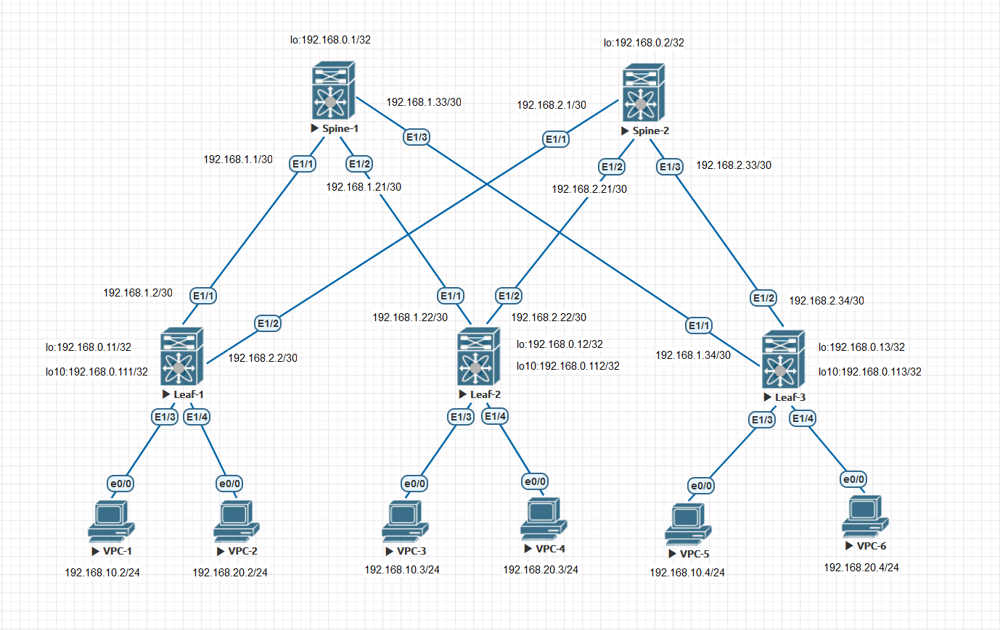

### VxLAN. EVPN L3.

## Цель:


## В этой самостоятельной работе мы ожидаем, что вы самостоятельно:
  


### Описание/Пошаговая инструкция выполнения домашнего задания:


## Схема стенда 



## Таблица адресов

| Device  | Interface | IP Address   | Subnet Mask     | Default Gateway |
|---------|-----------|--------------|-----------------|-----------------|
| Spine 1 | lo        | 192.168.0.1  | 255.255.255.255 |                 |
|         | E1/1      | 192.168.1.1  | 255.255.255.252 |                 |
|         | E1/2      | 192.168.1.21 | 255.255.255.252 |                 |
|         | E1/3      | 192.168.1.33 | 255.255.255.252 |                 |
| Spine 1 | lo        | 192.168.0.2  | 255.255.255.255 |                 |
|         | E1/1      | 192.168.2.1  | 255.255.255.252 |                 |
|         | E1/2      | 192.168.2.21 | 255.255.255.252 |                 |
|         | E1/3      | 192.168.2.33 | 255.255.255.252 |                 |
| Leaf 1  | lo        | 192.168.0.11 | 255.255.255.255 |                 |
|         | lo10      | 192.168.0.111| 255.255.255.255 |                 |
|         | E1/1      | 192.168.1.2  | 255.255.255.252 |                 |
|         | E1/2      | 192.168.2.2  | 255.255.255.252 |                 |
|         | E1/3      | 192.168.10.1 | 255.255.255.0   |                 |
|         | E1/4      | 192.168.20.1 | 255.255.255.0   |                 |
| Leaf 2  | lo        | 192.168.0.12 | 255.255.255.255 |                 |
|         | lo10      | 192.168.0.112| 255.255.255.255 |                 |
|         | E1/1      | 192.168.1.22 | 255.255.255.252 |                 |
|         | E1/2      | 192.168.2.22 | 255.255.255.252 |                 |
|         | E1/3      | 192.168.10.1 | 255.255.255.252 |                 |
|         | E1/4      | 192.168.20.1 | 255.255.255.252 |                 |
| Leaf 3  | lo        | 192.168.0.13 | 255.255.255.252 |                 |
|         | lo10      | 192.168.0.113| 255.255.255.252 |                 |
|         | E1/1      | 192.168.1.34 | 255.255.255.252 |                 |
|         | E1/2      | 192.168.2.34 | 255.255.255.255 |                 |
|         | E1/3      | 192.168.10.1 | 255.255.255.0   |                 |
|         | E1/4      | 192.168.20.1 | 255.255.255.0   |                 |
| VPC1    | eth0      | 192.168.10.2 | 255.255.255.0   | 192.168.10.1    |
| VPC2    | eth0      | 192.168.20.2 | 255.255.255.0   | 192.168.20.1    |
| VPC3    | eth0      | 192.168.10.3 | 255.255.255.0   | 192.168.10.1    |
| VPC4    | eth0      | 192.168.20.3 | 255.255.255.0   | 192.168.20.1    |
| VPC5    | eth0      | 192.168.10.4 | 255.255.255.0   | 192.168.10.1    |
| VPC6    | eth0      | 192.168.20.4 | 255.255.255.0   | 192.168.20.1    |

### [Файлы конфигураций устройст и сама работа выполненная в EVE-NG ](https://github.com/niknav83/Data_center_network_design/tree/main/labs/lab06/configs)

В данной работе применялса образ nxosv9k-9500-9.3.9

Логин и пароль: admin 

## Приступаем к настрйке сети:

### Настроим интерфейсы и IP адреса на всех устройствах Underlay-сети.

<details>

<summary> Конфигурация интерфейсов и OSPF для Spine-1: </summary>

```
interface loopback0
  ip address 192.168.0.1/32
  ip router ospf Underlay area 0.0.0.0

interface Ethernet1/1
  mtu 9216
  medium p2p
  ip address 192.168.1.1/30
  ip ospf network point-to-point
  no ip ospf passive-interface
  ip router ospf Underlay area 0.0.0.0
  no shutdown

interface Ethernet1/2
  mtu 9216
  medium p2p
  ip address 192.168.1.21/30
  ip ospf network point-to-point
  no ip ospf passive-interface
  ip router ospf Underlay area 0.0.0.0
  no shutdown

interface Ethernet1/3
  mtu 9216
  medium p2p
  ip address 192.168.1.33/30
  ip ospf network point-to-point
  no ip ospf passive-interface
  ip router ospf Underlay area 0.0.0.0
  no shutdown

router ospf Underlay
  router-id 192.168.0.1
  passive-interface default
```
</details>


<details>

<summary>Конфигурация интерфейсов и OSPF для Spine-2: </summary>

```
interface loopback0
  ip address 192.168.0.2/32
  ip router ospf Underlay area 0.0.0.0

interface Ethernet1/1
  mtu 9216
  medium p2p
  ip address 192.168.2.1/30
  ip ospf network point-to-point
  no ip ospf passive-interface
  ip router ospf Underlay area 0.0.0.0
  no shutdown

interface Ethernet1/2
  mtu 9216
  medium p2p
  ip address 192.168.2.21/30
  ip ospf network point-to-point
  no ip ospf passive-interface
  ip router ospf Underlay area 0.0.0.0
  no shutdown

interface Ethernet1/3
  mtu 9216
  medium p2p
  ip address 192.168.2.33/30
  ip ospf network point-to-point
  no ip ospf passive-interface
  ip router ospf Underlay area 0.0.0.0
  no shutdown

router ospf Underlay
  router-id 192.168.0.2
  passive-interface default
```
</details>


<details>

<summary> Конфигурация интерфейсов и OSPF для Leaf-1: </summary>

```
interface loopback0
  ip address 192.168.0.11/32
  ip router ospf Underlay area 0.0.0.0

interface loopback10
  ip address 192.168.0.111/32
  ip router ospf Underlay area 0.0.0.0

interface Vlan10
  no shutdown
  ip address 192.168.10.1/24
 
interface Vlan20
  no shutdown
  ip address 192.168.20.1/24
  
interface Ethernet1/1
  mtu 9216
  medium p2p
  ip address 192.168.1.2/30
  ip ospf network point-to-point
  no ip ospf passive-interface
  ip router ospf Underlay area 0.0.0.0
  no shutdown

interface Ethernet1/2
  mtu 9216
  medium p2p
  ip address 192.168.2.2/30
  ip ospf network point-to-point
  no ip ospf passive-interface
  ip router ospf Underlay area 0.0.0.0
  no shutdown

interface Ethernet1/3
  switchport
  switchport access vlan 10
  no shutdown

interface Ethernet1/4
  switchport
  switchport access vlan 20
  no shutdown

router ospf Underlay
  router-id 192.168.0.11
  passive-interface default
```
</details>


<details>

<summary> Конфигурация интерфейсов и OSPF для Leaf-2: </summary>

```
interface loopback0
  ip address 192.168.0.12/32
  ip router ospf Underlay area 0.0.0.0

interface loopback10
  ip address 192.168.0.112/32
  ip router ospf Underlay area 0.0.0.0

interface Vlan10
  no shutdown
  ip address 192.168.10.1/24
  
interface Vlan20
  no shutdown
  ip address 192.168.20.1/24
 
interface Ethernet1/1
  mtu 9216
  medium p2p
  ip address 192.168.1.22/30
  ip ospf network point-to-point
  no ip ospf passive-interface
  ip router ospf Underlay area 0.0.0.0
  no shutdown

interface Ethernet1/2
  mtu 9216
  medium p2p
  ip address 192.168.2.22/30
  ip ospf network point-to-point
  no ip ospf passive-interface
  ip router ospf Underlay area 0.0.0.0
  no shutdown

interface Ethernet1/3
  switchport
  switchport access vlan 10
  no shutdown

interface Ethernet1/4
  switchport
  switchport access vlan 20
  no shutdown

router ospf Underlay
  router-id 192.168.0.12
  passive-interface default
```
</details>


<details>

<summary> Конфигурация интерфейсов и OSPF для Leaf-3: </summary>

```
interface loopback0
  ip address 192.168.0.13/32
  ip router ospf Underlay area 0.0.0.0

interface loopback10
  ip address 192.168.0.113/32
  ip router ospf Underlay area 0.0.0.0

interface Vlan10
  no shutdown
  ip address 192.168.10.1/24

interface Vlan20
  no shutdown
  ip address 192.168.20.1/24

interface nve1
  no shutdown
  host-reachability protocol bgp
  source-interface loopback10
  member vni 10000
    ingress-replication protocol bgp
  member vni 20000
    ingress-replication protocol bgp
  member vni 99000 associate-vrf

interface Ethernet1/1
  mtu 9216
  medium p2p
  ip address 192.168.1.34/30
  ip ospf network point-to-point
  no ip ospf passive-interface
  ip router ospf Underlay area 0.0.0.0
  no shutdown

interface Ethernet1/2
  mtu 9216
  medium p2p
  ip address 192.168.2.34/30
  ip ospf network point-to-point
  no ip ospf passive-interface
  ip router ospf Underlay area 0.0.0.0
  no shutdown

interface Ethernet1/3
  switchport
  switchport access vlan 10
  no shutdown

interface Ethernet1/4
  switchport
  switchport access vlan 20
  no shutdown

router ospf Underlay
  router-id 192.168.0.13
  passive-interface default
```
</details>


### Далее на всех устройствах произведем необходимые настройки.


Конфигурация для Spine-1:

```
nv overlay evpn
feature ospf
feature bgp

router bgp 65000
  router-id 192.168.0.1
  reconnect-interval 10
  log-neighbor-changes
  address-family l2vpn evpn
  template peer LEAVES
    remote-as 65000
    update-source loopback0
    timers 3 9
    address-family l2vpn evpn
      send-community
      send-community extended
      route-reflector-client
  neighbor 192.168.0.11
    inherit peer LEAVES
  neighbor 192.168.0.12
    inherit peer LEAVES
  neighbor 192.168.0.13
    inherit peer LEAVES
```

 Конфигурация для Spine-2:

```
nv overlay evpn
feature ospf
feature bgp

router bgp 65000
  router-id 192.168.0.2
  reconnect-interval 10
  log-neighbor-changes
  address-family l2vpn evpn
  template peer LEAVES
    remote-as 65000
    update-source loopback0
    timers 3 9
    address-family l2vpn evpn
      send-community
      send-community extended
      route-reflector-client
  neighbor 192.168.0.11
    inherit peer LEAVES
  neighbor 192.168.0.12
    inherit peer LEAVES
  neighbor 192.168.0.13
    inherit peer LEAVES
```

 Конфигурация для Leaf-1:

```
nv overlay evpn
feature ospf
feature bgp
feature interface-vlan
feature vn-segment-vlan-based
feature bfd
feature nv overlay

fabric forwarding anycast-gateway-mac 0000.1111.2222

vlan 1,10,20,99
vlan 10
  vn-segment 10000
vlan 20
  vn-segment 20000
vlan 99
  vn-segment 99000

vrf context PROD
  vni 99000
  rd auto
  address-family ipv4 unicast
    route-target both auto
    route-target both auto evpn
interface Vlan10
  no shutdown
  vrf member PROD
  ip address 192.168.10.1/24
  fabric forwarding mode anycast-gateway

interface Vlan20
  no shutdown
  vrf member PROD
  ip address 192.168.20.1/24
  fabric forwarding mode anycast-gateway

interface Vlan99
  description Inter VXLAN Routing
  no shutdown
  vrf member PROD
  ip forward

interface nve1
  no shutdown
  host-reachability protocol bgp
  source-interface loopback10
  member vni 10000
    ingress-replication protocol bgp
  member vni 20000
    ingress-replication protocol bgp
  member vni 99000 associate-vrf

router bgp 65000
  router-id 192.168.0.11
  timers bgp 3 9
  reconnect-interval 10
  log-neighbor-changes
  address-family l2vpn evpn
    maximum-paths ibgp 3
    retain route-target all
  template peer SPINES
    remote-as 65000
    update-source loopback0
    timers 3 9
    address-family l2vpn evpn
      send-community
      send-community extended
  neighbor 192.168.0.1
    inherit peer SPINES
  neighbor 192.168.0.2
    inherit peer SPINES
  vrf PROD
    address-family ipv4 unicast
evpn
  vni 10000 l2
    rd auto
    route-target import auto
    route-target export auto
  vni 20000 l2
    rd auto
    route-target import auto
    route-target export auto
```
 Конфигурация для Leaf-2:

```
nv overlay evpn
feature ospf
feature bgp
feature interface-vlan
feature vn-segment-vlan-based
feature bfd
feature nv overlay

fabric forwarding anycast-gateway-mac 0000.1111.2222

vlan 1,10,20,99
vlan 10
  vn-segment 10000
vlan 20
  vn-segment 20000
vlan 99
  vn-segment 99000

vrf context PROD
  vni 99000
  rd auto
  address-family ipv4 unicast
    route-target both auto
    route-target both auto evpn
vrf context management

interface Vlan10
  no shutdown
  vrf member PROD
  ip address 192.168.10.1/24
  fabric forwarding mode anycast-gateway

interface Vlan20
  no shutdown
  vrf member PROD
  ip address 192.168.20.1/24
  fabric forwarding mode anycast-gateway

interface Vlan99
  description Inter VXLAN Routing
  no shutdown
  vrf member PROD
  ip forward

interface nve1
  no shutdown
  host-reachability protocol bgp
  source-interface loopback10
  member vni 10000
    ingress-replication protocol bgp
  member vni 20000
    ingress-replication protocol bgp
  member vni 99000 associate-vrf

router bgp 65000
  router-id 192.168.0.11
  timers bgp 3 9
  reconnect-interval 10
  log-neighbor-changes
  address-family l2vpn evpn
    maximum-paths ibgp 3
    retain route-target all
  template peer SPINES
    remote-as 65000
    update-source loopback0
    timers 3 9
    address-family l2vpn evpn
      send-community
      send-community extended
  neighbor 192.168.0.1
    inherit peer SPINES
  neighbor 192.168.0.2
    inherit peer SPINES
  vrf PROD
    address-family ipv4 unicast
evpn
  vni 10000 l2
    rd auto
    route-target import auto
    route-target export auto
  vni 20000 l2
    rd auto
    route-target import auto
    route-target export auto
```

 Конфигурация для Leaf-3:

```
nv overlay evpn
feature ospf
feature bgp
feature interface-vlan
feature vn-segment-vlan-based
feature bfd
feature nv overlay

fabric forwarding anycast-gateway-mac 0000.1111.2222

vlan 1,10,20,99
vlan 10
  vn-segment 10000
vlan 20
  vn-segment 20000
vlan 99
  vn-segment 99000

vrf context PROD
  vni 99000
  rd auto
  address-family ipv4 unicast
    route-target both auto
    route-target both auto evpn
vrf context management

interface Vlan10
  no shutdown
  vrf member PROD
  ip address 192.168.10.1/24
  fabric forwarding mode anycast-gateway

interface Vlan20
  no shutdown
  vrf member PROD
  ip address 192.168.20.1/24
  fabric forwarding mode anycast-gateway

interface Vlan99
  description Inter VXLAN Routing
  no shutdown
  vrf member PROD
  ip forward

interface nve1
  no shutdown
  host-reachability protocol bgp
  source-interface loopback10
  member vni 10000
    ingress-replication protocol bgp
  member vni 20000
    ingress-replication protocol bgp
  member vni 99000 associate-vrf

router bgp 65000
  router-id 192.168.0.12
  timers bgp 3 9
  reconnect-interval 10
  log-neighbor-changes
  address-family l2vpn evpn
    maximum-paths ibgp 3
    retain route-target all
  template peer SPINES
    remote-as 65000
    update-source loopback0
    timers 3 9
    address-family l2vpn evpn
      send-community
      send-community extended
  neighbor 192.168.0.1
    inherit peer SPINES
  neighbor 192.168.0.2
    inherit peer SPINES
  vrf PROD
    address-family ipv4 unicast
evpn
  vni 10000 l2
    rd auto
    route-target import auto
    route-target export auto
  vni 20000 l2
    rd auto
    route-target import auto
    route-target export auto
```

### Проверка работоспособности EVPN / VxLAN. Проверяем соседство по L2VPN между устройствами и таблицу маршрутизации Route Distinguisher. На LEAF-коммутаторах проверяем также NVE Peers:


<details>
  
<summary>Вывод команд для Spine-1 :</summary>

```
Spine-1# show bgp l2vpn evpn summary
BGP summary information for VRF default, address family L2VPN EVPN
BGP router identifier 192.168.0.1, local AS number 65000
BGP table version is 4184, L2VPN EVPN config peers 3, capable peers 3
14 network entries and 14 paths using 3416 bytes of memory
BGP attribute entries [10/1720], BGP AS path entries [0/0]
BGP community entries [0/0], BGP clusterlist entries [0/0]

Neighbor        V    AS MsgRcvd MsgSent   TblVer  InQ OutQ Up/Down  State/PfxRcd
192.168.0.11    4 65000   19446   18800     4184    0    0 00:03:18 6
192.168.0.12    4 65000   19095   18777     4184    0    0 00:03:19 4
192.168.0.13    4 65000   19105   18801     4184    0    0 00:03:22 4

```
```
Spine-1# show bgp l2vpn evpn
BGP routing table information for VRF default, address family L2VPN EVPN
BGP table version is 4184, Local Router ID is 192.168.0.1
Status: s-suppressed, x-deleted, S-stale, d-dampened, h-history, *-valid, >-best
Path type: i-internal, e-external, c-confed, l-local, a-aggregate, r-redist, I-injected
Origin codes: i - IGP, e - EGP, ? - incomplete, | - multipath, & - backup, 2 - best2

   Network            Next Hop            Metric     LocPrf     Weight Path
Route Distinguisher: 192.168.0.11:32777
*>i[2]:[0]:[0]:[48]:[aabb.cc01.1000]:[0]:[0.0.0.0]/216
                      192.168.0.111                     100          0 i
*>i[2]:[0]:[0]:[48]:[aabb.cc01.1000]:[32]:[192.168.10.2]/272
                      192.168.0.111                     100          0 i
*>i[3]:[0]:[32]:[192.168.0.111]/88
                      192.168.0.111                     100          0 i

Route Distinguisher: 192.168.0.11:32787
*>i[2]:[0]:[0]:[48]:[aabb.cc01.2000]:[0]:[0.0.0.0]/216
                      192.168.0.111                     100          0 i
*>i[2]:[0]:[0]:[48]:[aabb.cc01.2000]:[32]:[192.168.20.2]/272
                      192.168.0.111                     100          0 i
*>i[3]:[0]:[32]:[192.168.0.111]/88
                      192.168.0.111                     100          0 i

Route Distinguisher: 192.168.0.12:32777
*>i[2]:[0]:[0]:[48]:[aabb.cc01.3000]:[0]:[0.0.0.0]/216
                      192.168.0.112                     100          0 i
*>i[3]:[0]:[32]:[192.168.0.112]/88
                      192.168.0.112                     100          0 i

Route Distinguisher: 192.168.0.12:32787
*>i[2]:[0]:[0]:[48]:[aabb.cc01.4000]:[0]:[0.0.0.0]/216
                      192.168.0.112                     100          0 i
*>i[3]:[0]:[32]:[192.168.0.112]/88
                      192.168.0.112                     100          0 i

Route Distinguisher: 192.168.0.13:32777
*>i[2]:[0]:[0]:[48]:[aabb.cc01.5000]:[0]:[0.0.0.0]/216
                      192.168.0.113                     100          0 i
*>i[3]:[0]:[32]:[192.168.0.113]/88
                      192.168.0.113                     100          0 i

Route Distinguisher: 192.168.0.13:32787
*>i[2]:[0]:[0]:[48]:[aabb.cc01.6000]:[0]:[0.0.0.0]/216
                      192.168.0.113                     100          0 i
*>i[3]:[0]:[32]:[192.168.0.113]/88
                      192.168.0.113                     100          0 i
```
</details>

<details>
  
<summary>Вывод команд для Spine-2 :</summary>

```
Spine-2# show bgp l2vpn evpn summary
BGP summary information for VRF default, address family L2VPN EVPN
BGP router identifier 192.168.0.2, local AS number 65000
BGP table version is 4181, L2VPN EVPN config peers 3, capable peers 3
14 network entries and 14 paths using 3416 bytes of memory
BGP attribute entries [10/1720], BGP AS path entries [0/0]
BGP community entries [0/0], BGP clusterlist entries [0/0]

Neighbor        V    AS MsgRcvd MsgSent   TblVer  InQ OutQ Up/Down  State/PfxRcd
192.168.0.11    4 65000   19514   18922     4181    0    0 00:05:39 6
192.168.0.12    4 65000   19164   18901     4181    0    0 00:08:05 4
192.168.0.13    4 65000   19228   18878     4181    0    0 00:08:06 4
```
```
Spine-2# show bgp l2vpn evpn
BGP routing table information for VRF default, address family L2VPN EVPN
BGP table version is 4181, Local Router ID is 192.168.0.2
Status: s-suppressed, x-deleted, S-stale, d-dampened, h-history, *-valid, >-best
Path type: i-internal, e-external, c-confed, l-local, a-aggregate, r-redist, I-injected
Origin codes: i - IGP, e - EGP, ? - incomplete, | - multipath, & - backup, 2 - best2

   Network            Next Hop            Metric     LocPrf     Weight Path
Route Distinguisher: 192.168.0.11:32777
*>i[2]:[0]:[0]:[48]:[aabb.cc01.1000]:[0]:[0.0.0.0]/216
                      192.168.0.111                     100          0 i
*>i[2]:[0]:[0]:[48]:[aabb.cc01.1000]:[32]:[192.168.10.2]/272
                      192.168.0.111                     100          0 i
*>i[3]:[0]:[32]:[192.168.0.111]/88
                      192.168.0.111                     100          0 i

Route Distinguisher: 192.168.0.11:32787
*>i[2]:[0]:[0]:[48]:[aabb.cc01.2000]:[0]:[0.0.0.0]/216
                      192.168.0.111                     100          0 i
*>i[2]:[0]:[0]:[48]:[aabb.cc01.2000]:[32]:[192.168.20.2]/272
                      192.168.0.111                     100          0 i
*>i[3]:[0]:[32]:[192.168.0.111]/88
                      192.168.0.111                     100          0 i

Route Distinguisher: 192.168.0.12:32777
*>i[2]:[0]:[0]:[48]:[aabb.cc01.3000]:[0]:[0.0.0.0]/216
                      192.168.0.112                     100          0 i
*>i[3]:[0]:[32]:[192.168.0.112]/88
                      192.168.0.112                     100          0 i

Route Distinguisher: 192.168.0.12:32787
*>i[2]:[0]:[0]:[48]:[aabb.cc01.4000]:[0]:[0.0.0.0]/216
                      192.168.0.112                     100          0 i
*>i[3]:[0]:[32]:[192.168.0.112]/88
                      192.168.0.112                     100          0 i

Route Distinguisher: 192.168.0.13:32777
*>i[2]:[0]:[0]:[48]:[aabb.cc01.5000]:[0]:[0.0.0.0]/216
                      192.168.0.113                     100          0 i
*>i[3]:[0]:[32]:[192.168.0.113]/88
                      192.168.0.113                     100          0 i

Route Distinguisher: 192.168.0.13:32787
*>i[2]:[0]:[0]:[48]:[aabb.cc01.6000]:[0]:[0.0.0.0]/216
                      192.168.0.113                     100          0 i
*>i[3]:[0]:[32]:[192.168.0.113]/88
                      192.168.0.113                     100          0 i
```
</details>

<details>
  
<summary>Вывод команд для Leaf-1 :</summary>

```
Leaf-1# show bgp l2vpn evpn summary
BGP summary information for VRF default, address family L2VPN EVPN
BGP router identifier 192.168.0.11, local AS number 65000
BGP table version is 7945, L2VPN EVPN config peers 2, capable peers 2
22 network entries and 30 paths using 5368 bytes of memory
BGP attribute entries [26/4472], BGP AS path entries [0/0]
BGP community entries [0/0], BGP clusterlist entries [4/16]

Neighbor        V    AS MsgRcvd MsgSent   TblVer  InQ OutQ Up/Down  State/PfxRcd
192.168.0.1     4 65000   19994   18970     7945    0    0 00:09:34 8
192.168.0.2     4 65000   20024   18955     7945    0    0 00:07:09 8

```
```
Leaf-1# show nve peers
Interface Peer-IP                                 State LearnType Uptime   Router-Mac
--------- --------------------------------------  ----- --------- -------- -----------------
nve1      192.168.0.112                           Up    CP        00:08:47 5004.0000.1b08
nve1      192.168.0.113                           Up    CP        00:08:48 5005.0000.1b08
```
```
Leaf-1# show mac address-table
Legend:
        * - primary entry, G - Gateway MAC, (R) - Routed MAC, O - Overlay MAC
        age - seconds since last seen,+ - primary entry using vPC Peer-Link,
        (T) - True, (F) - False, C - ControlPlane MAC, ~ - vsan
   VLAN     MAC Address      Type      age     Secure NTFY Ports
---------+-----------------+--------+---------+------+----+------------------
*   10     aabb.cc01.1000   dynamic  0         F      F    Eth1/3
C   10     aabb.cc01.3000   dynamic  0         F      F    nve1(192.168.0.112)
C   10     aabb.cc01.5000   dynamic  0         F      F    nve1(192.168.0.113)
*   20     aabb.cc01.2000   dynamic  0         F      F    Eth1/4
C   20     aabb.cc01.4000   dynamic  0         F      F    nve1(192.168.0.112)
C   20     aabb.cc01.6000   dynamic  0         F      F    nve1(192.168.0.113)
*   99     5003.0000.1b08   static   -         F      F    Vlan99
*   99     5004.0000.1b08   static   -         F      F    nve1(192.168.0.112)
*   99     5005.0000.1b08   static   -         F      F    nve1(192.168.0.113)
G    -     0000.1111.2222   static   -         F      F    sup-eth1(R)
G    -     5003.0000.1b08   static   -         F      F    sup-eth1(R)
G   10     5003.0000.1b08   static   -         F      F    sup-eth1(R)
G   20     5003.0000.1b08   static   -         F      F    sup-eth1(R)
G   99     5003.0000.1b08   static   -         F      F    sup-eth1(R)
```
```
Leaf-1# show bgp l2vpn evpn
BGP routing table information for VRF default, address family L2VPN EVPN
BGP table version is 8043, Local Router ID is 192.168.0.11
Status: s-suppressed, x-deleted, S-stale, d-dampened, h-history, *-valid, >-best
Path type: i-internal, e-external, c-confed, l-local, a-aggregate, r-redist, I-injected
Origin codes: i - IGP, e - EGP, ? - incomplete, | - multipath, & - backup, 2 - best2

   Network            Next Hop            Metric     LocPrf     Weight Path
Route Distinguisher: 192.168.0.11:32777    (L2VNI 10000)
*>l[2]:[0]:[0]:[48]:[aabb.cc01.1000]:[0]:[0.0.0.0]/216
                      192.168.0.111                     100      32768 i
*>i[2]:[0]:[0]:[48]:[aabb.cc01.3000]:[0]:[0.0.0.0]/216
                      192.168.0.112                     100          0 i
*>i[2]:[0]:[0]:[48]:[aabb.cc01.5000]:[0]:[0.0.0.0]/216
                      192.168.0.113                     100          0 i
*>l[2]:[0]:[0]:[48]:[aabb.cc01.1000]:[32]:[192.168.10.2]/272
                      192.168.0.111                     100      32768 i
*>i[2]:[0]:[0]:[48]:[aabb.cc01.3000]:[32]:[192.168.10.3]/272
                      192.168.0.112                     100          0 i
*>i[2]:[0]:[0]:[48]:[aabb.cc01.5000]:[32]:[192.168.10.4]/272
                      192.168.0.113                     100          0 i
*>l[3]:[0]:[32]:[192.168.0.111]/88
                      192.168.0.111                     100      32768 i
*>i[3]:[0]:[32]:[192.168.0.112]/88
                      192.168.0.112                     100          0 i
*>i[3]:[0]:[32]:[192.168.0.113]/88
                      192.168.0.113                     100          0 i

Route Distinguisher: 192.168.0.11:32787    (L2VNI 20000)
*>l[2]:[0]:[0]:[48]:[aabb.cc01.2000]:[0]:[0.0.0.0]/216
                      192.168.0.111                     100      32768 i
*>i[2]:[0]:[0]:[48]:[aabb.cc01.4000]:[0]:[0.0.0.0]/216
                      192.168.0.112                     100          0 i
*>i[2]:[0]:[0]:[48]:[aabb.cc01.6000]:[0]:[0.0.0.0]/216
                      192.168.0.113                     100          0 i
*>l[2]:[0]:[0]:[48]:[aabb.cc01.2000]:[32]:[192.168.20.2]/272
                      192.168.0.111                     100      32768 i
*>i[2]:[0]:[0]:[48]:[aabb.cc01.4000]:[32]:[192.168.20.3]/272
                      192.168.0.112                     100          0 i
*>i[2]:[0]:[0]:[48]:[aabb.cc01.6000]:[32]:[192.168.20.4]/272
                      192.168.0.113                     100          0 i
*>l[3]:[0]:[32]:[192.168.0.111]/88
                      192.168.0.111                     100      32768 i
*>i[3]:[0]:[32]:[192.168.0.112]/88
                      192.168.0.112                     100          0 i
*>i[3]:[0]:[32]:[192.168.0.113]/88
                      192.168.0.113                     100          0 i

Route Distinguisher: 192.168.0.12:32777
*>i[2]:[0]:[0]:[48]:[aabb.cc01.3000]:[0]:[0.0.0.0]/216
                      192.168.0.112                     100          0 i
* i                   192.168.0.112                     100          0 i
* i[2]:[0]:[0]:[48]:[aabb.cc01.3000]:[32]:[192.168.10.3]/272
                      192.168.0.112                     100          0 i
*>i                   192.168.0.112                     100          0 i
* i[3]:[0]:[32]:[192.168.0.112]/88
                      192.168.0.112                     100          0 i
*>i                   192.168.0.112                     100          0 i

Route Distinguisher: 192.168.0.12:32787
*>i[2]:[0]:[0]:[48]:[aabb.cc01.4000]:[0]:[0.0.0.0]/216
                      192.168.0.112                     100          0 i
* i                   192.168.0.112                     100          0 i
* i[2]:[0]:[0]:[48]:[aabb.cc01.4000]:[32]:[192.168.20.3]/272
                      192.168.0.112                     100          0 i
*>i                   192.168.0.112                     100          0 i
* i[3]:[0]:[32]:[192.168.0.112]/88
                      192.168.0.112                     100          0 i
*>i                   192.168.0.112                     100          0 i

Route Distinguisher: 192.168.0.13:32777
*>i[2]:[0]:[0]:[48]:[aabb.cc01.5000]:[0]:[0.0.0.0]/216
                      192.168.0.113                     100          0 i
* i                   192.168.0.113                     100          0 i
* i[2]:[0]:[0]:[48]:[aabb.cc01.5000]:[32]:[192.168.10.4]/272
                      192.168.0.113                     100          0 i
*>i                   192.168.0.113                     100          0 i
*>i[3]:[0]:[32]:[192.168.0.113]/88
                      192.168.0.113                     100          0 i
* i                   192.168.0.113                     100          0 i

Route Distinguisher: 192.168.0.13:32787
* i[2]:[0]:[0]:[48]:[aabb.cc01.6000]:[0]:[0.0.0.0]/216
                      192.168.0.113                     100          0 i
*>i                   192.168.0.113                     100          0 i
*>i[2]:[0]:[0]:[48]:[aabb.cc01.6000]:[32]:[192.168.20.4]/272
                      192.168.0.113                     100          0 i
* i                   192.168.0.113                     100          0 i
*>i[3]:[0]:[32]:[192.168.0.113]/88
                      192.168.0.113                     100          0 i
* i                   192.168.0.113                     100          0 i

Route Distinguisher: 192.168.0.11:3    (L3VNI 99000)
*>i[2]:[0]:[0]:[48]:[aabb.cc01.3000]:[32]:[192.168.10.3]/272
                      192.168.0.112                     100          0 i
*>i[2]:[0]:[0]:[48]:[aabb.cc01.4000]:[32]:[192.168.20.3]/272
                      192.168.0.112                     100          0 i
*>i[2]:[0]:[0]:[48]:[aabb.cc01.5000]:[32]:[192.168.10.4]/272
                      192.168.0.113                     100          0 i
*>i[2]:[0]:[0]:[48]:[aabb.cc01.6000]:[32]:[192.168.20.4]/272
                      192.168.0.113                     100          0 i
```

</details>

<details>
  
<summary>Вывод команд для Leaf-2 :</summary>

```
Leaf-2# show bgp l2vpn evpn summary
BGP summary information for VRF default, address family L2VPN EVPN
BGP router identifier 192.168.0.12, local AS number 65000
BGP table version is 10142, L2VPN EVPN config peers 2, capable peers 2
34 network entries and 46 paths using 7816 bytes of memory
BGP attribute entries [42/7224], BGP AS path entries [0/0]
BGP community entries [0/0], BGP clusterlist entries [4/16]

Neighbor        V    AS MsgRcvd MsgSent   TblVer  InQ OutQ Up/Down  State/PfxRcd
192.168.0.1     4 65000   20719   19310    10142    0    0 00:13:13 12
192.168.0.2     4 65000   20762   19297    10142    0    0 00:13:11 12
```
```
Leaf-2# show nve peers
Interface Peer-IP                                 State LearnType Uptime   Router-Mac
--------- --------------------------------------  ----- --------- -------- -----------------
nve1      192.168.0.111                           Up    CP        00:13:34 5003.0000.1b08
nve1      192.168.0.113                           Up    CP        00:13:38 5005.0000.1b08
```
```
Leaf-2# show mac address-table
Legend:
        * - primary entry, G - Gateway MAC, (R) - Routed MAC, O - Overlay MAC
        age - seconds since last seen,+ - primary entry using vPC Peer-Link,
        (T) - True, (F) - False, C - ControlPlane MAC, ~ - vsan
   VLAN     MAC Address      Type      age     Secure NTFY Ports
---------+-----------------+--------+---------+------+----+------------------
C   10     aabb.cc01.1000   dynamic  0         F      F    nve1(192.168.0.111)
*   10     aabb.cc01.3000   dynamic  0         F      F    Eth1/3
C   10     aabb.cc01.5000   dynamic  0         F      F    nve1(192.168.0.113)
C   20     aabb.cc01.2000   dynamic  0         F      F    nve1(192.168.0.111)
*   20     aabb.cc01.4000   dynamic  0         F      F    Eth1/4
C   20     aabb.cc01.6000   dynamic  0         F      F    nve1(192.168.0.113)
*   99     5003.0000.1b08   static   -         F      F    nve1(192.168.0.111)
*   99     5004.0000.1b08   static   -         F      F    Vlan99
*   99     5005.0000.1b08   static   -         F      F    nve1(192.168.0.113)
G    -     0000.1111.2222   static   -         F      F    sup-eth1(R)
G    -     5004.0000.1b08   static   -         F      F    sup-eth1(R)
G   10     5004.0000.1b08   static   -         F      F    sup-eth1(R)
G   20     5004.0000.1b08   static   -         F      F    sup-eth1(R)
G   99     5004.0000.1b08   static   -         F      F    sup-eth1(R)
```
```
Leaf-2# show bgp l2vpn evpn
BGP routing table information for VRF default, address family L2VPN EVPN
BGP table version is 10142, Local Router ID is 192.168.0.12
Status: s-suppressed, x-deleted, S-stale, d-dampened, h-history, *-valid, >-best
Path type: i-internal, e-external, c-confed, l-local, a-aggregate, r-redist, I-injected
Origin codes: i - IGP, e - EGP, ? - incomplete, | - multipath, & - backup, 2 - best2

   Network            Next Hop            Metric     LocPrf     Weight Path
Route Distinguisher: 192.168.0.11:32777
* i[2]:[0]:[0]:[48]:[aabb.cc01.1000]:[0]:[0.0.0.0]/216
                      192.168.0.111                     100          0 i
*>i                   192.168.0.111                     100          0 i
*>i[2]:[0]:[0]:[48]:[aabb.cc01.1000]:[32]:[192.168.10.2]/272
                      192.168.0.111                     100          0 i
* i                   192.168.0.111                     100          0 i
* i[3]:[0]:[32]:[192.168.0.111]/88
                      192.168.0.111                     100          0 i
*>i                   192.168.0.111                     100          0 i

Route Distinguisher: 192.168.0.11:32787
*>i[2]:[0]:[0]:[48]:[aabb.cc01.2000]:[0]:[0.0.0.0]/216
                      192.168.0.111                     100          0 i
* i                   192.168.0.111                     100          0 i
* i[2]:[0]:[0]:[48]:[aabb.cc01.2000]:[32]:[192.168.20.2]/272
                      192.168.0.111                     100          0 i
*>i                   192.168.0.111                     100          0 i
* i[3]:[0]:[32]:[192.168.0.111]/88
                      192.168.0.111                     100          0 i
*>i                   192.168.0.111                     100          0 i

Route Distinguisher: 192.168.0.12:32777    (L2VNI 10000)
*>i[2]:[0]:[0]:[48]:[aabb.cc01.1000]:[0]:[0.0.0.0]/216
                      192.168.0.111                     100          0 i
*>l[2]:[0]:[0]:[48]:[aabb.cc01.3000]:[0]:[0.0.0.0]/216
                      192.168.0.112                     100      32768 i
*>i[2]:[0]:[0]:[48]:[aabb.cc01.5000]:[0]:[0.0.0.0]/216
                      192.168.0.113                     100          0 i
*>i[2]:[0]:[0]:[48]:[aabb.cc01.1000]:[32]:[192.168.10.2]/272
                      192.168.0.111                     100          0 i
*>l[2]:[0]:[0]:[48]:[aabb.cc01.3000]:[32]:[192.168.10.3]/272
                      192.168.0.112                     100      32768 i
*>i[2]:[0]:[0]:[48]:[aabb.cc01.5000]:[32]:[192.168.10.4]/272
                      192.168.0.113                     100          0 i
*>i[3]:[0]:[32]:[192.168.0.111]/88
                      192.168.0.111                     100          0 i
*>l[3]:[0]:[32]:[192.168.0.112]/88
                      192.168.0.112                     100      32768 i
*>i[3]:[0]:[32]:[192.168.0.113]/88
                      192.168.0.113                     100          0 i

Route Distinguisher: 192.168.0.12:32787    (L2VNI 20000)
*>i[2]:[0]:[0]:[48]:[aabb.cc01.2000]:[0]:[0.0.0.0]/216
                      192.168.0.111                     100          0 i
*>l[2]:[0]:[0]:[48]:[aabb.cc01.4000]:[0]:[0.0.0.0]/216
                      192.168.0.112                     100      32768 i
*>i[2]:[0]:[0]:[48]:[aabb.cc01.6000]:[0]:[0.0.0.0]/216
                      192.168.0.113                     100          0 i
*>i[2]:[0]:[0]:[48]:[aabb.cc01.2000]:[32]:[192.168.20.2]/272
                      192.168.0.111                     100          0 i
*>l[2]:[0]:[0]:[48]:[aabb.cc01.4000]:[32]:[192.168.20.3]/272
                      192.168.0.112                     100      32768 i
*>i[2]:[0]:[0]:[48]:[aabb.cc01.6000]:[32]:[192.168.20.4]/272
                      192.168.0.113                     100          0 i
*>i[3]:[0]:[32]:[192.168.0.111]/88
                      192.168.0.111                     100          0 i
*>l[3]:[0]:[32]:[192.168.0.112]/88
                      192.168.0.112                     100      32768 i
*>i[3]:[0]:[32]:[192.168.0.113]/88
                      192.168.0.113                     100          0 i

Route Distinguisher: 192.168.0.13:32777
*>i[2]:[0]:[0]:[48]:[aabb.cc01.5000]:[0]:[0.0.0.0]/216
                      192.168.0.113                     100          0 i
* i                   192.168.0.113                     100          0 i
* i[2]:[0]:[0]:[48]:[aabb.cc01.5000]:[32]:[192.168.10.4]/272
                      192.168.0.113                     100          0 i
*>i                   192.168.0.113                     100          0 i
*>i[3]:[0]:[32]:[192.168.0.113]/88
                      192.168.0.113                     100          0 i
* i                   192.168.0.113                     100          0 i

Route Distinguisher: 192.168.0.13:32787
* i[2]:[0]:[0]:[48]:[aabb.cc01.6000]:[0]:[0.0.0.0]/216
                      192.168.0.113                     100          0 i
*>i                   192.168.0.113                     100          0 i
*>i[2]:[0]:[0]:[48]:[aabb.cc01.6000]:[32]:[192.168.20.4]/272
                      192.168.0.113                     100          0 i
* i                   192.168.0.113                     100          0 i
*>i[3]:[0]:[32]:[192.168.0.113]/88
                      192.168.0.113                     100          0 i
* i                   192.168.0.113                     100          0 i

Route Distinguisher: 192.168.0.12:3    (L3VNI 99000)
*>i[2]:[0]:[0]:[48]:[aabb.cc01.1000]:[32]:[192.168.10.2]/272
                      192.168.0.111                     100          0 i
*>i[2]:[0]:[0]:[48]:[aabb.cc01.2000]:[32]:[192.168.20.2]/272
                      192.168.0.111                     100          0 i
*>i[2]:[0]:[0]:[48]:[aabb.cc01.5000]:[32]:[192.168.10.4]/272
                      192.168.0.113                     100          0 i
*>i[2]:[0]:[0]:[48]:[aabb.cc01.6000]:[32]:[192.168.20.4]/272
                      192.168.0.113                     100          0 i
```
</details>

<details>
  
<summary>Вывод команд для Leaf-3 :</summary>

```
Leaf-3# show bgp l2vpn evpn summary
BGP summary information for VRF default, address family L2VPN EVPN
BGP router identifier 192.168.0.13, local AS number 65000
BGP table version is 9949, L2VPN EVPN config peers 2, capable peers 2
34 network entries and 46 paths using 7816 bytes of memory
BGP attribute entries [42/7224], BGP AS path entries [0/0]
BGP community entries [0/0], BGP clusterlist entries [4/16]

Neighbor        V    AS MsgRcvd MsgSent   TblVer  InQ OutQ Up/Down  State/PfxRcd
192.168.0.1     4 65000   20808   19409     9949    0    0 00:16:04 12
192.168.0.2     4 65000   20830   19384     9949    0    0 00:16:11 12
```
```
Leaf-3# show nve peers
Interface Peer-IP                                 State LearnType Uptime   Router-Mac
--------- --------------------------------------  ----- --------- -------- -----------------
nve1      192.168.0.111                           Up    CP        00:16:25 5003.0000.1b08
nve1      192.168.0.112                           Up    CP        00:16:28 5004.0000.1b08
```
```
Leaf-3# show mac address-table
Legend:
        * - primary entry, G - Gateway MAC, (R) - Routed MAC, O - Overlay MAC
        age - seconds since last seen,+ - primary entry using vPC Peer-Link,
        (T) - True, (F) - False, C - ControlPlane MAC, ~ - vsan
   VLAN     MAC Address      Type      age     Secure NTFY Ports
---------+-----------------+--------+---------+------+----+------------------
C   10     aabb.cc01.1000   dynamic  0         F      F    nve1(192.168.0.111)
C   10     aabb.cc01.3000   dynamic  0         F      F    nve1(192.168.0.112)
*   10     aabb.cc01.5000   dynamic  0         F      F    Eth1/3
C   20     aabb.cc01.2000   dynamic  0         F      F    nve1(192.168.0.111)
C   20     aabb.cc01.4000   dynamic  0         F      F    nve1(192.168.0.112)
*   20     aabb.cc01.6000   dynamic  0         F      F    Eth1/4
*   99     5003.0000.1b08   static   -         F      F    nve1(192.168.0.111)
*   99     5004.0000.1b08   static   -         F      F    nve1(192.168.0.112)
*   99     5005.0000.1b08   static   -         F      F    Vlan99
G    -     0000.1111.2222   static   -         F      F    sup-eth1(R)
G    -     5005.0000.1b08   static   -         F      F    sup-eth1(R)
G   10     5005.0000.1b08   static   -         F      F    sup-eth1(R)
G   20     5005.0000.1b08   static   -         F      F    sup-eth1(R)
G   99     5005.0000.1b08   static   -         F      F    sup-eth1(R)

```
```
Leaf-3# show bgp l2vpn evpn
BGP routing table information for VRF default, address family L2VPN EVPN
BGP table version is 9949, Local Router ID is 192.168.0.13
Status: s-suppressed, x-deleted, S-stale, d-dampened, h-history, *-valid, >-best
Path type: i-internal, e-external, c-confed, l-local, a-aggregate, r-redist, I-injected
Origin codes: i - IGP, e - EGP, ? - incomplete, | - multipath, & - backup, 2 - best2

   Network            Next Hop            Metric     LocPrf     Weight Path
Route Distinguisher: 192.168.0.11:32777
* i[2]:[0]:[0]:[48]:[aabb.cc01.1000]:[0]:[0.0.0.0]/216
                      192.168.0.111                     100          0 i
*>i                   192.168.0.111                     100          0 i
* i[2]:[0]:[0]:[48]:[aabb.cc01.1000]:[32]:[192.168.10.2]/272
                      192.168.0.111                     100          0 i
*>i                   192.168.0.111                     100          0 i
* i[3]:[0]:[32]:[192.168.0.111]/88
                      192.168.0.111                     100          0 i
*>i                   192.168.0.111                     100          0 i

Route Distinguisher: 192.168.0.11:32787
* i[2]:[0]:[0]:[48]:[aabb.cc01.2000]:[0]:[0.0.0.0]/216
                      192.168.0.111                     100          0 i
*>i                   192.168.0.111                     100          0 i
*>i[2]:[0]:[0]:[48]:[aabb.cc01.2000]:[32]:[192.168.20.2]/272
                      192.168.0.111                     100          0 i
* i                   192.168.0.111                     100          0 i
* i[3]:[0]:[32]:[192.168.0.111]/88
                      192.168.0.111                     100          0 i
*>i                   192.168.0.111                     100          0 i

Route Distinguisher: 192.168.0.12:32777
* i[2]:[0]:[0]:[48]:[aabb.cc01.3000]:[0]:[0.0.0.0]/216
                      192.168.0.112                     100          0 i
*>i                   192.168.0.112                     100          0 i
* i[2]:[0]:[0]:[48]:[aabb.cc01.3000]:[32]:[192.168.10.3]/272
                      192.168.0.112                     100          0 i
*>i                   192.168.0.112                     100          0 i
* i[3]:[0]:[32]:[192.168.0.112]/88
                      192.168.0.112                     100          0 i
*>i                   192.168.0.112                     100          0 i

Route Distinguisher: 192.168.0.12:32787
* i[2]:[0]:[0]:[48]:[aabb.cc01.4000]:[0]:[0.0.0.0]/216
                      192.168.0.112                     100          0 i
*>i                   192.168.0.112                     100          0 i
* i[2]:[0]:[0]:[48]:[aabb.cc01.4000]:[32]:[192.168.20.3]/272
                      192.168.0.112                     100          0 i
*>i                   192.168.0.112                     100          0 i
* i[3]:[0]:[32]:[192.168.0.112]/88
                      192.168.0.112                     100          0 i
*>i                   192.168.0.112                     100          0 i

Route Distinguisher: 192.168.0.13:32777    (L2VNI 10000)
*>i[2]:[0]:[0]:[48]:[aabb.cc01.1000]:[0]:[0.0.0.0]/216
                      192.168.0.111                     100          0 i
*>i[2]:[0]:[0]:[48]:[aabb.cc01.3000]:[0]:[0.0.0.0]/216
                      192.168.0.112                     100          0 i
*>l[2]:[0]:[0]:[48]:[aabb.cc01.5000]:[0]:[0.0.0.0]/216
                      192.168.0.113                     100      32768 i
*>i[2]:[0]:[0]:[48]:[aabb.cc01.1000]:[32]:[192.168.10.2]/272
                      192.168.0.111                     100          0 i
*>i[2]:[0]:[0]:[48]:[aabb.cc01.3000]:[32]:[192.168.10.3]/272
                      192.168.0.112                     100          0 i
*>l[2]:[0]:[0]:[48]:[aabb.cc01.5000]:[32]:[192.168.10.4]/272
                      192.168.0.113                     100      32768 i
*>i[3]:[0]:[32]:[192.168.0.111]/88
                      192.168.0.111                     100          0 i
*>i[3]:[0]:[32]:[192.168.0.112]/88
                      192.168.0.112                     100          0 i
*>l[3]:[0]:[32]:[192.168.0.113]/88
                      192.168.0.113                     100      32768 i

Route Distinguisher: 192.168.0.13:32787    (L2VNI 20000)
*>i[2]:[0]:[0]:[48]:[aabb.cc01.2000]:[0]:[0.0.0.0]/216
                      192.168.0.111                     100          0 i
*>i[2]:[0]:[0]:[48]:[aabb.cc01.4000]:[0]:[0.0.0.0]/216
                      192.168.0.112                     100          0 i
*>l[2]:[0]:[0]:[48]:[aabb.cc01.6000]:[0]:[0.0.0.0]/216
                      192.168.0.113                     100      32768 i
*>i[2]:[0]:[0]:[48]:[aabb.cc01.2000]:[32]:[192.168.20.2]/272
                      192.168.0.111                     100          0 i
*>i[2]:[0]:[0]:[48]:[aabb.cc01.4000]:[32]:[192.168.20.3]/272
                      192.168.0.112                     100          0 i
*>l[2]:[0]:[0]:[48]:[aabb.cc01.6000]:[32]:[192.168.20.4]/272
                      192.168.0.113                     100      32768 i
*>i[3]:[0]:[32]:[192.168.0.111]/88
                      192.168.0.111                     100          0 i
*>i[3]:[0]:[32]:[192.168.0.112]/88
                      192.168.0.112                     100          0 i
*>l[3]:[0]:[32]:[192.168.0.113]/88
                      192.168.0.113                     100      32768 i

Route Distinguisher: 192.168.0.13:3    (L3VNI 99000)
*>i[2]:[0]:[0]:[48]:[aabb.cc01.1000]:[32]:[192.168.10.2]/272
                      192.168.0.111                     100          0 i
*>i[2]:[0]:[0]:[48]:[aabb.cc01.2000]:[32]:[192.168.20.2]/272
                      192.168.0.111                     100          0 i
*>i[2]:[0]:[0]:[48]:[aabb.cc01.3000]:[32]:[192.168.10.3]/272
                      192.168.0.112                     100          0 i
*>i[2]:[0]:[0]:[48]:[aabb.cc01.4000]:[32]:[192.168.20.3]/272
                      192.168.0.112                     100          0 i
```

</details>


