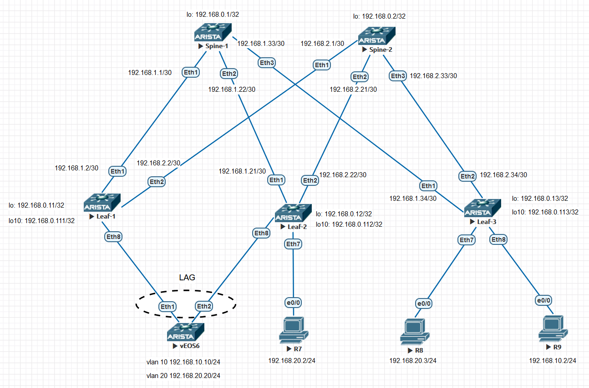

### VxLAN. vPC.

 Так как настройку будем производить на оборудовании Arista, то для данного задания будем использовать ESI-LAGs 
  
## Цель:

- Настроить отказоустойчивое подключение клиентов с использованием ESI-LAGs
  

## В этой самостоятельной работе мы ожидаем, что вы самостоятельно:
  
- Настроить отказоустойчивое подключение клиентов с использованием ESI-LAGs


### Описание/Пошаговая инструкция выполнения домашнего задания:


- Underlay и Overlay настроены, согласно  лабораторной работе
- Задаем Loopback-адреса, согласно плану сети
- Назначаем на LEAF1 и LEAF2 интерфейсу Loopback 10 также одинаковый secondary IP-адрес - 
- Проверяем, чтобы все коммутаторы обменивались маршрутной инофрмацией
- Настраиваем VLAN ID и VNI на LEAF1 и LEAF2 идентично друг другу
- Создаём агрегированные логические интерфесы на LEAF1 и LEAF2:
    - Cоздаём Port-Channel 1 (Ethernet 8), переводим в режим mode trunk
    - создаём VLAN 10 и 20.
    - Интерфейсы переводим в mode trunk
- На коомутаторе vEOS6 также создаём Port-Channel 1 (Ethernet 1 и Ethernet 2), переводим в режим mode trunk
- На коомутаторе vEOS6 также создаём VLAN 10 и 20, задаём IP-адреса. Интерфейс будет использоваться в качестве клиента
- На LEAF1 и LEAF2 настраиваем LAG и проверяем его работу
- Выполняем общую проверку работосопобности Overlay-сети

## Схема стенда 



## Таблица адресов

| Device  | Interface | IP Address   | Subnet Mask     | Default Gateway |
|---------|-----------|--------------|-----------------|-----------------|
| Spine 1 | lo        | 192.168.0.1  | 255.255.255.255 |                 |
|         | E1/1      | 192.168.1.1  | 255.255.255.252 |                 |
|         | E1/2      | 192.168.1.21 | 255.255.255.252 |                 |
|         | E1/3      | 192.168.1.33 | 255.255.255.252 |                 |
| Spine 1 | lo        | 192.168.0.2  | 255.255.255.255 |                 |
|         | E1/1      | 192.168.2.1  | 255.255.255.252 |                 |
|         | E1/2      | 192.168.2.21 | 255.255.255.252 |                 |
|         | E1/3      | 192.168.2.33 | 255.255.255.252 |                 |
| Leaf 1  | lo        | 192.168.0.11 | 255.255.255.255 |                 |
|         | lo10      | 192.168.0.111| 255.255.255.255 |                 |
|         | E1/1      | 192.168.1.2  | 255.255.255.252 |                 |
|         | E1/2      | 192.168.2.2  | 255.255.255.252 |                 |
| Leaf 2  | lo        | 192.168.0.12 | 255.255.255.255 |                 |
|         | lo10      | 192.168.0.112| 255.255.255.255 |                 |
|         | E1/1      | 192.168.1.22 | 255.255.255.252 |                 |
|         | E1/2      | 192.168.2.22 | 255.255.255.252 |                 |
|         | E1/7      | 192.168.20.1 | 255.255.255.252 |                 |
| Leaf 3  | lo        | 192.168.0.13 | 255.255.255.252 |                 |
|         | lo10      | 192.168.0.113| 255.255.255.252 |                 |
|         | E1/1      | 192.168.1.34 | 255.255.255.252 |                 |
|         | E1/2      | 192.168.2.34 | 255.255.255.255 |                 |
|         | E1/7      | 192.168.20.1 | 255.255.255.0   |                 |
|         | E1/8      | 192.168.10.1 | 255.255.255.0   |                 |
| vEOS6   | vlan 10   | 192.168.10.10| 255.255.255.0   | 192.168.10.1    |
|         | vlan 20   | 192.168.20.20| 255.255.255.0   | 192.168.20.1    |
| R7      | eth0/0    | 192.168.20.2 | 255.255.255.0   | 192.168.20.1    |
| R8      | eth0/0    | 192.168.20.3 | 255.255.255.0   | 192.168.20.1    |
| R9      | eth0/0    | 192.168.10.2 | 255.255.255.0   | 192.168.10.1    |

### [Файлы конфигураций устройст и сама работа выполненная в EVE-NG ](https://github.com/niknav83/Data_center_network_design/tree/main/labs/lab07/configs)

В данной работе применялса образ Arista (vEOS, EOS-4.21.1.1F) 

Логин: admin 

## Приступаем к настрйке сети:

### Настроим интерфейсы, IP адреса и OSPF на всех устройствах Underlay-сети.

<details>

<summary> Конфигурация интерфейсов и OSPF для Spine-1: </summary>

```
interface Ethernet1
   no switchport
   ip address 192.168.1.1/30
   ip ospf network point-to-point
   ip ospf area 0.0.0.0
!
interface Ethernet2
   no switchport
   ip address 192.168.1.21/30
   ip ospf network point-to-point
   ip ospf area 0.0.0.0
!
interface Ethernet3
   no switchport
   ip address 192.168.1.33/30
   ip ospf network point-to-point
   ip ospf area 0.0.0.0

interface Loopback0
   ip address 192.168.0.1/32
   ip ospf area 0.0.0.0

router ospf 1
   router-id 192.168.0.1
   passive-interface default
   no passive-interface Ethernet1
   no passive-interface Ethernet2
   no passive-interface Ethernet3
   network 0.0.0.0/0 area 0.0.0.0
   max-lsa 12000

```
</details>


<details>

<summary>Конфигурация интерфейсов и OSPF для Spine-2: </summary>

```
interface Ethernet1
   no switchport
   ip address 192.168.2.1/30
   ip ospf network point-to-point
   ip ospf area 0.0.0.0
!
interface Ethernet2
   no switchport
   ip address 192.168.2.21/30
   ip ospf network point-to-point
   ip ospf area 0.0.0.0
!
interface Ethernet3
   no switchport
   ip address 192.168.2.33/30
   ip ospf network point-to-point
   ip ospf area 0.0.0.0

interface Loopback0
   ip address 192.168.0.2/32
   ip ospf area 0.0.0.0

router ospf 1
   router-id 192.168.0.2
   passive-interface default
   no passive-interface Ethernet1
   no passive-interface Ethernet2
   no passive-interface Ethernet3
   network 0.0.0.0/0 area 0.0.0.0
   max-lsa 12000

```
</details>


<details>

<summary> Конфигурация интерфейсов и OSPF для Leaf-1: </summary>

```
vlan 10,20

interface Ethernet1
   no switchport
   ip address 192.168.1.2/30
   ip ospf network point-to-point
   ip ospf area 0.0.0.0
!
interface Ethernet2
   no switchport
   ip address 192.168.2.2/30
   ip ospf network point-to-point
   ip ospf area 0.0.0.0

interface Vlan10
   vrf forwarding PROD
   ip address virtual 192.168.10.1/24
!
interface Vlan20
   vrf forwarding PROD
   ip address virtual 192.168.20.1/24

interface Loopback0
   ip address 192.168.0.11/32
   ip ospf area 0.0.0.0
!
interface Loopback10
   ip address 192.168.0.111/32
   ip ospf area 0.0.0.0

router ospf 1
   router-id 192.168.0.11
   passive-interface default
   no passive-interface Ethernet1
   no passive-interface Ethernet2
   network 0.0.0.0/0 area 0.0.0.0
   max-lsa 12000

```
</details>


<details>

<summary> Конфигурация интерфейсов и OSPF для Leaf-2: </summary>

```
vlan 10,20

interface Ethernet1
   no switchport
   ip address 192.168.1.22/30
   ip ospf network point-to-point
   ip ospf area 0.0.0.0
!
interface Ethernet2
   no switchport
   ip address 192.168.2.22/30
   ip ospf network point-to-point
   ip ospf area 0.0.0.0

interface Ethernet7
   switchport access vlan 20
!
interface Ethernet8
   switchport trunk allowed vlan 10,20
   switchport mode trunk
   channel-group 1 mode active
   spanning-tree portfast
!
interface Loopback0
   ip address 192.168.0.12/32
   ip ospf area 0.0.0.0
!
interface Loopback10
   ip address 192.168.0.112/32
   ip ospf area 0.0.0.0

interface Vlan10
   vrf forwarding PROD
   ip address virtual 192.168.10.1/24
!
interface Vlan20
   vrf forwarding PROD
   ip address virtual 192.168.20.1/24

router ospf 1
   router-id 192.168.0.12
   passive-interface default
   no passive-interface Ethernet1
   no passive-interface Ethernet2
   network 0.0.0.0/0 area 0.0.0.0
   max-lsa 12000

```
</details>


<details>

<summary> Конфигурация интерфейсов и OSPF для Leaf-3: </summary>

```
vlan 10,20

interface Ethernet1
   no switchport
   ip address 192.168.1.34/30
   ip ospf network point-to-point
   ip ospf area 0.0.0.0
!
interface Ethernet2
   no switchport
   ip address 192.168.2.34/30
   ip ospf network point-to-point
   ip ospf area 0.0.0.0

interface Ethernet7
   switchport access vlan 20
!
interface Ethernet8
   switchport access vlan 10
!
interface Loopback0
   ip address 192.168.0.13/32
   ip ospf area 0.0.0.0
!
interface Loopback10
   ip address 192.168.0.113/32
   ip ospf area 0.0.0.0

interface Vlan10
   vrf forwarding PROD
   ip address virtual 192.168.10.1/24
!
interface Vlan20
   vrf forwarding PROD
   ip address virtual 192.168.20.1/24

router ospf 1
   router-id 192.168.0.13
   passive-interface default
   no passive-interface Ethernet1
   no passive-interface Ethernet2
   network 0.0.0.0/0 area 0.0.0.0
   max-lsa 12000
```
</details>


### Далее на всех устройствах произведем необходимые настройки.


Конфигурация для Spine-1:

```
ip routing
!
router bgp 65000
   router-id 192.168.0.1
   maximum-paths 4
   neighbor 192.168.0.11 remote-as 65000
   neighbor 192.168.0.11 update-source Loopback0
   neighbor 192.168.0.11 route-reflector-client
   neighbor 192.168.0.11 send-community
   neighbor 192.168.0.11 maximum-routes 12000 
   neighbor 192.168.0.12 remote-as 65000
   neighbor 192.168.0.12 update-source Loopback0
   neighbor 192.168.0.12 route-reflector-client
   neighbor 192.168.0.12 send-community
   neighbor 192.168.0.12 maximum-routes 12000 
   neighbor 192.168.0.13 remote-as 65000
   neighbor 192.168.0.13 update-source Loopback0
   neighbor 192.168.0.13 route-reflector-client
   neighbor 192.168.0.13 send-community
   neighbor 192.168.0.13 maximum-routes 12000 
   !
   address-family evpn
      neighbor 192.168.0.11 activate
      neighbor 192.168.0.12 activate
      neighbor 192.168.0.13 activate
   !
   address-family ipv4
      no neighbor 192.168.0.11 activate
      no neighbor 192.168.0.12 activate
      no neighbor 192.168.0.13 activate
```

 Конфигурация для Spine-2:

```
ip routing
!
router bgp 65000
   router-id 192.168.0.2
   maximum-paths 4
   neighbor 192.168.0.11 remote-as 65000
   neighbor 192.168.0.11 update-source Loopback0
   neighbor 192.168.0.11 route-reflector-client
   neighbor 192.168.0.11 send-community
   neighbor 192.168.0.11 maximum-routes 12000 
   neighbor 192.168.0.12 remote-as 65000
   neighbor 192.168.0.12 update-source Loopback0
   neighbor 192.168.0.12 route-reflector-client
   neighbor 192.168.0.12 send-community
   neighbor 192.168.0.12 maximum-routes 12000 
   neighbor 192.168.0.13 remote-as 65000
   neighbor 192.168.0.13 update-source Loopback0
   neighbor 192.168.0.13 route-reflector-client
   neighbor 192.168.0.13 send-community
   neighbor 192.168.0.13 maximum-routes 12000 
   !
   address-family evpn
      neighbor 192.168.0.11 activate
      neighbor 192.168.0.12 activate
      neighbor 192.168.0.13 activate
   !
   address-family ipv4
      no neighbor 192.168.0.11 activate
      no neighbor 192.168.0.12 activate
      no neighbor 192.168.0.13 activate
```

 Конфигурация для Leaf-1:

```
vrf definition PROD

interface Port-Channel1
   switchport trunk allowed vlan 10,20
   switchport mode trunk
   !
   evpn ethernet-segment
      identifier 0000:1111:2222:3333:4444
      route-target import 12:23:34:45:56:67
   lacp system-id 1111.2222.3333
   spanning-tree portfast

interface Vxlan1
   vxlan source-interface Loopback10
   vxlan udp-port 4789
   vxlan vlan 10,20 vni 10010,10020
   vxlan vrf PROD vni 100999
!
ip virtual-router mac-address 00:00:11:11:22:22
!
ip routing
ip routing vrf PROD
!
router bgp 65000
   router-id 192.168.0.11
   maximum-paths 4
   neighbor 192.168.0.1 remote-as 65000
   neighbor 192.168.0.1 update-source Loopback0
   neighbor 192.168.0.1 send-community
   neighbor 192.168.0.1 maximum-routes 12000 
   neighbor 192.168.0.2 remote-as 65000
   neighbor 192.168.0.2 update-source Loopback0
   neighbor 192.168.0.2 send-community
   neighbor 192.168.0.2 maximum-routes 12000 
   !
   vlan 10
      rd auto
      route-target both 65000:10010
      redistribute learned
   !
   vlan 20
      rd auto
      route-target both 65000:10020
      redistribute learned
   !
   address-family evpn
      neighbor 192.168.0.1 activate
      neighbor 192.168.0.2 activate
   !
   address-family ipv4
      no neighbor 192.168.0.1 activate
      no neighbor 192.168.0.2 activate
   !
   vrf PROD
      rd 192.168.0.11:1
      route-target import evpn 65000:100999
      route-target export evpn 65000:100999
```
 Конфигурация для Leaf-2:

```
vrf definition PROD
!
interface Port-Channel1
   switchport trunk allowed vlan 10,20
   switchport mode trunk
   !
   evpn ethernet-segment
      identifier 0000:1111:2222:3333:4444
      route-target import 12:23:34:45:56:67
   lacp system-id 1111.2222.3333
   spanning-tree portfast

interface Vxlan1
   vxlan source-interface Loopback10
   vxlan udp-port 4789
   vxlan vlan 10,20 vni 10010,10020
   vxlan vrf PROD vni 100999
   vxlan learn-restrict any
!
ip virtual-router mac-address 00:00:11:11:22:22
!
ip routing
no ip routing vrf PROD
!
router bgp 65000
   router-id 192.168.0.12
   maximum-paths 4
   neighbor 192.168.0.1 remote-as 65000
   neighbor 192.168.0.1 update-source Loopback0
   neighbor 192.168.0.1 send-community
   neighbor 192.168.0.1 maximum-routes 12000 
   neighbor 192.168.0.2 remote-as 65000
   neighbor 192.168.0.2 update-source Loopback0
   neighbor 192.168.0.2 send-community
   neighbor 192.168.0.2 maximum-routes 12000 
   !
   vlan 10
      rd auto
      route-target both 65000:10010
      redistribute learned
   !
   vlan 20
      rd auto
      route-target both 65000:10020
      redistribute learned
   !
   address-family evpn
      neighbor 192.168.0.1 activate
      neighbor 192.168.0.2 activate
   !
   address-family ipv4
      no neighbor 192.168.0.1 activate
      no neighbor 192.168.0.2 activate
   !
   vrf PROD
      route-target import evpn 65000:100999
      route-target export evpn 65000:100999 
```

 Конфигурация для Leaf-3:

```
vrf definition PROD

interface Vxlan1
   vxlan source-interface Loopback10
   vxlan udp-port 4789
   vxlan vlan 10,20 vni 10010,10020
   vxlan vrf PROD vni 100999
!
ip virtual-router mac-address 00:00:11:11:22:22
!
ip routing
ip routing vrf PROD
!
router bgp 65000
   router-id 192.168.0.13
   maximum-paths 4
   neighbor 192.168.0.1 remote-as 65000
   neighbor 192.168.0.1 update-source Loopback0
   neighbor 192.168.0.1 send-community
   neighbor 192.168.0.1 maximum-routes 12000 
   neighbor 192.168.0.2 remote-as 65000
   neighbor 192.168.0.2 update-source Loopback0
   neighbor 192.168.0.2 send-community
   neighbor 192.168.0.2 maximum-routes 12000 
   !
   vlan 10
      rd auto
      route-target both 65000:10010
      redistribute learned
   !
   vlan 20
      rd auto
      route-target both 65000:10020
      redistribute learned
   !
   address-family evpn
      neighbor 192.168.0.1 activate
      neighbor 192.168.0.2 activate
   !
   address-family ipv4
      no neighbor 192.168.0.1 activate
      no neighbor 192.168.0.2 activate
   !
   vrf PROD
      rd 192.168.0.11:1
      route-target import evpn 65000:100999
      route-target export evpn 65000:100999  
```

 Конфигурация для vEOS6:

```
vlan 10,20
!
interface Port-Channel1
   switchport trunk allowed vlan 10,20
   switchport mode trunk
!
interface Ethernet1
   switchport trunk allowed vlan 10,20
   switchport mode trunk
   channel-group 1 mode active
!
interface Ethernet2
   switchport trunk allowed vlan 10,20
   switchport mode trunk
   channel-group 1 mode active

interface Vlan10
   ip address 192.168.10.10/24
!
interface Vlan20
   ip address 192.168.20.20/24
```

### Проверка работоспособности EVPN / VxLAN. Проверяем соседство по L2VPN между устройствами и таблицу маршрутизации. На LEAF-коммутаторах проверяем также NVE Peers:


<details>
  
<summary>Вывод команд для Spine-1 :</summary>

```
SPINE-1#show bgp evpn summary
BGP summary information for VRF default
Router identifier 192.168.0.1, local AS number 65000
Neighbor Status Codes: m - Under maintenance
  Neighbor         V  AS           MsgRcvd   MsgSent  InQ OutQ  Up/Down State  PfxRcd PfxAcc
  192.168.0.11     4  65000            944       950    0    0 13:15:34 Estab  6      6
  192.168.0.12     4  65000            951       949    0    0 13:15:31 Estab  6      6
  192.168.0.13     4  65000            945       959    0    0 13:15:33 Estab  6      6

```
```
SPINE-1#show bgp evpn
BGP routing table information for VRF default
Router identifier 192.168.0.1, local AS number 65000
Route status codes: s - suppressed, * - valid, > - active, # - not installed, E - ECMP head, e - ECMP
                    S - Stale, c - Contributing to ECMP, b - backup
                    % - Pending BGP convergence
Origin codes: i - IGP, e - EGP, ? - incomplete
AS Path Attributes: Or-ID - Originator ID, C-LST - Cluster List, LL Nexthop - Link Local Nexthop

         Network             Next Hop         Metric  LocPref Weight Path
 * >     RD: 192.168.0.111:10 mac-ip 5000.0072.8b31
                             192.168.0.111    -       100     0       i
 * >     RD: 192.168.0.111:20 mac-ip 5000.0072.8b31
                             192.168.0.111    -       100     0       i
 * >     RD: 192.168.0.112:10 mac-ip 5000.0072.8b31
                             192.168.0.112    -       100     0       i
 * >     RD: 192.168.0.112:20 mac-ip 5000.0072.8b31
                             192.168.0.112    -       100     0       i
 * >     RD: 192.168.0.111:10 mac-ip 5000.0072.8b31 192.168.10.10
                             192.168.0.111    -       100     0       i
 * >     RD: 192.168.0.111:20 mac-ip 5000.0072.8b31 192.168.20.20
                             192.168.0.111    -       100     0       i
 * >     RD: 192.168.0.112:20 mac-ip aabb.cc00.7000
                             192.168.0.112    -       100     0       i
 * >     RD: 192.168.0.112:20 mac-ip aabb.cc00.7000 192.168.20.2
                             192.168.0.112    -       100     0       i
 * >     RD: 192.168.0.113:20 mac-ip aabb.cc00.8000
                             192.168.0.113    -       100     0       i
 * >     RD: 192.168.0.113:20 mac-ip aabb.cc00.8000 192.168.20.3
                             192.168.0.113    -       100     0       i
 * >     RD: 192.168.0.113:10 mac-ip aabb.cc00.9000
                             192.168.0.113    -       100     0       i
 * >     RD: 192.168.0.113:10 mac-ip aabb.cc00.9000 192.168.10.2
                             192.168.0.113    -       100     0       i
 * >     RD: 192.168.0.111:10 imet 192.168.0.111
                             192.168.0.111    -       100     0       i
 * >     RD: 192.168.0.111:20 imet 192.168.0.111
                             192.168.0.111    -       100     0       i
 * >     RD: 192.168.0.112:10 imet 192.168.0.112
                             192.168.0.112    -       100     0       i
 * >     RD: 192.168.0.112:20 imet 192.168.0.112
                             192.168.0.112    -       100     0       i
 * >     RD: 192.168.0.113:10 imet 192.168.0.113
                             192.168.0.113    -       100     0       i
 * >     RD: 192.168.0.113:20 imet 192.168.0.113
                             192.168.0.113    -       100     0       i

```
</details>

<details>
  
<summary>Вывод команд для Spine-2 :</summary>

```
SPINE-2#show bgp evpn summary
BGP summary information for VRF default
Router identifier 192.168.0.2, local AS number 65000
Neighbor Status Codes: m - Under maintenance
  Neighbor         V  AS           MsgRcvd   MsgSent  InQ OutQ  Up/Down State  PfxRcd PfxAcc
  192.168.0.11     4  65000            947       954    0    0 13:16:32 Estab  6      6
  192.168.0.12     4  65000            951       957    0    0 13:16:29 Estab  6      6
  192.168.0.13     4  65000            945       960    0    0 13:16:32 Estab  6      6
```
```
SPINE-2#show bgp evpn
BGP routing table information for VRF default
Router identifier 192.168.0.2, local AS number 65000
Route status codes: s - suppressed, * - valid, > - active, # - not installed, E - ECMP head, e - ECMP
                    S - Stale, c - Contributing to ECMP, b - backup
                    % - Pending BGP convergence
Origin codes: i - IGP, e - EGP, ? - incomplete
AS Path Attributes: Or-ID - Originator ID, C-LST - Cluster List, LL Nexthop - Link Local Nexthop

         Network             Next Hop         Metric  LocPref Weight Path
 * >     RD: 192.168.0.111:10 mac-ip 5000.0072.8b31
                             192.168.0.111    -       100     0       i
 * >     RD: 192.168.0.111:20 mac-ip 5000.0072.8b31
                             192.168.0.111    -       100     0       i
 * >     RD: 192.168.0.112:10 mac-ip 5000.0072.8b31
                             192.168.0.112    -       100     0       i
 * >     RD: 192.168.0.112:20 mac-ip 5000.0072.8b31
                             192.168.0.112    -       100     0       i
 * >     RD: 192.168.0.111:10 mac-ip 5000.0072.8b31 192.168.10.10
                             192.168.0.111    -       100     0       i
 * >     RD: 192.168.0.111:20 mac-ip 5000.0072.8b31 192.168.20.20
                             192.168.0.111    -       100     0       i
 * >     RD: 192.168.0.112:20 mac-ip aabb.cc00.7000
                             192.168.0.112    -       100     0       i
 * >     RD: 192.168.0.112:20 mac-ip aabb.cc00.7000 192.168.20.2
                             192.168.0.112    -       100     0       i
 * >     RD: 192.168.0.113:20 mac-ip aabb.cc00.8000
                             192.168.0.113    -       100     0       i
 * >     RD: 192.168.0.113:20 mac-ip aabb.cc00.8000 192.168.20.3
                             192.168.0.113    -       100     0       i
 * >     RD: 192.168.0.113:10 mac-ip aabb.cc00.9000
                             192.168.0.113    -       100     0       i
 * >     RD: 192.168.0.113:10 mac-ip aabb.cc00.9000 192.168.10.2
                             192.168.0.113    -       100     0       i
 * >     RD: 192.168.0.111:10 imet 192.168.0.111
                             192.168.0.111    -       100     0       i
 * >     RD: 192.168.0.111:20 imet 192.168.0.111
                             192.168.0.111    -       100     0       i
 * >     RD: 192.168.0.112:10 imet 192.168.0.112
                             192.168.0.112    -       100     0       i
 * >     RD: 192.168.0.112:20 imet 192.168.0.112
                             192.168.0.112    -       100     0       i
 * >     RD: 192.168.0.113:10 imet 192.168.0.113
                             192.168.0.113    -       100     0       i
 * >     RD: 192.168.0.113:20 imet 192.168.0.113
                             192.168.0.113    -       100     0       i

```
</details>

<details>
  
<summary>Вывод команд для Leaf-1 :</summary>

```
Leaf-1#show bgp evpn summary
BGP summary information for VRF default
Router identifier 192.168.0.11, local AS number 65000
Neighbor Status Codes: m - Under maintenance
  Neighbor         V  AS           MsgRcvd   MsgSent  InQ OutQ  Up/Down State  PfxRcd PfxAcc
  192.168.0.1      4  65000            952       946    0    0 13:17:16 Estab  12     12
  192.168.0.2      4  65000            954       948    0    0 13:17:20 Estab  12     12
```
```
Leaf-1#show bgp evpn
BGP routing table information for VRF default
Router identifier 192.168.0.11, local AS number 65000
Route status codes: s - suppressed, * - valid, > - active, # - not installed, E - ECMP head, e - ECMP
                    S - Stale, c - Contributing to ECMP, b - backup
                    % - Pending BGP convergence
Origin codes: i - IGP, e - EGP, ? - incomplete
AS Path Attributes: Or-ID - Originator ID, C-LST - Cluster List, LL Nexthop - Link Local Nexthop

         Network             Next Hop         Metric  LocPref Weight Path
 * >     RD: 192.168.0.111:10 mac-ip 5000.0072.8b31
                             -                -       -       0       i
 * >     RD: 192.168.0.111:10 mac-ip 5000.0072.8b31 192.168.10.10
                             -                -       -       0       i
 * >Ec   RD: 192.168.0.112:20 mac-ip aabb.cc00.7000
                             192.168.0.112    -       100     0       i Or-ID: 192.168.0.12 C-LST: 192.168.0.2
 *  ec   RD: 192.168.0.112:20 mac-ip aabb.cc00.7000
                             192.168.0.112    -       100     0       i Or-ID: 192.168.0.12 C-LST: 192.168.0.1
 * >Ec   RD: 192.168.0.112:20 mac-ip aabb.cc00.7000 192.168.20.2
                             192.168.0.112    -       100     0       i Or-ID: 192.168.0.12 C-LST: 192.168.0.2
 *  ec   RD: 192.168.0.112:20 mac-ip aabb.cc00.7000 192.168.20.2
                             192.168.0.112    -       100     0       i Or-ID: 192.168.0.12 C-LST: 192.168.0.1
 * >Ec   RD: 192.168.0.113:20 mac-ip aabb.cc00.8000
                             192.168.0.113    -       100     0       i Or-ID: 192.168.0.13 C-LST: 192.168.0.2
 *  ec   RD: 192.168.0.113:20 mac-ip aabb.cc00.8000
                             192.168.0.113    -       100     0       i Or-ID: 192.168.0.13 C-LST: 192.168.0.1
 * >Ec   RD: 192.168.0.113:20 mac-ip aabb.cc00.8000 192.168.20.3
                             192.168.0.113    -       100     0       i Or-ID: 192.168.0.13 C-LST: 192.168.0.1
 *  ec   RD: 192.168.0.113:20 mac-ip aabb.cc00.8000 192.168.20.3
                             192.168.0.113    -       100     0       i Or-ID: 192.168.0.13 C-LST: 192.168.0.2
 * >Ec   RD: 192.168.0.113:10 mac-ip aabb.cc00.9000
                             192.168.0.113    -       100     0       i Or-ID: 192.168.0.13 C-LST: 192.168.0.2
 *  ec   RD: 192.168.0.113:10 mac-ip aabb.cc00.9000
                             192.168.0.113    -       100     0       i Or-ID: 192.168.0.13 C-LST: 192.168.0.1
 * >Ec   RD: 192.168.0.113:10 mac-ip aabb.cc00.9000 192.168.10.2
                             192.168.0.113    -       100     0       i Or-ID: 192.168.0.13 C-LST: 192.168.0.2
 *  ec   RD: 192.168.0.113:10 mac-ip aabb.cc00.9000 192.168.10.2
                             192.168.0.113    -       100     0       i Or-ID: 192.168.0.13 C-LST: 192.168.0.1
 * >     RD: 192.168.0.111:10 imet 192.168.0.111
                             -                -       -       0       i
 * >     RD: 192.168.0.111:20 imet 192.168.0.111
                             -                -       -       0       i
 * >Ec   RD: 192.168.0.112:10 imet 192.168.0.112
                             192.168.0.112    -       100     0       i Or-ID: 192.168.0.12 C-LST: 192.168.0.2
 *  ec   RD: 192.168.0.112:10 imet 192.168.0.112
                             192.168.0.112    -       100     0       i Or-ID: 192.168.0.12 C-LST: 192.168.0.1
 * >Ec   RD: 192.168.0.112:20 imet 192.168.0.112
                             192.168.0.112    -       100     0       i Or-ID: 192.168.0.12 C-LST: 192.168.0.2
 *  ec   RD: 192.168.0.112:20 imet 192.168.0.112
                             192.168.0.112    -       100     0       i Or-ID: 192.168.0.12 C-LST: 192.168.0.1
 * >Ec   RD: 192.168.0.113:10 imet 192.168.0.113
                             192.168.0.113    -       100     0       i Or-ID: 192.168.0.13 C-LST: 192.168.0.2
 *  ec   RD: 192.168.0.113:10 imet 192.168.0.113
                             192.168.0.113    -       100     0       i Or-ID: 192.168.0.13 C-LST: 192.168.0.1
 * >Ec   RD: 192.168.0.113:20 imet 192.168.0.113
                             192.168.0.113    -       100     0       i Or-ID: 192.168.0.13 C-LST: 192.168.0.2
 *  ec   RD: 192.168.0.113:20 imet 192.168.0.113
                             192.168.0.113    -       100     0       i Or-ID: 192.168.0.13 C-LST: 192.168.0.1
```
```
Leaf-1#show mac address-table
          Mac Address Table
------------------------------------------------------------------

Vlan    Mac Address       Type        Ports      Moves   Last Move
----    -----------       ----        -----      -----   ---------
  10    5000.0072.8b31    DYNAMIC     Po1        1       0:00:31 ago
  10    aabb.cc00.9000    DYNAMIC     Vx1        1       13:19:10 ago
  20    5000.0072.8b31    DYNAMIC     Po1        1       0:00:19 ago
  20    aabb.cc00.7000    DYNAMIC     Vx1        1       13:19:08 ago
  20    aabb.cc00.8000    DYNAMIC     Vx1        1       13:19:10 ago
1008    5000.0015.f4e8    DYNAMIC     Vx1        1       0:30:02 ago
Total Mac Addresses for this criterion: 6

          Multicast Mac Address Table
------------------------------------------------------------------

Vlan    Mac Address       Type        Ports
----    -----------       ----        -----
Total Mac Addresses for this criterion: 0

```
```
Leaf-1#show interfaces port-Channel 1 status
Port       Name   Status       Vlan     Duplex Speed  Type         Flags Encapsulation
Po1               connected    trunk    full   unconf N/A
```
```
Leaf-1#show port-channel 1 active-ports detailed
Port Channel Port-Channel1 (Fallback State: Unconfigured):
  Active Ports:
       Port            Time became active       Protocol    Mode
    --------------- ------------------------ -------------- ------
       Ethernet8       Sun 17:33:23             LACP        Active
```
```
Leaf-1#show lacp interface
State: A = Active, P = Passive; S=ShortTimeout, L=LongTimeout;
       G = Aggregable, I = Individual; s+=InSync, s-=OutOfSync;
       C = Collecting, X = state machine expired,
       D = Distributing, d = default neighbor state
             |                        Partner                            Actor
Port Status  | Sys-id                  Port#  State    OperKey  PortPri  Port#
---- --------|------------------------ ------ -------- -------- -------- ------
Port Channel Port-Channel1:
Et8  Bundled | 8000,50-00-00-72-8b-31      1  ALGs+CD   0x0001    32768      8

                         |                 Actor
   Port         Status   |   State         OperKey    PortPriority
---------- --------------|------------- ------------- ------------
Port Channel Port-Channel1:
   Et8          Bundled  |   ALGs+CD        0x0001           32768
```

</details>

<details>
  
<summary>Вывод команд для Leaf-2 :</summary>

```
Leaf-2#show bgp evpn summary
BGP summary information for VRF default
Router identifier 192.168.0.12, local AS number 65000
Neighbor Status Codes: m - Under maintenance
  Neighbor         V  AS           MsgRcvd   MsgSent  InQ OutQ  Up/Down State  PfxRcd PfxAcc
  192.168.0.1      4  65000            961       961    0    0 13:22:22 Estab  12     12
  192.168.0.2      4  65000            968       959    0    0 13:22:25 Estab  12     12

```
```
Leaf-2#show bgp evpn
BGP routing table information for VRF default
Router identifier 192.168.0.12, local AS number 65000
Route status codes: s - suppressed, * - valid, > - active, # - not installed, E - ECMP head, e - ECMP
                    S - Stale, c - Contributing to ECMP, b - backup
                    % - Pending BGP convergence
Origin codes: i - IGP, e - EGP, ? - incomplete
AS Path Attributes: Or-ID - Originator ID, C-LST - Cluster List, LL Nexthop - Link Local Nexthop

         Network             Next Hop         Metric  LocPref Weight Path
 * >Ec   RD: 192.168.0.111:10 mac-ip 5000.0072.8b31
                             192.168.0.111    -       100     0       i Or-ID: 192.168.0.11 C-LST: 192.168.0.1
 *  ec   RD: 192.168.0.111:10 mac-ip 5000.0072.8b31
                             192.168.0.111    -       100     0       i Or-ID: 192.168.0.11 C-LST: 192.168.0.2
 * >Ec   RD: 192.168.0.111:20 mac-ip 5000.0072.8b31
                             192.168.0.111    -       100     0       i Or-ID: 192.168.0.11 C-LST: 192.168.0.2
 *  ec   RD: 192.168.0.111:20 mac-ip 5000.0072.8b31
                             192.168.0.111    -       100     0       i Or-ID: 192.168.0.11 C-LST: 192.168.0.1
 * >     RD: 192.168.0.112:10 mac-ip 5000.0072.8b31
                             -                -       -       0       i
 * >     RD: 192.168.0.112:20 mac-ip 5000.0072.8b31
                             -                -       -       0       i
 * >Ec   RD: 192.168.0.111:10 mac-ip 5000.0072.8b31 192.168.10.10
                             192.168.0.111    -       100     0       i Or-ID: 192.168.0.11 C-LST: 192.168.0.1
 *  ec   RD: 192.168.0.111:10 mac-ip 5000.0072.8b31 192.168.10.10
                             192.168.0.111    -       100     0       i Or-ID: 192.168.0.11 C-LST: 192.168.0.2
 * >Ec   RD: 192.168.0.111:20 mac-ip 5000.0072.8b31 192.168.20.20
                             192.168.0.111    -       100     0       i Or-ID: 192.168.0.11 C-LST: 192.168.0.2
 *  ec   RD: 192.168.0.111:20 mac-ip 5000.0072.8b31 192.168.20.20
                             192.168.0.111    -       100     0       i Or-ID: 192.168.0.11 C-LST: 192.168.0.1
 * >     RD: 192.168.0.112:20 mac-ip aabb.cc00.7000
                             -                -       -       0       i
 * >     RD: 192.168.0.112:20 mac-ip aabb.cc00.7000 192.168.20.2
                             -                -       -       0       i
 * >Ec   RD: 192.168.0.113:20 mac-ip aabb.cc00.8000
                             192.168.0.113    -       100     0       i Or-ID: 192.168.0.13 C-LST: 192.168.0.2
 *  ec   RD: 192.168.0.113:20 mac-ip aabb.cc00.8000
                             192.168.0.113    -       100     0       i Or-ID: 192.168.0.13 C-LST: 192.168.0.1
 * >Ec   RD: 192.168.0.113:20 mac-ip aabb.cc00.8000 192.168.20.3
                             192.168.0.113    -       100     0       i Or-ID: 192.168.0.13 C-LST: 192.168.0.1
 *  ec   RD: 192.168.0.113:20 mac-ip aabb.cc00.8000 192.168.20.3
                             192.168.0.113    -       100     0       i Or-ID: 192.168.0.13 C-LST: 192.168.0.2
 * >Ec   RD: 192.168.0.113:10 mac-ip aabb.cc00.9000
                             192.168.0.113    -       100     0       i Or-ID: 192.168.0.13 C-LST: 192.168.0.2
 *  ec   RD: 192.168.0.113:10 mac-ip aabb.cc00.9000
                             192.168.0.113    -       100     0       i Or-ID: 192.168.0.13 C-LST: 192.168.0.1
 * >Ec   RD: 192.168.0.113:10 mac-ip aabb.cc00.9000 192.168.10.2
                             192.168.0.113    -       100     0       i Or-ID: 192.168.0.13 C-LST: 192.168.0.2
 *  ec   RD: 192.168.0.113:10 mac-ip aabb.cc00.9000 192.168.10.2
                             192.168.0.113    -       100     0       i Or-ID: 192.168.0.13 C-LST: 192.168.0.1
 * >Ec   RD: 192.168.0.111:10 imet 192.168.0.111
                             192.168.0.111    -       100     0       i Or-ID: 192.168.0.11 C-LST: 192.168.0.2
 *  ec   RD: 192.168.0.111:10 imet 192.168.0.111
                             192.168.0.111    -       100     0       i Or-ID: 192.168.0.11 C-LST: 192.168.0.1
 * >Ec   RD: 192.168.0.111:20 imet 192.168.0.111
                             192.168.0.111    -       100     0       i Or-ID: 192.168.0.11 C-LST: 192.168.0.2
 *  ec   RD: 192.168.0.111:20 imet 192.168.0.111
                             192.168.0.111    -       100     0       i Or-ID: 192.168.0.11 C-LST: 192.168.0.1
 * >     RD: 192.168.0.112:10 imet 192.168.0.112
                             -                -       -       0       i
 * >     RD: 192.168.0.112:20 imet 192.168.0.112
                             -                -       -       0       i
 * >Ec   RD: 192.168.0.113:10 imet 192.168.0.113
                             192.168.0.113    -       100     0       i Or-ID: 192.168.0.13 C-LST: 192.168.0.2
 *  ec   RD: 192.168.0.113:10 imet 192.168.0.113
                             192.168.0.113    -       100     0       i Or-ID: 192.168.0.13 C-LST: 192.168.0.1
 * >Ec   RD: 192.168.0.113:20 imet 192.168.0.113
                             192.168.0.113    -       100     0       i Or-ID: 192.168.0.13 C-LST: 192.168.0.2
 *  ec   RD: 192.168.0.113:20 imet 192.168.0.113
                             192.168.0.113    -       100     0       i Or-ID: 192.168.0.13 C-LST: 192.168.0.1
```
```
Leaf-2#show mac address-table
          Mac Address Table
------------------------------------------------------------------

Vlan    Mac Address       Type        Ports      Moves   Last Move
----    -----------       ----        -----      -----   ---------
  10    aabb.cc00.9000    DYNAMIC     Vx1        1       13:23:39 ago
  20    5000.0072.8b31    DYNAMIC     Po1        1       0:05:04 ago
  20    aabb.cc00.7000    DYNAMIC     Et7        1       13:23:40 ago
  20    aabb.cc00.8000    DYNAMIC     Vx1        1       13:23:39 ago
1008    5000.0015.f4e8    DYNAMIC     Vx1        1       0:34:57 ago
Total Mac Addresses for this criterion: 5

          Multicast Mac Address Table
------------------------------------------------------------------

Vlan    Mac Address       Type        Ports
----    -----------       ----        -----
Total Mac Addresses for this criterion: 0

```
```
Leaf-2#show interfaces port-Channel 1 status
Port       Name   Status       Vlan     Duplex Speed  Type         Flags Encapsulation
Po1               connected    trunk    full   unconf N/A
```
```
Leaf-2#show port-channel 1 active-ports detailed
Port Channel Port-Channel1 (Fallback State: Unconfigured):
  Active Ports:
       Port            Time became active       Protocol    Mode
    --------------- ------------------------ -------------- ------
       Ethernet8       Sun 17:33:27             LACP        Active
```
```
Leaf-2#show lacp interface
State: A = Active, P = Passive; S=ShortTimeout, L=LongTimeout;
       G = Aggregable, I = Individual; s+=InSync, s-=OutOfSync;
       C = Collecting, X = state machine expired,
       D = Distributing, d = default neighbor state
             |                        Partner                            Actor
Port Status  | Sys-id                  Port#  State    OperKey  PortPri  Port#
---- --------|------------------------ ------ -------- -------- -------- ------
Port Channel Port-Channel1:
Et8  Bundled | 8000,50-00-00-72-8b-31      2  ALGs+CD   0x0001    32768      8

                         |                 Actor
   Port         Status   |   State         OperKey    PortPriority
---------- --------------|------------- ------------- ------------
Port Channel Port-Channel1:
   Et8          Bundled  |   ALGs+CD        0x0001           32768
```
</details>

<details>
  
<summary>Вывод команд для Leaf-3 :</summary>

```
Leaf-3#show bgp evpn summary
BGP summary information for VRF default
Router identifier 192.168.0.13, local AS number 65000
Neighbor Status Codes: m - Under maintenance
  Neighbor         V  AS           MsgRcvd   MsgSent  InQ OutQ  Up/Down State  PfxRcd PfxAcc
  192.168.0.1      4  65000            982       959    0    0 13:27:08 Estab  6      6
  192.168.0.2      4  65000            981       957    0    0 13:27:12 Estab  6      6
```
```
Leaf-3#show bgp evpn
BGP routing table information for VRF default
Router identifier 192.168.0.13, local AS number 65000
Route status codes: s - suppressed, * - valid, > - active, # - not installed, E - ECMP head, e - ECMP
                    S - Stale, c - Contributing to ECMP, b - backup
                    % - Pending BGP convergence
Origin codes: i - IGP, e - EGP, ? - incomplete
AS Path Attributes: Or-ID - Originator ID, C-LST - Cluster List, LL Nexthop - Link Local Nexthop

         Network             Next Hop         Metric  LocPref Weight Path
 * >Ec   RD: 192.168.0.112:20 mac-ip aabb.cc00.7000
                             192.168.0.112    -       100     0       i Or-ID: 192.168.0.12 C-LST: 192.168.0.2
 *  ec   RD: 192.168.0.112:20 mac-ip aabb.cc00.7000
                             192.168.0.112    -       100     0       i Or-ID: 192.168.0.12 C-LST: 192.168.0.1
 * >Ec   RD: 192.168.0.112:20 mac-ip aabb.cc00.7000 192.168.20.2
                             192.168.0.112    -       100     0       i Or-ID: 192.168.0.12 C-LST: 192.168.0.2
 *  ec   RD: 192.168.0.112:20 mac-ip aabb.cc00.7000 192.168.20.2
                             192.168.0.112    -       100     0       i Or-ID: 192.168.0.12 C-LST: 192.168.0.1
 * >     RD: 192.168.0.113:20 mac-ip aabb.cc00.8000
                             -                -       -       0       i
 * >     RD: 192.168.0.113:20 mac-ip aabb.cc00.8000 192.168.20.3
                             -                -       -       0       i
 * >     RD: 192.168.0.113:10 mac-ip aabb.cc00.9000
                             -                -       -       0       i
 * >     RD: 192.168.0.113:10 mac-ip aabb.cc00.9000 192.168.10.2
                             -                -       -       0       i
 * >Ec   RD: 192.168.0.111:10 imet 192.168.0.111
                             192.168.0.111    -       100     0       i Or-ID: 192.168.0.11 C-LST: 192.168.0.2
 *  ec   RD: 192.168.0.111:10 imet 192.168.0.111
                             192.168.0.111    -       100     0       i Or-ID: 192.168.0.11 C-LST: 192.168.0.1
 * >Ec   RD: 192.168.0.111:20 imet 192.168.0.111
                             192.168.0.111    -       100     0       i Or-ID: 192.168.0.11 C-LST: 192.168.0.2
 *  ec   RD: 192.168.0.111:20 imet 192.168.0.111
                             192.168.0.111    -       100     0       i Or-ID: 192.168.0.11 C-LST: 192.168.0.1
 * >Ec   RD: 192.168.0.112:10 imet 192.168.0.112
                             192.168.0.112    -       100     0       i Or-ID: 192.168.0.12 C-LST: 192.168.0.2
 *  ec   RD: 192.168.0.112:10 imet 192.168.0.112
                             192.168.0.112    -       100     0       i Or-ID: 192.168.0.12 C-LST: 192.168.0.1
 * >Ec   RD: 192.168.0.112:20 imet 192.168.0.112
                             192.168.0.112    -       100     0       i Or-ID: 192.168.0.12 C-LST: 192.168.0.2
 *  ec   RD: 192.168.0.112:20 imet 192.168.0.112
                             192.168.0.112    -       100     0       i Or-ID: 192.168.0.12 C-LST: 192.168.0.1
 * >     RD: 192.168.0.113:10 imet 192.168.0.113
                             -                -       -       0       i
 * >     RD: 192.168.0.113:20 imet 192.168.0.113
                             -                -       -       0       i
```
```
Leaf-3#show mac address-table
          Mac Address Table
------------------------------------------------------------------

Vlan    Mac Address       Type        Ports      Moves   Last Move
----    -----------       ----        -----      -----   ---------
  10    aabb.cc00.9000    DYNAMIC     Et8        1       13:27:56 ago
  20    aabb.cc00.7000    DYNAMIC     Vx1        1       13:27:48 ago
  20    aabb.cc00.8000    DYNAMIC     Et7        1       13:27:56 ago
Total Mac Addresses for this criterion: 3

          Multicast Mac Address Table
------------------------------------------------------------------

Vlan    Mac Address       Type        Ports
----    -----------       ----        -----
Total Mac Addresses for this criterion: 0

```
</details>


<details>
<summary>Вывод команд для vEOS6 :</summary>

```
vEOS6#show mac address-table
          Mac Address Table
------------------------------------------------------------------

Vlan    Mac Address       Type        Ports      Moves   Last Move
----    -----------       ----        -----      -----   ---------
  10    aabb.cc00.9000    DYNAMIC     Po1        1       13:28:30 ago
  20    aabb.cc00.7000    DYNAMIC     Po1        1       13:29:05 ago
  20    aabb.cc00.8000    DYNAMIC     Po1        1       13:28:17 ago
Total Mac Addresses for this criterion: 3

          Multicast Mac Address Table
------------------------------------------------------------------

Vlan    Mac Address       Type        Ports
----    -----------       ----        -----
Total Mac Addresses for this criterion: 0

```
```
vEOS6#show interfaces port-Channel 1 status
Port       Name   Status       Vlan     Duplex Speed  Type         Flags Encapsulation
Po1               connected    trunk    full   unconf N/A

```
```
vEOS6#show port-channel 1 active-ports detailed
Port Channel Port-Channel1 (Fallback State: Unconfigured):
  Active Ports:
       Port            Time became active       Protocol    Mode
    --------------- ------------------------ -------------- ------
       Ethernet1       Sun 17:33:22             LACP        Active
       Ethernet2       Sun 17:33:26             LACP        Active


```
```
vEOS6#show lacp interface
State: A = Active, P = Passive; S=ShortTimeout, L=LongTimeout;
       G = Aggregable, I = Individual; s+=InSync, s-=OutOfSync;
       C = Collecting, X = state machine expired,
       D = Distributing, d = default neighbor state
             |                        Partner                            Actor
Port Status  | Sys-id                  Port#  State    OperKey  PortPri  Port#
---- --------|------------------------ ------ -------- -------- -------- ------
Port Channel Port-Channel1:
Et1  Bundled | 8000,11-11-22-22-33-33      8  ALGs+CD   0x0001    32768      1
Et2  Bundled | 8000,11-11-22-22-33-33      8  ALGs+CD   0x0001    32768      2

                         |                 Actor
   Port         Status   |   State         OperKey    PortPriority
---------- --------------|------------- ------------- ------------
Port Channel Port-Channel1:
   Et1          Bundled  |   ALGs+CD        0x0001           32768
   Et2          Bundled  |   ALGs+CD        0x0001           32768

```

</details>

