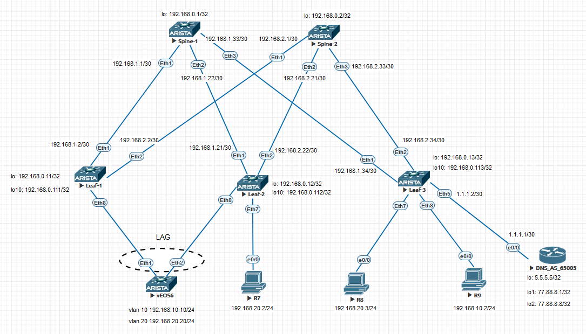

### VxLAN. Оптимизация таблиц маршрутизации

 Так как настройку будем производить на оборудовании Arista, то для данного задания будем использовать ESI-LAGs 
  
## Цель:

- Реализовать передачу суммарных префиксов через EVPN Route Type 5
  

## В этой самостоятельной работе мы ожидаем, что вы самостоятельно:
  
- Реализовать передачу суммарных префиксов через EVPN Route Type 5

### Описание/Пошаговая инструкция выполнения домашнего задания:


## Схема стенда 


<details>

## <summary> ## Таблица адресов: </summary>

| Device  | Interface | IP Address   | Subnet Mask     | Default Gateway |
|---------|-----------|--------------|-----------------|-----------------|
| Spine 1 | lo        | 192.168.0.1  | 255.255.255.255 |                 |
|         | E1/1      | 192.168.1.1  | 255.255.255.252 |                 |
|         | E1/2      | 192.168.1.21 | 255.255.255.252 |                 |
|         | E1/3      | 192.168.1.33 | 255.255.255.252 |                 |
| Spine 1 | lo        | 192.168.0.2  | 255.255.255.255 |                 |
|         | E1/1      | 192.168.2.1  | 255.255.255.252 |                 |
|         | E1/2      | 192.168.2.21 | 255.255.255.252 |                 |
|         | E1/3      | 192.168.2.33 | 255.255.255.252 |                 |
| Leaf 1  | lo        | 192.168.0.11 | 255.255.255.255 |                 |
|         | lo10      | 192.168.0.111| 255.255.255.255 |                 |
|         | E1/1      | 192.168.1.2  | 255.255.255.252 |                 |
|         | E1/2      | 192.168.2.2  | 255.255.255.252 |                 |
| Leaf 2  | lo        | 192.168.0.12 | 255.255.255.255 |                 |
|         | lo10      | 192.168.0.112| 255.255.255.255 |                 |
|         | E1/1      | 192.168.1.22 | 255.255.255.252 |                 |
|         | E1/2      | 192.168.2.22 | 255.255.255.252 |                 |
|         | E1/7      | 192.168.20.1 | 255.255.255.252 |                 |
| Leaf 3  | lo        | 192.168.0.13 | 255.255.255.252 |                 |
|         | lo10      | 192.168.0.113| 255.255.255.252 |                 |
|         | E1/1      | 192.168.1.34 | 255.255.255.252 |                 |
|         | E1/2      | 192.168.2.34 | 255.255.255.255 |                 |
|         | E1/7      | 192.168.20.1 | 255.255.255.0   |                 |
|         | E1/8      | 192.168.10.1 | 255.255.255.0   |                 |
|         | E1/5      | 1.1.1.2      | 255.255.255.252 |                 |
| vEOS6   | vlan 10   | 192.168.10.10| 255.255.255.0   | 192.168.10.1    |
|         | vlan 20   | 192.168.20.20| 255.255.255.0   | 192.168.20.1    |
| R7      | eth0/0    | 192.168.20.2 | 255.255.255.0   | 192.168.20.1    |
| R8      | eth0/0    | 192.168.20.3 | 255.255.255.0   | 192.168.20.1    |
| R9      | eth0/0    | 192.168.10.2 | 255.255.255.0   | 192.168.10.1    |
| DNS     | lo        | 5.5.5.5      | 255.255.255.255 |                 |
|         | lo1       | 77.88.8.1    | 255.255.255.255 |                 |
|         | lo2       | 77.88.8.8    | 255.255.255.255 |                 |
|         | eth0/0    | 1.1.1.2      | 255.255.255.252 |                 |


<details>

### [Файлы конфигураций устройст и сама работа выполненная в EVE-NG ](https://github.com/niknav83/Data_center_network_design/tree/main/labs/lab07/configs)

В данной работе применялса образ Arista (vEOS, EOS-4.21.1.1F) 

Логин: admin 

## Приступаем к настрйке сети:

### Настроим интерфейсы, IP адреса и OSPF на всех устройствах Underlay-сети.

<details>

<summary> Конфигурация интерфейсов и OSPF для Spine-1: </summary>

```


```
</details>


<details>

<summary>Конфигурация интерфейсов и OSPF для Spine-2: </summary>

```


```
</details>


<details>

<summary> Конфигурация интерфейсов и OSPF для Leaf-1: </summary>

```


```
</details>


<details>

<summary> Конфигурация интерфейсов и OSPF для Leaf-2: </summary>

```


```
</details>


<details>

<summary> Конфигурация интерфейсов и OSPF для Leaf-3: </summary>

```

```
</details>


### Далее на всех устройствах произведем необходимые настройки.


```

 Конфигурация для Spine-2:

```

```

 Конфигурация для Leaf-1:

```


```
 Конфигурация для Leaf-2:

```

```

 Конфигурация для Leaf-3:

```

```

 Конфигурация для DNS:

```

```

### Проверка работоспособности EVPN / VxLAN. Проверяем соседство по L2VPN между устройствами и таблицу маршрутизации. На LEAF-коммутаторах проверяем также NVE Peers:


<details>
  
<summary>Вывод команд для Spine-1 :</summary>

```

```
```


```
</details>

<details>
  
<summary>Вывод команд для Spine-2 :</summary>

```

```
```


```
</details>

<details>
  
<summary>Вывод команд для Leaf-1 :</summary>

```

```
```


```
```

```
```

```
```

```

</details>

<details>
  
<summary>Вывод команд для Leaf-2 :</summary>

```


```
```


```
```

```
```

```
```

```
</details>

<details>
  
<summary>Вывод команд для Leaf-3 :</summary>

```

```
```


  

```
```


```
</details>


<details>
<summary>Вывод команд для vEOS6 :</summary>

```

```
```

```
```

```

</details>
