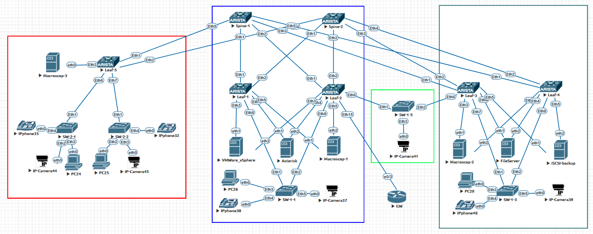

## Проектная работа "Оптимизация сетевой архитектуры: переход от классической 3-Tier топологии к evpn/vxlan и внедрение функции мультихоминга для эффективного подключения серверов"

### Оглавление
1. [Цель](#цель)
2. [Задачи](#задачи)
3. [Физическая схема](#физическая-схема-сети)

### Цель:
- Спроектировать и реализовать отказоустойчивое, масштабируемое решение сети для подключения серверов и клиентских устройств.
  
### Задачи:
- Проектирование отказоустойчивой и масштабируемой топологии Clos для ЦОД
- Проектирование адресного пространства


### Физическая схема сети:




### Адресация для построения сети Underlay


| Device  | Interface | IP Address | Subnet Mask     | Default Gateway |
|---------|-----------|------------|-----------------|-----------------|
| Spine 1 | lo        | 10.255.0.1 | 255.255.255.255 |                 |
|         | Eth1      | 10.0.1.1   | 255.255.255.252 |                 |
|         | Eth2      | 10.0.1.5   | 255.255.255.252 |                 |
|         | Eth3      | 10.0.1.9   | 255.255.255.252 |                 |
|         | Eth4      | 10.0.1.13  | 255.255.255.252 |                 |
|         | Eth5      | 10.0.1.17  | 255.255.255.252 |                 |
| Spine 2 | lo        | 10.255.0.2 | 255.255.255.255 |                 |
|         | Eth1      | 10.0.2.1   | 255.255.255.252 |                 |
|         | Eth2      | 10.0.2.5   | 255.255.255.252 |                 |
|         | Eth3      | 10.0.2.9   | 255.255.255.252 |                 |
|         | Eth4      | 10.0.2.13  | 255.255.255.252 |                 |
|         | Eth5      | 10.0.2.17  | 255.255.255.252 |                 |
| Leaf 1  | lo        | 10.255.1.1 | 255.255.255.255 |                 |
|         | Eth1      | 10.0.1.2   | 255.255.255.252 |                 |
|         | Eth2      | 10.0.2.2   | 255.255.255.252 |                 |
| Leaf 2  | lo        | 10.255.1.2 | 255.255.255.255 |                 |
|         | Eth1      | 10.0.1.6   | 255.255.255.252 |                 |
|         | Eth2      | 10.0.2.6   | 255.255.255.252 |                 |
| Leaf 3  | lo        | 10.255.2.1 | 255.255.255.255 |                 |
|         | Eth1      | 10.0.1.10  | 255.255.255.252 |                 |
|         | Eth2      | 10.0.2.10  | 255.255.255.252 |                 |
| Leaf 4  | lo        | 10.255.2.2 | 255.255.255.255 |                 |
|         | Eth1      | 10.0.1.14  | 255.255.255.252 |                 |
|         | Eth2      | 10.0.2.14  | 255.255.255.252 |                 |
| Leaf 5  | lo        | 10.255.3.1 | 255.255.255.255 |                 |
|         | Eth1      | 10.0.1.18  | 255.255.255.252 |                 |
|         | Eth2      | 10.0.2.18  | 255.255.255.252 |                 |


## Приступаем к настрйке сети:

### Настроим интерфейсы, IP адреса и OSPF на всех устройствах Underlay-сети.

<details>

<summary> Конфигурация интерфейсов и OSPF для Spine-1: </summary>

```
hostname Spine-1
!
interface Ethernet1
   mtu 9214
   no switchport
   ip address 10.0.1.1/30
   ip ospf bfd
   ip ospf network point-to-point
   ip ospf area 0.0.0.0
!
interface Ethernet2
   mtu 9214
   no switchport
   ip address 10.0.1.5/30
   ip ospf bfd
   ip ospf network point-to-point
   ip ospf area 0.0.0.0
!
interface Ethernet3
   mtu 9214
   no switchport
   ip address 10.0.1.9/30
   ip ospf bfd
   ip ospf network point-to-point
   ip ospf area 0.0.0.0
!
interface Ethernet4
   mtu 9214
   no switchport
   ip address 10.0.1.13/30
   ip ospf bfd
   ip ospf network point-to-point
   ip ospf area 0.0.0.0
!
interface Ethernet5
   mtu 9214
   no switchport
   ip address 10.0.1.17/30
   ip ospf bfd
   ip ospf network point-to-point
   ip ospf area 0.0.0.0
!
interface Loopback0
   ip address 10.255.0.1/32
   ip ospf area 0.0.0.0
!
ip routing
!
router ospf 1
   router-id 10.255.0.1
   bfd all-interfaces
   passive-interface default
   no passive-interface Ethernet1
   no passive-interface Ethernet2
   no passive-interface Ethernet3
   no passive-interface Ethernet4
   no passive-interface Ethernet5
   network 0.0.0.0/0 area 0.0.0.0
   max-lsa 12000
```
</details>


<details>

<summary>Конфигурация интерфейсов и OSPF для Spine-2: </summary>

```
hostname Spine-2
!
interface Ethernet1
   mtu 9214
   no switchport
   ip address 10.0.2.1/30
   ip ospf bfd
   ip ospf network point-to-point
   ip ospf area 0.0.0.0
!
interface Ethernet2
   mtu 9214
   no switchport
   ip address 10.0.2.5/30
   ip ospf bfd
   ip ospf network point-to-point
   ip ospf area 0.0.0.0
!
interface Ethernet3
   mtu 9214
   no switchport
   ip address 10.0.2.9/30
   ip ospf bfd
   ip ospf network point-to-point
   ip ospf area 0.0.0.0
!
interface Ethernet4
   mtu 9214
   no switchport
   ip address 10.0.2.13/30
   ip ospf bfd
   ip ospf network point-to-point
   ip ospf area 0.0.0.0
!
interface Ethernet5
   mtu 9214
   no switchport
   ip address 10.0.2.17/30
   ip ospf bfd
   ip ospf network point-to-point
   ip ospf area 0.0.0.0
!
interface Loopback0
   ip address 10.255.0.2/32
   ip ospf area 0.0.0.0
!
ip routing
!
router ospf 1
   router-id 10.255.0.2
   bfd all-interfaces
   passive-interface default
   no passive-interface Ethernet1
   no passive-interface Ethernet2
   no passive-interface Ethernet3
   no passive-interface Ethernet4
   no passive-interface Ethernet5
   network 0.0.0.0/0 area 0.0.0.0
   max-lsa 12000
```
</details>


<details>

<summary> Конфигурация интерфейсов и OSPF для Leaf-1: </summary>

```
hostname Leaf-1
!
interface Ethernet1
   mtu 9214
   no switchport
   ip address 10.0.1.2/30
   ip ospf bfd
   ip ospf network point-to-point
   ip ospf area 0.0.0.0
!
interface Ethernet2
   mtu 9214
   no switchport
   ip address 10.0.2.2/30
   ip ospf bfd
   ip ospf network point-to-point
   ip ospf area 0.0.0.0
!
interface Loopback0
   ip address 10.255.1.1/32
   ip ospf area 0.0.0.0
!
ip routing
!
router ospf 1
   router-id 10.255.1.1
   bfd all-interfaces
   passive-interface default
   no passive-interface Ethernet1
   no passive-interface Ethernet2
   network 0.0.0.0/0 area 0.0.0.0
   max-lsa 12000
```
</details>


<details>

<summary> Конфигурация интерфейсов и OSPF для Leaf-2: </summary>

```
hostname Leaf-2
!
interface Ethernet1
   mtu 9214
   no switchport
   ip address 10.0.1.6/30
   ip ospf bfd
   ip ospf network point-to-point
   ip ospf area 0.0.0.0
!
interface Ethernet2
   mtu 9214
   no switchport
   ip address 10.0.2.6/30
   ip ospf bfd
   ip ospf network point-to-point
   ip ospf area 0.0.0.0
!
interface Loopback0
   ip address 10.255.1.2/32
   ip ospf area 0.0.0.0
!
ip routing
!
router ospf 1
   router-id 10.255.1.2
   bfd all-interfaces
   passive-interface default
   no passive-interface Ethernet1
   no passive-interface Ethernet2
   network 0.0.0.0/0 area 0.0.0.0
   max-lsa 12000
```
</details>


<details>

<summary> Конфигурация интерфейсов и OSPF для Leaf-3: </summary>

```
hostname Leaf-3
!
interface Ethernet1
   mtu 9214
   no switchport
   ip address 10.0.1.10/30
   ip ospf network point-to-point
   ip ospf area 0.0.0.0
!
interface Ethernet2
   mtu 9214
   no switchport
   ip address 10.0.2.10/30
   ip ospf network point-to-point
   ip ospf area 0.0.0.0
!
interface Loopback0
   ip address 10.255.2.1/32
   ip ospf area 0.0.0.0
!
ip routing
!
router ospf 1
   router-id 10.255.2.1
   passive-interface default
   no passive-interface Ethernet1
   no passive-interface Ethernet2
   network 0.0.0.0/0 area 0.0.0.0
   max-lsa 12000
```
</details>


<details>

<summary> Конфигурация интерфейсов и OSPF для Leaf-4: </summary>

```
hostname Leaf-4
!
interface Ethernet1
   mtu 9214
   no switchport
   ip address 10.0.1.14/30
   ip ospf bfd
   ip ospf network point-to-point
   ip ospf area 0.0.0.0
!
interface Ethernet2
   mtu 9214
   no switchport
   ip address 10.0.2.14/30
   ip ospf bfd
   ip ospf network point-to-point
   ip ospf area 0.0.0.0
!
interface Loopback0
   ip address 10.255.2.2/32
   ip ospf area 0.0.0.0
!
ip routing
!
router ospf 1
   router-id 10.255.2.2
   bfd all-interfaces
   passive-interface default
   no passive-interface Ethernet1
   no passive-interface Ethernet2
   network 0.0.0.0/0 area 0.0.0.0
   max-lsa 12000
```
</details>


<details>

<summary> Конфигурация интерфейсов и OSPF для Leaf-5: </summary>

```
hostname Leaf-5
!
interface Ethernet1
   mtu 9214
   no switchport
   ip address 10.0.1.18/30
   ip ospf bfd
   ip ospf network point-to-point
   ip ospf area 0.0.0.0
!
interface Ethernet2
   mtu 9214
   no switchport
   ip address 10.0.2.18/30
   ip ospf bfd
   ip ospf network point-to-point
   ip ospf area 0.0.0.0
!
interface Loopback0
   ip address 10.255.3.1/32
   ip ospf area 0.0.0.0
!
ip routing
!
router ospf 1
   router-id 10.255.3.1
   bfd all-interfaces
   passive-interface default
   no passive-interface Ethernet1
   no passive-interface Ethernet2
   network 0.0.0.0/0 area 0.0.0.0
   max-lsa 12000
```
</details>


