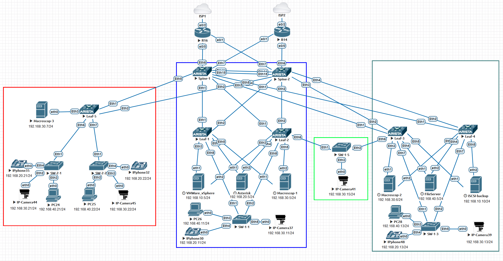
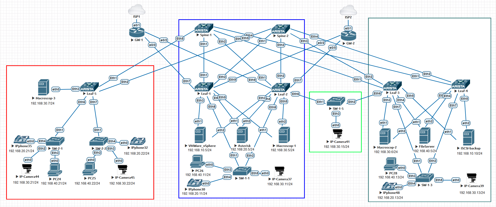

## Проектная работа "Оптимизация сетевой архитектуры: переход от классической 3-Tier топологии к evpn/vxlan и внедрение функции мультихоминга для эффективного подключения серверов"

### Оглавление
1. [Цель](#цель)
2. [Задачи](#задачи)
3. [Физическая схема текущей сети](#Физическая-схема-текущей-сети-и-краткое-описание-ее-работы)
4. [Физическая схема](#физическая-схема-сети)


 
## Цель:
- Спроектировать и реализовать отказоустойчивое, масштабируемое решение сети для подключения серверов и клиентских устройств.
  
### Задачи:
- Проектирование отказоустойчивой и масштабируемой топологии Clos для ЦОД
- Проектирование адресного пространства
- Проектирование подключения серверов сразу к двум коммутаторам.

  
## Физическая схема текущей сети и краткое описание ее работы:




### Физическая схема сети новой сети:




### Адресация для построения сети Underlay


| Device  | Interface | IP Address | Subnet Mask     | Default Gateway |
|---------|-----------|------------|-----------------|-----------------|
| Spine 1 | lo        | 10.255.0.1 | 255.255.255.255 |                 |
|         | Eth1      | 10.0.1.1   | 255.255.255.252 |                 |
|         | Eth2      | 10.0.1.5   | 255.255.255.252 |                 |
|         | Eth3      | 10.0.1.9   | 255.255.255.252 |                 |
|         | Eth4      | 10.0.1.13  | 255.255.255.252 |                 |
|         | Eth5      | 10.0.1.17  | 255.255.255.252 |                 |
| Spine 2 | lo        | 10.255.0.2 | 255.255.255.255 |                 |
|         | Eth1      | 10.0.2.1   | 255.255.255.252 |                 |
|         | Eth2      | 10.0.2.5   | 255.255.255.252 |                 |
|         | Eth3      | 10.0.2.9   | 255.255.255.252 |                 |
|         | Eth4      | 10.0.2.13  | 255.255.255.252 |                 |
|         | Eth5      | 10.0.2.17  | 255.255.255.252 |                 |
| Leaf 1  | lo        | 10.255.1.1 | 255.255.255.255 |                 |
|         | Eth1      | 10.0.1.2   | 255.255.255.252 |                 |
|         | Eth2      | 10.0.2.2   | 255.255.255.252 |                 |
| Leaf 2  | lo        | 10.255.1.2 | 255.255.255.255 |                 |
|         | Eth1      | 10.0.1.6   | 255.255.255.252 |                 |
|         | Eth2      | 10.0.2.6   | 255.255.255.252 |                 |
| Leaf 3  | lo        | 10.255.2.1 | 255.255.255.255 |                 |
|         | Eth1      | 10.0.1.10  | 255.255.255.252 |                 |
|         | Eth2      | 10.0.2.10  | 255.255.255.252 |                 |
| Leaf 4  | lo        | 10.255.2.2 | 255.255.255.255 |                 |
|         | Eth1      | 10.0.1.14  | 255.255.255.252 |                 |
|         | Eth2      | 10.0.2.14  | 255.255.255.252 |                 |
| Leaf 5  | lo        | 10.255.3.1 | 255.255.255.255 |                 |
|         | Eth1      | 10.0.1.18  | 255.255.255.252 |                 |
|         | Eth2      | 10.0.2.18  | 255.255.255.252 |                 |


### Адресация для построения сети Overlay


| Device  | Interface | IP Address | Subnet Mask     | Default Gateway |
|---------|-----------|------------|-----------------|-----------------|
| Leaf 1  | lo10      | 10.255.10.1| 255.255.255.255 |                 |
| Leaf 2  | lo10      | 10.255.10.2| 255.255.255.255 |                 |
| Leaf 3  | lo10      | 10.255.10.3| 255.255.255.255 |                 |
| Leaf 4  | lo10      | 10.255.10.4| 255.255.255.255 |                 |
| Leaf 5  | lo10      | 10.255.10.5| 255.255.255.255 |                 |


#### Сетевые зоны
Зоны одинаковы на всех LEAF коммутаторах. 

| Network         | Gateway / Interface VLAN IP Address | VLAN ID | VLAN Name      | VRF   | VNI   | Description |
|-----------------|-------------------------------------|---------|----------------|-------|-------|-------------|
| 192.168.10.0/24 | 192.168.10.1                        | 10      | VMWare         | PROD  | 10010 |             |
| 192.168.20.0/24 | 192.168.20.1                        | 20      | VoIP           | VoIP  | 10020 |             |
| 192.168.30.0/24 | 192.168.30.1                        | 30      | Video          | Video | 10030 |             |
| 192.168.40.0/24 | 192.168.40.1                        | 40      | PROD           | PROD  | 10040 |             |


## Приступаем к настрйке сети:

### Настроим интерфейсы, IP адреса и OSPF на всех устройствах Underlay-сети.

<details>

<summary> Конфигурация интерфейсов и OSPF для Spine-1: </summary>

```
hostname Spine-1
!
interface Ethernet1
   mtu 9214
   no switchport
   ip address 10.0.1.1/30
   ip ospf bfd
   ip ospf network point-to-point
   ip ospf area 0.0.0.0
!
interface Ethernet2
   mtu 9214
   no switchport
   ip address 10.0.1.5/30
   ip ospf bfd
   ip ospf network point-to-point
   ip ospf area 0.0.0.0
!
interface Ethernet3
   mtu 9214
   no switchport
   ip address 10.0.1.9/30
   ip ospf bfd
   ip ospf network point-to-point
   ip ospf area 0.0.0.0
!
interface Ethernet4
   mtu 9214
   no switchport
   ip address 10.0.1.13/30
   ip ospf bfd
   ip ospf network point-to-point
   ip ospf area 0.0.0.0
!
interface Ethernet5
   mtu 9214
   no switchport
   ip address 10.0.1.17/30
   ip ospf bfd
   ip ospf network point-to-point
   ip ospf area 0.0.0.0
!
interface Loopback0
   ip address 10.255.0.1/32
   ip ospf area 0.0.0.0
!
ip routing
!
router ospf 1
   router-id 10.255.0.1
   bfd all-interfaces
   passive-interface default
   no passive-interface Ethernet1
   no passive-interface Ethernet2
   no passive-interface Ethernet3
   no passive-interface Ethernet4
   no passive-interface Ethernet5
   network 0.0.0.0/0 area 0.0.0.0
   max-lsa 12000
```
</details>


<details>

<summary>Конфигурация интерфейсов и OSPF для Spine-2: </summary>

```
hostname Spine-2
!
interface Ethernet1
   mtu 9214
   no switchport
   ip address 10.0.2.1/30
   ip ospf bfd
   ip ospf network point-to-point
   ip ospf area 0.0.0.0
!
interface Ethernet2
   mtu 9214
   no switchport
   ip address 10.0.2.5/30
   ip ospf bfd
   ip ospf network point-to-point
   ip ospf area 0.0.0.0
!
interface Ethernet3
   mtu 9214
   no switchport
   ip address 10.0.2.9/30
   ip ospf bfd
   ip ospf network point-to-point
   ip ospf area 0.0.0.0
!
interface Ethernet4
   mtu 9214
   no switchport
   ip address 10.0.2.13/30
   ip ospf bfd
   ip ospf network point-to-point
   ip ospf area 0.0.0.0
!
interface Ethernet5
   mtu 9214
   no switchport
   ip address 10.0.2.17/30
   ip ospf bfd
   ip ospf network point-to-point
   ip ospf area 0.0.0.0
!
interface Loopback0
   ip address 10.255.0.2/32
   ip ospf area 0.0.0.0
!
ip routing
!
router ospf 1
   router-id 10.255.0.2
   bfd all-interfaces
   passive-interface default
   no passive-interface Ethernet1
   no passive-interface Ethernet2
   no passive-interface Ethernet3
   no passive-interface Ethernet4
   no passive-interface Ethernet5
   network 0.0.0.0/0 area 0.0.0.0
   max-lsa 12000
```
</details>


<details>

<summary> Конфигурация интерфейсов и OSPF для Leaf-1: </summary>

```
hostname Leaf-1
!
interface Ethernet1
   mtu 9214
   no switchport
   ip address 10.0.1.2/30
   ip ospf bfd
   ip ospf network point-to-point
   ip ospf area 0.0.0.0
!
interface Ethernet2
   mtu 9214
   no switchport
   ip address 10.0.2.2/30
   ip ospf bfd
   ip ospf network point-to-point
   ip ospf area 0.0.0.0
!
interface Loopback0
   ip address 10.255.1.1/32
   ip ospf area 0.0.0.0
!
ip routing
!
router ospf 1
   router-id 10.255.1.1
   bfd all-interfaces
   passive-interface default
   no passive-interface Ethernet1
   no passive-interface Ethernet2
   network 0.0.0.0/0 area 0.0.0.0
   max-lsa 12000
```
</details>


<details>

<summary> Конфигурация интерфейсов и OSPF для Leaf-2: </summary>

```
hostname Leaf-2
!
interface Ethernet1
   mtu 9214
   no switchport
   ip address 10.0.1.6/30
   ip ospf bfd
   ip ospf network point-to-point
   ip ospf area 0.0.0.0
!
interface Ethernet2
   mtu 9214
   no switchport
   ip address 10.0.2.6/30
   ip ospf bfd
   ip ospf network point-to-point
   ip ospf area 0.0.0.0
!
interface Loopback0
   ip address 10.255.1.2/32
   ip ospf area 0.0.0.0
!
ip routing
!
router ospf 1
   router-id 10.255.1.2
   bfd all-interfaces
   passive-interface default
   no passive-interface Ethernet1
   no passive-interface Ethernet2
   network 0.0.0.0/0 area 0.0.0.0
   max-lsa 12000
```
</details>


<details>

<summary> Конфигурация интерфейсов и OSPF для Leaf-3: </summary>

```
hostname Leaf-3
!
interface Ethernet1
   mtu 9214
   no switchport
   ip address 10.0.1.10/30
   ip ospf network point-to-point
   ip ospf area 0.0.0.0
!
interface Ethernet2
   mtu 9214
   no switchport
   ip address 10.0.2.10/30
   ip ospf network point-to-point
   ip ospf area 0.0.0.0
!
interface Loopback0
   ip address 10.255.2.1/32
   ip ospf area 0.0.0.0
!
ip routing
!
router ospf 1
   router-id 10.255.2.1
   passive-interface default
   no passive-interface Ethernet1
   no passive-interface Ethernet2
   network 0.0.0.0/0 area 0.0.0.0
   max-lsa 12000
```
</details>


<details>

<summary> Конфигурация интерфейсов и OSPF для Leaf-4: </summary>

```
hostname Leaf-4
!
interface Ethernet1
   mtu 9214
   no switchport
   ip address 10.0.1.14/30
   ip ospf bfd
   ip ospf network point-to-point
   ip ospf area 0.0.0.0
!
interface Ethernet2
   mtu 9214
   no switchport
   ip address 10.0.2.14/30
   ip ospf bfd
   ip ospf network point-to-point
   ip ospf area 0.0.0.0
!
interface Loopback0
   ip address 10.255.2.2/32
   ip ospf area 0.0.0.0
!
ip routing
!
router ospf 1
   router-id 10.255.2.2
   bfd all-interfaces
   passive-interface default
   no passive-interface Ethernet1
   no passive-interface Ethernet2
   network 0.0.0.0/0 area 0.0.0.0
   max-lsa 12000
```
</details>


<details>

<summary> Конфигурация интерфейсов и OSPF для Leaf-5: </summary>

```
hostname Leaf-5
!
interface Ethernet1
   mtu 9214
   no switchport
   ip address 10.0.1.18/30
   ip ospf bfd
   ip ospf network point-to-point
   ip ospf area 0.0.0.0
!
interface Ethernet2
   mtu 9214
   no switchport
   ip address 10.0.2.18/30
   ip ospf bfd
   ip ospf network point-to-point
   ip ospf area 0.0.0.0
!
interface Loopback0
   ip address 10.255.3.1/32
   ip ospf area 0.0.0.0
!
ip routing
!
router ospf 1
   router-id 10.255.3.1
   bfd all-interfaces
   passive-interface default
   no passive-interface Ethernet1
   no passive-interface Ethernet2
   network 0.0.0.0/0 area 0.0.0.0
   max-lsa 12000
```
</details>


### Настроим интерфейсы Loopback10, VLAN, VRF на всех устройствах Overlay-сети.

<details>
<summary> Конфигурация интерфейсов для Leaf-1: </summary>

```
vlan 10,20,30,40
!
vrf definition PROD
!
vrf definition Video
!
vrf definition VoIP
!
interface Loopback10
   ip address 10.255.10.1/32
   ip ospf area 0.0.0.0
!
interface Vlan10
   vrf forwarding PROD
   ip address virtual 192.168.10.1/24
!
interface Vlan20
   vrf forwarding VoIP
   ip address virtual 192.168.20.1/24
!
interface Vlan30
   vrf forwarding Video
   ip address virtual 192.168.30.1/24
!
interface Vlan40
   vrf forwarding PROD
   ip address virtual 192.168.40.1/24
!
ip virtual-router mac-address 00:00:11:11:22:22
!
ip routing
ip routing vrf Video
ip routing vrf VoIP
ip routing vrf PROD
!
```
</details>


<details>

<summary> Конфигурация интерфейсов для Leaf-2: </summary>

```
vlan 10,20,30,40
!
vrf definition PROD
!
vrf definition Video
!
vrf definition VoIP
!
interface Loopback10
   ip address 10.255.10.2/32
   ip ospf area 0.0.0.0
!
interface Vlan10
   vrf forwarding PROD
   ip address virtual 192.168.10.1/24
!
interface Vlan20
   vrf forwarding VoIP
   ip address virtual 192.168.20.1/24
!
interface Vlan30
   vrf forwarding Video
   ip address virtual 192.168.30.1/24
!
interface Vlan40
   vrf forwarding PROD
   ip address virtual 192.168.40.1/24
!
ip virtual-router mac-address 00:00:11:11:22:22
!
ip routing
ip routing vrf Video
ip routing vrf VoIP
ip routing vrf PROD
!
```
</details>


<details>

<summary> Конфигурация интерфейсов для Leaf-3: </summary>

```
vlan 10,20,30,40
!
vrf definition PROD
!
vrf definition Video
!
vrf definition VoIP
!
interface Loopback10
   ip address 10.255.10.3/32
   ip ospf area 0.0.0.0
!
interface Vlan10
   vrf forwarding PROD
   ip address virtual 192.168.10.1/24
!
interface Vlan20
   vrf forwarding VoIP
   ip address virtual 192.168.20.1/24
!
interface Vlan30
   vrf forwarding Video
   ip address virtual 192.168.30.1/24
!
interface Vlan40
   vrf forwarding PROD
   ip address virtual 192.168.40.1/24
!
ip virtual-router mac-address 00:00:11:11:22:22
!
ip routing
ip routing vrf Video
ip routing vrf VoIP
ip routing vrf PROD
!
```
</details>


<details>

<summary> Конфигурация интерфейсов для Leaf-4: </summary>

```
vlan 10,20,30,40
!
vrf definition PROD
!
vrf definition Video
!
vrf definition VoIP
!
interface Ethernet9

interface Loopback10
   ip address 10.255.10.4/32
   ip ospf area 0.0.0.0
!
interface Vlan10
   vrf forwarding PROD
   ip address virtual 192.168.10.1/24
!
interface Vlan20
   vrf forwarding VoIP
   ip address virtual 192.168.20.1/24
!
interface Vlan30
   vrf forwarding Video
   ip address virtual 192.168.30.1/24
!
interface Vlan40
   vrf forwarding PROD
   ip address virtual 192.168.40.1/24
!
ip virtual-router mac-address 00:00:11:11:22:22
!
ip routing
ip routing vrf Video
ip routing vrf VoIP
ip routing vrf PROD
!
```
</details>


<details>

<summary> Конфигурация интерфейсов для Leaf-5: </summary>

```
vlan 10,20,30,40
!
vrf definition PROD
!
vrf definition Video
!
vrf definition VoIP
!
interface Loopback10
   ip address 10.255.10.5/32
   ip ospf area 0.0.0.0
!
interface Vlan10
   vrf forwarding PROD
   ip address virtual 192.168.10.1/24
!
interface Vlan20
   vrf forwarding VoIP
   ip address virtual 192.168.20.1/24
!
interface Vlan30
   vrf forwarding Video
   ip address virtual 192.168.30.1/24
!
interface Vlan40
   vrf forwarding PROD
   ip address virtual 192.168.40.1/24
!
ip virtual-router mac-address 00:00:11:11:22:22
!
ip routing
ip routing vrf Video
ip routing vrf VoIP
ip routing vrf PROD
!
  ```
</details>


## Приступаем к настрйке сети Overlay:

### Настроим интерфейсы Loopback10, BGP, VXLAN на всех устройствах Overlay-сети.

<details>

<summary> Конфигурация интерфейсов и BGP для Spine-1: </summary>

```
router bgp 65000
   router-id 10.255.0.1
   maximum-paths 4
   neighbor LEAVES peer-group
   neighbor LEAVES remote-as 65000
   neighbor LEAVES update-source Loopback0
   neighbor LEAVES route-reflector-client
   neighbor LEAVES send-community
   neighbor LEAVES maximum-routes 12000 
   neighbor 10.255.1.1 peer-group LEAVES
   neighbor 10.255.1.2 peer-group LEAVES
   neighbor 10.255.2.1 peer-group LEAVES
   neighbor 10.255.2.2 peer-group LEAVES
   neighbor 10.255.3.1 peer-group LEAVES
   !
   address-family evpn
      neighbor LEAVES activate
   !
   address-family ipv4
      no neighbor LEAVES activate
!
```
</details>


<details>

<summary>Конфигурация интерфейсов и BGP для Spine-2: </summary>

```
router bgp 65000
   router-id 10.255.0.2
   maximum-paths 4
   neighbor LEAVES peer-group
   neighbor LEAVES remote-as 65000
   neighbor LEAVES update-source Loopback0
   neighbor LEAVES route-reflector-client
   neighbor LEAVES send-community
   neighbor LEAVES maximum-routes 12000 
   neighbor 10.255.1.1 peer-group LEAVES
   neighbor 10.255.1.2 peer-group LEAVES
   neighbor 10.255.2.1 peer-group LEAVES
   neighbor 10.255.2.2 peer-group LEAVES
   neighbor 10.255.3.1 peer-group LEAVES
   !
   address-family evpn
      neighbor LEAVES activate
   !
   address-family ipv4
      no neighbor LEAVES activate
!
```
</details>


<details>

<summary> Конфигурация интерфейсов и BGP для Leaf-1: </summary>

```
router bgp 65000
   router-id 10.255.1.1
   maximum-paths 4
   neighbor 10.255.0.1 remote-as 65000
   neighbor 10.255.0.1 update-source Loopback0
   neighbor 10.255.0.1 send-community
   neighbor 10.255.0.1 maximum-routes 12000 
   neighbor 10.255.0.2 remote-as 65000
   neighbor 10.255.0.2 update-source Loopback0
   neighbor 10.255.0.2 send-community
   neighbor 10.255.0.2 maximum-routes 12000 
   !
   vlan 10
      rd auto
      route-target both 65000:10010
      redistribute learned
   !
   vlan 20
      rd auto
      route-target both 65000:10020
      redistribute learned
   !
   vlan 30
      rd auto
      route-target both 65000:10030
      redistribute learned
   !
   vlan 40
      rd auto
      route-target both 65000:10040
      redistribute learned
   !
   address-family evpn
      neighbor 10.255.0.1 activate
      neighbor 10.255.0.2 activate
   !
   address-family ipv4
      no neighbor 10.255.0.1 activate
      no neighbor 10.255.0.2 activate
   !
   vrf PROD
      rd 10.255.1.1:1
      route-target import evpn 65000:100999
      route-target export evpn 65000:100999
   !
   vrf Video
      rd 10.255.1.1:30
      route-target import evpn 65000:100930
      route-target export evpn 65000:100930
   !
   vrf VoIP
      rd 10.255.1.1:20
      route-target import evpn 65000:100920
      route-target export evpn 65000:100920
!
```
</details>


<details>

<summary> Конфигурация интерфейсов и BGP для Leaf-2: </summary>

```
router bgp 65000
   router-id 10.255.1.2
   maximum-paths 4
   neighbor 10.255.0.1 remote-as 65000
   neighbor 10.255.0.1 update-source Loopback0
   neighbor 10.255.0.1 send-community
   neighbor 10.255.0.1 maximum-routes 12000 
   neighbor 10.255.0.2 remote-as 65000
   neighbor 10.255.0.2 update-source Loopback0
   neighbor 10.255.0.2 send-community
   neighbor 10.255.0.2 maximum-routes 12000 
   !
   vlan 10
      rd auto
      route-target both 65000:10010
      redistribute learned
   !
   vlan 20
      rd auto
      route-target both 65000:10020
      redistribute learned
   !
   vlan 30
      rd auto
      route-target both 65000:10030
      redistribute learned
   !
   vlan 40
      rd auto
      route-target both 65000:10040
      redistribute learned
   !
   address-family evpn
      neighbor 10.255.0.1 activate
      neighbor 10.255.0.2 activate
   !
   address-family ipv4
      no neighbor 10.255.0.1 activate
      no neighbor 10.255.0.2 activate
   !
   vrf PROD
      rd 10.255.1.2:1
      route-target import evpn 65000:100999
      route-target export evpn 65000:100999
   !
   vrf Video
      rd 10.255.1.2:30
      route-target import evpn 65000:100930
      route-target export evpn 65000:100930
   !
   vrf VoIP
      rd 10.255.1.2:20
      route-target import evpn 65000:100920
      route-target export evpn 65000:100920
!
```
</details>


<details>

<summary> Конфигурация интерфейсов и BGP для Leaf-3: </summary>

```
router bgp 65000
   router-id 10.255.2.1
   maximum-paths 4
   neighbor 10.255.0.1 remote-as 65000
   neighbor 10.255.0.1 update-source Loopback0
   neighbor 10.255.0.1 send-community
   neighbor 10.255.0.1 maximum-routes 12000 
   neighbor 10.255.0.2 remote-as 65000
   neighbor 10.255.0.2 update-source Loopback0
   neighbor 10.255.0.2 send-community
   neighbor 10.255.0.2 maximum-routes 12000 
   !
   vlan 10
      rd auto
      route-target both 65000:10010
      redistribute learned
   !
   vlan 20
      rd auto
      route-target both 65000:10020
      redistribute learned
   !
   vlan 30
      rd auto
      route-target both 65000:10030
      redistribute learned
   !
   vlan 40
      rd auto
      route-target both 65000:10040
      redistribute learned
   !
   address-family evpn
      neighbor 10.255.0.1 activate
      neighbor 10.255.0.2 activate
   !
   address-family ipv4
      no neighbor 10.255.0.1 activate
      no neighbor 10.255.0.2 activate
   !
   vrf PROD
      rd 10.255.2.1:1
      route-target import evpn 65000:100999
      route-target export evpn 65000:100999
   !
   vrf Video
      rd 10.255.2.1:30
      route-target import evpn 65000:100930
      route-target export evpn 65000:100930
   !
   vrf VoIP
      rd 10.255.2.1:20
      route-target import evpn 65000:100920
      route-target export evpn 65000:100920
!
```
</details>


<details>

<summary> Конфигурация интерфейсов и BGP для Leaf-4: </summary>

```
router bgp 65000
   router-id 10.255.2.2
   maximum-paths 4
   neighbor 10.255.0.1 remote-as 65000
   neighbor 10.255.0.1 update-source Loopback0
   neighbor 10.255.0.1 send-community
   neighbor 10.255.0.1 maximum-routes 12000 
   neighbor 10.255.0.2 remote-as 65000
   neighbor 10.255.0.2 update-source Loopback0
   neighbor 10.255.0.2 send-community
   neighbor 10.255.0.2 maximum-routes 12000 
   !
   vlan 10
      rd auto
      route-target both 65000:10010
      redistribute learned
   !
   vlan 20
      rd auto
      route-target both 65000:10020
      redistribute learned
   !
   vlan 30
      rd auto
      route-target both 65000:10030
      redistribute learned
   !
   vlan 40
      rd auto
      route-target both 65000:10040
      redistribute learned
   !
   address-family evpn
      neighbor 10.255.0.1 activate
      neighbor 10.255.0.2 activate
   !
   address-family ipv4
      no neighbor 10.255.0.1 activate
      no neighbor 10.255.0.2 activate
   !
   vrf PROD
      rd 10.255.2.2:1
      route-target import evpn 65000:100999
      route-target export evpn 65000:100999
   !
   vrf Video
      rd 10.255.2.2:30
      route-target import evpn 65000:100930
      route-target export evpn 65000:100930
   !
   vrf VoIP
      rd 10.255.2.2:20
      route-target import evpn 65000:100920
      route-target export evpn 65000:100920
!
```
</details>


<details>

<summary> Конфигурация интерфейсов и BGP для Leaf-5: </summary>

```
router bgp 65000
   router-id 10.255.3.1
   maximum-paths 4
   neighbor 10.255.0.1 remote-as 65000
   neighbor 10.255.0.1 update-source Loopback0
   neighbor 10.255.0.1 send-community
   neighbor 10.255.0.1 maximum-routes 12000 
   neighbor 10.255.0.2 remote-as 65000
   neighbor 10.255.0.2 update-source Loopback0
   neighbor 10.255.0.2 send-community
   neighbor 10.255.0.2 maximum-routes 12000 
   !
   vlan 10
      rd auto
      route-target both 65000:10010
      redistribute learned
   !
   vlan 20
      rd auto
      route-target both 65000:10020
      redistribute learned
   !
   vlan 30
      rd auto
      route-target both 65000:10030
      redistribute learned
   !
   vlan 40
      rd auto
      route-target both 65000:10040
      redistribute learned
   !
   address-family evpn
      neighbor 10.255.0.1 activate
      neighbor 10.255.0.2 activate
   !
   address-family ipv4
      no neighbor 10.255.0.1 activate
      no neighbor 10.255.0.2 activate
   !
   vrf PROD
      rd 10.255.3.1:1
      route-target import evpn 65000:100999
      route-target export evpn 65000:100999
   !
   vrf Video
      rd 10.255.3.1:30
      route-target import evpn 65000:100930
      route-target export evpn 65000:100930
   !
   vrf VoIP
      rd 10.255.3.1:20
      route-target import evpn 65000:100920
      route-target export evpn 65000:100920
!
```
</details>

## Приступаем к настрйке ESI-LAGs:

### Настроим ESI-LAGs на всех Leaf устройствах Overlay-сети.


<details>

<summary> Конфигурация интерфейсов и ESI-LAGs для Leaf-1: </summary>

```
interface Port-Channel1
   switchport trunk allowed vlan 10,40
   switchport mode trunk
   !
   evpn ethernet-segment
      identifier 0000:1111:2222:3333:4110
      route-target import 12:23:34:45:41:10
   lacp system-id 1111.2222.4110
   spanning-tree portfast
!
interface Port-Channel2
   switchport trunk allowed vlan 20,40
   switchport mode trunk
   !
   evpn ethernet-segment
      identifier 0000:1111:2222:3333:4220
      route-target import 12:23:34:45:42:20
   lacp system-id 1111.2222.4220
   spanning-tree portfast
!
interface Port-Channel3
   switchport trunk allowed vlan 30,40
   switchport mode trunk
   !
   evpn ethernet-segment
      identifier 0000:1111:2222:3333:4330
      route-target import 12:23:34:45:43:30
   lacp system-id 1111.2222.4330
   spanning-tree portfast
!
interface Port-Channel4
   switchport trunk allowed vlan 10,20,30,40
   switchport mode trunk
   !
   evpn ethernet-segment
      identifier 0000:1111:2222:3333:4224
      route-target import 12:23:34:45:42:24
   lacp system-id 1111.2222.4224
   spanning-tree portfast
!
interface Ethernet3
   switchport trunk allowed vlan 10,40
   switchport mode trunk
   channel-group 1 mode active
   spanning-tree portfast
!
interface Ethernet4
   switchport trunk allowed vlan 20,40
   switchport mode trunk
   channel-group 2 mode active
   spanning-tree portfast
!
interface Ethernet5
   switchport trunk allowed vlan 30,40
   switchport mode trunk
   channel-group 3 mode active
   spanning-tree portfast
!
interface Ethernet8
   switchport trunk allowed vlan 10,20,30,40
   switchport mode trunk
   channel-group 4 mode active
   spanning-tree portfast
!
```
</details>


<details>

<summary> Конфигурация интерфейсов и ESI-LAGs для Leaf-2: </summary>

```
interface Port-Channel1
   switchport trunk allowed vlan 10,40
   switchport mode trunk
   !
   evpn ethernet-segment
      identifier 0000:1111:2222:3333:4110
      route-target import 12:23:34:45:41:10
   lacp system-id 1111.2222.4110
   spanning-tree portfast
!
interface Port-Channel2
   switchport trunk allowed vlan 20,40
   switchport mode trunk
   !
   evpn ethernet-segment
      identifier 0000:1111:2222:3333:4220
      route-target import 12:23:34:45:42:20
   lacp system-id 1111.2222.4220
   spanning-tree portfast
!
interface Port-Channel3
   switchport trunk allowed vlan 30,40
   switchport mode trunk
   !
   evpn ethernet-segment
      identifier 0000:1111:2222:3333:4330
      route-target import 12:23:34:45:43:30
   lacp system-id 1111.2222.4330
   spanning-tree portfast
!
interface Port-Channel4
   switchport trunk allowed vlan 10,20,30,40
   switchport mode trunk
   !
   evpn ethernet-segment
      identifier 0000:1111:2222:3333:4224
      route-target import 12:23:34:45:42:24
   lacp system-id 1111.2222.4224
   spanning-tree portfast
!
interface Port-Channel6
   switchport trunk allowed vlan 10,20,30,40
   switchport mode trunk
   !
   evpn ethernet-segment
      identifier 0000:1111:2222:3333:4226
      route-target import 12:23:34:45:42:26
   lacp system-id 1111.2222.4226
   spanning-tree portfast
!
interface Ethernet3
   switchport trunk allowed vlan 10,40
   switchport mode trunk
   channel-group 1 mode active
   spanning-tree portfast
!
interface Ethernet4
   switchport trunk allowed vlan 20,40
   switchport mode trunk
   channel-group 2 mode active
   spanning-tree portfast
!
interface Ethernet5
   switchport trunk allowed vlan 30,40
   switchport mode trunk
   channel-group 3 mode active
   spanning-tree portfast
!
interface Ethernet6
   switchport trunk allowed vlan 10,20,30,40
   switchport mode trunk
   channel-group 6 mode active
   spanning-tree portfast
!
interface Ethernet8
   switchport trunk allowed vlan 10,20,30,40
   switchport mode trunk
   channel-group 4 mode active
   spanning-tree portfast
```
</details>


<details>

<summary> Конфигурация интерфейсов и ESI-LAGs для Leaf-3: </summary>

```
interface Port-Channel6
   switchport trunk allowed vlan 10,20,30,40
   switchport mode trunk
   !
   evpn ethernet-segment
      identifier 0000:1111:2222:3333:4226
      route-target import 12:23:34:45:42:26
   lacp system-id 1111.2222.4226
   spanning-tree portfast
!
interface Port-Channel7
   switchport trunk allowed vlan 10,20,30,40
   switchport mode trunk
   !
   evpn ethernet-segment
      identifier 0000:1111:2222:3333:4227
      route-target import 12:23:34:45:42:27
   lacp system-id 1111.2222.4227
   spanning-tree portfast
!
interface Port-Channel8
   switchport trunk allowed vlan 30,40
   switchport mode trunk
   !
   evpn ethernet-segment
      identifier 0000:1111:2222:3333:4228
      route-target import 12:23:34:45:42:28
   lacp system-id 1111.2222.4228
   spanning-tree portfast
!
interface Port-Channel9
   switchport trunk allowed vlan 40
   switchport mode trunk
   !
   evpn ethernet-segment
      identifier 0000:1111:2222:3333:4229
      route-target import 12:23:34:45:42:29
   lacp system-id 1111.2222.4229
   spanning-tree portfast
!
interface Port-Channel10
   switchport trunk allowed vlan 10
   switchport mode trunk
   !
   evpn ethernet-segment
      identifier 0000:1111:2222:3333:4210
      route-target import 12:23:34:45:42:10
   lacp system-id 1111.2222.4210
   spanning-tree portfast
!
interface Ethernet3
   switchport trunk allowed vlan 30,40
   switchport mode trunk
   channel-group 8 mode active
   spanning-tree portfast
!
interface Ethernet4
   switchport trunk allowed vlan 40
   switchport mode trunk
   channel-group 9 mode active
   spanning-tree portfast
!
interface Ethernet5
   switchport trunk allowed vlan 10
   switchport mode trunk
   channel-group 10 mode active
   spanning-tree portfast
!
interface Ethernet6
   switchport trunk allowed vlan 10,20,30,40
   switchport mode trunk
   channel-group 6 mode active
   spanning-tree portfast
!
interface Ethernet7
   switchport trunk allowed vlan 10,20,30,40
   switchport mode trunk
   channel-group 7 mode active
   spanning-tree portfast
!
```
</details>


<details>

<summary> Конфигурация интерфейсов и ESI-LAGs для Leaf-4: </summary>

```
!
interface Port-Channel7
   switchport trunk allowed vlan 10,20,30,40
   switchport mode trunk
   !
   evpn ethernet-segment
      identifier 0000:1111:2222:3333:4227
      route-target import 12:23:34:45:42:27
   lacp system-id 1111.2222.4227
   spanning-tree portfast
!
interface Port-Channel8
   switchport trunk allowed vlan 30,40
   switchport mode trunk
   !
   evpn ethernet-segment
      identifier 0000:1111:2222:3333:4228
      route-target import 12:23:34:45:42:28
   lacp system-id 1111.2222.4228
   spanning-tree portfast
!
interface Port-Channel9
   switchport trunk allowed vlan 40
   switchport mode trunk
   !
   evpn ethernet-segment
      identifier 0000:1111:2222:3333:4229
      route-target import 12:23:34:45:42:29
   lacp system-id 1111.2222.4229
   spanning-tree portfast
!
interface Port-Channel10
   switchport trunk allowed vlan 10
   switchport mode trunk
   !
   evpn ethernet-segment
      identifier 0000:1111:2222:3333:4210
      route-target import 12:23:34:45:42:10
   lacp system-id 1111.2222.4210
   spanning-tree portfast
!
interface Ethernet3
   switchport trunk allowed vlan 30,40
   switchport mode trunk
   channel-group 8 mode active
   spanning-tree portfast
!
interface Ethernet4
   switchport trunk allowed vlan 40
   switchport mode trunk
   channel-group 9 mode active
   spanning-tree portfast
!
interface Ethernet5
   switchport trunk allowed vlan 10
   switchport mode trunk
   channel-group 10 mode active
   spanning-tree portfast
!
interface Ethernet6
   shutdown
!
interface Ethernet7
   switchport trunk allowed vlan 10,20,30,40
   switchport mode trunk
   channel-group 7 mode active
   spanning-tree portfast
```
</details>


## Переходим к настройке серверов. 

Для демонстрации насстройки серверов будем использовать образ Mikrotik Router OS версии 7.11.2.


### Адреса серверов и их интерфейсы. 

| Device          | Interface | IP Address    | Subnet Mask   | Default Gateway |
|-----------------|-----------|---------------|---------------|-----------------|
| VMWare_vSphere  | Vlan 10   | 192.168.10.5  | 255.255.255.0 | 192.168.10.1    |
|                 | Vlan 40   | 192.168.40.15 | 255.255.255.0 | 192.168.40.1    |
| Asterisk        | Vlan 20   | 192.168.20.5  | 255.255.255.0 | 192.168.20.1    |
|                 | Vlan 40   | 192.168.40.25 | 255.255.255.0 | 192.168.40.1    |
| Macroscop-1     | Vlan 30   | 192.168.30.5  | 255.255.255.0 | 192.168.30.1    |
|                 | Vlan 40   | 192.168.40.35 | 255.255.255.0 | 192.168.40.1    |
| Macroscop-2     | Vlan 30   | 192.168.30.6  | 255.255.255.0 | 192.168.30.1    |
|                 | Vlan 40   | 192.168.40.45 | 255.255.255.0 | 192.168.40.1    |
| FileServer      | Vlan 40   | 192.168.40.5  | 255.255.255.0 | 192.168.40.1    |
| iSCSI-backup    | Vlan 10   | 192.168.10.10 | 255.255.255.0 | 192.168.10.1    |
| Macroscop-3     | Vlan 30   | 192.168.30.7  | 255.255.255.0 | 192.168.30.1    |


### Настроим LAGs на всех серверах.


<details>

<summary> Конфигурация интерфейсов для VMWare_vSphere: </summary>

```
[admin@VMWare_vSphere] > export
/interface bonding
add mode=802.3ad name=bond1 slaves=ether1,ether2
/interface vlan
add interface=bond1 mtu=1400 name=vlan10 vlan-id=10
add interface=bond1 mtu=1400 name=vlan40 vlan-id=40
/ip address
add address=192.168.10.5/24 interface=vlan10 network=192.168.10.0
add address=192.168.40.15/24 interface=vlan40 network=192.168.40.0
/ip route
add gateway=192.168.40.1
```
</details>


<details>

<summary> Конфигурация интерфейсов для Asterisk : </summary>

```
[admin@Asterisk] > export
/interface bonding
add mode=802.3ad name=bond1 slaves=ether1,ether2
/interface vlan
add interface=bond1 mtu=1400 name=vlan20 vlan-id=20
add interface=bond1 mtu=1400 name=vlan40 vlan-id=40
/ip address
add address=192.168.20.5/24 interface=vlan20 network=192.168.20.0
add address=192.168.40.25/24 interface=vlan40 network=192.168.40.0
/ip route
add gateway=192.168.40.1
```
</details>


<details>

<summary> Конфигурация интерфейсов для Macroscop-1 : </summary>

```

[admin@Macroscop-1] > export
/interface bonding
add mode=802.3ad name=bond1 slaves=ether1,ether2
/interface vlan
add interface=bond1 mtu=1400 name=vlan30 vlan-id=30
add interface=bond1 mtu=1400 name=vlan40 vlan-id=40
/ip address
add address=192.168.30.5/24 interface=vlan30 network=192.168.30.0
add address=192.168.40.35/24 interface=vlan40 network=192.168.40.0
/ip route
add gateway=192.168.40.1
```
</details>


<details>

<summary> Конфигурация интерфейсов для Macroscop-2 : </summary>

```
[admin@Macroscop-2] > export
/interface bonding
add mode=802.3ad name=bond1 slaves=ether1,ether2
/interface vlan
add interface=bond1 mtu=1400 name=vlan30 vlan-id=30
add interface=bond1 mtu=1400 name=vlan40 vlan-id=40
/ip address
add address=192.168.30.6/24 interface=vlan30 network=192.168.30.0
add address=192.168.40.45/24 interface=vlan40 network=192.168.40.0
/ip route
add gateway=192.168.40.1
```
</details>


<details>

<summary> Конфигурация интерфейсов для Macroscop-3 : </summary>

```
VPCS : 192.168.30.7 255.255.255.0 gateway 192.168.30.1

```
</details>


<details>

<summary> Конфигурация интерфейсов для FileServer: </summary>

```
[admin@FileServer] > export
/interface bonding
add mode=802.3ad name=bond1 slaves=ether1,ether2
/interface vlan
add interface=bond1 mtu=1400 name=vlan40 vlan-id=40
/ip address
add address=192.168.40.5/24 interface=vlan40 network=192.168.40.0
/ip route
add gateway=192.168.40.1
```
</details>


<details>

<summary> Конфигурация интерфейсов для iSCSI-backup : </summary>

```
[admin@iSCSI-backup] > export
/interface bonding
add mode=802.3ad name=bond1 slaves=ether1,ether2
/interface vlan
add interface=bond1 mtu=1400 name=vlan10 vlan-id=10
/ip address
add address=192.168.10.10/24 interface=vlan10 network=192.168.10.0
/ip route
add gateway=192.168.10.1
```
</details>


### Настроим LAGs на коммутаторах SW-1-1, SW-1-3, SW-1-5.


<details>

<summary> Конфигурация интерфейсов для SW-1-1 : </summary>

```
vlan 10,20,30,40
!
interface Port-Channel4
   switchport trunk allowed vlan 10,20,30,40
   switchport mode trunk
   spanning-tree portfast
!
interface Ethernet1
   switchport trunk allowed vlan 10,20,30,40
   switchport mode trunk
   channel-group 4 mode active
!
interface Ethernet2
   switchport trunk allowed vlan 10,20,30,40
   switchport mode trunk
   channel-group 4 mode active
!
interface Ethernet3
   switchport access vlan 40
!
interface Ethernet4
   switchport access vlan 20
!
interface Ethernet5
   switchport access vlan 30
!
```
</details>


<details>

<summary> Конфигурация интерфейсов для SW-1-3 : </summary>

```
vlan 10,20,30,40
!
interface Port-Channel7
   switchport trunk allowed vlan 10,20,30,40
   switchport mode trunk
   spanning-tree portfast
!
interface Ethernet1
   switchport trunk allowed vlan 10,20,30,40
   switchport mode trunk
   channel-group 7 mode active
!
interface Ethernet2
   switchport trunk allowed vlan 10,20,30,40
   switchport mode trunk
   channel-group 7 mode active
!
interface Ethernet3
   switchport access vlan 40
!
interface Ethernet4
   switchport access vlan 20
!
interface Ethernet5
   switchport access vlan 30
!
```
</details>


<details>

<summary> Конфигурация интерфейсов для SW-1-5  : </summary>

```
vlan 10,20,30,40
!
interface Port-Channel6
   switchport trunk allowed vlan 10,20,30,40
   switchport mode trunk
!
interface Ethernet1
   switchport trunk allowed vlan 10,20,30,40
   switchport mode trunk
   channel-group 6 mode active
!
interface Ethernet2
   switchport trunk allowed vlan 10,20,30,40
   switchport mode trunk
   channel-group 6 mode active
!
interface Ethernet3
   switchport access vlan 30
!
```
</details>


### Настроим интерфейсы на коммутаторах SW-2-1, SW-2-2.


<details>

<summary> Конфигурация интерфейсов для SW-2-1 : </summary>

```
!
vlan 10,20,30,40
!
interface Ethernet1
   switchport trunk allowed vlan 10,20,30,40
   switchport mode trunk
!
interface Ethernet2
   switchport access vlan 30
!
interface Ethernet3
   switchport access vlan 40
!
interface Ethernet4
   switchport access vlan 20
!
```
</details>


<details>

<summary> Конфигурация интерфейсов для SW-2-2 : </summary>

```
vlan 10,20,30,40
!
interface Ethernet1
   switchport trunk allowed vlan 10,20,30,40
   switchport mode trunk
!
interface Ethernet2
   switchport access vlan 40
!
interface Ethernet3
   switchport access vlan 30
!
interface Ethernet4
   switchport access vlan 20
!
```
</details>


## Переходим к проверке работы Undrelay и Overlay сети. 


<details>

<summary> Вывод команд для Spine-1: </summary>

```
Spine-1#show bgp evpn summary
BGP summary information for VRF default
Router identifier 10.255.0.1, local AS number 65000
Neighbor Status Codes: m - Under maintenance
  Neighbor         V  AS           MsgRcvd   MsgSent  InQ OutQ  Up/Down State  PfxRcd PfxAcc
  10.255.1.1       4  65000            205      3435    0    0 02:38:15 Estab  17     17
  10.255.1.2       4  65000            205      3531    0    0 02:38:18 Estab  15     15
  10.255.2.1       4  65000            202      3557    0    0 02:38:17 Estab  12     12
  10.255.2.2       4  65000            201      3687    0    0 02:38:18 Estab  14     14
  10.255.3.1       4  65000            210      3908    0    0 02:38:23 Estab  13     13

```

```
Spine-1#show bgp evpn
BGP routing table information for VRF default
Router identifier 10.255.0.1, local AS number 65000
Route status codes: s - suppressed, * - valid, > - active, # - not installed, E - ECMP head, e - ECMP
                    S - Stale, c - Contributing to ECMP, b - backup
                    % - Pending BGP convergence
Origin codes: i - IGP, e - EGP, ? - incomplete
AS Path Attributes: Or-ID - Originator ID, C-LST - Cluster List, LL Nexthop - Link Local Nexthop

         Network             Next Hop         Metric  LocPref Weight Path
 * >     RD: 10.255.10.5:30 mac-ip 0050.7966.6807
                             10.255.10.5      -       100     0       i
 * >     RD: 10.255.10.5:40 mac-ip 0050.7966.6818
                             10.255.10.5      -       100     0       i
 * >     RD: 10.255.10.5:40 mac-ip 0050.7966.6818 192.168.40.21
                             10.255.10.5      -       100     0       i
 * >     RD: 10.255.10.5:40 mac-ip 0050.7966.6819
                             10.255.10.5      -       100     0       i
 * >     RD: 10.255.10.1:40 mac-ip 0050.7966.681a
                             10.255.10.1      -       100     0       i
 * >     RD: 10.255.10.1:40 mac-ip 0050.7966.681a 192.168.40.11
                             10.255.10.1      -       100     0       i
 * >     RD: 10.255.10.3:40 mac-ip 0050.7966.681c
                             10.255.10.3      -       100     0       i
 * >     RD: 10.255.10.4:40 mac-ip 0050.7966.681c
                             10.255.10.4      -       100     0       i
 * >     RD: 10.255.10.3:40 mac-ip 0050.7966.681c 192.168.40.13
                             10.255.10.3      -       100     0       i
 * >     RD: 10.255.10.4:40 mac-ip 0050.7966.681c 192.168.40.13
                             10.255.10.4      -       100     0       i
 * >     RD: 10.255.10.1:20 mac-ip 0050.7966.681e
                             10.255.10.1      -       100     0       i
 * >     RD: 10.255.10.1:20 mac-ip 0050.7966.681e 192.168.20.11
                             10.255.10.1      -       100     0       i
 * >     RD: 10.255.10.5:20 mac-ip 0050.7966.6820
                             10.255.10.5      -       100     0       i
 * >     RD: 10.255.10.5:20 mac-ip 0050.7966.6823
                             10.255.10.5      -       100     0       i
 * >     RD: 10.255.10.2:30 mac-ip 0050.7966.6825
                             10.255.10.2      -       100     0       i
 * >     RD: 10.255.10.2:30 mac-ip 0050.7966.6825 192.168.30.11
                             10.255.10.2      -       100     0       i
 * >     RD: 10.255.10.4:30 mac-ip 0050.7966.6827
                             10.255.10.4      -       100     0       i
 * >     RD: 10.255.10.4:30 mac-ip 0050.7966.6827 192.168.30.13
                             10.255.10.4      -       100     0       i
 * >     RD: 10.255.10.3:30 mac-ip 0050.7966.6829
                             10.255.10.3      -       100     0       i
 * >     RD: 10.255.10.5:30 mac-ip 0050.7966.682c
                             10.255.10.5      -       100     0       i
 * >     RD: 10.255.10.5:30 mac-ip 0050.7966.682c 192.168.30.21
                             10.255.10.5      -       100     0       i
 * >     RD: 10.255.10.5:30 mac-ip 0050.7966.682d
                             10.255.10.5      -       100     0       i
 * >     RD: 10.255.10.4:20 mac-ip 0050.7966.6830
                             10.255.10.4      -       100     0       i
 * >     RD: 10.255.10.1:30 mac-ip 5000.0009.0000
                             10.255.10.1      -       100     0       i
 * >     RD: 10.255.10.1:40 mac-ip 5000.0009.0000
                             10.255.10.1      -       100     0       i
 * >     RD: 10.255.10.2:30 mac-ip 5000.0009.0000
                             10.255.10.2      -       100     0       i
 * >     RD: 10.255.10.2:40 mac-ip 5000.0009.0000
                             10.255.10.2      -       100     0       i
 * >     RD: 10.255.10.1:40 mac-ip 5000.0009.0000 192.168.40.35
                             10.255.10.1      -       100     0       i
 * >     RD: 10.255.10.2:40 mac-ip 5000.0009.0000 192.168.40.35
                             10.255.10.2      -       100     0       i
 * >     RD: 10.255.10.1:20 mac-ip 5000.000a.0000
                             10.255.10.1      -       100     0       i
 * >     RD: 10.255.10.1:40 mac-ip 5000.000a.0000
                             10.255.10.1      -       100     0       i
 * >     RD: 10.255.10.2:20 mac-ip 5000.000a.0000
                             10.255.10.2      -       100     0       i
 * >     RD: 10.255.10.2:40 mac-ip 5000.000a.0000
                             10.255.10.2      -       100     0       i
 * >     RD: 10.255.10.1:20 mac-ip 5000.000a.0000 192.168.20.5
                             10.255.10.1      -       100     0       i
 * >     RD: 10.255.10.2:20 mac-ip 5000.000a.0000 192.168.20.5
                             10.255.10.2      -       100     0       i
 * >     RD: 10.255.10.3:30 mac-ip 5000.000b.0000
                             10.255.10.3      -       100     0       i
 * >     RD: 10.255.10.3:40 mac-ip 5000.000b.0000
                             10.255.10.3      -       100     0       i
 * >     RD: 10.255.10.4:30 mac-ip 5000.000b.0000
                             10.255.10.4      -       100     0       i
 * >     RD: 10.255.10.4:40 mac-ip 5000.000b.0000
                             10.255.10.4      -       100     0       i
 * >     RD: 10.255.10.3:40 mac-ip 5000.000b.0000 192.168.40.45
                             10.255.10.3      -       100     0       i
 * >     RD: 10.255.10.4:40 mac-ip 5000.000b.0000 192.168.40.45
                             10.255.10.4      -       100     0       i
 * >     RD: 10.255.10.3:40 mac-ip 5000.000c.0000
                             10.255.10.3      -       100     0       i
 * >     RD: 10.255.10.4:40 mac-ip 5000.000c.0000
                             10.255.10.4      -       100     0       i
 * >     RD: 10.255.10.3:10 mac-ip 5000.000d.0000
                             10.255.10.3      -       100     0       i
 * >     RD: 10.255.10.4:10 mac-ip 5000.000d.0000
                             10.255.10.4      -       100     0       i
 * >     RD: 10.255.10.1:10 mac-ip 5000.000f.0000
                             10.255.10.1      -       100     0       i
 * >     RD: 10.255.10.1:40 mac-ip 5000.000f.0000
                             10.255.10.1      -       100     0       i
 * >     RD: 10.255.10.2:10 mac-ip 5000.000f.0000
                             10.255.10.2      -       100     0       i
 * >     RD: 10.255.10.2:40 mac-ip 5000.000f.0000
                             10.255.10.2      -       100     0       i
 * >     RD: 10.255.10.1:40 mac-ip 5000.000f.0000 192.168.40.15
                             10.255.10.1      -       100     0       i
 * >     RD: 10.255.10.2:40 mac-ip 5000.000f.0000 192.168.40.15
                             10.255.10.2      -       100     0       i
 * >     RD: 10.255.10.1:10 imet 10.255.10.1
                             10.255.10.1      -       100     0       i
 * >     RD: 10.255.10.1:20 imet 10.255.10.1
                             10.255.10.1      -       100     0       i
 * >     RD: 10.255.10.1:30 imet 10.255.10.1
                             10.255.10.1      -       100     0       i
 * >     RD: 10.255.10.1:40 imet 10.255.10.1
                             10.255.10.1      -       100     0       i
 * >     RD: 10.255.10.2:10 imet 10.255.10.2
                             10.255.10.2      -       100     0       i
 * >     RD: 10.255.10.2:20 imet 10.255.10.2
                             10.255.10.2      -       100     0       i
 * >     RD: 10.255.10.2:30 imet 10.255.10.2
                             10.255.10.2      -       100     0       i
 * >     RD: 10.255.10.2:40 imet 10.255.10.2
                             10.255.10.2      -       100     0       i
 * >     RD: 10.255.10.3:10 imet 10.255.10.3
                             10.255.10.3      -       100     0       i
 * >     RD: 10.255.10.3:20 imet 10.255.10.3
                             10.255.10.3      -       100     0       i
 * >     RD: 10.255.10.3:30 imet 10.255.10.3
                             10.255.10.3      -       100     0       i
 * >     RD: 10.255.10.3:40 imet 10.255.10.3
                             10.255.10.3      -       100     0       i
 * >     RD: 10.255.10.4:10 imet 10.255.10.4
                             10.255.10.4      -       100     0       i
 * >     RD: 10.255.10.4:20 imet 10.255.10.4
                             10.255.10.4      -       100     0       i
 * >     RD: 10.255.10.4:30 imet 10.255.10.4
                             10.255.10.4      -       100     0       i
 * >     RD: 10.255.10.4:40 imet 10.255.10.4
                             10.255.10.4      -       100     0       i
 * >     RD: 10.255.10.5:10 imet 10.255.10.5
                             10.255.10.5      -       100     0       i
 * >     RD: 10.255.10.5:20 imet 10.255.10.5
                             10.255.10.5      -       100     0       i
 * >     RD: 10.255.10.5:30 imet 10.255.10.5
                             10.255.10.5      -       100     0       i
 * >     RD: 10.255.10.5:40 imet 10.255.10.5
                             10.255.10.5      -       100     0       i

```
</details>


<details>

<summary>Вывод команд для  Spine-2: </summary>

```
Spine-2#show  bgp evpn summary
BGP summary information for VRF default
Router identifier 10.255.0.2, local AS number 65000
Neighbor Status Codes: m - Under maintenance
  Neighbor         V  AS           MsgRcvd   MsgSent  InQ OutQ  Up/Down State  PfxRcd PfxAcc
  10.255.1.1       4  65000            204      3073    0    0 02:40:26 Estab  13     13
  10.255.1.2       4  65000            206      3101    0    0 02:40:30 Estab  13     13
  10.255.2.1       4  65000            207      3185    0    0 02:40:30 Estab  9      9
  10.255.2.2       4  65000            208      3244    0    0 02:40:31 Estab  9      9
  10.255.3.1       4  65000            217      3458    0    0 02:40:30 Estab  4      4
```
```
Spine-2#show  bgp evpn
BGP routing table information for VRF default
Router identifier 10.255.0.2, local AS number 65000
Route status codes: s - suppressed, * - valid, > - active, # - not installed, E - ECMP head, e - ECMP
                    S - Stale, c - Contributing to ECMP, b - backup
                    % - Pending BGP convergence
Origin codes: i - IGP, e - EGP, ? - incomplete
AS Path Attributes: Or-ID - Originator ID, C-LST - Cluster List, LL Nexthop - Link Local Nexthop

         Network             Next Hop         Metric  LocPref Weight Path
 * >     RD: 10.255.10.1:30 mac-ip 5000.0009.0000
                             10.255.10.1      -       100     0       i
 * >     RD: 10.255.10.1:40 mac-ip 5000.0009.0000
                             10.255.10.1      -       100     0       i
 * >     RD: 10.255.10.2:30 mac-ip 5000.0009.0000
                             10.255.10.2      -       100     0       i
 * >     RD: 10.255.10.2:40 mac-ip 5000.0009.0000
                             10.255.10.2      -       100     0       i
 * >     RD: 10.255.10.1:40 mac-ip 5000.0009.0000 192.168.40.35
                             10.255.10.1      -       100     0       i
 * >     RD: 10.255.10.2:40 mac-ip 5000.0009.0000 192.168.40.35
                             10.255.10.2      -       100     0       i
 * >     RD: 10.255.10.1:20 mac-ip 5000.000a.0000
                             10.255.10.1      -       100     0       i
 * >     RD: 10.255.10.1:40 mac-ip 5000.000a.0000
                             10.255.10.1      -       100     0       i
 * >     RD: 10.255.10.2:20 mac-ip 5000.000a.0000
                             10.255.10.2      -       100     0       i
 * >     RD: 10.255.10.2:40 mac-ip 5000.000a.0000
                             10.255.10.2      -       100     0       i
 * >     RD: 10.255.10.1:20 mac-ip 5000.000a.0000 192.168.20.5
                             10.255.10.1      -       100     0       i
 * >     RD: 10.255.10.2:20 mac-ip 5000.000a.0000 192.168.20.5
                             10.255.10.2      -       100     0       i
 * >     RD: 10.255.10.3:30 mac-ip 5000.000b.0000
                             10.255.10.3      -       100     0       i
 * >     RD: 10.255.10.3:40 mac-ip 5000.000b.0000
                             10.255.10.3      -       100     0       i
 * >     RD: 10.255.10.4:30 mac-ip 5000.000b.0000
                             10.255.10.4      -       100     0       i
 * >     RD: 10.255.10.4:40 mac-ip 5000.000b.0000
                             10.255.10.4      -       100     0       i
 * >     RD: 10.255.10.3:40 mac-ip 5000.000b.0000 192.168.40.45
                             10.255.10.3      -       100     0       i
 * >     RD: 10.255.10.4:40 mac-ip 5000.000b.0000 192.168.40.45
                             10.255.10.4      -       100     0       i
 * >     RD: 10.255.10.3:40 mac-ip 5000.000c.0000
                             10.255.10.3      -       100     0       i
 * >     RD: 10.255.10.4:40 mac-ip 5000.000c.0000
                             10.255.10.4      -       100     0       i
 * >     RD: 10.255.10.3:10 mac-ip 5000.000d.0000
                             10.255.10.3      -       100     0       i
 * >     RD: 10.255.10.4:10 mac-ip 5000.000d.0000
                             10.255.10.4      -       100     0       i
 * >     RD: 10.255.10.1:10 mac-ip 5000.000f.0000
                             10.255.10.1      -       100     0       i
 * >     RD: 10.255.10.1:40 mac-ip 5000.000f.0000
                             10.255.10.1      -       100     0       i
 * >     RD: 10.255.10.2:10 mac-ip 5000.000f.0000
                             10.255.10.2      -       100     0       i
 * >     RD: 10.255.10.2:40 mac-ip 5000.000f.0000
                             10.255.10.2      -       100     0       i
 * >     RD: 10.255.10.1:40 mac-ip 5000.000f.0000 192.168.40.15
                             10.255.10.1      -       100     0       i
 * >     RD: 10.255.10.2:40 mac-ip 5000.000f.0000 192.168.40.15
                             10.255.10.2      -       100     0       i
 * >     RD: 10.255.10.1:10 imet 10.255.10.1
                             10.255.10.1      -       100     0       i
 * >     RD: 10.255.10.1:20 imet 10.255.10.1
                             10.255.10.1      -       100     0       i
 * >     RD: 10.255.10.1:30 imet 10.255.10.1
                             10.255.10.1      -       100     0       i
 * >     RD: 10.255.10.1:40 imet 10.255.10.1
                             10.255.10.1      -       100     0       i
 * >     RD: 10.255.10.2:10 imet 10.255.10.2
                             10.255.10.2      -       100     0       i
 * >     RD: 10.255.10.2:20 imet 10.255.10.2
                             10.255.10.2      -       100     0       i
 * >     RD: 10.255.10.2:30 imet 10.255.10.2
                             10.255.10.2      -       100     0       i
 * >     RD: 10.255.10.2:40 imet 10.255.10.2
                             10.255.10.2      -       100     0       i
 * >     RD: 10.255.10.3:10 imet 10.255.10.3
                             10.255.10.3      -       100     0       i
 * >     RD: 10.255.10.3:20 imet 10.255.10.3
                             10.255.10.3      -       100     0       i
 * >     RD: 10.255.10.3:30 imet 10.255.10.3
                             10.255.10.3      -       100     0       i
 * >     RD: 10.255.10.3:40 imet 10.255.10.3
                             10.255.10.3      -       100     0       i
 * >     RD: 10.255.10.4:10 imet 10.255.10.4
                             10.255.10.4      -       100     0       i
 * >     RD: 10.255.10.4:20 imet 10.255.10.4
                             10.255.10.4      -       100     0       i
 * >     RD: 10.255.10.4:30 imet 10.255.10.4
                             10.255.10.4      -       100     0       i
 * >     RD: 10.255.10.4:40 imet 10.255.10.4
                             10.255.10.4      -       100     0       i
 * >     RD: 10.255.10.5:10 imet 10.255.10.5
                             10.255.10.5      -       100     0       i
 * >     RD: 10.255.10.5:20 imet 10.255.10.5
                             10.255.10.5      -       100     0       i
 * >     RD: 10.255.10.5:30 imet 10.255.10.5
                             10.255.10.5      -       100     0       i
 * >     RD: 10.255.10.5:40 imet 10.255.10.5
                             10.255.10.5      -       100     0       i

```
</details>


<details>

<summary> Вывод команд для  Leaf-1: </summary>

```
Leaf-1#show bgp evpn summary
BGP summary information for VRF default
Router identifier 10.255.1.1, local AS number 65000
Neighbor Status Codes: m - Under maintenance
  Neighbor         V  AS           MsgRcvd   MsgSent  InQ OutQ  Up/Down State  PfxRcd PfxAcc
  10.255.0.1       4  65000           3508       209    0    0 02:41:42 Estab  35     35
  10.255.0.2       4  65000           3074       205    0    0 02:41:43 Estab  35     35

```
```
Leaf-1#show bgp evpn
BGP routing table information for VRF default
Router identifier 10.255.1.1, local AS number 65000
Route status codes: s - suppressed, * - valid, > - active, # - not installed, E - ECMP head, e - ECMP
                    S - Stale, c - Contributing to ECMP, b - backup
                    % - Pending BGP convergence
Origin codes: i - IGP, e - EGP, ? - incomplete
AS Path Attributes: Or-ID - Originator ID, C-LST - Cluster List, LL Nexthop - Link Local Nexthop

         Network             Next Hop         Metric  LocPref Weight Path
 * >     RD: 10.255.10.1:30 mac-ip 5000.0009.0000
                             -                -       -       0       i
 * >     RD: 10.255.10.1:40 mac-ip 5000.0009.0000
                             -                -       -       0       i
 * >Ec   RD: 10.255.10.2:30 mac-ip 5000.0009.0000
                             10.255.10.2      -       100     0       i Or-ID: 10.255.1.2 C-LST: 10.255.0.2
 *  ec   RD: 10.255.10.2:30 mac-ip 5000.0009.0000
                             10.255.10.2      -       100     0       i Or-ID: 10.255.1.2 C-LST: 10.255.0.1
 * >Ec   RD: 10.255.10.2:40 mac-ip 5000.0009.0000
                             10.255.10.2      -       100     0       i Or-ID: 10.255.1.2 C-LST: 10.255.0.2
 *  ec   RD: 10.255.10.2:40 mac-ip 5000.0009.0000
                             10.255.10.2      -       100     0       i Or-ID: 10.255.1.2 C-LST: 10.255.0.1
 * >     RD: 10.255.10.1:40 mac-ip 5000.0009.0000 192.168.40.35
                             -                -       -       0       i
 * >Ec   RD: 10.255.10.2:40 mac-ip 5000.0009.0000 192.168.40.35
                             10.255.10.2      -       100     0       i Or-ID: 10.255.1.2 C-LST: 10.255.0.2
 *  ec   RD: 10.255.10.2:40 mac-ip 5000.0009.0000 192.168.40.35
                             10.255.10.2      -       100     0       i Or-ID: 10.255.1.2 C-LST: 10.255.0.1
 * >     RD: 10.255.10.1:20 mac-ip 5000.000a.0000
                             -                -       -       0       i
 * >     RD: 10.255.10.1:40 mac-ip 5000.000a.0000
                             -                -       -       0       i
 * >Ec   RD: 10.255.10.2:20 mac-ip 5000.000a.0000
                             10.255.10.2      -       100     0       i Or-ID: 10.255.1.2 C-LST: 10.255.0.2
 *  ec   RD: 10.255.10.2:20 mac-ip 5000.000a.0000
                             10.255.10.2      -       100     0       i Or-ID: 10.255.1.2 C-LST: 10.255.0.1
 * >Ec   RD: 10.255.10.2:40 mac-ip 5000.000a.0000
                             10.255.10.2      -       100     0       i Or-ID: 10.255.1.2 C-LST: 10.255.0.2
 *  ec   RD: 10.255.10.2:40 mac-ip 5000.000a.0000
                             10.255.10.2      -       100     0       i Or-ID: 10.255.1.2 C-LST: 10.255.0.1
 * >     RD: 10.255.10.1:20 mac-ip 5000.000a.0000 192.168.20.5
                             -                -       -       0       i
 * >Ec   RD: 10.255.10.2:20 mac-ip 5000.000a.0000 192.168.20.5
                             10.255.10.2      -       100     0       i Or-ID: 10.255.1.2 C-LST: 10.255.0.2
 *  ec   RD: 10.255.10.2:20 mac-ip 5000.000a.0000 192.168.20.5
                             10.255.10.2      -       100     0       i Or-ID: 10.255.1.2 C-LST: 10.255.0.1
 * >Ec   RD: 10.255.10.3:30 mac-ip 5000.000b.0000
                             10.255.10.3      -       100     0       i Or-ID: 10.255.2.1 C-LST: 10.255.0.1
 *  ec   RD: 10.255.10.3:30 mac-ip 5000.000b.0000
                             10.255.10.3      -       100     0       i Or-ID: 10.255.2.1 C-LST: 10.255.0.2
 * >Ec   RD: 10.255.10.3:40 mac-ip 5000.000b.0000
                             10.255.10.3      -       100     0       i Or-ID: 10.255.2.1 C-LST: 10.255.0.1
 *  ec   RD: 10.255.10.3:40 mac-ip 5000.000b.0000
                             10.255.10.3      -       100     0       i Or-ID: 10.255.2.1 C-LST: 10.255.0.2
 * >Ec   RD: 10.255.10.4:30 mac-ip 5000.000b.0000
                             10.255.10.4      -       100     0       i Or-ID: 10.255.2.2 C-LST: 10.255.0.1
 *  ec   RD: 10.255.10.4:30 mac-ip 5000.000b.0000
                             10.255.10.4      -       100     0       i Or-ID: 10.255.2.2 C-LST: 10.255.0.2
 * >Ec   RD: 10.255.10.4:40 mac-ip 5000.000b.0000
                             10.255.10.4      -       100     0       i Or-ID: 10.255.2.2 C-LST: 10.255.0.1
 *  ec   RD: 10.255.10.4:40 mac-ip 5000.000b.0000
                             10.255.10.4      -       100     0       i Or-ID: 10.255.2.2 C-LST: 10.255.0.2
 * >Ec   RD: 10.255.10.3:40 mac-ip 5000.000b.0000 192.168.40.45
                             10.255.10.3      -       100     0       i Or-ID: 10.255.2.1 C-LST: 10.255.0.1
 *  ec   RD: 10.255.10.3:40 mac-ip 5000.000b.0000 192.168.40.45
                             10.255.10.3      -       100     0       i Or-ID: 10.255.2.1 C-LST: 10.255.0.2
 * >Ec   RD: 10.255.10.4:40 mac-ip 5000.000b.0000 192.168.40.45
                             10.255.10.4      -       100     0       i Or-ID: 10.255.2.2 C-LST: 10.255.0.1
 *  ec   RD: 10.255.10.4:40 mac-ip 5000.000b.0000 192.168.40.45
                             10.255.10.4      -       100     0       i Or-ID: 10.255.2.2 C-LST: 10.255.0.2
 * >Ec   RD: 10.255.10.3:40 mac-ip 5000.000c.0000
                             10.255.10.3      -       100     0       i Or-ID: 10.255.2.1 C-LST: 10.255.0.1
 *  ec   RD: 10.255.10.3:40 mac-ip 5000.000c.0000
                             10.255.10.3      -       100     0       i Or-ID: 10.255.2.1 C-LST: 10.255.0.2
 * >Ec   RD: 10.255.10.4:40 mac-ip 5000.000c.0000
                             10.255.10.4      -       100     0       i Or-ID: 10.255.2.2 C-LST: 10.255.0.1
 *  ec   RD: 10.255.10.4:40 mac-ip 5000.000c.0000
                             10.255.10.4      -       100     0       i Or-ID: 10.255.2.2 C-LST: 10.255.0.2
 * >Ec   RD: 10.255.10.3:10 mac-ip 5000.000d.0000
                             10.255.10.3      -       100     0       i Or-ID: 10.255.2.1 C-LST: 10.255.0.1
 *  ec   RD: 10.255.10.3:10 mac-ip 5000.000d.0000
                             10.255.10.3      -       100     0       i Or-ID: 10.255.2.1 C-LST: 10.255.0.2
 * >Ec   RD: 10.255.10.4:10 mac-ip 5000.000d.0000
                             10.255.10.4      -       100     0       i Or-ID: 10.255.2.2 C-LST: 10.255.0.1
 *  ec   RD: 10.255.10.4:10 mac-ip 5000.000d.0000
                             10.255.10.4      -       100     0       i Or-ID: 10.255.2.2 C-LST: 10.255.0.2
 * >     RD: 10.255.10.1:10 mac-ip 5000.000f.0000
                             -                -       -       0       i
 * >     RD: 10.255.10.1:40 mac-ip 5000.000f.0000
                             -                -       -       0       i
 * >Ec   RD: 10.255.10.2:10 mac-ip 5000.000f.0000
                             10.255.10.2      -       100     0       i Or-ID: 10.255.1.2 C-LST: 10.255.0.2
 *  ec   RD: 10.255.10.2:10 mac-ip 5000.000f.0000
                             10.255.10.2      -       100     0       i Or-ID: 10.255.1.2 C-LST: 10.255.0.1
 * >Ec   RD: 10.255.10.2:40 mac-ip 5000.000f.0000
                             10.255.10.2      -       100     0       i Or-ID: 10.255.1.2 C-LST: 10.255.0.2
 *  ec   RD: 10.255.10.2:40 mac-ip 5000.000f.0000
                             10.255.10.2      -       100     0       i Or-ID: 10.255.1.2 C-LST: 10.255.0.1
 * >     RD: 10.255.10.1:40 mac-ip 5000.000f.0000 192.168.40.15
                             -                -       -       0       i
 * >Ec   RD: 10.255.10.2:40 mac-ip 5000.000f.0000 192.168.40.15
                             10.255.10.2      -       100     0       i Or-ID: 10.255.1.2 C-LST: 10.255.0.2
 *  ec   RD: 10.255.10.2:40 mac-ip 5000.000f.0000 192.168.40.15
                             10.255.10.2      -       100     0       i Or-ID: 10.255.1.2 C-LST: 10.255.0.1
 * >     RD: 10.255.10.1:10 imet 10.255.10.1
                             -                -       -       0       i
 * >     RD: 10.255.10.1:20 imet 10.255.10.1
                             -                -       -       0       i
 * >     RD: 10.255.10.1:30 imet 10.255.10.1
                             -                -       -       0       i
 * >     RD: 10.255.10.1:40 imet 10.255.10.1
                             -                -       -       0       i
 * >Ec   RD: 10.255.10.2:10 imet 10.255.10.2
                             10.255.10.2      -       100     0       i Or-ID: 10.255.1.2 C-LST: 10.255.0.2
 *  ec   RD: 10.255.10.2:10 imet 10.255.10.2
                             10.255.10.2      -       100     0       i Or-ID: 10.255.1.2 C-LST: 10.255.0.1
 * >Ec   RD: 10.255.10.2:20 imet 10.255.10.2
                             10.255.10.2      -       100     0       i Or-ID: 10.255.1.2 C-LST: 10.255.0.2
 *  ec   RD: 10.255.10.2:20 imet 10.255.10.2
                             10.255.10.2      -       100     0       i Or-ID: 10.255.1.2 C-LST: 10.255.0.1
 * >Ec   RD: 10.255.10.2:30 imet 10.255.10.2
                             10.255.10.2      -       100     0       i Or-ID: 10.255.1.2 C-LST: 10.255.0.2
 *  ec   RD: 10.255.10.2:30 imet 10.255.10.2
                             10.255.10.2      -       100     0       i Or-ID: 10.255.1.2 C-LST: 10.255.0.1
 * >Ec   RD: 10.255.10.2:40 imet 10.255.10.2
                             10.255.10.2      -       100     0       i Or-ID: 10.255.1.2 C-LST: 10.255.0.2
 *  ec   RD: 10.255.10.2:40 imet 10.255.10.2
                             10.255.10.2      -       100     0       i Or-ID: 10.255.1.2 C-LST: 10.255.0.1
 * >Ec   RD: 10.255.10.3:10 imet 10.255.10.3
                             10.255.10.3      -       100     0       i Or-ID: 10.255.2.1 C-LST: 10.255.0.1
 *  ec   RD: 10.255.10.3:10 imet 10.255.10.3
                             10.255.10.3      -       100     0       i Or-ID: 10.255.2.1 C-LST: 10.255.0.2
 * >Ec   RD: 10.255.10.3:20 imet 10.255.10.3
                             10.255.10.3      -       100     0       i Or-ID: 10.255.2.1 C-LST: 10.255.0.1
 *  ec   RD: 10.255.10.3:20 imet 10.255.10.3
                             10.255.10.3      -       100     0       i Or-ID: 10.255.2.1 C-LST: 10.255.0.2
 * >Ec   RD: 10.255.10.3:30 imet 10.255.10.3
                             10.255.10.3      -       100     0       i Or-ID: 10.255.2.1 C-LST: 10.255.0.1
 *  ec   RD: 10.255.10.3:30 imet 10.255.10.3
                             10.255.10.3      -       100     0       i Or-ID: 10.255.2.1 C-LST: 10.255.0.2
 * >Ec   RD: 10.255.10.3:40 imet 10.255.10.3
                             10.255.10.3      -       100     0       i Or-ID: 10.255.2.1 C-LST: 10.255.0.1
 *  ec   RD: 10.255.10.3:40 imet 10.255.10.3
                             10.255.10.3      -       100     0       i Or-ID: 10.255.2.1 C-LST: 10.255.0.2
 * >Ec   RD: 10.255.10.4:10 imet 10.255.10.4
                             10.255.10.4      -       100     0       i Or-ID: 10.255.2.2 C-LST: 10.255.0.1
 *  ec   RD: 10.255.10.4:10 imet 10.255.10.4
                             10.255.10.4      -       100     0       i Or-ID: 10.255.2.2 C-LST: 10.255.0.2
 * >Ec   RD: 10.255.10.4:20 imet 10.255.10.4
                             10.255.10.4      -       100     0       i Or-ID: 10.255.2.2 C-LST: 10.255.0.1
 *  ec   RD: 10.255.10.4:20 imet 10.255.10.4
                             10.255.10.4      -       100     0       i Or-ID: 10.255.2.2 C-LST: 10.255.0.2
 * >Ec   RD: 10.255.10.4:30 imet 10.255.10.4
                             10.255.10.4      -       100     0       i Or-ID: 10.255.2.2 C-LST: 10.255.0.1
 *  ec   RD: 10.255.10.4:30 imet 10.255.10.4
                             10.255.10.4      -       100     0       i Or-ID: 10.255.2.2 C-LST: 10.255.0.2
 * >Ec   RD: 10.255.10.4:40 imet 10.255.10.4
                             10.255.10.4      -       100     0       i Or-ID: 10.255.2.2 C-LST: 10.255.0.1
 *  ec   RD: 10.255.10.4:40 imet 10.255.10.4
                             10.255.10.4      -       100     0       i Or-ID: 10.255.2.2 C-LST: 10.255.0.2

```
```
Leaf-1#show lacp aggregates
Port Channel Port-Channel1:
 Aggregate ID: [(8000,11-11-22-22-41-10,0001,0000,0000),(FFFF,50-00-00-0f-00-00,0009,0000,0000)]
  Bundled Ports: Ethernet3
Port Channel Port-Channel2:
 Aggregate ID: [(8000,11-11-22-22-42-20,0002,0000,0000),(FFFF,50-00-00-0a-00-00,0009,0000,0000)]
  Bundled Ports: Ethernet4
Port Channel Port-Channel3:
 Aggregate ID: [(8000,11-11-22-22-43-30,0003,0000,0000),(FFFF,50-00-00-09-00-00,0009,0000,0000)]
  Bundled Ports: Ethernet5
Port Channel Port-Channel4:
 Aggregate ID: [(8000,11-11-22-22-42-24,0004,0000,0000),(8000,50-00-00-5a-b3-2d,0004,0000,0000)]
  Bundled Ports: Ethernet8
Leaf-1#show lacp counters
                      LACPDUs       Markers         Marker Response
 Port    Status      RX     TX     RX      TX          RX          TX   Illegal
------- ---------- ------ ------ ------ ------- ----------- ----------- -------
Port Channel Port-Channel1:
 Et3     Bundled    298    330      0       0           0           0         0
Port Channel Port-Channel2:
 Et4     Bundled    300    329      0       0           0           0         0
Port Channel Port-Channel3:
 Et5     Bundled    299    329      0       0           0           0         0
Port Channel Port-Channel4:
 Et8     Bundled    329    330      0       0           0           0         0

Leaf-1#show lacp interface
State: A = Active, P = Passive; S=ShortTimeout, L=LongTimeout;
       G = Aggregable, I = Individual; s+=InSync, s-=OutOfSync;
       C = Collecting, X = state machine expired,
       D = Distributing, d = default neighbor state
             |                        Partner                            Actor
Port Status  | Sys-id                  Port#  State    OperKey  PortPri  Port#
---- --------|------------------------ ------ -------- -------- -------- ------
Port Channel Port-Channel1:
Et3  Bundled | FFFF,50-00-00-0f-00-00      1  ALGs+CD   0x0009      255      3
Port Channel Port-Channel2:
Et4  Bundled | FFFF,50-00-00-0a-00-00      1  ALGs+CD   0x0009      255      4
Port Channel Port-Channel3:
Et5  Bundled | FFFF,50-00-00-09-00-00      1  ALGs+CD   0x0009      255      5
Port Channel Port-Channel4:
Et8  Bundled | 8000,50-00-00-5a-b3-2d      1  ALGs+CD   0x0004    32768      8

                         |                 Actor
   Port         Status   |   State         OperKey    PortPriority
---------- --------------|------------- ------------- ------------
Port Channel Port-Channel1:
   Et3          Bundled  |   ALGs+CD        0x0001           32768
Port Channel Port-Channel2:
   Et4          Bundled  |   ALGs+CD        0x0002           32768
Port Channel Port-Channel3:
   Et5          Bundled  |   ALGs+CD        0x0003           32768
Port Channel Port-Channel4:
   Et8          Bundled  |   ALGs+CD        0x0004           32768

```
</details>


<details>

<summary> Вывод команд для  Leaf-2: </summary>

```
Leaf-2#show bgp evpn summary
BGP summary information for VRF default
Router identifier 10.255.1.2, local AS number 65000
Neighbor Status Codes: m - Under maintenance
  Neighbor         V  AS           MsgRcvd   MsgSent  InQ OutQ  Up/Down State  PfxRcd PfxAcc
  10.255.0.1       4  65000           3851       225    0    0 02:52:19 Estab  43     43
  10.255.0.2       4  65000           3351       221    0    0 02:52:20 Estab  43     43

```
```
Leaf-2#show bgp evpn
BGP routing table information for VRF default
Router identifier 10.255.1.2, local AS number 65000
Route status codes: s - suppressed, * - valid, > - active, # - not installed, E - ECMP head, e - ECMP
                    S - Stale, c - Contributing to ECMP, b - backup
                    % - Pending BGP convergence
Origin codes: i - IGP, e - EGP, ? - incomplete
AS Path Attributes: Or-ID - Originator ID, C-LST - Cluster List, LL Nexthop - Link Local Nexthop

         Network             Next Hop         Metric  LocPref Weight Path
 * >Ec   RD: 10.255.10.5:30 mac-ip 0050.7966.6807
                             10.255.10.5      -       100     0       i Or-ID: 10.255.3.1 C-LST: 10.255.0.1
 *  ec   RD: 10.255.10.5:30 mac-ip 0050.7966.6807
                             10.255.10.5      -       100     0       i Or-ID: 10.255.3.1 C-LST: 10.255.0.2
 * >Ec   RD: 10.255.10.5:40 mac-ip 0050.7966.6818
                             10.255.10.5      -       100     0       i Or-ID: 10.255.3.1 C-LST: 10.255.0.2
 *  ec   RD: 10.255.10.5:40 mac-ip 0050.7966.6818
                             10.255.10.5      -       100     0       i Or-ID: 10.255.3.1 C-LST: 10.255.0.1
 * >Ec   RD: 10.255.10.5:40 mac-ip 0050.7966.6818 192.168.40.21
                             10.255.10.5      -       100     0       i Or-ID: 10.255.3.1 C-LST: 10.255.0.2
 *  ec   RD: 10.255.10.5:40 mac-ip 0050.7966.6818 192.168.40.21
                             10.255.10.5      -       100     0       i Or-ID: 10.255.3.1 C-LST: 10.255.0.1
 * >Ec   RD: 10.255.10.5:40 mac-ip 0050.7966.6819
                             10.255.10.5      -       100     0       i Or-ID: 10.255.3.1 C-LST: 10.255.0.2
 *  ec   RD: 10.255.10.5:40 mac-ip 0050.7966.6819
                             10.255.10.5      -       100     0       i Or-ID: 10.255.3.1 C-LST: 10.255.0.1
 * >     RD: 10.255.10.2:40 mac-ip 0050.7966.681a
                             -                -       -       0       i
 * >     RD: 10.255.10.2:30 mac-ip 0050.7966.6825
                             -                -       -       0       i
 * >     RD: 10.255.10.2:30 mac-ip 0050.7966.6825 192.168.30.11
                             -                -       -       0       i
 * >Ec   RD: 10.255.10.3:30 mac-ip 0050.7966.6829
                             10.255.10.3      -       100     0       i Or-ID: 10.255.2.1 C-LST: 10.255.0.2
 *  ec   RD: 10.255.10.3:30 mac-ip 0050.7966.6829
                             10.255.10.3      -       100     0       i Or-ID: 10.255.2.1 C-LST: 10.255.0.1
 * >Ec   RD: 10.255.10.5:30 mac-ip 0050.7966.682c
                             10.255.10.5      -       100     0       i Or-ID: 10.255.3.1 C-LST: 10.255.0.1
 *  ec   RD: 10.255.10.5:30 mac-ip 0050.7966.682c
                             10.255.10.5      -       100     0       i Or-ID: 10.255.3.1 C-LST: 10.255.0.2
 * >Ec   RD: 10.255.10.5:30 mac-ip 0050.7966.682c 192.168.30.21
                             10.255.10.5      -       100     0       i Or-ID: 10.255.3.1 C-LST: 10.255.0.2
 *  ec   RD: 10.255.10.5:30 mac-ip 0050.7966.682c 192.168.30.21
                             10.255.10.5      -       100     0       i Or-ID: 10.255.3.1 C-LST: 10.255.0.1
 * >Ec   RD: 10.255.10.5:30 mac-ip 0050.7966.682d
                             10.255.10.5      -       100     0       i Or-ID: 10.255.3.1 C-LST: 10.255.0.1
 *  ec   RD: 10.255.10.5:30 mac-ip 0050.7966.682d
                             10.255.10.5      -       100     0       i Or-ID: 10.255.3.1 C-LST: 10.255.0.2
 * >Ec   RD: 10.255.10.1:30 mac-ip 5000.0009.0000
                             10.255.10.1      -       100     0       i Or-ID: 10.255.1.1 C-LST: 10.255.0.2
 *  ec   RD: 10.255.10.1:30 mac-ip 5000.0009.0000
                             10.255.10.1      -       100     0       i Or-ID: 10.255.1.1 C-LST: 10.255.0.1
 * >Ec   RD: 10.255.10.1:40 mac-ip 5000.0009.0000
                             10.255.10.1      -       100     0       i Or-ID: 10.255.1.1 C-LST: 10.255.0.2
 *  ec   RD: 10.255.10.1:40 mac-ip 5000.0009.0000
                             10.255.10.1      -       100     0       i Or-ID: 10.255.1.1 C-LST: 10.255.0.1
 * >     RD: 10.255.10.2:30 mac-ip 5000.0009.0000
                             -                -       -       0       i
 * >     RD: 10.255.10.2:40 mac-ip 5000.0009.0000
                             -                -       -       0       i
 * >Ec   RD: 10.255.10.1:40 mac-ip 5000.0009.0000 192.168.40.35
                             10.255.10.1      -       100     0       i Or-ID: 10.255.1.1 C-LST: 10.255.0.2
 *  ec   RD: 10.255.10.1:40 mac-ip 5000.0009.0000 192.168.40.35
                             10.255.10.1      -       100     0       i Or-ID: 10.255.1.1 C-LST: 10.255.0.1
 * >     RD: 10.255.10.2:40 mac-ip 5000.0009.0000 192.168.40.35
                             -                -       -       0       i
 * >Ec   RD: 10.255.10.1:20 mac-ip 5000.000a.0000
                             10.255.10.1      -       100     0       i Or-ID: 10.255.1.1 C-LST: 10.255.0.2
 *  ec   RD: 10.255.10.1:20 mac-ip 5000.000a.0000
                             10.255.10.1      -       100     0       i Or-ID: 10.255.1.1 C-LST: 10.255.0.1
 * >Ec   RD: 10.255.10.1:40 mac-ip 5000.000a.0000
                             10.255.10.1      -       100     0       i Or-ID: 10.255.1.1 C-LST: 10.255.0.2
 *  ec   RD: 10.255.10.1:40 mac-ip 5000.000a.0000
                             10.255.10.1      -       100     0       i Or-ID: 10.255.1.1 C-LST: 10.255.0.1
 * >     RD: 10.255.10.2:20 mac-ip 5000.000a.0000
                             -                -       -       0       i
 * >     RD: 10.255.10.2:40 mac-ip 5000.000a.0000
                             -                -       -       0       i
 * >Ec   RD: 10.255.10.1:20 mac-ip 5000.000a.0000 192.168.20.5
                             10.255.10.1      -       100     0       i Or-ID: 10.255.1.1 C-LST: 10.255.0.2
 *  ec   RD: 10.255.10.1:20 mac-ip 5000.000a.0000 192.168.20.5
                             10.255.10.1      -       100     0       i Or-ID: 10.255.1.1 C-LST: 10.255.0.1
 * >     RD: 10.255.10.2:20 mac-ip 5000.000a.0000 192.168.20.5
                             -                -       -       0       i
 * >Ec   RD: 10.255.10.3:30 mac-ip 5000.000b.0000
                             10.255.10.3      -       100     0       i Or-ID: 10.255.2.1 C-LST: 10.255.0.2
 *  ec   RD: 10.255.10.3:30 mac-ip 5000.000b.0000
                             10.255.10.3      -       100     0       i Or-ID: 10.255.2.1 C-LST: 10.255.0.1
 * >Ec   RD: 10.255.10.3:40 mac-ip 5000.000b.0000
                             10.255.10.3      -       100     0       i Or-ID: 10.255.2.1 C-LST: 10.255.0.2
 *  ec   RD: 10.255.10.3:40 mac-ip 5000.000b.0000
                             10.255.10.3      -       100     0       i Or-ID: 10.255.2.1 C-LST: 10.255.0.1
 * >Ec   RD: 10.255.10.4:30 mac-ip 5000.000b.0000
                             10.255.10.4      -       100     0       i Or-ID: 10.255.2.2 C-LST: 10.255.0.2
 *  ec   RD: 10.255.10.4:30 mac-ip 5000.000b.0000
                             10.255.10.4      -       100     0       i Or-ID: 10.255.2.2 C-LST: 10.255.0.1
 * >Ec   RD: 10.255.10.4:40 mac-ip 5000.000b.0000
                             10.255.10.4      -       100     0       i Or-ID: 10.255.2.2 C-LST: 10.255.0.2
 *  ec   RD: 10.255.10.4:40 mac-ip 5000.000b.0000
                             10.255.10.4      -       100     0       i Or-ID: 10.255.2.2 C-LST: 10.255.0.1
 * >Ec   RD: 10.255.10.3:40 mac-ip 5000.000b.0000 192.168.40.45
                             10.255.10.3      -       100     0       i Or-ID: 10.255.2.1 C-LST: 10.255.0.2
 *  ec   RD: 10.255.10.3:40 mac-ip 5000.000b.0000 192.168.40.45
                             10.255.10.3      -       100     0       i Or-ID: 10.255.2.1 C-LST: 10.255.0.1
 * >Ec   RD: 10.255.10.4:40 mac-ip 5000.000b.0000 192.168.40.45
                             10.255.10.4      -       100     0       i Or-ID: 10.255.2.2 C-LST: 10.255.0.2
 *  ec   RD: 10.255.10.4:40 mac-ip 5000.000b.0000 192.168.40.45
                             10.255.10.4      -       100     0       i Or-ID: 10.255.2.2 C-LST: 10.255.0.1
 * >Ec   RD: 10.255.10.3:40 mac-ip 5000.000c.0000
                             10.255.10.3      -       100     0       i Or-ID: 10.255.2.1 C-LST: 10.255.0.2
 *  ec   RD: 10.255.10.3:40 mac-ip 5000.000c.0000
                             10.255.10.3      -       100     0       i Or-ID: 10.255.2.1 C-LST: 10.255.0.1
 * >Ec   RD: 10.255.10.4:40 mac-ip 5000.000c.0000
                             10.255.10.4      -       100     0       i Or-ID: 10.255.2.2 C-LST: 10.255.0.2
 *  ec   RD: 10.255.10.4:40 mac-ip 5000.000c.0000
                             10.255.10.4      -       100     0       i Or-ID: 10.255.2.2 C-LST: 10.255.0.1
 * >Ec   RD: 10.255.10.3:10 mac-ip 5000.000d.0000
                             10.255.10.3      -       100     0       i Or-ID: 10.255.2.1 C-LST: 10.255.0.2
 *  ec   RD: 10.255.10.3:10 mac-ip 5000.000d.0000
                             10.255.10.3      -       100     0       i Or-ID: 10.255.2.1 C-LST: 10.255.0.1
 * >Ec   RD: 10.255.10.4:10 mac-ip 5000.000d.0000
                             10.255.10.4      -       100     0       i Or-ID: 10.255.2.2 C-LST: 10.255.0.2
 *  ec   RD: 10.255.10.4:10 mac-ip 5000.000d.0000
                             10.255.10.4      -       100     0       i Or-ID: 10.255.2.2 C-LST: 10.255.0.1
 * >Ec   RD: 10.255.10.1:10 mac-ip 5000.000f.0000
                             10.255.10.1      -       100     0       i Or-ID: 10.255.1.1 C-LST: 10.255.0.2
 *  ec   RD: 10.255.10.1:10 mac-ip 5000.000f.0000
                             10.255.10.1      -       100     0       i Or-ID: 10.255.1.1 C-LST: 10.255.0.1
 * >Ec   RD: 10.255.10.1:40 mac-ip 5000.000f.0000
                             10.255.10.1      -       100     0       i Or-ID: 10.255.1.1 C-LST: 10.255.0.2
 *  ec   RD: 10.255.10.1:40 mac-ip 5000.000f.0000
                             10.255.10.1      -       100     0       i Or-ID: 10.255.1.1 C-LST: 10.255.0.1
 * >     RD: 10.255.10.2:10 mac-ip 5000.000f.0000
                             -                -       -       0       i
 * >     RD: 10.255.10.2:40 mac-ip 5000.000f.0000
                             -                -       -       0       i
 * >Ec   RD: 10.255.10.1:40 mac-ip 5000.000f.0000 192.168.40.15
                             10.255.10.1      -       100     0       i Or-ID: 10.255.1.1 C-LST: 10.255.0.2
 *  ec   RD: 10.255.10.1:40 mac-ip 5000.000f.0000 192.168.40.15
                             10.255.10.1      -       100     0       i Or-ID: 10.255.1.1 C-LST: 10.255.0.1
 * >     RD: 10.255.10.2:40 mac-ip 5000.000f.0000 192.168.40.15
                             -                -       -       0       i
 * >Ec   RD: 10.255.10.1:10 imet 10.255.10.1
                             10.255.10.1      -       100     0       i Or-ID: 10.255.1.1 C-LST: 10.255.0.2
 *  ec   RD: 10.255.10.1:10 imet 10.255.10.1
                             10.255.10.1      -       100     0       i Or-ID: 10.255.1.1 C-LST: 10.255.0.1
 * >Ec   RD: 10.255.10.1:20 imet 10.255.10.1
                             10.255.10.1      -       100     0       i Or-ID: 10.255.1.1 C-LST: 10.255.0.2
 *  ec   RD: 10.255.10.1:20 imet 10.255.10.1
                             10.255.10.1      -       100     0       i Or-ID: 10.255.1.1 C-LST: 10.255.0.1
 * >Ec   RD: 10.255.10.1:30 imet 10.255.10.1
                             10.255.10.1      -       100     0       i Or-ID: 10.255.1.1 C-LST: 10.255.0.2
 *  ec   RD: 10.255.10.1:30 imet 10.255.10.1
                             10.255.10.1      -       100     0       i Or-ID: 10.255.1.1 C-LST: 10.255.0.1
 * >Ec   RD: 10.255.10.1:40 imet 10.255.10.1
                             10.255.10.1      -       100     0       i Or-ID: 10.255.1.1 C-LST: 10.255.0.2
 *  ec   RD: 10.255.10.1:40 imet 10.255.10.1
                             10.255.10.1      -       100     0       i Or-ID: 10.255.1.1 C-LST: 10.255.0.1
 * >     RD: 10.255.10.2:10 imet 10.255.10.2
                             -                -       -       0       i
 * >     RD: 10.255.10.2:20 imet 10.255.10.2
                             -                -       -       0       i
 * >     RD: 10.255.10.2:30 imet 10.255.10.2
                             -                -       -       0       i
 * >     RD: 10.255.10.2:40 imet 10.255.10.2
                             -                -       -       0       i
 * >Ec   RD: 10.255.10.3:10 imet 10.255.10.3
                             10.255.10.3      -       100     0       i Or-ID: 10.255.2.1 C-LST: 10.255.0.2
 *  ec   RD: 10.255.10.3:10 imet 10.255.10.3
                             10.255.10.3      -       100     0       i Or-ID: 10.255.2.1 C-LST: 10.255.0.1
 * >Ec   RD: 10.255.10.3:20 imet 10.255.10.3
                             10.255.10.3      -       100     0       i Or-ID: 10.255.2.1 C-LST: 10.255.0.2
 *  ec   RD: 10.255.10.3:20 imet 10.255.10.3
                             10.255.10.3      -       100     0       i Or-ID: 10.255.2.1 C-LST: 10.255.0.1
 * >Ec   RD: 10.255.10.3:30 imet 10.255.10.3
                             10.255.10.3      -       100     0       i Or-ID: 10.255.2.1 C-LST: 10.255.0.2
 *  ec   RD: 10.255.10.3:30 imet 10.255.10.3
                             10.255.10.3      -       100     0       i Or-ID: 10.255.2.1 C-LST: 10.255.0.1
 * >Ec   RD: 10.255.10.3:40 imet 10.255.10.3
                             10.255.10.3      -       100     0       i Or-ID: 10.255.2.1 C-LST: 10.255.0.2
 *  ec   RD: 10.255.10.3:40 imet 10.255.10.3
                             10.255.10.3      -       100     0       i Or-ID: 10.255.2.1 C-LST: 10.255.0.1
 * >Ec   RD: 10.255.10.4:10 imet 10.255.10.4
                             10.255.10.4      -       100     0       i Or-ID: 10.255.2.2 C-LST: 10.255.0.2
 *  ec   RD: 10.255.10.4:10 imet 10.255.10.4
                             10.255.10.4      -       100     0       i Or-ID: 10.255.2.2 C-LST: 10.255.0.1
 * >Ec   RD: 10.255.10.4:20 imet 10.255.10.4
                             10.255.10.4      -       100     0       i Or-ID: 10.255.2.2 C-LST: 10.255.0.2
 *  ec   RD: 10.255.10.4:20 imet 10.255.10.4
                             10.255.10.4      -       100     0       i Or-ID: 10.255.2.2 C-LST: 10.255.0.1
 * >Ec   RD: 10.255.10.4:30 imet 10.255.10.4
                             10.255.10.4      -       100     0       i Or-ID: 10.255.2.2 C-LST: 10.255.0.2
 *  ec   RD: 10.255.10.4:30 imet 10.255.10.4
                             10.255.10.4      -       100     0       i Or-ID: 10.255.2.2 C-LST: 10.255.0.1
 * >Ec   RD: 10.255.10.4:40 imet 10.255.10.4
                             10.255.10.4      -       100     0       i Or-ID: 10.255.2.2 C-LST: 10.255.0.2
 *  ec   RD: 10.255.10.4:40 imet 10.255.10.4
                             10.255.10.4      -       100     0       i Or-ID: 10.255.2.2 C-LST: 10.255.0.1
 * >Ec   RD: 10.255.10.5:10 imet 10.255.10.5
                             10.255.10.5      -       100     0       i Or-ID: 10.255.3.1 C-LST: 10.255.0.2
 *  ec   RD: 10.255.10.5:10 imet 10.255.10.5
                             10.255.10.5      -       100     0       i Or-ID: 10.255.3.1 C-LST: 10.255.0.1
 * >Ec   RD: 10.255.10.5:20 imet 10.255.10.5
                             10.255.10.5      -       100     0       i Or-ID: 10.255.3.1 C-LST: 10.255.0.2
 *  ec   RD: 10.255.10.5:20 imet 10.255.10.5
                             10.255.10.5      -       100     0       i Or-ID: 10.255.3.1 C-LST: 10.255.0.1
 * >Ec   RD: 10.255.10.5:30 imet 10.255.10.5
                             10.255.10.5      -       100     0       i Or-ID: 10.255.3.1 C-LST: 10.255.0.2
 *  ec   RD: 10.255.10.5:30 imet 10.255.10.5
                             10.255.10.5      -       100     0       i Or-ID: 10.255.3.1 C-LST: 10.255.0.1
 * >Ec   RD: 10.255.10.5:40 imet 10.255.10.5
                             10.255.10.5      -       100     0       i Or-ID: 10.255.3.1 C-LST: 10.255.0.2
 *  ec   RD: 10.255.10.5:40 imet 10.255.10.5
                             10.255.10.5      -       100     0       i Or-ID: 10.255.3.1 C-LST: 10.255.0.1

```
```
Leaf-2#show lacp aggregates
Port Channel Port-Channel1:
 Aggregate ID: [(8000,11-11-22-22-41-10,0001,0000,0000),(FFFF,50-00-00-0f-00-00,0009,0000,0000)]
  Bundled Ports: Ethernet3
Port Channel Port-Channel2:
 Aggregate ID: [(8000,11-11-22-22-42-20,0002,0000,0000),(FFFF,50-00-00-0a-00-00,0009,0000,0000)]
  Bundled Ports: Ethernet4
Port Channel Port-Channel3:
 Aggregate ID: [(8000,11-11-22-22-43-30,0003,0000,0000),(FFFF,50-00-00-09-00-00,0009,0000,0000)]
  Bundled Ports: Ethernet5
Port Channel Port-Channel4:
 Aggregate ID: [(8000,11-11-22-22-42-24,0004,0000,0000),(8000,50-00-00-5a-b3-2d,0004,0000,0000)]
  Bundled Ports: Ethernet8
Port Channel Port-Channel6:
 Aggregate ID: [(8000,11-11-22-22-42-26,0006,0000,0000),(8000,50-00-00-88-70-da,0006,0000,0000)]
  Bundled Ports: Ethernet6
Leaf-2#show lacp interface
State: A = Active, P = Passive; S=ShortTimeout, L=LongTimeout;
       G = Aggregable, I = Individual; s+=InSync, s-=OutOfSync;
       C = Collecting, X = state machine expired,
       D = Distributing, d = default neighbor state
             |                        Partner                            Actor
Port Status  | Sys-id                  Port#  State    OperKey  PortPri  Port#
---- --------|------------------------ ------ -------- -------- -------- ------
Port Channel Port-Channel1:
Et3  Bundled | FFFF,50-00-00-0f-00-00      2  ALGs+CD   0x0009      255      3
Port Channel Port-Channel2:
Et4  Bundled | FFFF,50-00-00-0a-00-00      2  ALGs+CD   0x0009      255      4
Port Channel Port-Channel3:
Et5  Bundled | FFFF,50-00-00-09-00-00      2  ALGs+CD   0x0009      255      5
Port Channel Port-Channel4:
Et8  Bundled | 8000,50-00-00-5a-b3-2d      2  ALGs+CD   0x0004    32768      8
Port Channel Port-Channel6:
Et6  Bundled | 8000,50-00-00-88-70-da      1  ALGs+CD   0x0006    32768      6

                         |                 Actor
   Port         Status   |   State         OperKey    PortPriority
---------- --------------|------------- ------------- ------------
Port Channel Port-Channel1:
   Et3          Bundled  |   ALGs+CD        0x0001           32768
Port Channel Port-Channel2:
   Et4          Bundled  |   ALGs+CD        0x0002           32768
Port Channel Port-Channel3:
   Et5          Bundled  |   ALGs+CD        0x0003           32768
Port Channel Port-Channel4:
   Et8          Bundled  |   ALGs+CD        0x0004           32768
Port Channel Port-Channel6:
   Et6          Bundled  |   ALGs+CD        0x0006           32768

```
</details>


<details>

<summary> Вывод команд для  Leaf-3: </summary>

```
Leaf-3#show bgp evpn summary
BGP summary information for VRF default
Router identifier 10.255.2.1, local AS number 65000
Neighbor Status Codes: m - Under maintenance
  Neighbor         V  AS           MsgRcvd   MsgSent  InQ OutQ  Up/Down State  PfxRcd PfxAcc
  10.255.0.1       4  65000           4007       225    0    0 02:56:21 Estab  49     49
  10.255.0.2       4  65000           3573       226    0    0 02:56:22 Estab  49     49

```
```
Leaf-3#show bgp evpn
BGP routing table information for VRF default
Router identifier 10.255.2.1, local AS number 65000
Route status codes: s - suppressed, * - valid, > - active, # - not installed, E - ECMP head, e - ECMP
                    S - Stale, c - Contributing to ECMP, b - backup
                    % - Pending BGP convergence
Origin codes: i - IGP, e - EGP, ? - incomplete
AS Path Attributes: Or-ID - Originator ID, C-LST - Cluster List, LL Nexthop - Link Local Nexthop

         Network             Next Hop         Metric  LocPref Weight Path
 * >Ec   RD: 10.255.10.5:30 mac-ip 0050.7966.6807
                             10.255.10.5      -       100     0       i Or-ID: 10.255.3.1 C-LST: 10.255.0.1
 *  ec   RD: 10.255.10.5:30 mac-ip 0050.7966.6807
                             10.255.10.5      -       100     0       i Or-ID: 10.255.3.1 C-LST: 10.255.0.2
 * >Ec   RD: 10.255.10.5:40 mac-ip 0050.7966.6818
                             10.255.10.5      -       100     0       i Or-ID: 10.255.3.1 C-LST: 10.255.0.1
 *  ec   RD: 10.255.10.5:40 mac-ip 0050.7966.6818
                             10.255.10.5      -       100     0       i Or-ID: 10.255.3.1 C-LST: 10.255.0.2
 * >Ec   RD: 10.255.10.5:40 mac-ip 0050.7966.6818 192.168.40.21
                             10.255.10.5      -       100     0       i Or-ID: 10.255.3.1 C-LST: 10.255.0.1
 *  ec   RD: 10.255.10.5:40 mac-ip 0050.7966.6818 192.168.40.21
                             10.255.10.5      -       100     0       i Or-ID: 10.255.3.1 C-LST: 10.255.0.2
 * >Ec   RD: 10.255.10.5:40 mac-ip 0050.7966.6819
                             10.255.10.5      -       100     0       i Or-ID: 10.255.3.1 C-LST: 10.255.0.1
 *  ec   RD: 10.255.10.5:40 mac-ip 0050.7966.6819
                             10.255.10.5      -       100     0       i Or-ID: 10.255.3.1 C-LST: 10.255.0.2
 * >Ec   RD: 10.255.10.2:40 mac-ip 0050.7966.681a
                             10.255.10.2      -       100     0       i Or-ID: 10.255.1.2 C-LST: 10.255.0.1
 *  ec   RD: 10.255.10.2:40 mac-ip 0050.7966.681a
                             10.255.10.2      -       100     0       i Or-ID: 10.255.1.2 C-LST: 10.255.0.2
 * >Ec   RD: 10.255.10.2:30 mac-ip 0050.7966.6825
                             10.255.10.2      -       100     0       i Or-ID: 10.255.1.2 C-LST: 10.255.0.1
 *  ec   RD: 10.255.10.2:30 mac-ip 0050.7966.6825
                             10.255.10.2      -       100     0       i Or-ID: 10.255.1.2 C-LST: 10.255.0.2
 * >Ec   RD: 10.255.10.2:30 mac-ip 0050.7966.6825 192.168.30.11
                             10.255.10.2      -       100     0       i Or-ID: 10.255.1.2 C-LST: 10.255.0.1
 *  ec   RD: 10.255.10.2:30 mac-ip 0050.7966.6825 192.168.30.11
                             10.255.10.2      -       100     0       i Or-ID: 10.255.1.2 C-LST: 10.255.0.2
 * >Ec   RD: 10.255.10.5:30 mac-ip 0050.7966.682c
                             10.255.10.5      -       100     0       i Or-ID: 10.255.3.1 C-LST: 10.255.0.1
 *  ec   RD: 10.255.10.5:30 mac-ip 0050.7966.682c
                             10.255.10.5      -       100     0       i Or-ID: 10.255.3.1 C-LST: 10.255.0.2
 * >Ec   RD: 10.255.10.5:30 mac-ip 0050.7966.682c 192.168.30.21
                             10.255.10.5      -       100     0       i Or-ID: 10.255.3.1 C-LST: 10.255.0.1
 *  ec   RD: 10.255.10.5:30 mac-ip 0050.7966.682c 192.168.30.21
                             10.255.10.5      -       100     0       i Or-ID: 10.255.3.1 C-LST: 10.255.0.2
 * >Ec   RD: 10.255.10.5:30 mac-ip 0050.7966.682d
                             10.255.10.5      -       100     0       i Or-ID: 10.255.3.1 C-LST: 10.255.0.1
 *  ec   RD: 10.255.10.5:30 mac-ip 0050.7966.682d
                             10.255.10.5      -       100     0       i Or-ID: 10.255.3.1 C-LST: 10.255.0.2
 * >Ec   RD: 10.255.10.1:30 mac-ip 5000.0009.0000
                             10.255.10.1      -       100     0       i Or-ID: 10.255.1.1 C-LST: 10.255.0.1
 *  ec   RD: 10.255.10.1:30 mac-ip 5000.0009.0000
                             10.255.10.1      -       100     0       i Or-ID: 10.255.1.1 C-LST: 10.255.0.2
 * >Ec   RD: 10.255.10.1:40 mac-ip 5000.0009.0000
                             10.255.10.1      -       100     0       i Or-ID: 10.255.1.1 C-LST: 10.255.0.1
 *  ec   RD: 10.255.10.1:40 mac-ip 5000.0009.0000
                             10.255.10.1      -       100     0       i Or-ID: 10.255.1.1 C-LST: 10.255.0.2
 * >Ec   RD: 10.255.10.2:30 mac-ip 5000.0009.0000
                             10.255.10.2      -       100     0       i Or-ID: 10.255.1.2 C-LST: 10.255.0.1
 *  ec   RD: 10.255.10.2:30 mac-ip 5000.0009.0000
                             10.255.10.2      -       100     0       i Or-ID: 10.255.1.2 C-LST: 10.255.0.2
 * >Ec   RD: 10.255.10.2:40 mac-ip 5000.0009.0000
                             10.255.10.2      -       100     0       i Or-ID: 10.255.1.2 C-LST: 10.255.0.1
 *  ec   RD: 10.255.10.2:40 mac-ip 5000.0009.0000
                             10.255.10.2      -       100     0       i Or-ID: 10.255.1.2 C-LST: 10.255.0.2
 * >Ec   RD: 10.255.10.1:40 mac-ip 5000.0009.0000 192.168.40.35
                             10.255.10.1      -       100     0       i Or-ID: 10.255.1.1 C-LST: 10.255.0.1
 *  ec   RD: 10.255.10.1:40 mac-ip 5000.0009.0000 192.168.40.35
                             10.255.10.1      -       100     0       i Or-ID: 10.255.1.1 C-LST: 10.255.0.2
 * >Ec   RD: 10.255.10.2:40 mac-ip 5000.0009.0000 192.168.40.35
                             10.255.10.2      -       100     0       i Or-ID: 10.255.1.2 C-LST: 10.255.0.1
 *  ec   RD: 10.255.10.2:40 mac-ip 5000.0009.0000 192.168.40.35
                             10.255.10.2      -       100     0       i Or-ID: 10.255.1.2 C-LST: 10.255.0.2
 * >Ec   RD: 10.255.10.1:20 mac-ip 5000.000a.0000
                             10.255.10.1      -       100     0       i Or-ID: 10.255.1.1 C-LST: 10.255.0.1
 *  ec   RD: 10.255.10.1:20 mac-ip 5000.000a.0000
                             10.255.10.1      -       100     0       i Or-ID: 10.255.1.1 C-LST: 10.255.0.2
 * >Ec   RD: 10.255.10.1:40 mac-ip 5000.000a.0000
                             10.255.10.1      -       100     0       i Or-ID: 10.255.1.1 C-LST: 10.255.0.1
 *  ec   RD: 10.255.10.1:40 mac-ip 5000.000a.0000
                             10.255.10.1      -       100     0       i Or-ID: 10.255.1.1 C-LST: 10.255.0.2
 * >Ec   RD: 10.255.10.2:20 mac-ip 5000.000a.0000
                             10.255.10.2      -       100     0       i Or-ID: 10.255.1.2 C-LST: 10.255.0.1
 *  ec   RD: 10.255.10.2:20 mac-ip 5000.000a.0000
                             10.255.10.2      -       100     0       i Or-ID: 10.255.1.2 C-LST: 10.255.0.2
 * >Ec   RD: 10.255.10.2:40 mac-ip 5000.000a.0000
                             10.255.10.2      -       100     0       i Or-ID: 10.255.1.2 C-LST: 10.255.0.1
 *  ec   RD: 10.255.10.2:40 mac-ip 5000.000a.0000
                             10.255.10.2      -       100     0       i Or-ID: 10.255.1.2 C-LST: 10.255.0.2
 * >Ec   RD: 10.255.10.1:20 mac-ip 5000.000a.0000 192.168.20.5
                             10.255.10.1      -       100     0       i Or-ID: 10.255.1.1 C-LST: 10.255.0.1
 *  ec   RD: 10.255.10.1:20 mac-ip 5000.000a.0000 192.168.20.5
                             10.255.10.1      -       100     0       i Or-ID: 10.255.1.1 C-LST: 10.255.0.2
 * >Ec   RD: 10.255.10.2:20 mac-ip 5000.000a.0000 192.168.20.5
                             10.255.10.2      -       100     0       i Or-ID: 10.255.1.2 C-LST: 10.255.0.1
 *  ec   RD: 10.255.10.2:20 mac-ip 5000.000a.0000 192.168.20.5
                             10.255.10.2      -       100     0       i Or-ID: 10.255.1.2 C-LST: 10.255.0.2
 * >     RD: 10.255.10.3:30 mac-ip 5000.000b.0000
                             -                -       -       0       i
 * >     RD: 10.255.10.3:40 mac-ip 5000.000b.0000
                             -                -       -       0       i
 * >Ec   RD: 10.255.10.4:30 mac-ip 5000.000b.0000
                             10.255.10.4      -       100     0       i Or-ID: 10.255.2.2 C-LST: 10.255.0.1
 *  ec   RD: 10.255.10.4:30 mac-ip 5000.000b.0000
                             10.255.10.4      -       100     0       i Or-ID: 10.255.2.2 C-LST: 10.255.0.2
 * >Ec   RD: 10.255.10.4:40 mac-ip 5000.000b.0000
                             10.255.10.4      -       100     0       i Or-ID: 10.255.2.2 C-LST: 10.255.0.1
 *  ec   RD: 10.255.10.4:40 mac-ip 5000.000b.0000
                             10.255.10.4      -       100     0       i Or-ID: 10.255.2.2 C-LST: 10.255.0.2
 * >     RD: 10.255.10.3:40 mac-ip 5000.000b.0000 192.168.40.45
                             -                -       -       0       i
 * >Ec   RD: 10.255.10.4:40 mac-ip 5000.000b.0000 192.168.40.45
                             10.255.10.4      -       100     0       i Or-ID: 10.255.2.2 C-LST: 10.255.0.1
 *  ec   RD: 10.255.10.4:40 mac-ip 5000.000b.0000 192.168.40.45
                             10.255.10.4      -       100     0       i Or-ID: 10.255.2.2 C-LST: 10.255.0.2
 * >     RD: 10.255.10.3:40 mac-ip 5000.000c.0000
                             -                -       -       0       i
 * >Ec   RD: 10.255.10.4:40 mac-ip 5000.000c.0000
                             10.255.10.4      -       100     0       i Or-ID: 10.255.2.2 C-LST: 10.255.0.1
 *  ec   RD: 10.255.10.4:40 mac-ip 5000.000c.0000
                             10.255.10.4      -       100     0       i Or-ID: 10.255.2.2 C-LST: 10.255.0.2
 * >     RD: 10.255.10.3:10 mac-ip 5000.000d.0000
                             -                -       -       0       i
 * >Ec   RD: 10.255.10.4:10 mac-ip 5000.000d.0000
                             10.255.10.4      -       100     0       i Or-ID: 10.255.2.2 C-LST: 10.255.0.1
 *  ec   RD: 10.255.10.4:10 mac-ip 5000.000d.0000
                             10.255.10.4      -       100     0       i Or-ID: 10.255.2.2 C-LST: 10.255.0.2
 * >Ec   RD: 10.255.10.1:10 mac-ip 5000.000f.0000
                             10.255.10.1      -       100     0       i Or-ID: 10.255.1.1 C-LST: 10.255.0.1
 *  ec   RD: 10.255.10.1:10 mac-ip 5000.000f.0000
                             10.255.10.1      -       100     0       i Or-ID: 10.255.1.1 C-LST: 10.255.0.2
 * >Ec   RD: 10.255.10.1:40 mac-ip 5000.000f.0000
                             10.255.10.1      -       100     0       i Or-ID: 10.255.1.1 C-LST: 10.255.0.1
 *  ec   RD: 10.255.10.1:40 mac-ip 5000.000f.0000
                             10.255.10.1      -       100     0       i Or-ID: 10.255.1.1 C-LST: 10.255.0.2
 * >Ec   RD: 10.255.10.2:10 mac-ip 5000.000f.0000
                             10.255.10.2      -       100     0       i Or-ID: 10.255.1.2 C-LST: 10.255.0.1
 *  ec   RD: 10.255.10.2:10 mac-ip 5000.000f.0000
                             10.255.10.2      -       100     0       i Or-ID: 10.255.1.2 C-LST: 10.255.0.2
 * >Ec   RD: 10.255.10.2:40 mac-ip 5000.000f.0000
                             10.255.10.2      -       100     0       i Or-ID: 10.255.1.2 C-LST: 10.255.0.1
 *  ec   RD: 10.255.10.2:40 mac-ip 5000.000f.0000
                             10.255.10.2      -       100     0       i Or-ID: 10.255.1.2 C-LST: 10.255.0.2
 * >Ec   RD: 10.255.10.1:40 mac-ip 5000.000f.0000 192.168.40.15
                             10.255.10.1      -       100     0       i Or-ID: 10.255.1.1 C-LST: 10.255.0.1
 *  ec   RD: 10.255.10.1:40 mac-ip 5000.000f.0000 192.168.40.15
                             10.255.10.1      -       100     0       i Or-ID: 10.255.1.1 C-LST: 10.255.0.2
 * >Ec   RD: 10.255.10.2:40 mac-ip 5000.000f.0000 192.168.40.15
                             10.255.10.2      -       100     0       i Or-ID: 10.255.1.2 C-LST: 10.255.0.1
 *  ec   RD: 10.255.10.2:40 mac-ip 5000.000f.0000 192.168.40.15
                             10.255.10.2      -       100     0       i Or-ID: 10.255.1.2 C-LST: 10.255.0.2
 * >Ec   RD: 10.255.10.1:10 imet 10.255.10.1
                             10.255.10.1      -       100     0       i Or-ID: 10.255.1.1 C-LST: 10.255.0.1
 *  ec   RD: 10.255.10.1:10 imet 10.255.10.1
                             10.255.10.1      -       100     0       i Or-ID: 10.255.1.1 C-LST: 10.255.0.2
 * >Ec   RD: 10.255.10.1:20 imet 10.255.10.1
                             10.255.10.1      -       100     0       i Or-ID: 10.255.1.1 C-LST: 10.255.0.1
 *  ec   RD: 10.255.10.1:20 imet 10.255.10.1
                             10.255.10.1      -       100     0       i Or-ID: 10.255.1.1 C-LST: 10.255.0.2
 * >Ec   RD: 10.255.10.1:30 imet 10.255.10.1
                             10.255.10.1      -       100     0       i Or-ID: 10.255.1.1 C-LST: 10.255.0.1
 *  ec   RD: 10.255.10.1:30 imet 10.255.10.1
                             10.255.10.1      -       100     0       i Or-ID: 10.255.1.1 C-LST: 10.255.0.2
 * >Ec   RD: 10.255.10.1:40 imet 10.255.10.1
                             10.255.10.1      -       100     0       i Or-ID: 10.255.1.1 C-LST: 10.255.0.1
 *  ec   RD: 10.255.10.1:40 imet 10.255.10.1
                             10.255.10.1      -       100     0       i Or-ID: 10.255.1.1 C-LST: 10.255.0.2
 * >Ec   RD: 10.255.10.2:10 imet 10.255.10.2
                             10.255.10.2      -       100     0       i Or-ID: 10.255.1.2 C-LST: 10.255.0.1
 *  ec   RD: 10.255.10.2:10 imet 10.255.10.2
                             10.255.10.2      -       100     0       i Or-ID: 10.255.1.2 C-LST: 10.255.0.2
 * >Ec   RD: 10.255.10.2:20 imet 10.255.10.2
                             10.255.10.2      -       100     0       i Or-ID: 10.255.1.2 C-LST: 10.255.0.1
 *  ec   RD: 10.255.10.2:20 imet 10.255.10.2
                             10.255.10.2      -       100     0       i Or-ID: 10.255.1.2 C-LST: 10.255.0.2
 * >Ec   RD: 10.255.10.2:30 imet 10.255.10.2
                             10.255.10.2      -       100     0       i Or-ID: 10.255.1.2 C-LST: 10.255.0.1
 *  ec   RD: 10.255.10.2:30 imet 10.255.10.2
                             10.255.10.2      -       100     0       i Or-ID: 10.255.1.2 C-LST: 10.255.0.2
 * >Ec   RD: 10.255.10.2:40 imet 10.255.10.2
                             10.255.10.2      -       100     0       i Or-ID: 10.255.1.2 C-LST: 10.255.0.1
 *  ec   RD: 10.255.10.2:40 imet 10.255.10.2
                             10.255.10.2      -       100     0       i Or-ID: 10.255.1.2 C-LST: 10.255.0.2
 * >     RD: 10.255.10.3:10 imet 10.255.10.3
                             -                -       -       0       i
 * >     RD: 10.255.10.3:20 imet 10.255.10.3
                             -                -       -       0       i
 * >     RD: 10.255.10.3:30 imet 10.255.10.3
                             -                -       -       0       i
 * >     RD: 10.255.10.3:40 imet 10.255.10.3
                             -                -       -       0       i
 * >Ec   RD: 10.255.10.4:10 imet 10.255.10.4
                             10.255.10.4      -       100     0       i Or-ID: 10.255.2.2 C-LST: 10.255.0.1
 *  ec   RD: 10.255.10.4:10 imet 10.255.10.4
                             10.255.10.4      -       100     0       i Or-ID: 10.255.2.2 C-LST: 10.255.0.2
 * >Ec   RD: 10.255.10.4:20 imet 10.255.10.4
                             10.255.10.4      -       100     0       i Or-ID: 10.255.2.2 C-LST: 10.255.0.1
 *  ec   RD: 10.255.10.4:20 imet 10.255.10.4
                             10.255.10.4      -       100     0       i Or-ID: 10.255.2.2 C-LST: 10.255.0.2
 * >Ec   RD: 10.255.10.4:30 imet 10.255.10.4
                             10.255.10.4      -       100     0       i Or-ID: 10.255.2.2 C-LST: 10.255.0.1
 *  ec   RD: 10.255.10.4:30 imet 10.255.10.4
                             10.255.10.4      -       100     0       i Or-ID: 10.255.2.2 C-LST: 10.255.0.2
 * >Ec   RD: 10.255.10.4:40 imet 10.255.10.4
                             10.255.10.4      -       100     0       i Or-ID: 10.255.2.2 C-LST: 10.255.0.1
 *  ec   RD: 10.255.10.4:40 imet 10.255.10.4
                             10.255.10.4      -       100     0       i Or-ID: 10.255.2.2 C-LST: 10.255.0.2
 * >Ec   RD: 10.255.10.5:10 imet 10.255.10.5
                             10.255.10.5      -       100     0       i Or-ID: 10.255.3.1 C-LST: 10.255.0.1
 *  ec   RD: 10.255.10.5:10 imet 10.255.10.5
                             10.255.10.5      -       100     0       i Or-ID: 10.255.3.1 C-LST: 10.255.0.2
 * >Ec   RD: 10.255.10.5:20 imet 10.255.10.5
                             10.255.10.5      -       100     0       i Or-ID: 10.255.3.1 C-LST: 10.255.0.1
 *  ec   RD: 10.255.10.5:20 imet 10.255.10.5
                             10.255.10.5      -       100     0       i Or-ID: 10.255.3.1 C-LST: 10.255.0.2
 * >Ec   RD: 10.255.10.5:30 imet 10.255.10.5
                             10.255.10.5      -       100     0       i Or-ID: 10.255.3.1 C-LST: 10.255.0.1
 *  ec   RD: 10.255.10.5:30 imet 10.255.10.5
                             10.255.10.5      -       100     0       i Or-ID: 10.255.3.1 C-LST: 10.255.0.2
 * >Ec   RD: 10.255.10.5:40 imet 10.255.10.5
                             10.255.10.5      -       100     0       i Or-ID: 10.255.3.1 C-LST: 10.255.0.1
 *  ec   RD: 10.255.10.5:40 imet 10.255.10.5
                             10.255.10.5      -       100     0       i Or-ID: 10.255.3.1 C-LST: 10.255.0.2

```

```
Leaf-3#show lacp aggregates
Port Channel Port-Channel6:
 Aggregate ID: [(8000,11-11-22-22-42-26,0006,0000,0000),(8000,50-00-00-88-70-da,0006,0000,0000)]
  Bundled Ports: Ethernet6
Port Channel Port-Channel7:
 Aggregate ID: [(8000,11-11-22-22-42-27,0007,0000,0000),(8000,50-00-00-88-f9-bc,0007,0000,0000)]
  Bundled Ports: Ethernet7
Port Channel Port-Channel8:
 Aggregate ID: [(8000,11-11-22-22-42-28,0008,0000,0000),(FFFF,50-00-00-0b-00-00,0009,0000,0000)]
  Bundled Ports: Ethernet3
Port Channel Port-Channel9:
 Aggregate ID: [(8000,11-11-22-22-42-29,0009,0000,0000),(FFFF,50-00-00-0c-00-00,0009,0000,0000)]
  Bundled Ports: Ethernet4
Port Channel Port-Channel10:
 Aggregate ID: [(8000,11-11-22-22-42-10,000A,0000,0000),(FFFF,50-00-00-0d-00-00,0009,0000,0000)]
  Bundled Ports: Ethernet5
Leaf-3#
Leaf-3#show  lacp interface
State: A = Active, P = Passive; S=ShortTimeout, L=LongTimeout;
       G = Aggregable, I = Individual; s+=InSync, s-=OutOfSync;
       C = Collecting, X = state machine expired,
       D = Distributing, d = default neighbor state
             |                        Partner                            Actor
Port Status  | Sys-id                  Port#  State    OperKey  PortPri  Port#
---- --------|------------------------ ------ -------- -------- -------- ------
Port Channel Port-Channel6:
Et6  Bundled | 8000,50-00-00-88-70-da      2  ALGs+CD   0x0006    32768      6
Port Channel Port-Channel7:
Et7  Bundled | 8000,50-00-00-88-f9-bc      1  ALGs+CD   0x0007    32768      7
Port Channel Port-Channel8:
Et3  Bundled | FFFF,50-00-00-0b-00-00      1  ALGs+CD   0x0009      255      3
Port Channel Port-Channel9:
Et4  Bundled | FFFF,50-00-00-0c-00-00      1  ALGs+CD   0x0009      255      4
Port Channel Port-Channel10:
Et5  Bundled | FFFF,50-00-00-0d-00-00      1  ALGs+CD   0x0009      255      5

                         |                 Actor
   Port         Status   |   State         OperKey    PortPriority
---------- --------------|------------- ------------- ------------
Port Channel Port-Channel6:
   Et6          Bundled  |   ALGs+CD        0x0006           32768
Port Channel Port-Channel7:
   Et7          Bundled  |   ALGs+CD        0x0007           32768
Port Channel Port-Channel8:
   Et3          Bundled  |   ALGs+CD        0x0008           32768
Port Channel Port-Channel9:
   Et4          Bundled  |   ALGs+CD        0x0009           32768
Port Channel Port-Channel10:
   Et5          Bundled  |   ALGs+CD        0x000a           32768

```

</details>


<details>

<summary> Вывод команд для  Leaf-4: </summary>

```
Leaf-4#show bgp evpn summary
BGP summary information for VRF default
Router identifier 10.255.2.2, local AS number 65000
Neighbor Status Codes: m - Under maintenance
  Neighbor         V  AS           MsgRcvd   MsgSent  InQ OutQ  Up/Down State  PfxRcd PfxAcc
  10.255.0.1       4  65000           4269       228    0    0 02:56:39 Estab  49     49
  10.255.0.2       4  65000           3775       232    0    0 02:56:40 Estab  49     49

```
```
Leaf-4#show bgp evpn
BGP routing table information for VRF default
Router identifier 10.255.2.2, local AS number 65000
Route status codes: s - suppressed, * - valid, > - active, # - not installed, E - ECMP head, e - ECMP
                    S - Stale, c - Contributing to ECMP, b - backup
                    % - Pending BGP convergence
Origin codes: i - IGP, e - EGP, ? - incomplete
AS Path Attributes: Or-ID - Originator ID, C-LST - Cluster List, LL Nexthop - Link Local Nexthop

         Network             Next Hop         Metric  LocPref Weight Path
         RD: 10.255.10.5:30 mac-ip 0050.7966.6807
                             10.255.10.5      -       100     0       i Or-ID: 10.255.3.1 C-LST: 10.255.0.1
         RD: 10.255.10.5:30 mac-ip 0050.7966.6807
                             10.255.10.5      -       100     0       i Or-ID: 10.255.3.1 C-LST: 10.255.0.2
         RD: 10.255.10.5:40 mac-ip 0050.7966.6818
                             10.255.10.5      -       100     0       i Or-ID: 10.255.3.1 C-LST: 10.255.0.1
         RD: 10.255.10.5:40 mac-ip 0050.7966.6818
                             10.255.10.5      -       100     0       i Or-ID: 10.255.3.1 C-LST: 10.255.0.2
         RD: 10.255.10.5:40 mac-ip 0050.7966.6818 192.168.40.21
                             10.255.10.5      -       100     0       i Or-ID: 10.255.3.1 C-LST: 10.255.0.1
         RD: 10.255.10.5:40 mac-ip 0050.7966.6818 192.168.40.21
                             10.255.10.5      -       100     0       i Or-ID: 10.255.3.1 C-LST: 10.255.0.2
         RD: 10.255.10.5:40 mac-ip 0050.7966.6819
                             10.255.10.5      -       100     0       i Or-ID: 10.255.3.1 C-LST: 10.255.0.1
         RD: 10.255.10.5:40 mac-ip 0050.7966.6819
                             10.255.10.5      -       100     0       i Or-ID: 10.255.3.1 C-LST: 10.255.0.2
         RD: 10.255.10.2:40 mac-ip 0050.7966.681a
                             10.255.10.2      -       100     0       i Or-ID: 10.255.1.2 C-LST: 10.255.0.2
         RD: 10.255.10.2:40 mac-ip 0050.7966.681a
                             10.255.10.2      -       100     0       i Or-ID: 10.255.1.2 C-LST: 10.255.0.1
         RD: 10.255.10.2:30 mac-ip 0050.7966.6825
                             10.255.10.2      -       100     0       i Or-ID: 10.255.1.2 C-LST: 10.255.0.2
         RD: 10.255.10.2:30 mac-ip 0050.7966.6825
                             10.255.10.2      -       100     0       i Or-ID: 10.255.1.2 C-LST: 10.255.0.1
         RD: 10.255.10.2:30 mac-ip 0050.7966.6825 192.168.30.11
                             10.255.10.2      -       100     0       i Or-ID: 10.255.1.2 C-LST: 10.255.0.2
         RD: 10.255.10.2:30 mac-ip 0050.7966.6825 192.168.30.11
                             10.255.10.2      -       100     0       i Or-ID: 10.255.1.2 C-LST: 10.255.0.1
         RD: 10.255.10.5:30 mac-ip 0050.7966.682c
                             10.255.10.5      -       100     0       i Or-ID: 10.255.3.1 C-LST: 10.255.0.1
         RD: 10.255.10.5:30 mac-ip 0050.7966.682c
                             10.255.10.5      -       100     0       i Or-ID: 10.255.3.1 C-LST: 10.255.0.2
         RD: 10.255.10.5:30 mac-ip 0050.7966.682c 192.168.30.21
                             10.255.10.5      -       100     0       i Or-ID: 10.255.3.1 C-LST: 10.255.0.1
         RD: 10.255.10.5:30 mac-ip 0050.7966.682c 192.168.30.21
                             10.255.10.5      -       100     0       i Or-ID: 10.255.3.1 C-LST: 10.255.0.2
         RD: 10.255.10.5:30 mac-ip 0050.7966.682d
                             10.255.10.5      -       100     0       i Or-ID: 10.255.3.1 C-LST: 10.255.0.1
         RD: 10.255.10.5:30 mac-ip 0050.7966.682d
                             10.255.10.5      -       100     0       i Or-ID: 10.255.3.1 C-LST: 10.255.0.2
         RD: 10.255.10.1:30 mac-ip 5000.0009.0000
                             10.255.10.1      -       100     0       i Or-ID: 10.255.1.1 C-LST: 10.255.0.2
         RD: 10.255.10.1:30 mac-ip 5000.0009.0000
                             10.255.10.1      -       100     0       i Or-ID: 10.255.1.1 C-LST: 10.255.0.1
         RD: 10.255.10.1:40 mac-ip 5000.0009.0000
                             10.255.10.1      -       100     0       i Or-ID: 10.255.1.1 C-LST: 10.255.0.2
         RD: 10.255.10.1:40 mac-ip 5000.0009.0000
                             10.255.10.1      -       100     0       i Or-ID: 10.255.1.1 C-LST: 10.255.0.1
         RD: 10.255.10.2:30 mac-ip 5000.0009.0000
                             10.255.10.2      -       100     0       i Or-ID: 10.255.1.2 C-LST: 10.255.0.2
         RD: 10.255.10.2:30 mac-ip 5000.0009.0000
                             10.255.10.2      -       100     0       i Or-ID: 10.255.1.2 C-LST: 10.255.0.1
         RD: 10.255.10.2:40 mac-ip 5000.0009.0000
                             10.255.10.2      -       100     0       i Or-ID: 10.255.1.2 C-LST: 10.255.0.2
         RD: 10.255.10.2:40 mac-ip 5000.0009.0000
                             10.255.10.2      -       100     0       i Or-ID: 10.255.1.2 C-LST: 10.255.0.1
         RD: 10.255.10.1:40 mac-ip 5000.0009.0000 192.168.40.35
                             10.255.10.1      -       100     0       i Or-ID: 10.255.1.1 C-LST: 10.255.0.2
         RD: 10.255.10.1:40 mac-ip 5000.0009.0000 192.168.40.35
                             10.255.10.1      -       100     0       i Or-ID: 10.255.1.1 C-LST: 10.255.0.1
         RD: 10.255.10.2:40 mac-ip 5000.0009.0000 192.168.40.35
                             10.255.10.2      -       100     0       i Or-ID: 10.255.1.2 C-LST: 10.255.0.2
         RD: 10.255.10.2:40 mac-ip 5000.0009.0000 192.168.40.35
                             10.255.10.2      -       100     0       i Or-ID: 10.255.1.2 C-LST: 10.255.0.1
         RD: 10.255.10.1:20 mac-ip 5000.000a.0000
                             10.255.10.1      -       100     0       i Or-ID: 10.255.1.1 C-LST: 10.255.0.2
         RD: 10.255.10.1:20 mac-ip 5000.000a.0000
                             10.255.10.1      -       100     0       i Or-ID: 10.255.1.1 C-LST: 10.255.0.1
         RD: 10.255.10.1:40 mac-ip 5000.000a.0000
                             10.255.10.1      -       100     0       i Or-ID: 10.255.1.1 C-LST: 10.255.0.2
         RD: 10.255.10.1:40 mac-ip 5000.000a.0000
                             10.255.10.1      -       100     0       i Or-ID: 10.255.1.1 C-LST: 10.255.0.1
         RD: 10.255.10.2:20 mac-ip 5000.000a.0000
                             10.255.10.2      -       100     0       i Or-ID: 10.255.1.2 C-LST: 10.255.0.2
         RD: 10.255.10.2:20 mac-ip 5000.000a.0000
                             10.255.10.2      -       100     0       i Or-ID: 10.255.1.2 C-LST: 10.255.0.1
         RD: 10.255.10.2:40 mac-ip 5000.000a.0000
                             10.255.10.2      -       100     0       i Or-ID: 10.255.1.2 C-LST: 10.255.0.2
         RD: 10.255.10.2:40 mac-ip 5000.000a.0000
                             10.255.10.2      -       100     0       i Or-ID: 10.255.1.2 C-LST: 10.255.0.1
         RD: 10.255.10.1:20 mac-ip 5000.000a.0000 192.168.20.5
                             10.255.10.1      -       100     0       i Or-ID: 10.255.1.1 C-LST: 10.255.0.2
         RD: 10.255.10.1:20 mac-ip 5000.000a.0000 192.168.20.5
                             10.255.10.1      -       100     0       i Or-ID: 10.255.1.1 C-LST: 10.255.0.1
         RD: 10.255.10.2:20 mac-ip 5000.000a.0000 192.168.20.5
                             10.255.10.2      -       100     0       i Or-ID: 10.255.1.2 C-LST: 10.255.0.2
         RD: 10.255.10.2:20 mac-ip 5000.000a.0000 192.168.20.5
                             10.255.10.2      -       100     0       i Or-ID: 10.255.1.2 C-LST: 10.255.0.1
         RD: 10.255.10.3:30 mac-ip 5000.000b.0000
                             10.255.10.3      -       100     0       i Or-ID: 10.255.2.1 C-LST: 10.255.0.2
         RD: 10.255.10.3:30 mac-ip 5000.000b.0000
                             10.255.10.3      -       100     0       i Or-ID: 10.255.2.1 C-LST: 10.255.0.1
         RD: 10.255.10.3:40 mac-ip 5000.000b.0000
                             10.255.10.3      -       100     0       i Or-ID: 10.255.2.1 C-LST: 10.255.0.2
         RD: 10.255.10.3:40 mac-ip 5000.000b.0000
                             10.255.10.3      -       100     0       i Or-ID: 10.255.2.1 C-LST: 10.255.0.1
 * >     RD: 10.255.10.4:30 mac-ip 5000.000b.0000
                             -                -       -       0       i
 * >     RD: 10.255.10.4:40 mac-ip 5000.000b.0000
                             -                -       -       0       i
         RD: 10.255.10.3:40 mac-ip 5000.000b.0000 192.168.40.45
                             10.255.10.3      -       100     0       i Or-ID: 10.255.2.1 C-LST: 10.255.0.2
         RD: 10.255.10.3:40 mac-ip 5000.000b.0000 192.168.40.45
                             10.255.10.3      -       100     0       i Or-ID: 10.255.2.1 C-LST: 10.255.0.1
 * >     RD: 10.255.10.4:40 mac-ip 5000.000b.0000 192.168.40.45
                             -                -       -       0       i
         RD: 10.255.10.3:40 mac-ip 5000.000c.0000
                             10.255.10.3      -       100     0       i Or-ID: 10.255.2.1 C-LST: 10.255.0.2
         RD: 10.255.10.3:40 mac-ip 5000.000c.0000
                             10.255.10.3      -       100     0       i Or-ID: 10.255.2.1 C-LST: 10.255.0.1
 * >     RD: 10.255.10.4:40 mac-ip 5000.000c.0000
                             -                -       -       0       i
         RD: 10.255.10.3:10 mac-ip 5000.000d.0000
                             10.255.10.3      -       100     0       i Or-ID: 10.255.2.1 C-LST: 10.255.0.2
         RD: 10.255.10.3:10 mac-ip 5000.000d.0000
                             10.255.10.3      -       100     0       i Or-ID: 10.255.2.1 C-LST: 10.255.0.1
 * >     RD: 10.255.10.4:10 mac-ip 5000.000d.0000
                             -                -       -       0       i
         RD: 10.255.10.1:10 mac-ip 5000.000f.0000
                             10.255.10.1      -       100     0       i Or-ID: 10.255.1.1 C-LST: 10.255.0.2
         RD: 10.255.10.1:10 mac-ip 5000.000f.0000
                             10.255.10.1      -       100     0       i Or-ID: 10.255.1.1 C-LST: 10.255.0.1
         RD: 10.255.10.1:40 mac-ip 5000.000f.0000
                             10.255.10.1      -       100     0       i Or-ID: 10.255.1.1 C-LST: 10.255.0.2
         RD: 10.255.10.1:40 mac-ip 5000.000f.0000
                             10.255.10.1      -       100     0       i Or-ID: 10.255.1.1 C-LST: 10.255.0.1
         RD: 10.255.10.2:10 mac-ip 5000.000f.0000
                             10.255.10.2      -       100     0       i Or-ID: 10.255.1.2 C-LST: 10.255.0.2
         RD: 10.255.10.2:10 mac-ip 5000.000f.0000
                             10.255.10.2      -       100     0       i Or-ID: 10.255.1.2 C-LST: 10.255.0.1
         RD: 10.255.10.2:40 mac-ip 5000.000f.0000
                             10.255.10.2      -       100     0       i Or-ID: 10.255.1.2 C-LST: 10.255.0.2
         RD: 10.255.10.2:40 mac-ip 5000.000f.0000
                             10.255.10.2      -       100     0       i Or-ID: 10.255.1.2 C-LST: 10.255.0.1
         RD: 10.255.10.1:40 mac-ip 5000.000f.0000 192.168.40.15
                             10.255.10.1      -       100     0       i Or-ID: 10.255.1.1 C-LST: 10.255.0.2
         RD: 10.255.10.1:40 mac-ip 5000.000f.0000 192.168.40.15
                             10.255.10.1      -       100     0       i Or-ID: 10.255.1.1 C-LST: 10.255.0.1
         RD: 10.255.10.2:40 mac-ip 5000.000f.0000 192.168.40.15
                             10.255.10.2      -       100     0       i Or-ID: 10.255.1.2 C-LST: 10.255.0.2
         RD: 10.255.10.2:40 mac-ip 5000.000f.0000 192.168.40.15
                             10.255.10.2      -       100     0       i Or-ID: 10.255.1.2 C-LST: 10.255.0.1
         RD: 10.255.10.1:10 imet 10.255.10.1
                             10.255.10.1      -       100     0       i Or-ID: 10.255.1.1 C-LST: 10.255.0.2
         RD: 10.255.10.1:10 imet 10.255.10.1
                             10.255.10.1      -       100     0       i Or-ID: 10.255.1.1 C-LST: 10.255.0.1
         RD: 10.255.10.1:20 imet 10.255.10.1
                             10.255.10.1      -       100     0       i Or-ID: 10.255.1.1 C-LST: 10.255.0.2
         RD: 10.255.10.1:20 imet 10.255.10.1
                             10.255.10.1      -       100     0       i Or-ID: 10.255.1.1 C-LST: 10.255.0.1
         RD: 10.255.10.1:30 imet 10.255.10.1
                             10.255.10.1      -       100     0       i Or-ID: 10.255.1.1 C-LST: 10.255.0.2
         RD: 10.255.10.1:30 imet 10.255.10.1
                             10.255.10.1      -       100     0       i Or-ID: 10.255.1.1 C-LST: 10.255.0.1
         RD: 10.255.10.1:40 imet 10.255.10.1
                             10.255.10.1      -       100     0       i Or-ID: 10.255.1.1 C-LST: 10.255.0.2
         RD: 10.255.10.1:40 imet 10.255.10.1
                             10.255.10.1      -       100     0       i Or-ID: 10.255.1.1 C-LST: 10.255.0.1
         RD: 10.255.10.2:10 imet 10.255.10.2
                             10.255.10.2      -       100     0       i Or-ID: 10.255.1.2 C-LST: 10.255.0.2
         RD: 10.255.10.2:10 imet 10.255.10.2
                             10.255.10.2      -       100     0       i Or-ID: 10.255.1.2 C-LST: 10.255.0.1
         RD: 10.255.10.2:20 imet 10.255.10.2
                             10.255.10.2      -       100     0       i Or-ID: 10.255.1.2 C-LST: 10.255.0.2
         RD: 10.255.10.2:20 imet 10.255.10.2
                             10.255.10.2      -       100     0       i Or-ID: 10.255.1.2 C-LST: 10.255.0.1
         RD: 10.255.10.2:30 imet 10.255.10.2
                             10.255.10.2      -       100     0       i Or-ID: 10.255.1.2 C-LST: 10.255.0.2
         RD: 10.255.10.2:30 imet 10.255.10.2
                             10.255.10.2      -       100     0       i Or-ID: 10.255.1.2 C-LST: 10.255.0.1
         RD: 10.255.10.2:40 imet 10.255.10.2
                             10.255.10.2      -       100     0       i Or-ID: 10.255.1.2 C-LST: 10.255.0.2
         RD: 10.255.10.2:40 imet 10.255.10.2
                             10.255.10.2      -       100     0       i Or-ID: 10.255.1.2 C-LST: 10.255.0.1
         RD: 10.255.10.3:10 imet 10.255.10.3
                             10.255.10.3      -       100     0       i Or-ID: 10.255.2.1 C-LST: 10.255.0.2
         RD: 10.255.10.3:10 imet 10.255.10.3
                             10.255.10.3      -       100     0       i Or-ID: 10.255.2.1 C-LST: 10.255.0.1
         RD: 10.255.10.3:20 imet 10.255.10.3
                             10.255.10.3      -       100     0       i Or-ID: 10.255.2.1 C-LST: 10.255.0.2
         RD: 10.255.10.3:20 imet 10.255.10.3
                             10.255.10.3      -       100     0       i Or-ID: 10.255.2.1 C-LST: 10.255.0.1
         RD: 10.255.10.3:30 imet 10.255.10.3
                             10.255.10.3      -       100     0       i Or-ID: 10.255.2.1 C-LST: 10.255.0.2
         RD: 10.255.10.3:30 imet 10.255.10.3
                             10.255.10.3      -       100     0       i Or-ID: 10.255.2.1 C-LST: 10.255.0.1
         RD: 10.255.10.3:40 imet 10.255.10.3
                             10.255.10.3      -       100     0       i Or-ID: 10.255.2.1 C-LST: 10.255.0.2
         RD: 10.255.10.3:40 imet 10.255.10.3
                             10.255.10.3      -       100     0       i Or-ID: 10.255.2.1 C-LST: 10.255.0.1
 * >     RD: 10.255.10.4:10 imet 10.255.10.4
                             -                -       -       0       i
 * >     RD: 10.255.10.4:20 imet 10.255.10.4
                             -                -       -       0       i
 * >     RD: 10.255.10.4:30 imet 10.255.10.4
                             -                -       -       0       i
 * >     RD: 10.255.10.4:40 imet 10.255.10.4
                             -                -       -       0       i
         RD: 10.255.10.5:10 imet 10.255.10.5
                             10.255.10.5      -       100     0       i Or-ID: 10.255.3.1 C-LST: 10.255.0.1
         RD: 10.255.10.5:10 imet 10.255.10.5
                             10.255.10.5      -       100     0       i Or-ID: 10.255.3.1 C-LST: 10.255.0.2
         RD: 10.255.10.5:20 imet 10.255.10.5
                             10.255.10.5      -       100     0       i Or-ID: 10.255.3.1 C-LST: 10.255.0.1
         RD: 10.255.10.5:20 imet 10.255.10.5
                             10.255.10.5      -       100     0       i Or-ID: 10.255.3.1 C-LST: 10.255.0.2
         RD: 10.255.10.5:30 imet 10.255.10.5
                             10.255.10.5      -       100     0       i Or-ID: 10.255.3.1 C-LST: 10.255.0.1
         RD: 10.255.10.5:30 imet 10.255.10.5
                             10.255.10.5      -       100     0       i Or-ID: 10.255.3.1 C-LST: 10.255.0.2
         RD: 10.255.10.5:40 imet 10.255.10.5
                             10.255.10.5      -       100     0       i Or-ID: 10.255.3.1 C-LST: 10.255.0.1
         RD: 10.255.10.5:40 imet 10.255.10.5
                             10.255.10.5      -       100     0       i Or-ID: 10.255.3.1 C-LST: 10.255.0.2

```
```
Leaf-4#show lacp aggregates
Port Channel Port-Channel7:
 Aggregate ID: [(8000,11-11-22-22-42-27,0007,0000,0000),(8000,50-00-00-88-f9-bc,0007,0000,0000)]
  Bundled Ports: Ethernet7
Port Channel Port-Channel8:
 Aggregate ID: [(8000,11-11-22-22-42-28,0008,0000,0000),(FFFF,50-00-00-0b-00-00,0009,0000,0000)]
  Bundled Ports: Ethernet3
Port Channel Port-Channel9:
 Aggregate ID: [(8000,11-11-22-22-42-29,0009,0000,0000),(FFFF,50-00-00-0c-00-00,0009,0000,0000)]
  Bundled Ports: Ethernet4
Port Channel Port-Channel10:
 Aggregate ID: [(8000,11-11-22-22-42-10,000A,0000,0000),(FFFF,50-00-00-0d-00-00,0009,0000,0000)]
  Bundled Ports: Ethernet5
Leaf-4#
Leaf-4#show  lacp interface
State: A = Active, P = Passive; S=ShortTimeout, L=LongTimeout;
       G = Aggregable, I = Individual; s+=InSync, s-=OutOfSync;
       C = Collecting, X = state machine expired,
       D = Distributing, d = default neighbor state
             |                        Partner                            Actor
Port Status  | Sys-id                  Port#  State    OperKey  PortPri  Port#
---- --------|------------------------ ------ -------- -------- -------- ------
Port Channel Port-Channel7:
Et7  Bundled | 8000,50-00-00-88-f9-bc      2  ALGs+CD   0x0007    32768      7
Port Channel Port-Channel8:
Et3  Bundled | FFFF,50-00-00-0b-00-00      2  ALGs+CD   0x0009      255      3
Port Channel Port-Channel9:
Et4  Bundled | FFFF,50-00-00-0c-00-00      2  ALGs+CD   0x0009      255      4
Port Channel Port-Channel10:
Et5  Bundled | FFFF,50-00-00-0d-00-00      2  ALGs+CD   0x0009      255      5

                         |                 Actor
   Port         Status   |   State         OperKey    PortPriority
---------- --------------|------------- ------------- ------------
Port Channel Port-Channel7:
   Et7          Bundled  |   ALGs+CD        0x0007           32768
Port Channel Port-Channel8:
   Et3          Bundled  |   ALGs+CD        0x0008           32768
Port Channel Port-Channel9:
   Et4          Bundled  |   ALGs+CD        0x0009           32768
Port Channel Port-Channel10:
   Et5          Bundled  |   ALGs+CD        0x000a           32768

```
</details>


<details>

<summary> Вывод команд для  Leaf-5: </summary>

```
Leaf-5#show bgp evpn summary
BGP summary information for VRF default
Router identifier 10.255.3.1, local AS number 65000
Neighbor Status Codes: m - Under maintenance
  Neighbor         V  AS           MsgRcvd   MsgSent  InQ OutQ  Up/Down State  PfxRcd PfxAcc
  10.255.0.1       4  65000           4567       246    0    0 03:03:30 Estab  47     47
  10.255.0.2       4  65000           4043       248    0    0 03:03:26 Estab  47     47


```
```
Leaf-5#show bgp evpn
BGP routing table information for VRF default
Router identifier 10.255.3.1, local AS number 65000
Route status codes: s - suppressed, * - valid, > - active, # - not installed, E - ECMP head, e - ECMP
                    S - Stale, c - Contributing to ECMP, b - backup
                    % - Pending BGP convergence
Origin codes: i - IGP, e - EGP, ? - incomplete
AS Path Attributes: Or-ID - Originator ID, C-LST - Cluster List, LL Nexthop - Link Local Nexthop

         Network             Next Hop         Metric  LocPref Weight Path
 * >     RD: 10.255.10.5:30 mac-ip 0050.7966.6807
                             -                -       -       0       i
 * >     RD: 10.255.10.5:40 mac-ip 0050.7966.6818
                             -                -       -       0       i
 * >     RD: 10.255.10.5:40 mac-ip 0050.7966.6818 192.168.40.21
                             -                -       -       0       i
 * >     RD: 10.255.10.5:40 mac-ip 0050.7966.6819
                             -                -       -       0       i
 * >Ec   RD: 10.255.10.2:40 mac-ip 0050.7966.681a
                             10.255.10.2      -       100     0       i Or-ID: 10.255.1.2 C-LST: 10.255.0.2
 *  ec   RD: 10.255.10.2:40 mac-ip 0050.7966.681a
                             10.255.10.2      -       100     0       i Or-ID: 10.255.1.2 C-LST: 10.255.0.1
 * >Ec   RD: 10.255.10.2:30 mac-ip 0050.7966.6825
                             10.255.10.2      -       100     0       i Or-ID: 10.255.1.2 C-LST: 10.255.0.1
 *  ec   RD: 10.255.10.2:30 mac-ip 0050.7966.6825
                             10.255.10.2      -       100     0       i Or-ID: 10.255.1.2 C-LST: 10.255.0.2
 * >Ec   RD: 10.255.10.2:30 mac-ip 0050.7966.6825 192.168.30.11
                             10.255.10.2      -       100     0       i Or-ID: 10.255.1.2 C-LST: 10.255.0.2
 *  ec   RD: 10.255.10.2:30 mac-ip 0050.7966.6825 192.168.30.11
                             10.255.10.2      -       100     0       i Or-ID: 10.255.1.2 C-LST: 10.255.0.1
 * >     RD: 10.255.10.5:30 mac-ip 0050.7966.682c
                             -                -       -       0       i
 * >     RD: 10.255.10.5:30 mac-ip 0050.7966.682c 192.168.30.21
                             -                -       -       0       i
 * >     RD: 10.255.10.5:30 mac-ip 0050.7966.682d
                             -                -       -       0       i
 * >Ec   RD: 10.255.10.1:30 mac-ip 5000.0009.0000
                             10.255.10.1      -       100     0       i Or-ID: 10.255.1.1 C-LST: 10.255.0.2
 *  ec   RD: 10.255.10.1:30 mac-ip 5000.0009.0000
                             10.255.10.1      -       100     0       i Or-ID: 10.255.1.1 C-LST: 10.255.0.1
 * >Ec   RD: 10.255.10.1:40 mac-ip 5000.0009.0000
                             10.255.10.1      -       100     0       i Or-ID: 10.255.1.1 C-LST: 10.255.0.2
 *  ec   RD: 10.255.10.1:40 mac-ip 5000.0009.0000
                             10.255.10.1      -       100     0       i Or-ID: 10.255.1.1 C-LST: 10.255.0.1
 * >Ec   RD: 10.255.10.2:30 mac-ip 5000.0009.0000
                             10.255.10.2      -       100     0       i Or-ID: 10.255.1.2 C-LST: 10.255.0.1
 *  ec   RD: 10.255.10.2:30 mac-ip 5000.0009.0000
                             10.255.10.2      -       100     0       i Or-ID: 10.255.1.2 C-LST: 10.255.0.2
 * >Ec   RD: 10.255.10.2:40 mac-ip 5000.0009.0000
                             10.255.10.2      -       100     0       i Or-ID: 10.255.1.2 C-LST: 10.255.0.2
 *  ec   RD: 10.255.10.2:40 mac-ip 5000.0009.0000
                             10.255.10.2      -       100     0       i Or-ID: 10.255.1.2 C-LST: 10.255.0.1
 * >Ec   RD: 10.255.10.1:40 mac-ip 5000.0009.0000 192.168.40.35
                             10.255.10.1      -       100     0       i Or-ID: 10.255.1.1 C-LST: 10.255.0.2
 *  ec   RD: 10.255.10.1:40 mac-ip 5000.0009.0000 192.168.40.35
                             10.255.10.1      -       100     0       i Or-ID: 10.255.1.1 C-LST: 10.255.0.1
 * >Ec   RD: 10.255.10.2:40 mac-ip 5000.0009.0000 192.168.40.35
                             10.255.10.2      -       100     0       i Or-ID: 10.255.1.2 C-LST: 10.255.0.2
 *  ec   RD: 10.255.10.2:40 mac-ip 5000.0009.0000 192.168.40.35
                             10.255.10.2      -       100     0       i Or-ID: 10.255.1.2 C-LST: 10.255.0.1
 * >Ec   RD: 10.255.10.1:20 mac-ip 5000.000a.0000
                             10.255.10.1      -       100     0       i Or-ID: 10.255.1.1 C-LST: 10.255.0.2
 *  ec   RD: 10.255.10.1:20 mac-ip 5000.000a.0000
                             10.255.10.1      -       100     0       i Or-ID: 10.255.1.1 C-LST: 10.255.0.1
 * >Ec   RD: 10.255.10.1:40 mac-ip 5000.000a.0000
                             10.255.10.1      -       100     0       i Or-ID: 10.255.1.1 C-LST: 10.255.0.2
 *  ec   RD: 10.255.10.1:40 mac-ip 5000.000a.0000
                             10.255.10.1      -       100     0       i Or-ID: 10.255.1.1 C-LST: 10.255.0.1
 * >Ec   RD: 10.255.10.2:20 mac-ip 5000.000a.0000
                             10.255.10.2      -       100     0       i Or-ID: 10.255.1.2 C-LST: 10.255.0.2
 *  ec   RD: 10.255.10.2:20 mac-ip 5000.000a.0000
                             10.255.10.2      -       100     0       i Or-ID: 10.255.1.2 C-LST: 10.255.0.1
 * >Ec   RD: 10.255.10.2:40 mac-ip 5000.000a.0000
                             10.255.10.2      -       100     0       i Or-ID: 10.255.1.2 C-LST: 10.255.0.2
 *  ec   RD: 10.255.10.2:40 mac-ip 5000.000a.0000
                             10.255.10.2      -       100     0       i Or-ID: 10.255.1.2 C-LST: 10.255.0.1
 * >Ec   RD: 10.255.10.1:20 mac-ip 5000.000a.0000 192.168.20.5
                             10.255.10.1      -       100     0       i Or-ID: 10.255.1.1 C-LST: 10.255.0.2
 *  ec   RD: 10.255.10.1:20 mac-ip 5000.000a.0000 192.168.20.5
                             10.255.10.1      -       100     0       i Or-ID: 10.255.1.1 C-LST: 10.255.0.1
 * >Ec   RD: 10.255.10.2:20 mac-ip 5000.000a.0000 192.168.20.5
                             10.255.10.2      -       100     0       i Or-ID: 10.255.1.2 C-LST: 10.255.0.2
 *  ec   RD: 10.255.10.2:20 mac-ip 5000.000a.0000 192.168.20.5
                             10.255.10.2      -       100     0       i Or-ID: 10.255.1.2 C-LST: 10.255.0.1
 * >Ec   RD: 10.255.10.3:30 mac-ip 5000.000b.0000
                             10.255.10.3      -       100     0       i Or-ID: 10.255.2.1 C-LST: 10.255.0.2
 *  ec   RD: 10.255.10.3:30 mac-ip 5000.000b.0000
                             10.255.10.3      -       100     0       i Or-ID: 10.255.2.1 C-LST: 10.255.0.1
 * >Ec   RD: 10.255.10.3:40 mac-ip 5000.000b.0000
                             10.255.10.3      -       100     0       i Or-ID: 10.255.2.1 C-LST: 10.255.0.1
 *  ec   RD: 10.255.10.3:40 mac-ip 5000.000b.0000
                             10.255.10.3      -       100     0       i Or-ID: 10.255.2.1 C-LST: 10.255.0.2
 * >Ec   RD: 10.255.10.4:30 mac-ip 5000.000b.0000
                             10.255.10.4      -       100     0       i Or-ID: 10.255.2.2 C-LST: 10.255.0.1
 *  ec   RD: 10.255.10.4:30 mac-ip 5000.000b.0000
                             10.255.10.4      -       100     0       i Or-ID: 10.255.2.2 C-LST: 10.255.0.2
 * >Ec   RD: 10.255.10.4:40 mac-ip 5000.000b.0000
                             10.255.10.4      -       100     0       i Or-ID: 10.255.2.2 C-LST: 10.255.0.2
 *  ec   RD: 10.255.10.4:40 mac-ip 5000.000b.0000
                             10.255.10.4      -       100     0       i Or-ID: 10.255.2.2 C-LST: 10.255.0.1
 * >Ec   RD: 10.255.10.3:40 mac-ip 5000.000b.0000 192.168.40.45
                             10.255.10.3      -       100     0       i Or-ID: 10.255.2.1 C-LST: 10.255.0.2
 *  ec   RD: 10.255.10.3:40 mac-ip 5000.000b.0000 192.168.40.45
                             10.255.10.3      -       100     0       i Or-ID: 10.255.2.1 C-LST: 10.255.0.1
 * >Ec   RD: 10.255.10.4:40 mac-ip 5000.000b.0000 192.168.40.45
                             10.255.10.4      -       100     0       i Or-ID: 10.255.2.2 C-LST: 10.255.0.2
 *  ec   RD: 10.255.10.4:40 mac-ip 5000.000b.0000 192.168.40.45
                             10.255.10.4      -       100     0       i Or-ID: 10.255.2.2 C-LST: 10.255.0.1
 * >Ec   RD: 10.255.10.3:40 mac-ip 5000.000c.0000
                             10.255.10.3      -       100     0       i Or-ID: 10.255.2.1 C-LST: 10.255.0.1
 *  ec   RD: 10.255.10.3:40 mac-ip 5000.000c.0000
                             10.255.10.3      -       100     0       i Or-ID: 10.255.2.1 C-LST: 10.255.0.2
 * >Ec   RD: 10.255.10.4:40 mac-ip 5000.000c.0000
                             10.255.10.4      -       100     0       i Or-ID: 10.255.2.2 C-LST: 10.255.0.2
 *  ec   RD: 10.255.10.4:40 mac-ip 5000.000c.0000
                             10.255.10.4      -       100     0       i Or-ID: 10.255.2.2 C-LST: 10.255.0.1
 * >Ec   RD: 10.255.10.3:10 mac-ip 5000.000d.0000
                             10.255.10.3      -       100     0       i Or-ID: 10.255.2.1 C-LST: 10.255.0.2
 *  ec   RD: 10.255.10.3:10 mac-ip 5000.000d.0000
                             10.255.10.3      -       100     0       i Or-ID: 10.255.2.1 C-LST: 10.255.0.1
 * >Ec   RD: 10.255.10.4:10 mac-ip 5000.000d.0000
                             10.255.10.4      -       100     0       i Or-ID: 10.255.2.2 C-LST: 10.255.0.2
 *  ec   RD: 10.255.10.4:10 mac-ip 5000.000d.0000
                             10.255.10.4      -       100     0       i Or-ID: 10.255.2.2 C-LST: 10.255.0.1
 * >Ec   RD: 10.255.10.1:10 mac-ip 5000.000f.0000
                             10.255.10.1      -       100     0       i Or-ID: 10.255.1.1 C-LST: 10.255.0.2
 *  ec   RD: 10.255.10.1:10 mac-ip 5000.000f.0000
                             10.255.10.1      -       100     0       i Or-ID: 10.255.1.1 C-LST: 10.255.0.1
 * >Ec   RD: 10.255.10.1:40 mac-ip 5000.000f.0000
                             10.255.10.1      -       100     0       i Or-ID: 10.255.1.1 C-LST: 10.255.0.2
 *  ec   RD: 10.255.10.1:40 mac-ip 5000.000f.0000
                             10.255.10.1      -       100     0       i Or-ID: 10.255.1.1 C-LST: 10.255.0.1
 * >Ec   RD: 10.255.10.2:10 mac-ip 5000.000f.0000
                             10.255.10.2      -       100     0       i Or-ID: 10.255.1.2 C-LST: 10.255.0.2
 *  ec   RD: 10.255.10.2:10 mac-ip 5000.000f.0000
                             10.255.10.2      -       100     0       i Or-ID: 10.255.1.2 C-LST: 10.255.0.1
 * >Ec   RD: 10.255.10.2:40 mac-ip 5000.000f.0000
                             10.255.10.2      -       100     0       i Or-ID: 10.255.1.2 C-LST: 10.255.0.2
 *  ec   RD: 10.255.10.2:40 mac-ip 5000.000f.0000
                             10.255.10.2      -       100     0       i Or-ID: 10.255.1.2 C-LST: 10.255.0.1
 * >Ec   RD: 10.255.10.1:40 mac-ip 5000.000f.0000 192.168.40.15
                             10.255.10.1      -       100     0       i Or-ID: 10.255.1.1 C-LST: 10.255.0.2
 *  ec   RD: 10.255.10.1:40 mac-ip 5000.000f.0000 192.168.40.15
                             10.255.10.1      -       100     0       i Or-ID: 10.255.1.1 C-LST: 10.255.0.1
 * >Ec   RD: 10.255.10.2:40 mac-ip 5000.000f.0000 192.168.40.15
                             10.255.10.2      -       100     0       i Or-ID: 10.255.1.2 C-LST: 10.255.0.2
 *  ec   RD: 10.255.10.2:40 mac-ip 5000.000f.0000 192.168.40.15
                             10.255.10.2      -       100     0       i Or-ID: 10.255.1.2 C-LST: 10.255.0.1
 * >Ec   RD: 10.255.10.1:10 imet 10.255.10.1
                             10.255.10.1      -       100     0       i Or-ID: 10.255.1.1 C-LST: 10.255.0.2
 *  ec   RD: 10.255.10.1:10 imet 10.255.10.1
                             10.255.10.1      -       100     0       i Or-ID: 10.255.1.1 C-LST: 10.255.0.1
 * >Ec   RD: 10.255.10.1:20 imet 10.255.10.1
                             10.255.10.1      -       100     0       i Or-ID: 10.255.1.1 C-LST: 10.255.0.2
 *  ec   RD: 10.255.10.1:20 imet 10.255.10.1
                             10.255.10.1      -       100     0       i Or-ID: 10.255.1.1 C-LST: 10.255.0.1
 * >Ec   RD: 10.255.10.1:30 imet 10.255.10.1
                             10.255.10.1      -       100     0       i Or-ID: 10.255.1.1 C-LST: 10.255.0.2
 *  ec   RD: 10.255.10.1:30 imet 10.255.10.1
                             10.255.10.1      -       100     0       i Or-ID: 10.255.1.1 C-LST: 10.255.0.1
 * >Ec   RD: 10.255.10.1:40 imet 10.255.10.1
                             10.255.10.1      -       100     0       i Or-ID: 10.255.1.1 C-LST: 10.255.0.2
 *  ec   RD: 10.255.10.1:40 imet 10.255.10.1
                             10.255.10.1      -       100     0       i Or-ID: 10.255.1.1 C-LST: 10.255.0.1
 * >Ec   RD: 10.255.10.2:10 imet 10.255.10.2
                             10.255.10.2      -       100     0       i Or-ID: 10.255.1.2 C-LST: 10.255.0.2
 *  ec   RD: 10.255.10.2:10 imet 10.255.10.2
                             10.255.10.2      -       100     0       i Or-ID: 10.255.1.2 C-LST: 10.255.0.1
 * >Ec   RD: 10.255.10.2:20 imet 10.255.10.2
                             10.255.10.2      -       100     0       i Or-ID: 10.255.1.2 C-LST: 10.255.0.2
 *  ec   RD: 10.255.10.2:20 imet 10.255.10.2
                             10.255.10.2      -       100     0       i Or-ID: 10.255.1.2 C-LST: 10.255.0.1
 * >Ec   RD: 10.255.10.2:30 imet 10.255.10.2
                             10.255.10.2      -       100     0       i Or-ID: 10.255.1.2 C-LST: 10.255.0.2
 *  ec   RD: 10.255.10.2:30 imet 10.255.10.2
                             10.255.10.2      -       100     0       i Or-ID: 10.255.1.2 C-LST: 10.255.0.1
 * >Ec   RD: 10.255.10.2:40 imet 10.255.10.2
                             10.255.10.2      -       100     0       i Or-ID: 10.255.1.2 C-LST: 10.255.0.2
 *  ec   RD: 10.255.10.2:40 imet 10.255.10.2
                             10.255.10.2      -       100     0       i Or-ID: 10.255.1.2 C-LST: 10.255.0.1
 * >Ec   RD: 10.255.10.3:10 imet 10.255.10.3
                             10.255.10.3      -       100     0       i Or-ID: 10.255.2.1 C-LST: 10.255.0.1
 *  ec   RD: 10.255.10.3:10 imet 10.255.10.3
                             10.255.10.3      -       100     0       i Or-ID: 10.255.2.1 C-LST: 10.255.0.2
 * >Ec   RD: 10.255.10.3:20 imet 10.255.10.3
                             10.255.10.3      -       100     0       i Or-ID: 10.255.2.1 C-LST: 10.255.0.2
 *  ec   RD: 10.255.10.3:20 imet 10.255.10.3
                             10.255.10.3      -       100     0       i Or-ID: 10.255.2.1 C-LST: 10.255.0.1
 * >Ec   RD: 10.255.10.3:30 imet 10.255.10.3
                             10.255.10.3      -       100     0       i Or-ID: 10.255.2.1 C-LST: 10.255.0.2
 *  ec   RD: 10.255.10.3:30 imet 10.255.10.3
                             10.255.10.3      -       100     0       i Or-ID: 10.255.2.1 C-LST: 10.255.0.1
 * >Ec   RD: 10.255.10.3:40 imet 10.255.10.3
                             10.255.10.3      -       100     0       i Or-ID: 10.255.2.1 C-LST: 10.255.0.1
 *  ec   RD: 10.255.10.3:40 imet 10.255.10.3
                             10.255.10.3      -       100     0       i Or-ID: 10.255.2.1 C-LST: 10.255.0.2
 * >Ec   RD: 10.255.10.4:10 imet 10.255.10.4
                             10.255.10.4      -       100     0       i Or-ID: 10.255.2.2 C-LST: 10.255.0.2
 *  ec   RD: 10.255.10.4:10 imet 10.255.10.4
                             10.255.10.4      -       100     0       i Or-ID: 10.255.2.2 C-LST: 10.255.0.1
 * >Ec   RD: 10.255.10.4:20 imet 10.255.10.4
                             10.255.10.4      -       100     0       i Or-ID: 10.255.2.2 C-LST: 10.255.0.2
 *  ec   RD: 10.255.10.4:20 imet 10.255.10.4
                             10.255.10.4      -       100     0       i Or-ID: 10.255.2.2 C-LST: 10.255.0.1
 * >Ec   RD: 10.255.10.4:30 imet 10.255.10.4
                             10.255.10.4      -       100     0       i Or-ID: 10.255.2.2 C-LST: 10.255.0.2
 *  ec   RD: 10.255.10.4:30 imet 10.255.10.4
                             10.255.10.4      -       100     0       i Or-ID: 10.255.2.2 C-LST: 10.255.0.1
 * >Ec   RD: 10.255.10.4:40 imet 10.255.10.4
                             10.255.10.4      -       100     0       i Or-ID: 10.255.2.2 C-LST: 10.255.0.1
 *  ec   RD: 10.255.10.4:40 imet 10.255.10.4
                             10.255.10.4      -       100     0       i Or-ID: 10.255.2.2 C-LST: 10.255.0.2
 * >     RD: 10.255.10.5:10 imet 10.255.10.5
                             -                -       -       0       i
 * >     RD: 10.255.10.5:20 imet 10.255.10.5
                             -                -       -       0       i
 * >     RD: 10.255.10.5:30 imet 10.255.10.5
                             -                -       -       0       i
 * >     RD: 10.255.10.5:40 imet 10.255.10.5
                             -                -       -       0       i

```

</details>


<details>

<summary> Вывод команд для  SW-1-1 : </summary>

```
SW-1-1#show lacp aggregates
Port Channel Port-Channel4:
 Aggregate ID: [(8000,11-11-22-22-42-24,0004,0000,0000),(8000,50-00-00-5a-b3-2d,0004,0000,0000)]
  Bundled Ports: Ethernet1 Ethernet2
SW-1-1#show lacp interface
State: A = Active, P = Passive; S=ShortTimeout, L=LongTimeout;
       G = Aggregable, I = Individual; s+=InSync, s-=OutOfSync;
       C = Collecting, X = state machine expired,
       D = Distributing, d = default neighbor state
             |                        Partner                            Actor
Port Status  | Sys-id                  Port#  State    OperKey  PortPri  Port#
---- --------|------------------------ ------ -------- -------- -------- ------
Port Channel Port-Channel4:
Et1  Bundled | 8000,11-11-22-22-42-24      8  ALGs+CD   0x0004    32768      1
Et2  Bundled | 8000,11-11-22-22-42-24      8  ALGs+CD   0x0004    32768      2

                         |                 Actor
   Port         Status   |   State         OperKey    PortPriority
---------- --------------|------------- ------------- ------------
Port Channel Port-Channel4:
   Et1          Bundled  |   ALGs+CD        0x0004           32768
   Et2          Bundled  |   ALGs+CD        0x0004           32768

```

</details>


<details>

<summary> Вывод команд для  SW-1-3 : </summary>

```
SW-1-3#show  lacp aggregates
Port Channel Port-Channel7:
 Aggregate ID: [(8000,11-11-22-22-42-27,0007,0000,0000),(8000,50-00-00-88-f9-bc,0007,0000,0000)]
  Bundled Ports: Ethernet1 Ethernet2
SW-1-3#
SW-1-3#show  lacp interface
State: A = Active, P = Passive; S=ShortTimeout, L=LongTimeout;
       G = Aggregable, I = Individual; s+=InSync, s-=OutOfSync;
       C = Collecting, X = state machine expired,
       D = Distributing, d = default neighbor state
             |                        Partner                            Actor
Port Status  | Sys-id                  Port#  State    OperKey  PortPri  Port#
---- --------|------------------------ ------ -------- -------- -------- ------
Port Channel Port-Channel7:
Et1  Bundled | 8000,11-11-22-22-42-27      7  ALGs+CD   0x0007    32768      1
Et2  Bundled | 8000,11-11-22-22-42-27      7  ALGs+CD   0x0007    32768      2

                         |                 Actor
   Port         Status   |   State         OperKey    PortPriority
---------- --------------|------------- ------------- ------------
Port Channel Port-Channel7:
   Et1          Bundled  |   ALGs+CD        0x0007           32768
   Et2          Bundled  |   ALGs+CD        0x0007           32768

```
</details>


<details>

<summary> Вывод команд для  SW-1-5  : </summary>

```
SW-1-5#show lacp aggregates
Port Channel Port-Channel6:
 Aggregate ID: [(8000,11-11-22-22-42-26,0006,0000,0000),(8000,50-00-00-88-70-da,0006,0000,0000)]
  Bundled Ports: Ethernet1 Ethernet2
SW-1-5#
SW-1-5#show lacp interface
State: A = Active, P = Passive; S=ShortTimeout, L=LongTimeout;
       G = Aggregable, I = Individual; s+=InSync, s-=OutOfSync;
       C = Collecting, X = state machine expired,
       D = Distributing, d = default neighbor state
             |                        Partner                            Actor
Port Status  | Sys-id                  Port#  State    OperKey  PortPri  Port#
---- --------|------------------------ ------ -------- -------- -------- ------
Port Channel Port-Channel6:
Et1  Bundled | 8000,11-11-22-22-42-26      6  ALGs+CD   0x0006    32768      1
Et2  Bundled | 8000,11-11-22-22-42-26      6  ALGs+CD   0x0006    32768      2

                         |                 Actor
   Port         Status   |   State         OperKey    PortPriority
---------- --------------|------------- ------------- ------------
Port Channel Port-Channel6:
   Et1          Bundled  |   ALGs+CD        0x0006           32768
   Et2          Bundled  |   ALGs+CD        0x0006           32768

```
</details>


<details>

<summary> Вывод команд для  VMWare_vSphere: </summary>

```
[admin@VMWare_vSphere] > /interface bonding monitor [find]
                    mode: 802.3ad
            active-ports: ether1,ether2
          inactive-ports:
          lacp-system-id: 50:00:00:0F:00:00
    lacp-system-priority: 65535
  lacp-partner-system-id: 11:11:22:22:41:10

[admin@VMWare_vSphere] > /interface bonding monitor-slaves bond1
Flags: A - active; P - partner
 AP port=ether1 key=9 flags="A-GSCD--" partner-sys-id=11:11:22:22:41:10
     partner-sys-priority=32768 partner-key=1 partner-flags="A-GSCD--"

 AP port=ether2 key=9 flags="A-GSCD--" partner-sys-id=11:11:22:22:41:10
     partner-sys-priority=32768 partner-key=1 partner-flags="A-GSCD--"

```
</details>


<details>

<summary> Вывод команд для  Asterisk : </summary>

```
[admin@Asterisk] > /interface bonding monitor [find]
                    mode: 802.3ad
            active-ports: ether1,ether2
          inactive-ports:
          lacp-system-id: 50:00:00:0A:00:00
    lacp-system-priority: 65535
  lacp-partner-system-id: 11:11:22:22:42:20

[admin@Asterisk] > /interface bonding monitor-slaves bond1
Flags: A - active; P - partner
 AP port=ether1 key=9 flags="A-GSCD--" partner-sys-id=11:11:22:22:42:20
     partner-sys-priority=32768 partner-key=2 partner-flags="A-GSCD--"

 AP port=ether2 key=9 flags="A-GSCD--" partner-sys-id=11:11:22:22:42:20
     partner-sys-priority=32768 partner-key=2 partner-flags="A-GSCD--"

```
</details>


<details>

<summary> Вывод команд для  Macroscop-1 : </summary>

```
[admin@Macroscop-1] > /interface bonding monitor [find]
                    mode: 802.3ad
            active-ports: ether1,ether2
          inactive-ports:
          lacp-system-id: 50:00:00:09:00:00
    lacp-system-priority: 65535
  lacp-partner-system-id: 11:11:22:22:43:30

[admin@Macroscop-1] > /interface bonding monitor-slaves bond1
Flags: A - active; P - partner
 AP port=ether1 key=9 flags="A-GSCD--" partner-sys-id=11:11:22:22:43:30
     partner-sys-priority=32768 partner-key=3 partner-flags="A-GSCD--"

 AP port=ether2 key=9 flags="A-GSCD--" partner-sys-id=11:11:22:22:43:30
     partner-sys-priority=32768 partner-key=3 partner-flags="A-GSCD--"
```
</details>


<details>

<summary> Вывод команд для  Macroscop-2 : </summary>

```
[admin@Macroscop-2] > /interface bonding monitor [find]
                    mode: 802.3ad
            active-ports: ether1,ether2
          inactive-ports:
          lacp-system-id: 50:00:00:0B:00:00
    lacp-system-priority: 65535
  lacp-partner-system-id: 11:11:22:22:42:28

[admin@Macroscop-2] > /interface bonding monitor-slaves bond1
Flags: A - active; P - partner
 AP port=ether1 key=9 flags="A-GSCD--" partner-sys-id=11:11:22:22:42:28
     partner-sys-priority=32768 partner-key=8 partner-flags="A-GSCD--"

 AP port=ether2 key=9 flags="A-GSCD--" partner-sys-id=11:11:22:22:42:28
     partner-sys-priority=32768 partner-key=8 partner-flags="A-GSCD--"

```
</details>


<details>

<summary> Вывод команд для  FileServer: </summary>

```
[admin@FileServer] > /interface bonding monitor [find]
                    mode: 802.3ad
            active-ports: ether1,ether2
          inactive-ports:
          lacp-system-id: 50:00:00:0C:00:00
    lacp-system-priority: 65535
  lacp-partner-system-id: 11:11:22:22:42:29

[admin@FileServer] > /interface bonding monitor-slaves bond1
Flags: A - active; P - partner
 AP port=ether1 key=9 flags="A-GSCD--" partner-sys-id=11:11:22:22:42:29
     partner-sys-priority=32768 partner-key=9 partner-flags="A-GSCD--"

 AP port=ether2 key=9 flags="A-GSCD--" partner-sys-id=11:11:22:22:42:29
     partner-sys-priority=32768 partner-key=9 partner-flags="A-GSCD--"

```
</details>


<details>

<summary> Вывод команд для  iSCSI-backup : </summary>

```
[admin@iSCSI-backup] > /interface bonding monitor [find]
                    mode: 802.3ad
            active-ports: ether1,ether2
          inactive-ports:
          lacp-system-id: 50:00:00:0D:00:00
    lacp-system-priority: 65535
  lacp-partner-system-id: 11:11:22:22:42:10

[admin@iSCSI-backup] > /interface bonding monitor-slaves bond1
Flags: A - active; P - partner
 AP port=ether1 key=9 flags="A-GSCD--" partner-sys-id=11:11:22:22:42:10
     partner-sys-priority=32768 partner-key=10 partner-flags="A-GSCD--"

 AP port=ether2 key=9 flags="A-GSCD--" partner-sys-id=11:11:22:22:42:10
     partner-sys-priority=32768 partner-key=10 partner-flags="A-GSCD--"

```
</details>


### [Файлы конфигураций устройств и сама работа выполненная в EVE-NG ](https://github.com/niknav83/Data_center_network_design/tree/main/project_work/configs)

В данной работе применялись образы
 
 - Arista (vEOS, EOS-4.21.1.1F) 
 
    Логин: admin 

 - Mikrotik Router OS версии 7.11.2.
 
   Логин: admin 
 
   Пароль: admin


